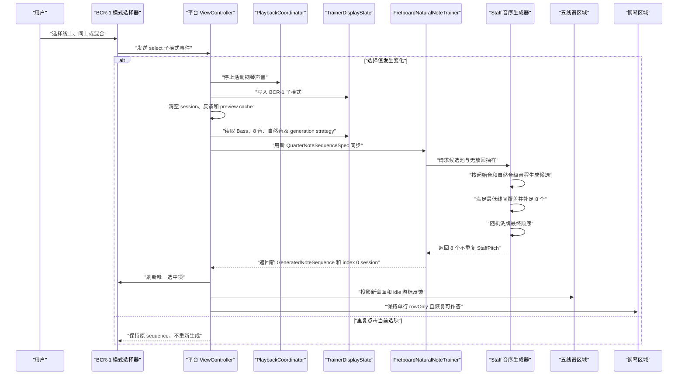
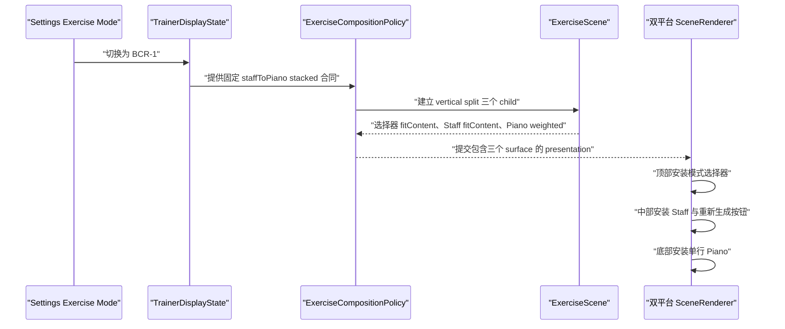

# BCR-1 三种出题模式与三层 UI 修改计划

## 已确认的产品合同

- `BCR-1` 仍是一个 `TrainerExerciseMode`；“线上 / 间上 / 混合”是其内部出题子模式。
- 默认子模式为 `.mixed`，选择在当前运行状态内保留；本次不新增持久化存储。
- 三种子模式均固定：Bass Clef、8 个自然音、单行钢琴、`.rowOnly`、`.pitchClass` 判题。
- 线上模式：从 `C2` 开始按自然音级三度生成 8 个候选，8 个全部无放回使用并洗牌。
- 间上模式：从 `D2` 开始按自然音级三度生成 8 个候选，8 个全部无放回使用并洗牌。
- 混合模式：从 `C2` 开始按自然音级二度生成 `C2...D4` 共 16 个候选，无放回取 8 个；不固定线上/间上比例，但必须至少各出现 1 个，最后整体洗牌。
- UI 从两层扩展为三层：顶部模式选择器、中部五线谱、底部钢琴。
- 当前重新生成按钮继续属于原五线谱区域：BCR-1 中随 Staff 从顶部移动到中部，不进入新的选择器区域。
- 切换子模式时立即停止活动钢琴声音、清空旧 session、判题反馈和 piano preview cache，并按新子模式重新生成。

## 一、建立通用的自然音级音程序列合同

在 [StaffPitchLayout.swift](NoteMaster_Ver_1/Shared/Staff/StaffPitchLayout.swift) 暴露不依赖具体 View 的谱面位置分类，统一处理谱表内外的线与间；负数 staff position 也继续按奇偶分类，因此 `C2/D2` 等下加线、下加间能够使用同一逻辑。

```swift
// 文件路径: NoteMaster_Ver_1/Shared/Staff/StaffPitchLayout.swift
// 类型/方法: StaffPositionKind, StaffPitchLayout.staffPosition(for:), positionKind(for:)
// 功能说明: 以当前谱号底线参考音为零点，把任意 StaffPitch 归类为线上或间上；
// ledger line / ledger space 不需要单独写 Bass Clef 特例。
enum StaffPositionKind: Equatable, Hashable, Sendable {
    case line
    case space
}

extension StaffPitchLayout {
    func staffPosition(for pitch: StaffPitch) -> Int {
        pitch.diatonicIndex - bottomLineReferencePitch.diatonicIndex
    }

    func positionKind(for pitch: StaffPitch) -> StaffPositionKind {
        staffPosition(for: pitch).isMultiple(of: 2) ? .line : .space
    }
}
```

新增 [StaffDiatonicPitchSequenceGenerator.swift](NoteMaster_Ver_1/Shared/Staff/StaffDiatonicPitchSequenceGenerator.swift)，只负责“起始音 + 自然音级音程 + 候选数量”到有序候选池的确定性转换。这里的三度是 `intervalNumber - 1 == 2` 个 diatonic steps，不是固定三个半音；因此 `C2 -> E2` 与 `E2 -> G2` 可以自然形成大/小三度交替。

```swift
// 文件路径: NoteMaster_Ver_1/Shared/Staff/StaffDiatonicPitchSequenceGenerator.swift
// 类型/方法: StaffDiatonicPitchProgressionSpec, StaffDiatonicPitchSequenceGenerator.makeCandidates(for:)
// 功能说明: 生成器只建立有序、自然音候选池，不负责随机、不知道 BCR-1，也不硬编码 Bass Clef。
struct StaffDiatonicPitchProgressionSpec: Equatable, Sendable {
    var startPitch: StaffPitch
    var intervalNumber: Int
    var candidateCount: Int

    init(
        startPitch: StaffPitch,
        intervalNumber: Int,
        candidateCount: Int
    ) {
        precondition(startPitch.accidental == .natural)
        precondition(intervalNumber >= 2)
        precondition(candidateCount > 0)
        self.startPitch = startPitch
        self.intervalNumber = intervalNumber
        self.candidateCount = candidateCount
    }

    // 二度前进 1 个字母，三度前进 2 个字母，五度前进 4 个字母。
    var diatonicStepCount: Int { intervalNumber - 1 }
}

struct StaffDiatonicPitchSequenceGenerator {
    func makeCandidates(
        for spec: StaffDiatonicPitchProgressionSpec
    ) -> [StaffPitch] {
        (0..<spec.candidateCount).map { offset in
            let diatonicIndex = spec.startPitch.diatonicIndex
                + (offset * spec.diatonicStepCount)
            return StaffPitch(naturalDiatonicIndex: diatonicIndex)
        }
    }
}
```

`StaffPitch(naturalDiatonicIndex:)` 使用规范化余数恢复 `letter + octave`，避免以后支持低于第 0 八度时受到 Swift 负数整除行为影响。生成器允许未来传入四度、五度等任意自然音级音程；线上/间上的约束由采样合同负责验证，因而四度自然会成为线间混合，而五度仍可保持同类位置。

## 二、在 quarter-note 生成器中加入显式生成策略

在 [StaffQuarterNoteSequenceGenerator.swift](NoteMaster_Ver_1/Shared/Staff/StaffQuarterNoteSequenceGenerator.swift) 保留现有 `.clefRangeRandomWithReplacement` 路径，避免改变 Sequence、P-2、SR-0、SR-1、SR-2。新增 progression + 无放回采样路径，并把策略放入 Equatable spec，使子模式变化能被 controller 的 `currentSpec != configuredSpec` 检测到。

```swift
// 文件路径: NoteMaster_Ver_1/Shared/Staff/StaffQuarterNoteSequenceGenerator.swift
// 类型: StaffWithoutReplacementSelectionSpec, StaffQuarterNoteGenerationStrategy
// 功能说明: 候选池生成和出题抽样分层；minimumLineCount/minimumSpaceCount 表达混合模式的最低覆盖约束。
struct StaffWithoutReplacementSelectionSpec: Equatable, Sendable {
    var outputCount: Int
    var minimumLineCount: Int
    var minimumSpaceCount: Int

    init(
        outputCount: Int,
        minimumLineCount: Int = 0,
        minimumSpaceCount: Int = 0
    ) {
        precondition(outputCount > 0)
        precondition(minimumLineCount >= 0 && minimumSpaceCount >= 0)
        precondition(minimumLineCount + minimumSpaceCount <= outputCount)
        self.outputCount = outputCount
        self.minimumLineCount = minimumLineCount
        self.minimumSpaceCount = minimumSpaceCount
    }
}

enum StaffQuarterNoteGenerationStrategy: Equatable, Sendable {
    // 兼容现有行为：按 clef 固定池逐项有放回随机抽取。
    case clefRangeRandomWithReplacement

    // 新行为：先生成确定候选池，再按位置覆盖约束无放回抽取并洗牌。
    case diatonicProgression(
        progression: StaffDiatonicPitchProgressionSpec,
        selection: StaffWithoutReplacementSelectionSpec
    )
}
```

```swift
// 文件路径: NoteMaster_Ver_1/Shared/Staff/StaffQuarterNoteSequenceGenerator.swift
// 方法: StaffQuarterNoteSequenceGenerator.makeSequence(spec:using:), selectWithoutReplacement(...)
// 功能说明: 约束抽样有界执行，不用可能无限循环的 rejection sampling；
// 先满足最低线/间覆盖，再从剩余候选补齐，最后统一 Fisher-Yates shuffle。
func selectWithoutReplacement<R: RandomNumberGenerator>(
    candidates: [StaffPitch],
    clef: StaffClef,
    spec: StaffWithoutReplacementSelectionSpec,
    using generator: inout R
) -> [StaffPitch] {
    precondition(spec.outputCount <= candidates.count)

    var remaining = candidates
    var selected: [StaffPitch] = []
    let layout = StaffPitchLayout(clef: clef)

    // 精确满足最低覆盖；line/space 候选不足时立即暴露错误配置。
    removeRandomCandidates(
        count: spec.minimumLineCount,
        kind: .line,
        from: &remaining,
        into: &selected,
        layout: layout,
        using: &generator
    )
    removeRandomCandidates(
        count: spec.minimumSpaceCount,
        kind: .space,
        from: &remaining,
        into: &selected,
        layout: layout,
        using: &generator
    )

    // 从剩余全集无放回补足；不再固定线上/间上的最终比例。
    while selected.count < spec.outputCount {
        selected.append(removeRandomCandidate(from: &remaining, using: &generator))
    }

    selected.shuffle(using: &generator)
    return selected
}
```

同步扩展 [FretboardNaturalNoteTrainer.swift](NoteMaster_Ver_1/Shared/Fretboard/FretboardNaturalNoteTrainer.swift) 的 `QuarterNoteSequenceSpec` 和私有 `staffGeneratorSpec` 映射，让 `generationStrategy` 成为 trainer mode 身份的一部分；`GeneratedNoteSequence`、session 和 `.pitchClass/.exactNote` evaluator 不改变。

## 三、建立 BCR-1 子模式状态与固定生成配置

在 [TrainerDisplayState.swift](NoteMaster_Ver_1/Shared/Controls/TrainerDisplayState.swift) 新增 BCR-1 专属配置。UI 子模式与底层通用 progression spec 分离，避免把中文 UI 语义塞进 Staff generator。

```swift
// 文件路径: NoteMaster_Ver_1/Shared/Controls/TrainerDisplayState.swift
// 类型/属性: TrainerBCR1QuestionMode, TrainerBCR1QuestionConfiguration.generationStrategy
// 功能说明: 三个子模式集中映射到精确的候选池和无放回规则；默认 mixed。
enum TrainerBCR1QuestionMode: CaseIterable, Equatable, Hashable, Sendable {
    case line
    case space
    case mixed
}

struct TrainerBCR1QuestionConfiguration: Equatable, Sendable {
    var mode: TrainerBCR1QuestionMode

    static let `default` = TrainerBCR1QuestionConfiguration(mode: .mixed)

    var generationStrategy: StaffQuarterNoteGenerationStrategy {
        switch mode {
        case .line:
            return .diatonicProgression(
                progression: .init(
                    startPitch: StaffPitch(letter: .c, octave: 2),
                    intervalNumber: 3,
                    candidateCount: 8
                ),
                selection: .init(
                    outputCount: 8,
                    minimumLineCount: 8
                )
            )
        case .space:
            return .diatonicProgression(
                progression: .init(
                    startPitch: StaffPitch(letter: .d, octave: 2),
                    intervalNumber: 3,
                    candidateCount: 8
                ),
                selection: .init(
                    outputCount: 8,
                    minimumSpaceCount: 8
                )
            )
        case .mixed:
            return .diatonicProgression(
                progression: .init(
                    startPitch: StaffPitch(letter: .c, octave: 2),
                    intervalNumber: 2,
                    candidateCount: 16
                ),
                selection: .init(
                    outputCount: 8,
                    minimumLineCount: 1,
                    minimumSpaceCount: 1
                )
            )
        }
    }
}
```

`TrainerSequenceConfiguration` 增加默认值为 `.clefRangeRandomWithReplacement` 的 `generationStrategy`，现有调用点无需改变即可保持旧行为。`TrainerDisplayState` 增加 `bcr1QuestionConfiguration` 和 setter；`resolvedSequenceConfiguration` 在 `.bcr1` 下固定 Bass、8 音、无 accidental、pitchClass 及当前 BCR strategy，其它模式继续消费原配置。

```swift
// 文件路径: NoteMaster_Ver_1/Shared/Controls/TrainerDisplayState.swift
// 属性/方法: TrainerDisplayState.bcr1QuestionConfiguration, resolvedSequenceConfiguration, setBCR1QuestionMode(_:)
// 功能说明: resolved configuration 是 controller/trainer 唯一消费入口；离开 BCR-1 后恢复普通 sequence 的原始策略。
struct TrainerDisplayState: Equatable, Sendable {
    var exerciseMode: TrainerExerciseMode
    var sequenceConfiguration: TrainerSequenceConfiguration
    var bcr1QuestionConfiguration: TrainerBCR1QuestionConfiguration
    // ...现有 position 配置保持不变...

    mutating func setBCR1QuestionMode(_ mode: TrainerBCR1QuestionMode) {
        bcr1QuestionConfiguration.mode = mode
    }

    var resolvedSequenceConfiguration: TrainerSequenceConfiguration {
        var resolved = sequenceConfiguration.applyingModeConstraints(exerciseMode)
        guard exerciseMode == .bcr1 else {
            return resolved
        }

        resolved.clef = .bass
        resolved.noteCount = 8
        resolved.includesAccidentals = false
        resolved.answerPolicy = .pitchClass
        resolved.generationStrategy = bcr1QuestionConfiguration.generationStrategy
        return resolved
    }
}
```

同时让 `TrainerSequenceConfiguration.init(quarterNoteSequenceSpec:)` 与 `quarterNoteSequenceSpec` 双向携带 generation strategy，防止从显式 spec 进入普通 Sequence 时静默丢失内容策略。

## 四、增加独立的 shared 选择器模型

新增 [BCR1QuestionModeSelectorModel.swift](NoteMaster_Ver_1/Shared/Controls/BCR1QuestionModeSelectorModel.swift)。不复用 `SettingsPanelModel`：新控件位于 exercise scene，事件不应经过 Settings route/action，也不应进入 `ExerciseAnswerRouter`。

```swift
// 文件路径: NoteMaster_Ver_1/Shared/Controls/BCR1QuestionModeSelectorModel.swift
// 类型: BCR1QuestionModeSelectorChoice, BCR1QuestionModeSelectorModel, BCR1QuestionModeSelectorEvent
// 功能说明: shared model 冻结选项顺序、中文标题、选中态和无障碍说明，双平台仅负责渲染与回传事件。
struct BCR1QuestionModeSelectorChoice: Equatable, Sendable {
    var mode: TrainerBCR1QuestionMode
    var title: String
    var isSelected: Bool
}

struct BCR1QuestionModeSelectorModel: Equatable, Sendable {
    var accessibilityLabel: String
    var choices: [BCR1QuestionModeSelectorChoice]

    static func make(from state: TrainerDisplayState) -> Self {
        let selected = state.bcr1QuestionConfiguration.mode
        return Self(
            accessibilityLabel: "选择 BCR-1 音符位置模式",
            choices: [
                .init(mode: .line, title: "线上", isSelected: selected == .line),
                .init(mode: .space, title: "间上", isSelected: selected == .space),
                .init(mode: .mixed, title: "混合", isSelected: selected == .mixed)
            ]
        )
    }
}

enum BCR1QuestionModeSelectorEvent: Equatable, Sendable {
    case select(TrainerBCR1QuestionMode)
}
```

## 五、把 BCR-1 scene 扩展为三个正式 surface

在 [SceneCore.swift](NoteMaster_Ver_1/Shared/Scene/SceneCore.swift) 增加通用 `.questionModeSelector` surface ID/kind；在 [ExerciseScene.swift](NoteMaster_Ver_1/Shared/Exercise/ExerciseScene.swift) 增加 `.bcr1QuestionModeSelector` auxiliary node，并让其纵向 sizing 为 `.fitContent`、默认允许交互。

在 [ExerciseCompositionPolicy.swift](NoteMaster_Ver_1/Shared/Exercise/ExerciseCompositionPolicy.swift) 对 `.bcr1` 生成直接的三 child vertical split；不要借用当前名为 `.threePane`、实际仍回落两层 stacked 的 preset，也不要改变 `.pianoRecognitionAnswer` 的固定 composition/layout 设置。

```swift
// 文件路径: NoteMaster_Ver_1/Shared/Exercise/ExerciseCompositionPolicy.swift
// 方法: ExerciseCompositionPolicy.makeMainSceneNode(from:preferences:trainerDisplayState:)
// 功能说明: BCR-1 是 selector + prompt + answer 三个直接 child；前两层按内容高度，钢琴填充剩余空间。
if trainerDisplayState?.exerciseMode == .bcr1 {
    return .makeSplit(
        axis: .vertical,
        children: [
            ExerciseSceneSplitChild(
                node: .surface(.bcr1QuestionModeSelector),
                mainAxisSizing: .fitContent
            ),
            ExerciseSceneSplitChild(
                node: .surface(sceneSurfaces.prompt),
                mainAxisSizing: .fitContent
            ),
            ExerciseSceneSplitChild(
                node: .surface(sceneSurfaces.answer),
                mainAxisSizing: .weighted(1)
            )
        ]
    )
}
```

在 [ExercisePresentationState.swift](NoteMaster_Ver_1/Shared/Exercise/ExercisePresentationState.swift) 将只表达 primary/secondary 的摘要泛化为 children 数组，同时保留兼容计算属性供现有 rail/debug 代码使用。这样三层 BCR 不会让 `renderedSceneLayout` 变为 `nil`，而自然音条 rail 仍明确要求恰好两个 side-by-side child。

```swift
// 文件路径: NoteMaster_Ver_1/Shared/Exercise/ExercisePresentationState.swift
// 类型/属性: ExerciseRenderedSceneChild, ExerciseRenderedSceneLayout.children, renderedSceneLayout
// 功能说明: 摘要层与底层 N-child SceneNode 对齐；旧 primary/secondary 作为只读兼容投影。
struct ExerciseRenderedSceneChild: Equatable, Sendable {
    var surface: ExerciseSurfaceNode
    var mainAxisSizing: ExerciseSceneSplitChildMainAxisSizing
}

struct ExerciseRenderedSceneLayout: Equatable, Sendable {
    var arrangement: ExerciseRenderedSceneArrangement
    var children: [ExerciseRenderedSceneChild]

    var primarySurface: ExerciseSurfaceNode { children[0].surface }
    var secondarySurface: ExerciseSurfaceNode? {
        children.indices.contains(1) ? children[1].surface : nil
    }
}
```

`ExerciseSceneValidator.legacyPageDisplayState(for:)` 保持只接受旧两槽位组合；BCR-1 三层 scene 继续返回 `nil`，不把 selector 或 main piano 倒灌进 legacy page model。

## 六、实现双平台顶部选择器并接入 renderer

新增：

- [iOSBCR1QuestionModeSelectorView.swift](NoteMaster_Ver_1/Platform/iOS/Controls/iOSBCR1QuestionModeSelectorView.swift)
- [macOSBCR1QuestionModeSelectorView.swift](NoteMaster_Ver_1/Platform/macOS/Controls/macOSBCR1QuestionModeSelectorView.swift)

两端分别使用 `UISegmentedControl` / `NSSegmentedControl`，保持 `.selectOne`、顺序“线上 / 间上 / 混合”、横向填充、稳定 accessibility identifier。View 只接收 model 并发送 event，不直接改 trainer。

```swift
// 文件路径: NoteMaster_Ver_1/Platform/iOS/Controls/iOSBCR1QuestionModeSelectorView.swift
// 类型/方法: iOSBCR1QuestionModeSelectorView.apply(model:), handleSelectionChanged(_:)
// 功能说明: 顶部 surface 只执行 shared model；intrinsic height 供 scene 的 fitContent 使用。
final class iOSBCR1QuestionModeSelectorView: UIView {
    var onEvent: ((BCR1QuestionModeSelectorEvent) -> Void)?

    func apply(model: BCR1QuestionModeSelectorModel) {
        // 按 model.choices 重建三个 segment，并同步唯一选中项与 accessibility。
    }

    @objc
    private func handleSelectionChanged(_ sender: UISegmentedControl) {
        // 将选中 segment 映射为 .select(choice.mode)，不直接生成题目。
    }
}
```

```swift
// 文件路径: NoteMaster_Ver_1/Platform/macOS/Controls/macOSBCR1QuestionModeSelectorView.swift
// 类型/方法: macOSBCR1QuestionModeSelectorView.apply(model:), handleSelectionChanged(_:)
// 功能说明: 与 iOS 消费完全相同的 model/event，使用 NSSegmentedControl.selectOne。
final class macOSBCR1QuestionModeSelectorView: NSView {
    var onEvent: ((BCR1QuestionModeSelectorEvent) -> Void)?

    func apply(model: BCR1QuestionModeSelectorModel) {
        // 更新 segmentCount、label、enabled、selectedSegment 和无障碍属性。
    }
}
```

在 [iOSExerciseSceneRenderer.swift](NoteMaster_Ver_1/Platform/iOS/Exercise/iOSExerciseSceneRenderer.swift) 与 [macOSExerciseSceneRenderer.swift](NoteMaster_Ver_1/Platform/macOS/Exercise/macOSExerciseSceneRenderer.swift)：

- 注入 selector view。
- 补齐 `view(for:)`、surface visibility 和 slot/host 注册。
- 继续复用已经支持任意 child 数量的 `renderSplit/syncSplit`。
- selector/staff 两层 `.fitContent`，piano `.weighted(1)`；现有 `requiresViewportPinnedHeight` 会因同一 vertical split 同时包含 fit/weighted 自动保持 viewport 高度。

### 重新生成按钮随 prompt surface 移动

移除 regenerate button 相对整个 `sceneContainerView.top/trailing` 的静态约束。改为在 renderer 遇到当前 prompt surface 时，把按钮作为该 surface host 的 overlay，锚到其 top/trailing。这样：

- BCR-1 的 selector 是 auxiliary，不会取得按钮。
- BCR-1 的 Staff 是中部 prompt，按钮随之移动到中部。
- SR 和普通 Staff sequence 中 Staff 仍在顶部，视觉位置保持。
- 如果普通 Sequence 使用 Target Prompt，按钮跟随真实 prompt，而不是悬浮在无关 scene 顶部。

```swift
// 文件路径: NoteMaster_Ver_1/Platform/iOS/Exercise/iOSExerciseSceneRenderer.swift
// 方法: renderSurface(_:in:), installSequenceRegenerateButton(inPromptHost:)
// 功能说明: regenerate button 的空间归属从整个 scene 改为 prompt host；macOS 在 syncSurface 中镜像处理。
private func renderSurface(
    _ surface: ExerciseSurfaceNode,
    in hostView: UIView
) {
    embed(view(for: surface.id), in: hostView)

    if surface.isPromptSurface {
        installSequenceRegenerateButton(inPromptHost: hostView)
    }
}

private func installSequenceRegenerateButton(inPromptHost hostView: UIView) {
    // 重新挂载并约束 top/trailing/固定尺寸；约束加入 activeSceneConstraints，
    // 每次 scene rebuild 都与 prompt host 一起更新，不残留旧父视图约束。
}
```

## 七、接通 selector event、重置与重新生成链

在 [iOSViewController.swift](NoteMaster_Ver_1/Platform/iOS/iOSViewController.swift) 和 [macOSViewController.swift](NoteMaster_Ver_1/Platform/macOS/macOSViewController.swift)：

- 创建 selector view 并传入 renderer。
- `trainerDisplayState` 变化时刷新 selector model。
- 仅在当前 mode 为 `.bcr1` 且新值不同的情况下响应。
- 新增 `PlaybackStopReason.bcr1QuestionModeChanged`，切换前停止活动声音与 preview。
- 调用现有 `resetQuarterNoteSequenceInteractionState()` 清 session、last evaluation、preview cache。
- 更新 shared state 后走 `synchronizeTrainerPresentationState(reason:)`；新 generation strategy 已进入 spec equality，生成器会重建 8 音 sequence。
- 重复点击已选 segment 是 no-op，不无意义重生。
- 手动 regenerate 继续使用当前 resolved spec，因此保留当前子模式。

```swift
// 文件路径: NoteMaster_Ver_1/Platform/iOS/iOSViewController.swift
// 方法: handleBCR1QuestionModeSelectorEvent(_:)
// 功能说明: 单一事务内完成停止播放、更新状态、清理旧题和按新 spec 重生；macOS 使用 presentation transaction 镜像执行。
private func handleBCR1QuestionModeSelectorEvent(
    _ event: BCR1QuestionModeSelectorEvent
) {
    guard case let .select(nextMode) = event,
          trainerDisplayState.exerciseMode == .bcr1,
          nextMode != trainerDisplayState.bcr1QuestionConfiguration.mode else {
        return
    }

    interruptActivePianoPlayback(reason: .bcr1QuestionModeChanged)
    trainerDisplayState.setBCR1QuestionMode(nextMode)
    resetQuarterNoteSequenceInteractionState()
    synchronizeTrainerPresentationState(reason: "bcr1QuestionModeChanged")
}
```

## 八、关键业务逻辑时序图





## 九、自动验证与回归矩阵

### 共享生成器验证

在 [FretboardValidation.swift](NoteMaster_Ver_1/Shared/Fretboard/FretboardValidation.swift) 使用注入的 deterministic RNG 增加固定夹具：

- progression：`C2 + 三度 + 8` 精确得到线上集合；`D2 + 三度 + 8` 精确得到间上集合；`C2 + 二度 + 16` 精确得到 `C2...D4`。
- 线上输出：count 8、集合精确、全部 `.line`、全自然、无重复。
- 间上输出：count 8、集合精确、全部 `.space`、全自然、无重复。
- 混合输出：count 8、是 16 音全集子集、无重复、至少 1 line + 1 space；不断言 4:4。
- 不断言“洗牌后必须不同于原数组”，避免合法随机排列恰好相同造成 flaky。
- 错误配置：抽样数大于候选数、最低覆盖和大于输出数、对应位置候选不足时能在合同边界失败。

### BCR 状态与 scene 验证

在 [ExerciseCompositionValidationExercisePolicy.swift](NoteMaster_Ver_1/Shared/Exercise/ExerciseCompositionValidationExercisePolicy.swift)、[ExerciseCompositionValidationSceneCore.swift](NoteMaster_Ver_1/Shared/Exercise/ExerciseCompositionValidationSceneCore.swift) 和 [ExerciseCompositionValidation.swift](NoteMaster_Ver_1/Shared/Exercise/ExerciseCompositionValidation.swift) 增加/更新夹具：

- BCR 默认子模式 `.mixed`。
- requested `noteCount/includesAccidentals` 会被 BCR 固定为 `8/false`；SR-1/SR-2 仍保留原合同。
- BCR scene surface 顺序严格为 selector、staff、piano。
- sizing 严格为 fitContent、fitContent、weighted(1)。
- selector 为可交互 auxiliary；staff 为 prompt；piano 为 answer。
- `renderedSceneLayout.children.count == 3`，legacy projection 仍为 `nil`。
- 非 BCR scene 不包含 selector。

在 [SettingsNavigationValidationStateAndNavigation.swift](NoteMaster_Ver_1/Shared/Controls/SettingsNavigationValidationStateAndNavigation.swift) 更新 BCR fixture 对 note count/accidental 的旧“保持请求值”断言，改为固定 8 个自然音；继续确认 Composition、Layout、Accessories、Clef、Rows、Movement 等 Settings 路由保持隐藏。selector 不新增 Settings route。

### Staff 边界音验证

在 [StaffValidation.swift](NoteMaster_Ver_1/Shared/Staff/StaffValidation.swift) 增加覆盖 BCR 完整范围 `C2...D4` 的 Bass fixture，验证：

- `C2/E2/C4` 等 ledger line 和 `D2/D4` 等 ledger space 的纵向位置与 ledger line 数量。
- 8 音 score 的 notehead/stem/cursor/红绿反馈均在有效绘制区域。
- 若现有 Bass preferred height 对极值不足，只调整 BCR Staff presentation 的垂直留白，不全局放大其它模式。

### 双平台 runtime smoke

扩展现有 `runBCR1PianoAnswerSmokeTest`，不新增 AppDelegate 环境变量：

1. 切入 BCR，断言默认 mixed、顶部 selector 可见、中部 Staff 与 regenerate 按钮同 host、底部 Piano 可交互。
2. 验证默认 mixed sequence 为 8 个自然音、无重复、至少各 1 个 line/space。
3. 制造一次错误答案，确认 index 不前进并产生反馈。
4. 选择线上，确认旧反馈/session/cache 清空、index 回到 0、集合精确等于 8 个线上音。
5. 选择间上，重复验证重置与精确集合。
6. 手动 regenerate，确认仍为间上模式、集合合同不变；不要求随机顺序必然变化。
7. 用同 pitch class 不同 octave 作答，确认 BCR 仍按 `.pitchClass` 推进。
8. 切回 Single，确认 selector 和 regenerate button 不残留。
9. macOS 每步经过现有 layout settlement/presentation transaction 后再断言，避免异步布局误报。

最终执行：IDE lint、`git diff --check`、macOS Debug build、generic iOS Simulator Debug build、startup validation、双平台 `bcr1-piano-answer`；再回归双平台 `sr0-note-strip-answer`、`sr1-piano-answer`、`sr2-piano-answer`，确认 BCR 专用策略不污染旧模式。

## 十、实施边界与文件范围

预计新增 4 个 Swift 文件：

- [StaffDiatonicPitchSequenceGenerator.swift](NoteMaster_Ver_1/Shared/Staff/StaffDiatonicPitchSequenceGenerator.swift)
- [BCR1QuestionModeSelectorModel.swift](NoteMaster_Ver_1/Shared/Controls/BCR1QuestionModeSelectorModel.swift)
- [iOSBCR1QuestionModeSelectorView.swift](NoteMaster_Ver_1/Platform/iOS/Controls/iOSBCR1QuestionModeSelectorView.swift)
- [macOSBCR1QuestionModeSelectorView.swift](NoteMaster_Ver_1/Platform/macOS/Controls/macOSBCR1QuestionModeSelectorView.swift)

预计修改的核心现有文件：

- [TrainerDisplayState.swift](NoteMaster_Ver_1/Shared/Controls/TrainerDisplayState.swift)
- [StaffPitchLayout.swift](NoteMaster_Ver_1/Shared/Staff/StaffPitchLayout.swift)
- [StaffQuarterNoteSequenceGenerator.swift](NoteMaster_Ver_1/Shared/Staff/StaffQuarterNoteSequenceGenerator.swift)
- [FretboardNaturalNoteTrainer.swift](NoteMaster_Ver_1/Shared/Fretboard/FretboardNaturalNoteTrainer.swift)
- [SceneCore.swift](NoteMaster_Ver_1/Shared/Scene/SceneCore.swift)
- [ExerciseScene.swift](NoteMaster_Ver_1/Shared/Exercise/ExerciseScene.swift)
- [ExercisePresentationState.swift](NoteMaster_Ver_1/Shared/Exercise/ExercisePresentationState.swift)
- [ExerciseCompositionPolicy.swift](NoteMaster_Ver_1/Shared/Exercise/ExerciseCompositionPolicy.swift)
- [PlaybackCoordinator.swift](NoteMaster_Ver_1/Shared/Playback/PlaybackCoordinator.swift)
- [iOSExerciseSceneRenderer.swift](NoteMaster_Ver_1/Platform/iOS/Exercise/iOSExerciseSceneRenderer.swift)
- [macOSExerciseSceneRenderer.swift](NoteMaster_Ver_1/Platform/macOS/Exercise/macOSExerciseSceneRenderer.swift)
- [iOSViewController.swift](NoteMaster_Ver_1/Platform/iOS/iOSViewController.swift)
- [macOSViewController.swift](NoteMaster_Ver_1/Platform/macOS/macOSViewController.swift)
- 对应的 shared validation 文件。

不修改 `SettingsPanelModel`，因为选择器不是 Settings 选项；不修改现有 Markdown 记录、`.gitignore` 或计划外文档；不提交 Git。新增 Swift 文件会由当前 `PBXFileSystemSynchronizedRootGroup` 自动纳入工程，无需手工改 `project.pbxproj`。实施时保留并基于当前未提交的 BCR-1 Changes 继续工作，不覆盖用户已有改动。