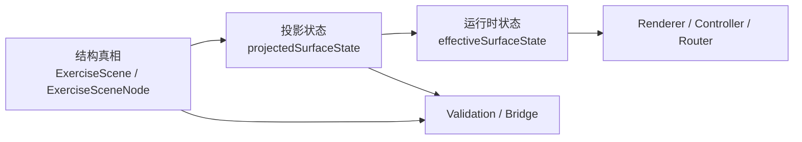

# Exercise 状态语义根因修复计划

## 目标

把当前 Exercise 架构中的两类真相彻底拆开：

- 结构真相：某个 `surface` 是否真的存在于 scene tree 中。
- 运行时真相：某个 `surface` 当前是否可见、可交互、是否 answer enabled。

当前问题集中在这三个点：

- [NoteMaster_Ver_1/Shared/Exercise/ExercisePresentationState.swift](NoteMaster_Ver_1/Shared/Exercise/ExercisePresentationState.swift) 里的 `surfaceState(for:)` 同时被拿来表达“有没有”和“当前状态是什么”。
- [NoteMaster_Ver_1/Shared/Exercise/ExerciseCompositionPolicy.swift](NoteMaster_Ver_1/Shared/Exercise/ExerciseCompositionPolicy.swift) 里的 `makeSurfaceStates(scene:)` 先把 `ExerciseSurfaceID.allCases` 全量填为 `.hidden`，导致“不在 scene 中”与“在 scene 中但 hidden”都可能表现成“非 nil”。
- [NoteMaster_Ver_1/Shared/Exercise/ExerciseCompositionValidation.swift](NoteMaster_Ver_1/Shared/Exercise/ExerciseCompositionValidation.swift) 以及后续消费层里，部分调用点仍在用 `surfaceState(...) != nil` 这类旧语义推断结构成员关系。

## 架构决策

- 在 [NoteMaster_Ver_1/Shared/Exercise/ExerciseScene.swift](NoteMaster_Ver_1/Shared/Exercise/ExerciseScene.swift) 明确提供结构查询 helper，例如 `containsSurface(_:)`，统一通过 `scene.surfaceNode(for:) != nil` 回答“某 surface 是否在树里”。
- 在 [NoteMaster_Ver_1/Shared/Exercise/ExercisePresentationState.swift](NoteMaster_Ver_1/Shared/Exercise/ExercisePresentationState.swift) 将现有 `surfaceState(for:)` 拆成两类 API：
  - `projectedSurfaceState(for:)`：只对 scene 内真实存在的 surface 返回状态。
  - `effectiveSurfaceState(for:)`：给 UI/交互一个闭世界结果，不存在时返回 `.hidden`。
- 调整 [NoteMaster_Ver_1/Shared/Exercise/ExerciseCompositionPolicy.swift](NoteMaster_Ver_1/Shared/Exercise/ExerciseCompositionPolicy.swift) 中 `makeSurfaceStates(scene:)` 的存储策略，只保存 scene 内投影出来的 surface 状态，不再把 `allCases` 预填为 `.hidden`。
- 逐层迁移调用方语义：
  - Validation / scene contract / bridge：只问“结构有没有”。
  - Renderer / ViewController / AnswerRouter：只问“当前有效状态是什么”。
- 收口回归：在 [NoteMaster_Ver_1/Shared/Exercise/ExerciseCompositionValidation.swift](NoteMaster_Ver_1/Shared/Exercise/ExerciseCompositionValidation.swift) 新增专门 fixture，冻结 `absent != hidden` 的共享约束。

## 实施步骤

### 1. 重构 shared contract

主要文件：

- [NoteMaster_Ver_1/Shared/Exercise/ExerciseScene.swift](NoteMaster_Ver_1/Shared/Exercise/ExerciseScene.swift)
- [NoteMaster_Ver_1/Shared/Exercise/ExercisePresentationState.swift](NoteMaster_Ver_1/Shared/Exercise/ExerciseCompositionValidation.swift)

动作：

- 在 `ExerciseScene` / `ExerciseSceneNode` 上补充结构成员 helper，例如 `containsSurface(_:)`，统一命名“scene membership”。
- 在 `ExercisePresentationState` 中引入 `projectedSurfaceState(for:)` 与 `effectiveSurfaceState(for:)`，并把旧 `surfaceState(for:)` 降级为兼容入口或标注为待迁移。
- 明确文档化三个语义：`containsSurface`、`projectedSurfaceState`、`effectiveSurfaceState` 的边界。

关键现状：

- `surfaceState(for:)` 当前实现位于 [NoteMaster_Ver_1/Shared/Exercise/ExercisePresentationState.swift](NoteMaster_Ver_1/Shared/Exercise/ExercisePresentationState.swift)，既读 `surfaceStates` 字典，也会回退到 `defaultSurfaceState(...)`。

### 2. 调整状态构造策略

主要文件：

- [NoteMaster_Ver_1/Shared/Exercise/ExerciseCompositionPolicy.swift](NoteMaster_Ver_1/Shared/Exercise/ExerciseCompositionPolicy.swift)

动作：

- 重写 `makeSurfaceStates(scene:)`，改成只存储 scene tree 中真实投影出的 surface。
- 让 `.hidden` 成为读取层语义，而不是存储层的全量默认值。
- 检查 `makePresentation(...)` 与 `legacyCompatiblePresentation(...)` 输出的一致性，确保两条路径不再出现“一个稀疏、一个全量”的状态表语义分叉。

关键现状：

- 当前 `makeSurfaceStates(scene:)` 先把 `ExerciseSurfaceID.allCases` 全量初始化为 `.hidden`，这是本次 nil/hidden 语义混淆的核心来源。

### 3. 分层迁移调用点

优先文件：

- [NoteMaster_Ver_1/Shared/Exercise/ExerciseCompositionValidation.swift](NoteMaster_Ver_1/Shared/Exercise/ExerciseCompositionValidation.swift)
- [NoteMaster_Ver_1/Shared/Exercise/ExerciseAnswerRouter.swift](NoteMaster_Ver_1/Shared/Exercise/ExerciseAnswerRouter.swift)
- [NoteMaster_Ver_1/Platform/iOS/Exercise/iOSExerciseSceneRenderer.swift](NoteMaster_Ver_1/Platform/iOS/Exercise/iOSExerciseSceneRenderer.swift)
- [NoteMaster_Ver_1/Platform/macOS/Exercise/macOSExerciseSceneRenderer.swift](NoteMaster_Ver_1/Platform/macOS/Exercise/macOSExerciseSceneRenderer.swift)
- [NoteMaster_Ver_1/Platform/iOS/iOSViewController.swift](NoteMaster_Ver_1/Platform/iOS/iOSViewController.swift)
- [NoteMaster_Ver_1/Platform/macOS/macOSViewController.swift](NoteMaster_Ver_1/Platform/macOS/macOSViewController.swift)

动作：

- Validation 中所有“是否混入某 surface”的断言，改为 `scene.containsSurface(...)`。
- Validation 中所有“若未投影则应隐藏”的断言，改为 `effectiveSurfaceState(...) == .hidden`。
- Renderer / ViewController 中的可见性和交互开关统一走 `effectiveSurfaceState(...)` / `isSurfaceVisible(...)`，不再隐式依赖 nil 语义。
- `ExerciseAnswerRouter` 明确其对 absent 与 hidden 的区分：
  - 如果语义上确实要区分“未投影”和“已投影但禁用”，则先查 `containsSurface(...)`，再查 `effectiveSurfaceState(...)`。
  - 如果只关心“当前能不能答”，则直接走 `effectiveSurfaceState(...)`。

### 4. 收口 shared validation 与回归清单

主要文件：

- [NoteMaster_Ver_1/Shared/Exercise/ExerciseCompositionValidation.swift](NoteMaster_Ver_1/Shared/Exercise/ExerciseCompositionValidation.swift)

动作：

- 修正现有 `phase_zero_side_by_side_invariants_preserve_composition_specific_surface_pairs` 中所有拿 `surfaceState(...) != nil` 推断“混入 surface”的旧断言。
- 新增一组专门 fixture：冻结以下边界。
  - `targetPromptToFretboard + sideBySide`：`containsSurface(.naturalNoteStrip) == false`，但 `effectiveSurfaceState(.naturalNoteStrip) == .hidden`。
  - `staffToFretboard + sideBySide`：同上。
  - `fretboardToNaturalNoteStrip + sideBySide`：`containsSurface(.naturalNoteStrip) == true`，且 style 为 `verticalRail`。
  - `fretboardToNaturalNoteStrip + stacked`：`containsSurface(.naturalNoteStrip) == true`，且 style 为 `horizontalStrip`。
- 更新 `manualChecklist(for:)`，显式要求检查 absent/hidden 分层不影响右侧 rail、旧 stacked、answer 路由与 accessory 路径。

### 5. 验证与收敛

验证范围：

- 共享 validation 在 iOS/macOS 启动时均通过。
- `xcodebuild` 的 macOS 与 iOS 构建通过。
- 手工回归至少覆盖：
  - `positionPrompt + Side` 的右侧 rail。
  - `positionPrompt + Stacked` 的底部横条。
  - `single/sequence + sideBySide` 不混入 `naturalNoteStrip` scene 成员。
  - strip 不存在但 `.hidden` 默认态仍不影响 renderer、controller、router。

## 风险与注意点

- `ExerciseAnswerRouter` 当前对 `nil`、`!isVisible`、`!isAnswerEnabled`、`!isInteractionEnabled` 有不同返回分支；迁移时必须先决定哪些分支要保留“未投影”和“已投影但禁用”的区别。
- `ExercisePresentationState(scene:)` 的直接构造在测试和默认推导里仍被使用；需要保证新 API 下这条路径的语义也稳定，不要只修 `makePresentation(...)`。
- 若旧 `surfaceState(for:)` 继续保留一段时间，必须限制其用途并在 validation 中禁止再拿它推断 scene membership，否则问题会再次回流。

