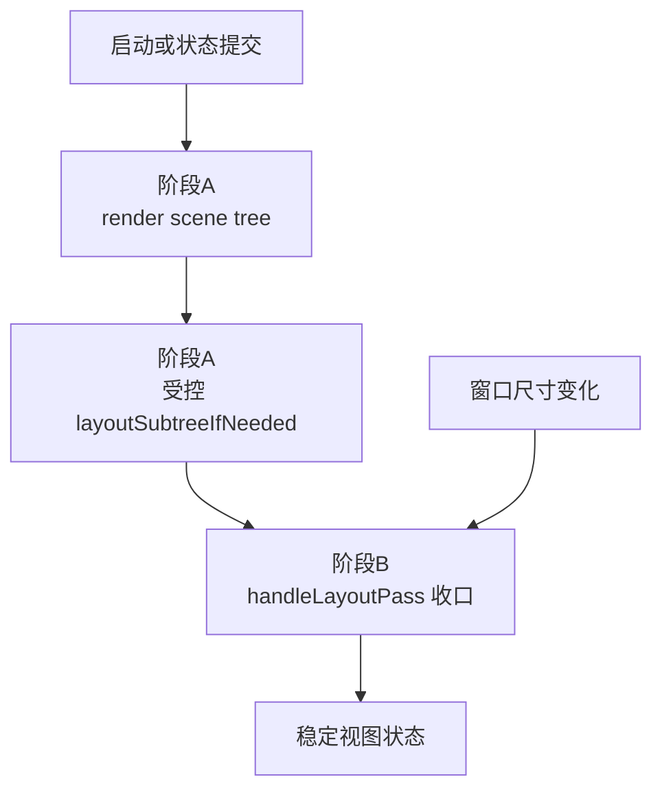

# macOS Scene Layout 收口修复计划

## 目标

- 修复 macOS 启动后白屏。
- 修复 `Layout Preset` 从 `side` 切回 `stacked` 后，在事件返回后的 AppKit 布局阶段崩溃。
- 保留前一轮已经生效的 `settings same-route 复用` 修复，不把问题回退到“当前 page/row/button 在 action 未返回时被同步拆树”。

## 已确认的边界

- 必须保留的修复：
  - [NoteMaster_Ver_1/Platform/macOS/Controls/macOSSettingsNavigatorView.swift](NoteMaster_Ver_1/Platform/macOS/Controls/macOSSettingsNavigatorView.swift)
  - [NoteMaster_Ver_1/Platform/macOS/Controls/macOSSettingsPanelView.swift](NoteMaster_Ver_1/Platform/macOS/Controls/macOSSettingsPanelView.swift)
  - [NoteMaster_Ver_1/Platform/macOS/Controls/macOSSettingsIndexPageView.swift](NoteMaster_Ver_1/Platform/macOS/Controls/macOSSettingsIndexPageView.swift)
- 这些改动已经被日志证明有效：`event end` 和 `choiceRow dispatch after` 都能走到，说明当前 action 已经正常返回，不再是旧的“同步拆 settings 树”崩溃。
- 新问题集中在：
  - [NoteMaster_Ver_1/Platform/macOS/macOSViewController.swift](NoteMaster_Ver_1/Platform/macOS/macOSViewController.swift)
  - [NoteMaster_Ver_1/Platform/macOS/Exercise/macOSExerciseSceneRenderer.swift](NoteMaster_Ver_1/Platform/macOS/Exercise/macOSExerciseSceneRenderer.swift)

## 现状断点

```swift
// 文件路径: NoteMaster_Ver_1/Platform/macOS/macOSViewController.swift
// 函数名: viewDidLayout(), updateLayoutIfNeeded()
// 功能说明: 当前把 scene 的 layout 收口拆到了 viewDidLayout 和异步 flush 上；这会让 render 后的稳定布局阶段依赖 AppKit 后续周期，而不是受控事务。
override func viewDidLayout() {
    super.viewDidLayout()
    if exerciseSceneRenderer.handleLayoutPass() {
        updateLayoutIfNeeded()
    }
}

private func updateLayoutIfNeeded() {
    view.needsLayout = true
    guard !isDeferredLayoutPassScheduled else {
        return
    }

    isDeferredLayoutPassScheduled = true
    DispatchQueue.main.async { [weak self] in
        self?.flushDeferredLayoutPassIfNeeded()
    }
}
```

```swift
// 文件路径: NoteMaster_Ver_1/Platform/macOS/Exercise/macOSExerciseSceneRenderer.swift
// 函数名: handleLayoutPass(), syncVerticalFretboardContentSizeConstraints(), updateFretboardViewportPresentation()
// 功能说明: handleLayoutPass 不是只读检查，它会继续改约束常量和 scroller 呈现，因此不能直接挂在 viewDidLayout 里跑。
func handleLayoutPass() -> Bool {
    let didUpdateContentSizeConstraints = syncVerticalFretboardContentSizeConstraints()
    let didUpdateViewportPresentation = updateFretboardViewportPresentation()
    return didUpdateContentSizeConstraints || didUpdateViewportPresentation
}
```

## 目标时序




## 实施步骤

### 1. 保留 settings 复用修复，不回退 navigator/panel/index

重点文件：

- [NoteMaster_Ver_1/Platform/macOS/Controls/macOSSettingsNavigatorView.swift](NoteMaster_Ver_1/Platform/macOS/Controls/macOSSettingsNavigatorView.swift)
- [NoteMaster_Ver_1/Platform/macOS/Controls/macOSSettingsPanelView.swift](NoteMaster_Ver_1/Platform/macOS/Controls/macOSSettingsPanelView.swift)
- [NoteMaster_Ver_1/Platform/macOS/Controls/macOSSettingsIndexPageView.swift](NoteMaster_Ver_1/Platform/macOS/Controls/macOSSettingsIndexPageView.swift)

执行要点：

- 明确把 `same route -> reuse current page` 作为保留边界。
- 明确把 `arrangedSubviewsMatch(...)` 作为保留边界。
- 后续修复只改 `scene render/layout settlement`，不再碰 `replaceCurrentPage` 的 same-route 分支。

### 2. 保证启动首帧一定完成一次 scene render

重点文件：

- [NoteMaster_Ver_1/Platform/macOS/macOSViewController.swift](NoteMaster_Ver_1/Platform/macOS/macOSViewController.swift)

执行要点：

- 解决当前 `initialExercisePresentationState` 与首次 `semanticPresentationState` 相等时，`didSet` 不触发、`renderExercisePresentationState()` 根本不跑的问题。
- 推荐做法：在 `macOSViewController` 引入显式的“首帧已渲染”状态；在启动同步链里，即使 `exercisePresentationState` 未变化，也要强制走一次 `renderExercisePresentationState()`。
- 目标是把“首帧 scene tree 建立”从属性等值偶然行为里解耦出来。

### 3. 在 controller 层建立统一的两阶段 layout settlement 入口

重点文件：

- [NoteMaster_Ver_1/Platform/macOS/macOSViewController.swift](NoteMaster_Ver_1/Platform/macOS/macOSViewController.swift)
- [NoteMaster_Ver_1/Platform/macOS/Exercise/macOSExerciseSceneRenderer.swift](NoteMaster_Ver_1/Platform/macOS/Exercise/macOSExerciseSceneRenderer.swift)

执行要点：

- 引入统一的 `settleSceneLayoutIfNeeded()` 一类入口，把 scene 收口明确拆成两阶段：
  - 阶段 A：`renderExercisePresentationState()` 内提交 scene tree 和静态/半静态约束
  - 阶段 B：在受控的布局事务里执行 `handleLayoutPass()`，把 viewport/content width/scroller 收口到稳定状态
- 移除当前 `updateLayoutIfNeeded() -> DispatchQueue.main.async -> flushDeferredLayoutPassIfNeeded()` 这条打散链路。
- `viewDidLayout()` 不再直接调用 `handleLayoutPass()`；改为只在外部几何变化时安排一次后续 settlement，而不是在 AppKit 布局过程中继续修改 scene 约束。
- 为 settlement 增加重入保护，避免 `layoutSubtreeIfNeeded()` 过程中再次进入完整 render。

### 4. 收敛 render / display / staff / piano 的调用职责

重点文件：

- [NoteMaster_Ver_1/Platform/macOS/macOSViewController.swift](NoteMaster_Ver_1/Platform/macOS/macOSViewController.swift)
- [NoteMaster_Ver_1/Platform/macOS/Exercise/macOSExerciseSceneRenderer.swift](NoteMaster_Ver_1/Platform/macOS/Exercise/macOSExerciseSceneRenderer.swift)

执行要点：

- 保留 renderer 目前已经做对的拆分：
  - `render(...)` 负责 scene tree 重建
  - `applyFretboardDisplayState(...)` 负责 display-only 刷新
- 但 controller 层需要把它们统一收口到同一个 settlement 入口，避免：
  - `renderExercisePresentationState()` 自己触发一轮 layout
  - `applyFretboardDisplayState()` / `applyStaffDisplayState()` / `applyPianoDemoState()` 又各自触发额外 layout
- 目标是“一次业务变更 -> 一次受控 render/settlement 事务”，而不是多条 `didSet`/`apply*` 链各自排一次 layout。

### 5. 冻结新的回归边界

重点文件：

- [NoteMaster_Ver_1/Shared/Controls/SettingsNavigationValidation.swift](NoteMaster_Ver_1/Shared/Controls/SettingsNavigationValidation.swift)
- [NoteMaster_Ver_1/Platform/macOS/macOSViewController.swift](NoteMaster_Ver_1/Platform/macOS/macOSViewController.swift)
- [NoteMaster_Ver_1/Platform/macOS/Exercise/macOSExerciseSceneRenderer.swift](NoteMaster_Ver_1/Platform/macOS/Exercise/macOSExerciseSceneRenderer.swift)

执行要点：

- 保留现有 `exercise_layout_route_remains_stable_across_choice_updates` 夹具，确认修复过程中不会回退 settings reuse 边界。
- 增加本轮手工回归重点：
  - 启动后首屏不再白屏
  - `stacked -> side -> stacked` 往返不崩
  - 当前停留在 `Exercise > Layout` 子页时，settings 不闪跳、不退回上一层
  - 日志持续出现 `reuse currentPage`，不再出现旧的 `remove oldPage ... containsActiveSender=true`
- 最终重新跑 macOS / iOS 构建，确认 shared 层和双平台编译面都稳定。

## 成功标准

- 启动后 macOS 主窗口首屏立即有内容，不再白屏。
- `Layout Preset` 在 `stacked` / `side` 间往返切换时，不再在 `app.run()` 顶层事件循环后崩溃。
- settings 同页更新继续复用当前 page/row/button，不回退到旧的同步拆树问题。
- `scene render`、`handleLayoutPass`、根视图布局 flush 各自职责清晰，时序回到单次受控事务。

