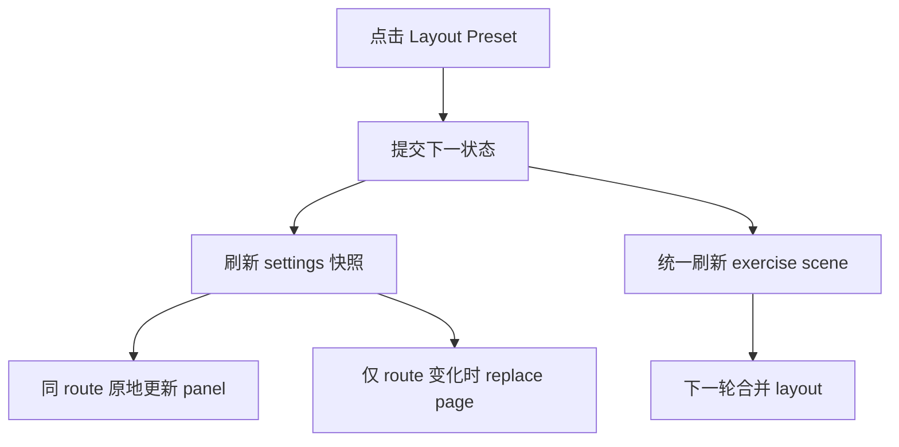

# macOS Side 崩溃系统修复方案

## 目标

- 修掉 macOS 上切 `Layout Preset = Side` 时的 `EXC_BAD_ACCESS`。
- 不靠临时 `guard` 或跳过某一次 layout；直接修正当前架构里 `settings 导航`、`状态提交`、`布局阶段` 三者的职责边界。
- 保持现有 `Scene Tree / Layout Tree`、`ExerciseCompositionPolicy`、`SettingsNavigationSnapshotBuilder` 的总体架构不变。

## 现状断点

当前有两个关键事实已经被代码和日志同时证实：

```swift
// NoteMaster_Ver_1/Platform/macOS/Controls/macOSSettingsNavigatorView.swift
routeStack = reconciledPath
replaceCurrentPage(
    with: makePageView(for: routeStack.last ?? model.rootRoute),
    transitionDirection: transitionDirection,
    animated: didCurrentRouteChange && transitionDirection != .none
)
```

这里即使 `didCurrentRouteChange == false`，也会无条件 `replaceCurrentPage`，导致当前 action 还没返回，旧 page 就被 `removeFromSuperview()`。

```swift
// NoteMaster_Ver_1/Platform/macOS/Controls/macOSSettingsPanelView.swift
var model: SettingsPanelModel {
    didSet {
        guard oldValue != model else { return }
        applyModel()
    }
}
```

`panel` 本身已经具备“同页原地更新”的能力，问题不是做不到，而是 `navigator` 没有使用这条能力链路。

## 目标流转




## 实施步骤

### 1. 修正 navigator 的页面替换语义

重点文件：

- [NoteMaster_Ver_1/Platform/macOS/Controls/macOSSettingsNavigatorView.swift](NoteMaster_Ver_1/Platform/macOS/Controls/macOSSettingsNavigatorView.swift)
- [NoteMaster_Ver_1/Platform/macOS/Controls/macOSSettingsPanelView.swift](NoteMaster_Ver_1/Platform/macOS/Controls/macOSSettingsPanelView.swift)
- [NoteMaster_Ver_1/Shared/Controls/SettingsNavigationModel.swift](NoteMaster_Ver_1/Shared/Controls/SettingsNavigationModel.swift)

做法：

- 在 `applyModelUpdate()` 里把“route 变化”和“page 内容变化”显式拆开，不再用 `oldValue != model` 或 `model 更新了` 作为整页 replace 的信号。
- 当 `previousPath.last == reconciledPath.last`，且当前/下一页都还是 `.form` 页面时：
  - 复用 `currentPageView as? macOSSettingsPanelView`
  - 直接写入新的 `panelModel`
  - 跳过 `replaceCurrentPage()` / `installCurrentPageView()`
- 只有以下情况才允许 replace 当前 page：
  - 栈顶 route 真的变了
  - `index` / `form` 页面类型切换了
  - 当前 view 类型与目标页面类型不兼容
- 如果 diff 逻辑写起来仍然别扭，就把 [NoteMaster_Ver_1/Shared/Controls/SettingsNavigationModel.swift](NoteMaster_Ver_1/Shared/Controls/SettingsNavigationModel.swift) 的使用约定再向前推一步：明确“导航结构变化”和“页面内容变化”是两类不同信号，`navigator` 只消费前者。

预期结果：

- 切 `exerciseLayout` 这种“仍停留在当前子页”的操作，不再拆掉承载当前 `ChoiceChipButton` 的 page。
- `macOSSettingsPanelView` 继续承担单页表单原地刷新职责；`navigator` 只负责 route 切换。

### 2. 把 controller 的状态提交改成单次事务

重点文件：

- [NoteMaster_Ver_1/Platform/macOS/macOSViewController.swift](NoteMaster_Ver_1/Platform/macOS/macOSViewController.swift)

当前问题：

- `exerciseLayoutPreferences.didSet -> applySettingsPanelState()`
- `exercisePresentationState.didSet -> renderExercisePresentationState()`
- `applyFretboardDisplayState()` 里又会 `applySettingsPanelState()` + `renderExercisePresentationState()`
- `applyStaffDisplayState()` 里还会 `applySettingsPanelState()` + `updateLayoutIfNeeded()`

这让一次 settings 事件在同一调用栈里重复触发 settings 刷新、scene 重建和 layout。

做法：

- 在 `handleSettingsPanelEvent(_:)` / `synchronizeExerciseCompositionState(reason:)` 这一层引入“先算 next state，再统一 apply”的事务边界。
- 把几个属性 `didSet` 里的重副作用收敛掉：
  - `didSet` 只保留轻量同步，或在事务进行中只记脏位
  - 事件末尾统一执行一次 `applySettingsPanelState()`
  - 统一执行一次 `renderExercisePresentationState()`
  - 再统一执行 interaction / label / sequence 等后处理
- 尤其要消除 `applyFretboardDisplayState()` 和 `exercisePresentationState.didSet` 两边重复触发 `renderExercisePresentationState()` 的情况。

预期结果：

- 一次 `setLayoutPresetSideBySide` 只会形成一次稳定的 UI 提交，而不是多轮互相嵌套的 `didSet` 级联。

### 3. 把强制 layout 挪出当前 action 栈

重点文件：

- [NoteMaster_Ver_1/Platform/macOS/macOSViewController.swift](NoteMaster_Ver_1/Platform/macOS/macOSViewController.swift)
- [NoteMaster_Ver_1/Platform/macOS/Exercise/macOSExerciseSceneRenderer.swift](NoteMaster_Ver_1/Platform/macOS/Exercise/macOSExerciseSceneRenderer.swift)

做法：

- 收口 `updateLayoutIfNeeded()` 的调用语义：不再在 settings action 尚未返回时，对根 `view` 连续执行 `layoutSubtreeIfNeeded()`。
- 把“结构变更后的 layout”改成合并执行：
  - 先 `needsLayout`
  - 再通过下一轮 runloop / 已有稳定布局回调 / 单次 post-commit flush 执行
- `exerciseSceneRenderer.handleLayoutPass()` 应该只在视图树稳定后跑，不要和 `replaceCurrentPage`、`rebuildSceneHierarchy` 交错在同一未返回的 action 栈里。
- 如果必须保留同步布局，也要把范围收窄到受影响子树，避免对根 `view` 做全树强制布局。

预期结果：

- 事件源即使刚完成状态写入，也不会在同一 action 栈里遭遇“旧页被拆 + 根视图被强制 layout”的组合拳。

### 4. 冻结新的回归契约

重点文件：

- [NoteMaster_Ver_1/Shared/Controls/SettingsNavigationValidation.swift](NoteMaster_Ver_1/Shared/Controls/SettingsNavigationValidation.swift)
- [NoteMaster_Ver_1/Platform/macOS/Controls/macOSSettingsNavigatorView.swift](NoteMaster_Ver_1/Platform/macOS/Controls/macOSSettingsNavigatorView.swift)
- [NoteMaster_Ver_1/Platform/macOS/macOSViewController.swift](NoteMaster_Ver_1/Platform/macOS/macOSViewController.swift)

做法：

- 在 shared validation 里补一条语义夹具：`exerciseLayout` 这类“route 不变、row 内容变化”的场景，导航结构保持原路径，不应退化成结构性 page replacement 语义。
- 在 macOS navigator/debug trace 层补一条硬约束：
  - 若 `didCurrentRouteChange == false`
  - 且 `currentPageView` 仍包含 active row / sender
  - 则禁止直接走 `installCurrentPageView remove oldPage`
- 手工回归至少覆盖：
  - `Stacked -> Side -> Stacked`
  - 当前停留在 `Exercise > Layout`
  - settings 打开/关闭
  - live resize
  - `positionPrompt` 与 `single/sequence`

预期结果：

- 这次修复不只解决一个崩溃点，还会把“同 route 不拆页、一次事件只提交一次 UI、layout 不在事件栈里强冲”固化成长期契约。

## 推荐落地顺序

1. 先做 `navigator` 同 route 原地更新；这是最直接切断 `removeFromSuperview()` 伤到当前事件源的地方。
2. 再做 `macOSViewController` 的事务式提交，消掉重复 render/layout。
3. 最后收口 layout 阶段，并补 validation / debug 断言，把这条边界冻结住。

## 成功标准

- 切 `Layout Preset = Side` 不再触发 `EXC_BAD_ACCESS`。
- `SettingsTrace` 中，`didCurrentRouteChange=false` 的场景不再出现“remove oldPage containsActiveRow=true containsActiveSender=true”。
- 一次 layout 切换只出现一轮稳定的 settings 更新和一轮稳定的 scene 更新，不再有重复 `renderExercisePresentationState` / `layoutSubtreeIfNeeded` 链。

