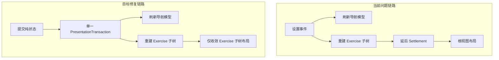

# macOS 根因修复计划

## 目标

让 macOS 上 `Layout Preset` 在 `stacked` 与 `side` 间反复切换时不再崩溃，并且不再通过“只修某个调用点”的方式补洞。修复后，`settings`、`scene render`、`layout settlement` 必须由一个明确的 transaction owner 统一提交；已生效的 same-route settings page/row/button 复用修复必须保留。

## 根因结论

- 当前崩溃不是 shared scene contract 错误，而是 macOS 落地层破坏了 transaction 边界。shared 层对 `stacked/side`、surface membership、viewport pinning 的契约和自动化验证是自洽的，真正不稳定的是 [NoteMaster_Ver_1/Platform/macOS/macOSViewController.swift](NoteMaster_Ver_1/Platform/macOS/macOSViewController.swift) 与 [NoteMaster_Ver_1/Platform/macOS/Exercise/macOSExerciseSceneRenderer.swift](NoteMaster_Ver_1/Platform/macOS/Exercise/macOSExerciseSceneRenderer.swift) 的集成方式。
- 当前一次 `settings -> scene` 切换被拆成三段由不同 owner 管理的事务：
  - `handleSettingsPanelEvent()` / `exerciseLayoutPreferences.didSet` 刷新 settings 导航模型；
  - `exercisePresentationState.didSet` 立即重建 exercise scene tree；
  - `settleSceneLayoutIfNeeded()` 再异步或延后对根 `view` 做 layout 收敛。
- `stacked/side` 正好是 churn 最大的切换：它会同时改变 split 轴、`verticalRail` 语义、`requiresViewportPinnedHeight`、指板 host 约束 priority、以及 `NSScrollView` 相关几何；只要这三段事务不是原子提交，就会在不同阶段反复炸。

```swift
// NoteMaster_Ver_1/Platform/macOS/macOSViewController.swift
private var exercisePresentationState = macOSViewController
    .initialExercisePresentationState {
    didSet {
        renderExercisePresentationState()
        handleQuarterNoteSequencePresentationTransition(
            from: oldValue,
            to: exercisePresentationState
        )
        updateAnswerSurfaceInteractionState()
    }
}
```

```swift
// NoteMaster_Ver_1/Platform/macOS/macOSViewController.swift
for _ in 0..<maxPassCount {
    view.needsLayout = true
    view.layoutSubtreeIfNeeded()
    didUpdateDynamicLayout = exerciseSceneRenderer.handleLayoutPass()
}
```




## 修复范围

- 主要修改 [NoteMaster_Ver_1/Platform/macOS/macOSViewController.swift](NoteMaster_Ver_1/Platform/macOS/macOSViewController.swift) 与 [NoteMaster_Ver_1/Platform/macOS/Exercise/macOSExerciseSceneRenderer.swift](NoteMaster_Ver_1/Platform/macOS/Exercise/macOSExerciseSceneRenderer.swift)。
- [NoteMaster_Ver_1/Platform/macOS/Controls/macOSSettingsNavigatorView.swift](NoteMaster_Ver_1/Platform/macOS/Controls/macOSSettingsNavigatorView.swift)、[NoteMaster_Ver_1/Platform/macOS/Controls/macOSSettingsPanelView.swift](NoteMaster_Ver_1/Platform/macOS/Controls/macOSSettingsPanelView.swift)、[NoteMaster_Ver_1/Platform/macOS/Controls/macOSSettingsIndexPageView.swift](NoteMaster_Ver_1/Platform/macOS/Controls/macOSSettingsIndexPageView.swift) 的复用边界保持不变，不回退。
- shared 层默认不改；只有当 [NoteMaster_Ver_1/Shared/Exercise/ExercisePresentationState.swift](NoteMaster_Ver_1/Shared/Exercise/ExercisePresentationState.swift) 的布局查询 API 无法支撑明确的主区判定时，才补一个更清晰的 shared helper，且必须证明这是 API 澄清而不是 platform bug 转移。

## 实施步骤

1. 在 [NoteMaster_Ver_1/Platform/macOS/macOSViewController.swift](NoteMaster_Ver_1/Platform/macOS/macOSViewController.swift) 建立单一的 `presentation transaction` 提交入口。
  `handleSettingsPanelEvent()` 只负责计算下一份纯状态和 dirty domains，不再允许多个 `didSet` 自动触发 settings refresh、scene render、layout settlement。
2. 移除 `exerciseLayoutPreferences`、`exercisePresentationState` 以及相关 display state 的重型 `didSet` 副作用。
  这些属性改为“纯状态存储”；真正的 UI 副作用统一由 transaction 提交顺序触发，避免一次切换被拆成多条交错调用链。
3. 把 transaction 的固定顺序钉死。
  顺序应为：状态归并与 composition reconcile -> settings 导航模型刷新 -> exercise scene render -> post-render interaction state -> exercise subtree settlement。
4. 把 settlement 的布局作用域从根 `view` 收缩到 exercise subtree。
  优先以 [NoteMaster_Ver_1/Platform/macOS/macOSViewController.swift](NoteMaster_Ver_1/Platform/macOS/macOSViewController.swift) 的 `contentView` / `scrollView` / `sceneContainerView` 为边界，不再把 [NoteMaster_Ver_1/Platform/macOS/Controls/macOSSettingsContainerView.swift](NoteMaster_Ver_1/Platform/macOS/Controls/macOSSettingsContainerView.swift) 所在 overlay 树拉进同一次收敛。
5. 统一 scene-affecting 入口。
  `layout preset`、`fretboard display`、`staff`、`piano`、以及任何会影响 `ExercisePresentationState` 或 geometry 的变更都必须走同一个 transaction，而不是分别走 `render()`、`applyFretboardDisplayState()`、`requestSceneLayoutSettlement()` 这类分叉链。
6. 保留 `viewDidLayout()` 仅作为几何脏标记入口。
  不让它直接承担 scene 动态约束修改职责，只在主 transaction 之外负责报告“exercise subtree bounds 已变化，需要下一次统一提交”。
7. 扩大日志边界。
  现有 `macOSSettingsMutationTrace.logIfActive(...)` 在异步 settlement 阶段会静默；需要给 transaction begin/end 和 settlement begin/end 增加无条件日志，确保后续若再崩，日志能覆盖“事件结束后”的那一拍。

## 参考边界

- [NoteMaster_Ver_1/Platform/iOS/iOSViewController.swift](NoteMaster_Ver_1/Platform/iOS/iOSViewController.swift) 的 `renderExercisePresentationState()` 是更稳定的参考：scene render、settings refresh、layout pass 在一个明确方法里顺序提交。macOS 不必照抄实现，但要恢复这种“单一 owner + 固定顺序”的边界。
- [NoteMaster_Ver_1/Shared/Exercise/ExerciseCompositionValidation.swift](NoteMaster_Ver_1/Shared/Exercise/ExerciseCompositionValidation.swift) 已经证明 `stacked/side`、surface membership、viewport pinning 的 shared contract 是成立的；本次修复以 macOS 平台落地为主。

## 验证边界

- macOS 启动首帧：确认不再白屏，scene 在窗口挂载后完成首轮 transaction 与 subtree settlement。
- `stacked -> side -> stacked` 往返切换：连续多次切换不崩溃，且 `natural note strip` 在 rail / stacked 间形态恢复正确。
- Settings 稳定性：停留在 `Exercise > Layout` 子页直接切换 layout，不跳页、不闪回、不 teardown 当前 page。
- live resize：窗口尺寸变化时只触发 exercise subtree 的几何收敛，不再把 settings overlay 带入同一次重型布局。
- 构建回归：重新验证 macOS 与 iOS 编译链；若 shared 层未改，需确保本次修复不会影响现有 shared validation 通过结果。

## 交付标准

- `settings`、`scene render`、`layout settlement` 在 macOS 上由一个明确的 transaction owner 提交，不再通过多个 `didSet` 自动串联。
- `stacked/side` 切换不再依赖局部 guard 或某一个调用点的特殊时机，反复切换依旧稳定。
- settlement 不再对根 `view` 做全树收敛，而是限定在 exercise subtree。
- 已经修好的 settings same-route 复用边界保持不变，shared scene 契约保持不变或仅做 API 澄清。

