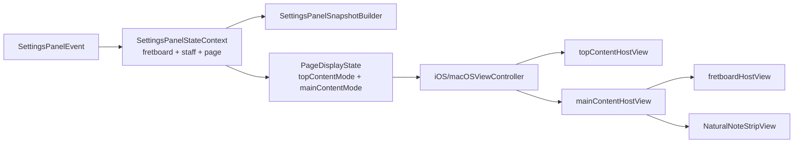

# PageDisplayState 分阶段计划

## 目标

- 用统一的 [PageDisplayState](NoteMaster_Ver_1/Shared/Controls/PageDisplayState.swift) 承载页面级编排状态，把“顶部区域切换”和“主内容区域切换”都收进去。
- 把 settings 链路从“多个并列 `inout` 参数”升级为“单一组合上下文”，从根上避免后续页面状态继续把 [SettingsPanelEvent.apply(...)](NoteMaster_Ver_1/Shared/Controls/SettingsPanelModel.swift) 的签名越堆越长。
- 双平台对称落地：iOS 用 `UIView`，macOS 同步补 `NSView`，shared settings 和页面编排层一次到位。

## 当前接缝

```swift
// NoteMaster_Ver_1/Shared/Controls/SettingsPanelModel.swift
func apply(
    to fretboardDisplayState: inout FretboardDisplayState,
    and staffDisplayState: inout StaffDisplayState,
    topContentDisplayState: inout TopContentDisplayState
)
```

```swift
// NoteMaster_Ver_1/Platform/iOS/iOSViewController.swift
contentView.addSubview(topContentHostView)
contentView.addSubview(fretboardHostView)

fretboardHostView.topAnchor.constraint(
    equalTo: topContentHostView.bottomAnchor,
    constant: Layout.verticalSpacing
)
```

上面两处分别暴露了当前的两个瓶颈：

- settings 事件链靠并列 state 参数向下传，页面状态一扩就会继续涨签名。
- 主内容区现在直接是 `fretboardHostView`，没有中间 host，后续再加第三种页面主内容时会继续把控制器约束和显隐逻辑搅在一起。

## 目标结构




## 阶段 1：页面状态域收口

- 新增 [PageDisplayState.swift](NoteMaster_Ver_1/Shared/Controls/PageDisplayState.swift)，定义：
- `PageTopContentMode`：替代当前 [TopContentMode](NoteMaster_Ver_1/Shared/Controls/TopContentDisplayState.swift)
- `PageMainContentMode`：至少包含 `.fretboard` 和 `.naturalNoteStrip`
- `PageDisplayState`：统一持有 `topContentMode` 与 `mainContentMode`，默认值保持当前页面行为不变（顶部仍显示 `staff`，主内容仍显示 `fretboard`）
- 把现有 [TopContentDisplayState.swift](NoteMaster_Ver_1/Shared/Controls/TopContentDisplayState.swift) 的引用整体迁到 `PageDisplayState`，避免 controller 和 settings 链路继续混用旧名。
- 新增 [SettingsPanelStateContext.swift](NoteMaster_Ver_1/Shared/Controls/SettingsPanelStateContext.swift)，只作为 settings 读写链路的组合载体，内部持有 `fretboardDisplayState`、`staffDisplayState`、`pageDisplayState`。
- 第一阶段先不强迫控制器把三份顶层状态合成单一巨型 state；控制器仍可保留 `displayState` / `staffDisplayState` / `pageDisplayState` 三个属性，只通过一个计算属性把它们收口成 `SettingsPanelStateContext`，把重构范围控制在 settings 和页面编排层。

## 阶段 2：shared settings 域整形

- 在 [SettingsPanelModel.swift](NoteMaster_Ver_1/Shared/Controls/SettingsPanelModel.swift) 中新增 `SettingsSectionID.page`，把当前语义含混的 `.content` row 改名为 `.topContent`，并新增 `.mainContent`。
- `Page` section 建议收口为两行：
- `Top Content`：`Staff / Target`
- `Main Content`：`Fretboard / Natural Notes`
- 原来放在 `Staff` section 里的顶部内容切换要迁出，避免页面编排状态继续挂在 staff 域下面。
- 在 [SettingsActionID](NoteMaster_Ver_1/Shared/Controls/SettingsPanelModel.swift) 中新增页面主内容动作，例如 `setMainContentFretboard` / `setMainContentNaturalNotes`；现有 `setTopContentStaff` / `setTopContentTargetPrompt` 保留但改为写入 `PageDisplayState`。
- [SettingsPanelEvent.apply(...)](NoteMaster_Ver_1/Shared/Controls/SettingsPanelModel.swift) 改为 `apply(to: inout SettingsPanelStateContext)`，不再暴露三个并列 `inout` 参数。
- [SettingsPanelSnapshotBuilder.swift](NoteMaster_Ver_1/Shared/Controls/SettingsPanelSnapshotBuilder.swift) 改为直接消费 `SettingsPanelStateContext`，让 `makeModel(...)` / `makeChoiceItem(...)` 与事件 apply 使用同一份上下文真相。
- [iOSSettingsPanelView.swift](NoteMaster_Ver_1/Platform/iOS/Controls/iOSSettingsPanelView.swift) 和 [macOSSettingsPanelView.swift](NoteMaster_Ver_1/Platform/macOS/Controls/macOSSettingsPanelView.swift) 预计不需要结构改动；它们已经能泛化渲染 choice row，只需要吃到新的 shared model。
- 单独留意 [ButtonPanelModel.swift](NoteMaster_Ver_1/Shared/Controls/ButtonPanelModel.swift) 对 `SettingsActionID` 的桥接。它当前用默认 `staff/top` state 做代理；本轮要确保 page 新动作不会漏进旧 `ButtonPanelActionID`，避免旧桥接层被页面状态污染。

## 阶段 3：自然音单一真相与双平台新组件

- 在 [NotePitch.swift](NoteMaster_Ver_1/Shared/Fretboard/NotePitch.swift) 上抽出统一自然音顺序，例如 `PitchClass.naturalCasesInOrder`，作为 `C D E F G A B` 的唯一共享出口。
- 把 [FretboardNaturalNoteTrainer.swift](NoteMaster_Ver_1/Shared/Fretboard/FretboardNaturalNoteTrainer.swift) 内部私有的自然音数组迁移到这条共享出口，避免 trainer 和新组件各写一份自然音列表。
- 新增 [iOSNaturalNoteStripView.swift](NoteMaster_Ver_1/Platform/iOS/Controls/iOSNaturalNoteStripView.swift)：
- `UIView + UIStackView + UIButton`
- `axis = .horizontal`
- `distribution = .fillEqually`
- 始终单行，不换行
- 新增 [macOSNaturalNoteStripView.swift](NoteMaster_Ver_1/Platform/macOS/Controls/macOSNaturalNoteStripView.swift)，与 iOS 对称：
- `NSView + NSStackView + NSButton`
- 与 iOS 保持同样的按钮顺序、外观层次和对外接口
- 新组件保持“平台薄壳”原则：
- 输入只依赖共享自然音顺序和必要显示模型
- 对外只暴露点击回调，例如 `onPitchClassTap`
- 不把 trainer 状态机塞进组件内部
- 本轮范围先完成“显示 + 切换 + 点击接缝”；如果后续要把按钮点击直接接入 trainer 判题，可在这条壳层回调上继续接，不需要重写组件结构。

## 阶段 4：双平台控制器主内容 host 重构

- 在 [iOSViewController.swift](NoteMaster_Ver_1/Platform/iOS/iOSViewController.swift) 和 [macOSViewController.swift](NoteMaster_Ver_1/Platform/macOS/macOSViewController.swift) 中新增 `mainContentHostView`，把它放到 `topContentHostView` 下方、`contentView.bottom` 上方，接替当前 `fretboardHostView` 的页面占位角色。
- 现有 `fretboardHostView` 不直接从页面根布局链拿位置，而是变成 `mainContentHostView` 的一个子视图；新的 `naturalNoteStripView` 作为第二个子视图与它并列，由 `PageDisplayState.mainContentMode` 控制显示。
- 把当前 `applyTopContentDisplayState()` 升级为 `applyPageDisplayState()`，或拆成 `applyTopContentMode()` + `applyMainContentMode()`，统一由 `pageDisplayState` 驱动。
- `applyDisplayState()` 的页面组装入口要同步改名，保证 `fretboard` / `staff` / `page` 三条 apply 流水线职责清晰：
- `applyFretboardDisplayState()` 只处理指板内部配置与滚动
- `applyStaffDisplayState()` 只处理五线谱内部配置
- `applyPageDisplayState()` 只处理页面编排和 host 切换
- 当 `mainContentMode != .fretboard` 时，iOS/macOS 两端的指板专用逻辑都应显式短路：
- `rebuildVerticalFretboardHostHeightConstraint()`
- `updateFretboardLayoutModeConstraints()`
- `syncVerticalFretboardContentWidthConstraint()` / `syncVerticalFretboardContentSizeConstraints()`
- `updateFretboardViewportPresentation()`
- 这样可以避免“隐藏的指板 host 仍在被滚动/约束同步路径反复修改”，防止 iOS 嵌套滚动与 macOS document 尺寸逻辑在隐藏状态下继续副作用。
- [iOSSettingsContainerView.swift](NoteMaster_Ver_1/Platform/iOS/Controls/iOSSettingsContainerView.swift) 与 [macOSSettingsContainerView.swift](NoteMaster_Ver_1/Platform/macOS/Controls/macOSSettingsContainerView.swift) 预计不需要结构性修改；它们仍只负责包 settings panel 壳层。

## 阶段 5：验证与回归

- 为页面状态和 settings 纯逻辑补一层 shared 验证，重点覆盖：
- `PageDisplayState.default` 是否保持现有页面默认行为
- `setTopContent*` / `setMainContent*` 是否正确写入 `SettingsPanelStateContext`
- `SettingsPanelSnapshotBuilder` 生成的 `Page` section 选中态是否与 context 一致
- 在 [FretboardValidation.swift](NoteMaster_Ver_1/Shared/Fretboard/FretboardValidation.swift) 的 `manualChecklist(...)` 中增加页面切换回归项：
- 切换 `Top Content` 时，顶部区域在 `staff` / `target prompt` 间正确切换
- 切换 `Main Content` 时，主区域在 `fretboard` / `natural note strip` 间正确切换
- 从 `natural note strip` 切回 `fretboard` 后，原来的 horizontal / vertical 模式、vertical viewport 高度比例、居中状态都能恢复
- `NaturalNoteStripView` 在 iOS 横竖屏和 macOS live resize 下始终保持单行，不换行、不压缩丢按钮
- iOS 手工回归重点：外层纵向滚动、指板横向滚动、新按钮组件点击三者不互相抢手势。
- macOS 手工回归重点：`NSScrollView` document 高度更新、live resize、切回指板后的水平居中与滚动边界恢复。

## 关键文件清单

- 新增 [PageDisplayState.swift](NoteMaster_Ver_1/Shared/Controls/PageDisplayState.swift)：统一页面级状态
- 新增 [SettingsPanelStateContext.swift](NoteMaster_Ver_1/Shared/Controls/SettingsPanelStateContext.swift)：settings 读写上下文
- 修改 [SettingsPanelModel.swift](NoteMaster_Ver_1/Shared/Controls/SettingsPanelModel.swift)：section / row / action / event apply 全面接入 page 与 context
- 修改 [SettingsPanelSnapshotBuilder.swift](NoteMaster_Ver_1/Shared/Controls/SettingsPanelSnapshotBuilder.swift)：从并列参数切到 context
- 修改 [NotePitch.swift](NoteMaster_Ver_1/Shared/Fretboard/NotePitch.swift)：抽自然音唯一真相
- 修改 [FretboardNaturalNoteTrainer.swift](NoteMaster_Ver_1/Shared/Fretboard/FretboardNaturalNoteTrainer.swift)：复用共享自然音集合
- 新增 [iOSNaturalNoteStripView.swift](NoteMaster_Ver_1/Platform/iOS/Controls/iOSNaturalNoteStripView.swift)：iOS 自然音按钮条
- 新增 [macOSNaturalNoteStripView.swift](NoteMaster_Ver_1/Platform/macOS/Controls/macOSNaturalNoteStripView.swift)：macOS 对称组件
- 修改 [iOSViewController.swift](NoteMaster_Ver_1/Platform/iOS/iOSViewController.swift)：新增 `mainContentHostView` 与统一页面 apply 管线
- 修改 [macOSViewController.swift](NoteMaster_Ver_1/Platform/macOS/macOSViewController.swift)：对称接入 `mainContentHostView`
- 修改 [FretboardValidation.swift](NoteMaster_Ver_1/Shared/Fretboard/FretboardValidation.swift)：补页面切换回归清单

## 验收标准

- settings 面板出现独立 `Page` section，并明确区分 `Top Content` 与 `Main Content`，不再复用语义模糊的 `Content`。
- `SettingsPanelEvent.apply(...)` 不再需要为页面增长继续增加新的 `inout` 参数；页面扩展优先吸收到 `PageDisplayState` 和 `SettingsPanelStateContext` 内部。
- iOS 与 macOS 都能在同一套 shared state / settings 下切换 `fretboard` 和 `natural note strip`。
- 新组件中的 `C D E F G A B` 永远从 shared 单一真相派生，不再在 trainer、平台 view、settings 里各写一份。
- 从新组件切回指板后，现有 vertical viewport、scroll、layout 行为不回归。

