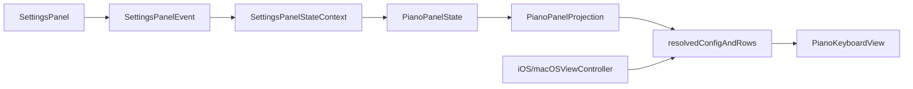

# 钢琴控制面板实施计划

## 实现决策

- 采用“扩展现有 `SettingsPanel`”路线，不新增独立 `PianoControlPanelView`。
- 继续保持 `PianoKeyboardView` 为半受控组件：view 只接收 `configuration` 和 `rows`，控制面板状态先落在控制器，再投影成最终传给 view 的数据。
- 为避免 iOS/macOS 控制器各自复制行数/级联/吸附转换逻辑，在 `Shared/Piano` 新增一个纯投影层。

## 关键落点

- 在 [NoteMaster_Ver_1/Shared/Piano/PianoState.swift](NoteMaster_Ver_1/Shared/Piano/PianoState.swift) 旁边新增一个 shared piano 控制状态文件，例如 `PianoPanelState.swift`，承载：
- `isVisible`
- `rowCount`
- `movementScope`
- `snapEnabled`
- 在 [NoteMaster_Ver_1/Shared/Piano/PianoConfiguration.swift](NoteMaster_Ver_1/Shared/Piano/PianoConfiguration.swift) 保持 `snapEnabled` 仍属于渲染/交互配置，不把“是否显示”“行数”塞进 configuration。
- 在 [NoteMaster_Ver_1/Shared/Controls/SettingsPanelStateContext.swift](NoteMaster_Ver_1/Shared/Controls/SettingsPanelStateContext.swift) 增加 `pianoPanelState`，让现有 settings snapshot/build/apply 链路能感知钢琴控制态。
- 扩展 [NoteMaster_Ver_1/Shared/Controls/SettingsPanelModel.swift](NoteMaster_Ver_1/Shared/Controls/SettingsPanelModel.swift) 与 [NoteMaster_Ver_1/Shared/Controls/SettingsPanelSnapshotBuilder.swift](NoteMaster_Ver_1/Shared/Controls/SettingsPanelSnapshotBuilder.swift)，新增一个 `piano` section，并复用现有 `.choice / .slider / .toggle` 行类型。
- 在 [NoteMaster_Ver_1/Platform/iOS/iOSViewController.swift](NoteMaster_Ver_1/Platform/iOS/iOSViewController.swift) 和 [NoteMaster_Ver_1/Platform/macOS/macOSViewController.swift](NoteMaster_Ver_1/Platform/macOS/macOSViewController.swift) 扩展 `settingsPanelStateContext`、`handleSettingsPanelEvent(_:)`、`applyPianoDemoState()`，把 panel state 投影成最终的 `configuration` 和 `rows`。

## 分阶段实施

### 1. Shared Piano 控制状态与投影

- 新增 `PianoPanelState`：
- `isVisible: Bool`
- `rowCount: Int`
- `movementScope: PianoMovementScope`
- `snapEnabled: Bool`
- 新增 `PianoPanelProjection`（或等价纯 helper），提供：
- `resolvedConfiguration(from:baseConfiguration:panelState:)`
- `resolvedRows(from:baseRows:panelState:)`
- 约定默认行数策略：
- 减少行数：保留前 `N` 行
- 增加行数：在最后一行基础上按 `-12` 半音追加新行
- 应用级联切换：统一重写所有 row 的 `movementScope`
- 应用吸附切换：只修改 `PianoConfiguration.snapEnabled`
- 这一层尽量纯函数化，便于后续补 shared validation，而不是把规则散落到两个控制器里。

### 2. 扩展 SettingsPanel 的 shared schema

- 在 `SettingsSectionID` 新增 `piano` 分组。
- 在 `SettingsToggleID` 新增：
- `pianoVisible`
- `pianoSnapEnabled`
- 在 `SettingsSliderID` 新增：
- `pianoRowCount`
- 在 `SettingsChoiceRowID` / `SettingsActionID` 新增：
- `pianoMovementScope`
- `setPianoMovementScopeCascade`
- `setPianoMovementScopeRowOnly`
- 扩展 `resolvedValue(...)`、`isSelected(...)`、`apply(...)`、`displayValue(...)`，让 `SettingsPanelEvent.apply(to:)` 能直接更新 `pianoPanelState`。
- 在 `SettingsPanelSnapshotBuilder` 里构造 `piano` section；因为平台 view 已支持通用 `.choice/.slider/.toggle` 行，所以 [NoteMaster_Ver_1/Platform/iOS/Controls/iOSSettingsPanelView.swift](NoteMaster_Ver_1/Platform/iOS/Controls/iOSSettingsPanelView.swift) 和 [NoteMaster_Ver_1/Platform/macOS/Controls/macOSSettingsPanelView.swift](NoteMaster_Ver_1/Platform/macOS/Controls/macOSSettingsPanelView.swift) 预计无需新增 row view 类型。

### 3. 控制器接线与状态投影

- 在两个控制器新增：
- `pianoPanelState`
- `pianoBaseConfiguration`
- `pianoBaseRows`
- 让 `settingsPanelStateContext` 把 `pianoPanelState` 暴露给 settings panel snapshot builder。
- 扩展 `handleSettingsPanelEvent(_:)`：除现有 fretboard/staff/page/trainer 外，额外检测 piano panel state 变化，并触发 `applyPianoDemoState()`。
- 重写 `applyPianoDemoState()`：
- 用 shared projection 先计算 `resolvedConfiguration` 与 `resolvedRows`
- 再更新 `pianoKeyboardView.configuration` 和 `pianoKeyboardView.rows`
- 保持现有 `replaceRows(...)` 的 sanitation 机制继续负责 preview/activeInteraction 清理，复用 [NoteMaster_Ver_1/Platform/iOS/Controls/iOSPianoKeyboardView.swift](NoteMaster_Ver_1/Platform/iOS/Controls/iOSPianoKeyboardView.swift) 与 [NoteMaster_Ver_1/Platform/macOS/Controls/macOSPianoKeyboardView.swift](NoteMaster_Ver_1/Platform/macOS/Controls/macOSPianoKeyboardView.swift) 已有逻辑。

### 4. 显示/隐藏的布局收口

- 不建议只切 `pianoDemoContainerView.isHidden`，因为当前底部收口直接挂在 piano demo container 上。
- 为两个控制器补一组“显示/隐藏时切换的底部约束”，确保：
- 显示时：`contentView.bottom` 由 piano demo card 收口
- 隐藏时：`contentView.bottom` 改由 `mainContentHostView` 收口
- 如需保留最小间距，再单独维护 `mainContentHostView -> pianoDemoContainerView` 的顶部间距约束常量。

### 5. 状态文本与验证

- 扩展 piano demo status 文本，把控制面板结果也显示出来，例如：
- `visible`
- `rowCount`
- `movementScope`
- `snapEnabled`
- 给 shared 投影层补 focused validation：
- 行数增减是否稳定
- 级联切换是否覆盖所有行
- 吸附开关是否只影响 configuration 不改起始音
- 最后做现有标准回归：`ReadLints` + `swiftc -typecheck` + 双平台手工点按检查。

## 现有代码的复用依据

- 控制器已经有统一的 piano 应用边界，不必把 panel 逻辑塞进 view：
- [NoteMaster_Ver_1/Platform/iOS/iOSViewController.swift](NoteMaster_Ver_1/Platform/iOS/iOSViewController.swift)
- [NoteMaster_Ver_1/Platform/macOS/macOSViewController.swift](NoteMaster_Ver_1/Platform/macOS/macOSViewController.swift)
- 现有 settings panel 已经是 shared model 驱动的通用渲染链：
- [NoteMaster_Ver_1/Shared/Controls/SettingsPanelModel.swift](NoteMaster_Ver_1/Shared/Controls/SettingsPanelModel.swift)
- [NoteMaster_Ver_1/Shared/Controls/SettingsPanelSnapshotBuilder.swift](NoteMaster_Ver_1/Shared/Controls/SettingsPanelSnapshotBuilder.swift)
- [NoteMaster_Ver_1/Platform/iOS/Controls/iOSSettingsPanelView.swift](NoteMaster_Ver_1/Platform/iOS/Controls/iOSSettingsPanelView.swift)
- [NoteMaster_Ver_1/Platform/macOS/Controls/macOSSettingsPanelView.swift](NoteMaster_Ver_1/Platform/macOS/Controls/macOSSettingsPanelView.swift)
- piano view 已支持外部直接替换 `rows` 并自动清理不合法的交互态，可直接承接“行数变化”这一控制项：
- [NoteMaster_Ver_1/Platform/iOS/Controls/iOSPianoKeyboardView.swift](NoteMaster_Ver_1/Platform/iOS/Controls/iOSPianoKeyboardView.swift)
- [NoteMaster_Ver_1/Platform/macOS/Controls/macOSPianoKeyboardView.swift](NoteMaster_Ver_1/Platform/macOS/Controls/macOSPianoKeyboardView.swift)

