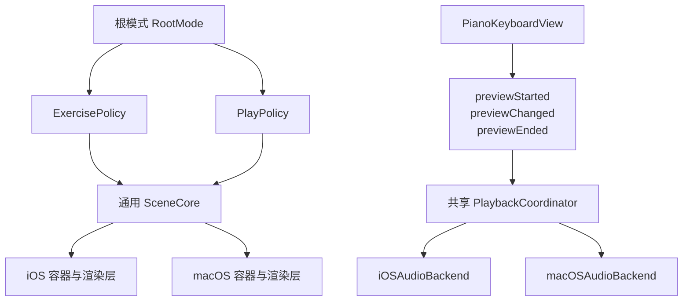

# Play 模式分阶段计划

## 目标

- 将当前以 `Exercise*` 命名和约束的页面/场景体系，上提为更通用的 root mode + scene core。
- 新增与 `exercise` 平级且互斥的 `play` 模式；首版 `play` 只展示 `piano`，不显示 `fretboard` / `staff` / `notestrip`。
- 音频链路采用“共享协调器 + 平台后端”：只消费 `previewStarted` / `previewChanged` / `previewEnded`，底层分别接 iOS/macOS 音频实现。
- 整个迁移过程中，现有 exercise 行为、settings 导航、validation 与 smoke test 要持续可回归。

## 架构目标

## 关键现状与切入点

- 当前通用场景能力其实已经存在，但被 exercise 命名和验证规则包住了： [NoteMaster_Ver_1/Shared/Exercise/ExerciseScene.swift](NoteMaster_Ver_1/Shared/Exercise/ExerciseScene.swift)、[NoteMaster_Ver_1/Shared/Exercise/ExercisePresentationState.swift](NoteMaster_Ver_1/Shared/Exercise/ExercisePresentationState.swift)、[NoteMaster_Ver_1/Shared/Exercise/ExerciseCompositionPolicy.swift](NoteMaster_Ver_1/Shared/Exercise/ExerciseCompositionPolicy.swift)、[NoteMaster_Ver_1/Shared/Exercise/ExerciseSceneValidator.swift](NoteMaster_Ver_1/Shared/Exercise/ExerciseSceneValidator.swift)。
- 当前顶层入口直接绑死到 exercise 控制器： [NoteMaster_Ver_1/Platform/iOS/iOSAppDelegate.swift](NoteMaster_Ver_1/Platform/iOS/iOSAppDelegate.swift)、[NoteMaster_Ver_1/Platform/macOS/macOSAppDelegate.swift](NoteMaster_Ver_1/Platform/macOS/macOSAppDelegate.swift)、[NoteMaster_Ver_1/Platform/iOS/iOSViewController.swift](NoteMaster_Ver_1/Platform/iOS/iOSViewController.swift)、[NoteMaster_Ver_1/Platform/macOS/macOSViewController.swift](NoteMaster_Ver_1/Platform/macOS/macOSViewController.swift)。
- `piano` 已经具备稳定 preview 语义，是接音频最好的统一输入口： [NoteMaster_Ver_1/Shared/Piano/PianoInteraction.swift](NoteMaster_Ver_1/Shared/Piano/PianoInteraction.swift)、[NoteMaster_Ver_1/Shared/Piano/PianoInteractionReducer.swift](NoteMaster_Ver_1/Shared/Piano/PianoInteractionReducer.swift)、[NoteMaster_Ver_1/Platform/iOS/Controls/iOSPianoKeyboardView.swift](NoteMaster_Ver_1/Platform/iOS/Controls/iOSPianoKeyboardView.swift)、[NoteMaster_Ver_1/Platform/macOS/Controls/macOSPianoKeyboardView.swift](NoteMaster_Ver_1/Platform/macOS/Controls/macOSPianoKeyboardView.swift)。
- 当前仓库没有现成音频基础设施；平台后端需要从零建立，推荐先以 `AVFoundation` 作为 iOS/macOS 的默认实现方向做一期 spike，再锁定最终后端。

## Phase 1：先抽出稳定边界，不改现有行为

- 在平台入口之上引入 `RootMode` 与根容器壳层，但默认仍只启动 `exercise`，先不暴露 `play` 给最终用户。
- 给当前 `Exercise*` 核心类型加“通用场景”过渡层，优先用命名空间/薄包装/兼容别名方式，把新代码写向通用层，旧代码继续跑现有 exercise 路径。
- 将 `ExerciseSceneValidator` 中“结构校验”和“exercise 专属规范化”分离；结构校验保留在 validator，训练语义相关的 normalizedPreferences / composition 限制下沉到 exercise policy。
- 继续把 `LegacyPageLayoutAdapter` 视为 exercise 专用兼容桥，明确它不参与 play。
- 完成条件：exercise 启动、settings、layout smoke、validation 结果与当前保持一致。

关键文件：

- [NoteMaster_Ver_1/Shared/Exercise/ExerciseSceneValidator.swift](NoteMaster_Ver_1/Shared/Exercise/ExerciseSceneValidator.swift)
- [NoteMaster_Ver_1/Shared/Exercise/ExerciseCompositionPolicy.swift](NoteMaster_Ver_1/Shared/Exercise/ExerciseCompositionPolicy.swift)
- [NoteMaster_Ver_1/Shared/Exercise/LegacyPageLayoutAdapter.swift](NoteMaster_Ver_1/Shared/Exercise/LegacyPageLayoutAdapter.swift)
- [NoteMaster_Ver_1/Platform/iOS/iOSAppDelegate.swift](NoteMaster_Ver_1/Platform/iOS/iOSAppDelegate.swift)
- [NoteMaster_Ver_1/Platform/macOS/macOSAppDelegate.swift](NoteMaster_Ver_1/Platform/macOS/macOSAppDelegate.swift)

## Phase 2：把 Exercise Core 上提成通用 Scene Core

- 把当前 `ExerciseScene*` / `ExercisePresentationState` 的通用部分演进为根模式无关的 scene core；`prompt/answer` 这类训练语义改为 exercise 子域能力，而不是全局根语义。
- 保持平台 renderer 暂时可复用现有实现，但在职责上改成“通用 scene renderer + exercise policy 输出”。
- 为 play 新增独立 policy：输出单 surface 的 piano scene，不依赖 prompt/answer 规则，不依赖 `LegacyPageLayoutAdapter`。
- exercise 继续走现有 surface 组合策略，play 从一开始就只绑定 `piano`。
- 完成条件：scene core 可以同时承载 exercise scene 与 piano-only play scene，且不需要靠 `TrainerExerciseMode` 才能成立。

关键文件：

- [NoteMaster_Ver_1/Shared/Exercise/ExerciseScene.swift](NoteMaster_Ver_1/Shared/Exercise/ExerciseScene.swift)
- [NoteMaster_Ver_1/Shared/Exercise/ExercisePresentationState.swift](NoteMaster_Ver_1/Shared/Exercise/ExercisePresentationState.swift)
- [NoteMaster_Ver_1/Platform/iOS/Exercise/iOSExerciseSceneRenderer.swift](NoteMaster_Ver_1/Platform/iOS/Exercise/iOSExerciseSceneRenderer.swift)
- [NoteMaster_Ver_1/Platform/macOS/Exercise/macOSExerciseSceneRenderer.swift](NoteMaster_Ver_1/Platform/macOS/Exercise/macOSExerciseSceneRenderer.swift)

## Phase 3：把状态与设置从“练习唯一”拆成“根模式 + 模式专属”

- 保留 [NoteMaster_Ver_1/Shared/Controls/TrainerDisplayState.swift](NoteMaster_Ver_1/Shared/Controls/TrainerDisplayState.swift) 作为 exercise 专属状态，不把 `play` 硬塞进 `exerciseMode`。
- 新增根级 mode state，至少拆为 exercise 专属状态与 play 专属状态；避免 play 路径误依赖 trainer session、prompt/answer 会话与 feedback。
- 将 [NoteMaster_Ver_1/Shared/Controls/SettingsPanelStateContext.swift](NoteMaster_Ver_1/Shared/Controls/SettingsPanelStateContext.swift) 从“单一全局上下文”拆成“根模式公共 slice + exercise slice + play slice”，让 settings 能按 mode 组装 section。
- 把 [NoteMaster_Ver_1/Shared/Controls/SettingsPanelModel.swift](NoteMaster_Ver_1/Shared/Controls/SettingsPanelModel.swift) 与 [NoteMaster_Ver_1/Shared/Controls/SettingsPanelSnapshotBuilder.swift](NoteMaster_Ver_1/Shared/Controls/SettingsPanelSnapshotBuilder.swift) 从“Exercise 一套打天下”改成“公共项 + mode 专属项”。
- 更新 [NoteMaster_Ver_1/Shared/Controls/SettingsNavigationSnapshotBuilder.swift](NoteMaster_Ver_1/Shared/Controls/SettingsNavigationSnapshotBuilder.swift) 与 [NoteMaster_Ver_1/Shared/Controls/SettingsNavigationValidation.swift](NoteMaster_Ver_1/Shared/Controls/SettingsNavigationValidation.swift)，新增 play root tree 与 exercise root tree 的双路验证。
- 完成条件：切到 play 后，settings 不再暴露 exercise 专属项；切回 exercise 后旧路径不丢失。

## Phase 4：落地 play 页面壳层与 piano-only UI

- 在根容器中接入 `play` 子控制器或等效子树，exercise 与 play 通过 `RootMode` 互斥切换。
- `play` 页面首版只复用现有 `iOSPianoKeyboardView` / `macOSPianoKeyboardView` 与共享的 piano state/projection，不引入 fretboard/staff/notestrip。
- 把当前控制器里的 piano demo 逻辑从 exercise 控制器中拆出，避免 `play` 只是“exercise 页面里显示一个 accessory”。
- rowCount / whiteKeyStyle / snap 等可复用 piano 配置，优先归到 mode 公共或 play 专属设置，不再通过 exercise accessory 语义驱动。
- 完成条件：根模式能稳定切换到 play，页面只显示 piano，且不依赖 `ExerciseLayoutPreferences.isPianoAccessoryVisible`。

关键文件：

- [NoteMaster_Ver_1/Platform/iOS/iOSViewController.swift](NoteMaster_Ver_1/Platform/iOS/iOSViewController.swift)
- [NoteMaster_Ver_1/Platform/macOS/macOSViewController.swift](NoteMaster_Ver_1/Platform/macOS/macOSViewController.swift)
- [NoteMaster_Ver_1/Platform/iOS/Controls/iOSPianoKeyboardView.swift](NoteMaster_Ver_1/Platform/iOS/Controls/iOSPianoKeyboardView.swift)
- [NoteMaster_Ver_1/Platform/macOS/Controls/macOSPianoKeyboardView.swift](NoteMaster_Ver_1/Platform/macOS/Controls/macOSPianoKeyboardView.swift)
- [NoteMaster_Ver_1/Shared/Piano/PianoPanelState.swift](NoteMaster_Ver_1/Shared/Piano/PianoPanelState.swift)

## Phase 5：接入“共享协调器 + 平台后端”音频体系

- 新增共享 `PlaybackCoordinator`，它只消费 `previewStarted` / `previewChanged` / `previewEnded`，并维护统一的“当前预览音”状态机。
- 平台后端分别实现相同 contract，推荐先做一轮 `AVFoundation` spike，验证 iOS/macOS 是否能在同一接口下满足首版发声与停音要求；通过后再固定后端实现。
- `previewChanged` 需要定义清楚“切音”语义：是先停旧音再起新音，还是做无缝替换；协调器统一收口，平台后端不要自己推导手势。
- `previewChanged + previewEnded` 可能在同一 reduction 内背靠背出现，协调器必须处理幂等切音/停音。
- 当前 `replaceRows` 会清空 preview 但不发 `previewEnded`；因此要在 play 壳层或协调器补一个“强制静音 / 中断预览”入口，覆盖 mode 切换、rows 替换、view disappear、settings 触发行重建等场景。
- 完成条件：按下发声、滑动切音、抬起停音、离开 play / 改 row / 切 mode 时都不会残留悬空音。

关键文件：

- [NoteMaster_Ver_1/Shared/Piano/PianoInteraction.swift](NoteMaster_Ver_1/Shared/Piano/PianoInteraction.swift)
- [NoteMaster_Ver_1/Shared/Piano/PianoInteractionReducer.swift](NoteMaster_Ver_1/Shared/Piano/PianoInteractionReducer.swift)
- [NoteMaster_Ver_1/Shared/Fretboard/NotePitch.swift](NoteMaster_Ver_1/Shared/Fretboard/NotePitch.swift)
- [NoteMaster_Ver_1/Platform/iOS/Controls/iOSPianoKeyboardView.swift](NoteMaster_Ver_1/Platform/iOS/Controls/iOSPianoKeyboardView.swift)
- [NoteMaster_Ver_1/Platform/macOS/Controls/macOSPianoKeyboardView.swift](NoteMaster_Ver_1/Platform/macOS/Controls/macOSPianoKeyboardView.swift)

## Phase 6：清理命名、拆验证、去掉过渡层

- 等 exercise 与 play 双模式都稳定后，再收尾重命名：只有真正通用的 core 才去掉 `Exercise*` 前缀；训练专属概念继续保留 exercise / trainer 语义命名。
- 将超大的 validation 文件按职责拆分成 scene core、exercise policy、play policy、settings navigation 几组，降低后续模式继续扩展时的维护成本。
- 对 platform renderer 做最后一轮清理，确认“通用 scene 渲染职责”和“mode policy 输出职责”边界稳定。
- 完成条件：没有兼容别名泄漏到新代码路径，验证和命名都能准确反映真实职责。

关键文件：

- [NoteMaster_Ver_1/Shared/Exercise/ExerciseCompositionValidation.swift](NoteMaster_Ver_1/Shared/Exercise/ExerciseCompositionValidation.swift)
- [NoteMaster_Ver_1/Shared/Controls/SettingsNavigationValidation.swift](NoteMaster_Ver_1/Shared/Controls/SettingsNavigationValidation.swift)
- [NoteMaster_Ver_1/Shared/Piano/PianoValidation.swift](NoteMaster_Ver_1/Shared/Piano/PianoValidation.swift)

## 每阶段的验收闸门

- Phase 1 闸门：现有 exercise 启动、settings、layout smoke、validation 结果不回退。
- Phase 2 闸门：scene core 可以表达 play 的 piano-only scene，且不再依赖 exercise 专属规范化才能成立。
- Phase 3 闸门：settings 中 exercise / play 的 section 明确隔离，不发生状态串味。
- Phase 4 闸门：play 页面可以单独进入、退出、切回 exercise，且不借道 exercise accessory 语义。
- Phase 5 闸门：发声状态机覆盖按下、滑动、抬起、取消、切 mode、重建 rows 六类退出路径。
- Phase 6 闸门：过渡层显著减少，验证文件职责拆清，后续再加新 mode 不需要复制整套 exercise 命名。

