# Position Prompt 品位筛选计划

## 目标

- 仅在 `exerciseMode == .positionPrompt` 时，在 `Trainer` 分区新增一行 12 格品位筛选控件，表示 `1...12` 品。
- 默认全选 `1...12`；用户可逐个选中/取消，但必须始终至少保留 1 个已选品位。
- `positionPrompt` 的出题、换题与 session 校验仅从选中品位里选择自然音位置；`single` 与 `sequence` 不读取这份配置。
- 现有“上指板、下音名按钮”的页面编排与答题时序保持不变。

## 现状锚点

- `Trainer` 分区当前只有一行 `Exercise Mode`：[NoteMaster_Ver_1/Shared/Controls/SettingsPanelModel.swift](NoteMaster_Ver_1/Shared/Controls/SettingsPanelModel.swift)

```swift
case .trainer:
    return [
        .choice(.exerciseMode)
    ]
```

- 设置面板当前只支持 `choice / slider / toggle` 三种 row，事件也只有 `triggerAction / setSliderValue / setToggleValue`：[NoteMaster_Ver_1/Shared/Controls/SettingsPanelModel.swift](NoteMaster_Ver_1/Shared/Controls/SettingsPanelModel.swift)
- `positionPrompt` 候选池当前直接遍历 `configuration.fretRange`，而 `fretRange == 0...maxFret`，所以默认会包含空弦：[NoteMaster_Ver_1/Shared/Fretboard/FretboardConfiguration.swift](NoteMaster_Ver_1/Shared/Fretboard/FretboardConfiguration.swift), [NoteMaster_Ver_1/Shared/Fretboard/FretboardNaturalNoteTrainer.swift](NoteMaster_Ver_1/Shared/Fretboard/FretboardNaturalNoteTrainer.swift)

```swift
for stringIndex in 0..<configuration.stringCount {
    for fret in configuration.fretRange {
        let cell = FretboardCell(stringIndex: stringIndex, fret: fret)
        guard let pitchClass = configuration.pitchClass(for: cell),
              pitchClass.isNatural else {
            continue
        }
        cells.append(cell)
    }
}
```

## 数据流

```mermaid
flowchart LR
  FretFilterRow["PositionPromptFretFilterRow"] -->|"toggleFret(1...12)"| SettingsEvent["SettingsPanelEvent.togglePositionPromptFret"]
  SettingsEvent --> TrainerState["TrainerDisplayState.positionPromptConfiguration.selectedFrets"]
  TrainerState --> Snapshot["SettingsPanelSnapshotBuilder"]
  TrainerState --> Controller["iOS/macOSViewController"]
  Controller --> SessionCheck["positionPromptSessionMatchesCurrentTrainer"]
  SessionCheck --> EnsureSession["ensurePositionPromptSession"]
  EnsureSession --> TrainerCore["FretboardNaturalNoteTrainer.makePositionPromptSession"]
  TrainerCore --> CandidateFilter["naturalCells ∩ allowedFrets"]
```




## 分阶段实施

### 阶段 1：扩展 trainer 状态，给 positionPrompt 增加“允许品位集合”真相源

- 在 [NoteMaster_Ver_1/Shared/Controls/TrainerDisplayState.swift](NoteMaster_Ver_1/Shared/Controls/TrainerDisplayState.swift) 新增 `PositionPromptConfiguration`（建议字段：`selectedFrets: Set<Int>`，默认 `Set(1...12)`）。
- 给 `PositionPromptConfiguration` 增加最小辅助方法：
  - `normalized()`：裁剪到 `1...12`。
  - `canToggleOff(_ fret: Int)`：保证最后一个已选品位不可取消。
  - `toggling(_ fret: Int)`：返回新的配置或保持原值。
- 保持 `TrainerDisplayState` 仍是设置面板的单一 trainer 真相源，这样 [NoteMaster_Ver_1/Shared/Controls/SettingsPanelStateContext.swift](NoteMaster_Ver_1/Shared/Controls/SettingsPanelStateContext.swift) 无需新增独立字段，只需继续透传 `trainerDisplayState`。
- 这一阶段的目标是先把“选中了哪些品”变成 shared 状态，而不是控制器私有状态。

### 阶段 2：扩展 settings shared model，新增 positionPrompt 专用 row 与事件

- 在 [NoteMaster_Ver_1/Shared/Controls/SettingsPanelModel.swift](NoteMaster_Ver_1/Shared/Controls/SettingsPanelModel.swift) 新增一类专用 row，而不是把 12 个品位硬塞进 `SettingsActionID`：
  - 建议新增 `SettingsRowID.positionPromptFrets` 或 `SettingsRowID.fretFilter(SettingsFretFilterRowID)`。
  - 新增 `SettingsRow.positionPromptFrets(...)` 对应的 row payload。
  - 新增 `SettingsPanelEvent.togglePositionPromptFret(Int)`，并在 `apply(to:)` 中落到 `trainerDisplayState.positionPromptConfiguration`。
- 在 [NoteMaster_Ver_1/Shared/Controls/SettingsPanelSnapshotBuilder.swift](NoteMaster_Ver_1/Shared/Controls/SettingsPanelSnapshotBuilder.swift) 为这行实现快照构建，只在 `stateContext.trainerDisplayState.isPositionPromptMode` 时返回 row，否则省略。
- 在 `Trainer` 分区里把新 row 放在 `Exercise Mode` 下方，保持用户路径自然：先选模式，再配品位范围。
- 这一阶段结束后，设置面板共享模型应能表达“positionPrompt 模式下显示 12 格筛选行”的结构。

### 阶段 3：双端设置面板新增 12 格单行控件

- 在 [NoteMaster_Ver_1/Platform/iOS/Controls/iOSSettingsPanelView.swift](NoteMaster_Ver_1/Platform/iOS/Controls/iOSSettingsPanelView.swift) 的 `controlView(for:)` 里新增 row 分支，并添加私有 `PositionPromptFretFilterRowView`。
- 在 [NoteMaster_Ver_1/Platform/macOS/Controls/macOSSettingsPanelView.swift](NoteMaster_Ver_1/Platform/macOS/Controls/macOSSettingsPanelView.swift) 做对称实现。
- 该 row view 的行为约束：
  - 一行 12 个等宽格子，标题显示 `Fret Range` 或 `Frets`。
  - 格子文案为 `1...12`。
  - 选中态/未选中态清晰可见。
  - 点击已选中的最后一个格子时，不发送取消事件，保持至少一个已选。
- 这层只负责 UI 与事件发射，不直接做出题逻辑。
- 这一阶段的目标是让设置面板在双端都能稳定显示和回显 12 格筛选控件。

### 阶段 4：shared trainer 只从允许品位出题

- 在 [NoteMaster_Ver_1/Shared/Fretboard/FretboardNaturalNoteTrainer.swift](NoteMaster_Ver_1/Shared/Fretboard/FretboardNaturalNoteTrainer.swift) 把 `allowedFrets` 接入 `positionPrompt` 候选池。
- 建议改造点：
  - `positionPromptCandidateCells(...)` 增加 `allowedFrets` 过滤。
  - `makePositionPromptSession(...)` 与内部 `excluding:` 版本贯穿 `allowedFrets`。
  - `handlePositionPromptAnswer(...)` 在答对后换题时沿用同一 `allowedFrets`。
  - `validatePositionPromptSession(...)` 断言 `session.promptCell.fret` 仍属于当前允许集合。
- 这样 shared 层就真正具备“只从选中的品位里抽题”的语义，而不是 UI 仅做展示。
- 这一阶段结束后，空弦 `fret == 0` 应默认不再进入 `positionPrompt` 候选池。

### 阶段 5：双端控制器纳入筛选变化后的 session 重建与时序处理

- 在 [NoteMaster_Ver_1/Platform/iOS/iOSViewController.swift](NoteMaster_Ver_1/Platform/iOS/iOSViewController.swift) 与 [NoteMaster_Ver_1/Platform/macOS/macOSViewController.swift](NoteMaster_Ver_1/Platform/macOS/macOSViewController.swift) 中，把当前筛选状态纳入 `positionPromptSessionMatchesCurrentTrainer(_:)`。
- 当设置面板切换品位后：
  - 若当前 prompt 的 `fret` 仍合法，允许继续保留当前题。
  - 若当前 prompt 已不在允许集合内，应取消待执行反馈任务并重建 `positionPromptSession`。
- 需要复查并对齐这些入口：
  - `settingsPanelStateContext`
  - `handleSettingsPanelEvent(_:)`
  - `positionPromptSessionMatchesCurrentTrainer(_:)`
  - `ensurePositionPromptSession()`
  - `synchronizePositionPromptPresentation(reason:)`
- 这一阶段的目标是确保“筛选变化后不会继续显示一个非法题目”，同时不破坏现有红闪/绿停留节奏。

### 阶段 6：validation 与回归验证

- 在 [NoteMaster_Ver_1/Shared/Fretboard/FretboardValidation.swift](NoteMaster_Ver_1/Shared/Fretboard/FretboardValidation.swift) 补 positionPrompt 相关校验：
  - 默认全选 `1...12` 时，候选池不含空弦。
  - 子集 `{1, 3, 5, 7}` 时，新建题目与答对后换题都只落在这些品位。
  - 当排除当前题目后重新抽题，仍满足 `allowedFrets`。
- 补手工回归清单：
  - `single` 与 `sequence` 模式下不显示该控件。
  - `positionPrompt` 模式下显示该控件，并默认全选。
  - 只选少数品位时，题目只在这些品位出现。
  - 尝试取消最后一个已选品位时，UI 保持至少一个选中。
  - 筛选变化后，若当前题目非法，界面能平滑切换到新题，不残留错误 overlay 或延时任务。

## 实施顺序建议

1. 先做阶段 1 + 阶段 2，把 shared 状态、row 模型与事件打通。
2. 再做阶段 3，让设置面板双端都能显示 12 格筛选控件。
3. 然后做阶段 4 + 阶段 5，把 shared trainer 与双端控制器真正接上筛选结果。
4. 最后做阶段 6，补 validation 与双端回归，确认 `single / sequence` 没被带坏。

## 风险点

- 现有设置面板只支持 `choice / slider / toggle`，方案 1 的核心风险在于需要新增一类自定义 row；但这比向 `SettingsActionID` 塞 12 个品位 action 更干净，也更符合“12 格子”的 UI 目标。
- `positionPrompt` 当前在控制器里倾向“尽量保留 session”；新增筛选后要重新定义“何时必须失效并重建 session”，否则会出现题目落在未选品位上的状态残留。
- 双端设置视图当前都按 `SettingsRow` 的 switch 分支创建 view，因此 row 类型一旦新增，iOS/macOS 两边都必须同步补齐，不适合只做单端。

