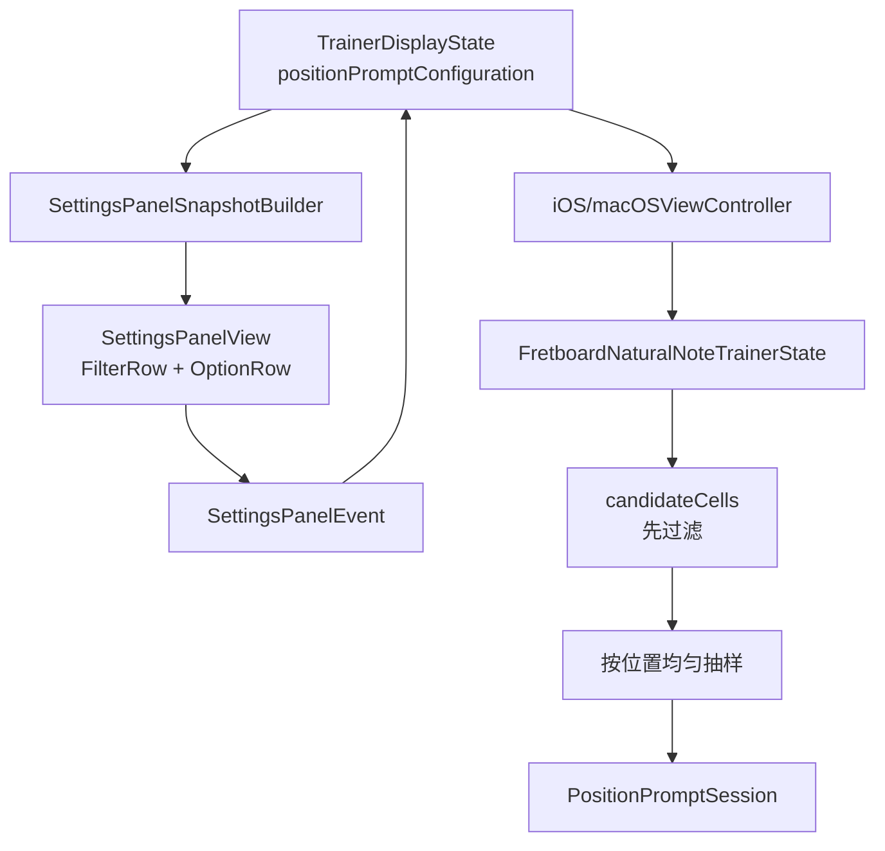

# Position 过滤模式重构计划

## 目标

把当前写死为“按品位筛选”的 `positionPrompt` 出题链路，升级成统一的过滤模式架构：

- 过滤模式互斥：`noteName` 或 `fret`
- 仍采用统一流程：先构造候选池，再按位置均匀抽一个位置
- 默认过滤模式改为按音名过滤，默认选中 `C/E/F/B`
- 切换过滤模式时保留另一套选择状态，避免用户来回切换时丢设置

## 现状锚点

当前实现的几个关键锚点如下：

- 训练状态仍只有品位过滤配置，集中在 [TrainerDisplayState.swift](NoteMaster_Ver_1/Shared/Controls/TrainerDisplayState.swift)
- 设置面板把多选过滤硬编码成 `.fretFilter` 行与 `.togglePositionPromptFret(Int)` 事件，集中在 [SettingsPanelModel.swift](NoteMaster_Ver_1/Shared/Controls/SettingsPanelModel.swift)
- 设置面板快照只会在 `positionPrompt` 模式下生成 `Frets` 这一行，集中在 [SettingsPanelSnapshotBuilder.swift](NoteMaster_Ver_1/Shared/Controls/SettingsPanelSnapshotBuilder.swift)
- shared trainer 当前固定走“allowed frets -> candidate cells -> randomElement”链路，集中在 [FretboardNaturalNoteTrainer.swift](NoteMaster_Ver_1/Shared/Fretboard/FretboardNaturalNoteTrainer.swift)
- iOS/macOS controller 当前只感知 `positionPromptConfiguration.selectedFrets` 变化，集中在 [iOSViewController.swift](NoteMaster_Ver_1/Platform/iOS/iOSViewController.swift) 与 [macOSViewController.swift](NoteMaster_Ver_1/Platform/macOS/macOSViewController.swift)
- 自然音 7 键已经有共享顺序真相源 `PitchClass.naturalCasesInOrder`，定义在 [NotePitch.swift](NoteMaster_Ver_1/Shared/Fretboard/NotePitch.swift)

## 实施阶段

### 阶段 1：重构共享领域模型

在 [TrainerDisplayState.swift](NoteMaster_Ver_1/Shared/Controls/TrainerDisplayState.swift) 引入统一过滤模型，替代当前“只有 selectedFrets”的结构。

建议收口为：

- `TrainerPositionPromptFilterMode`
  - `.noteName`
  - `.fret`
- `TrainerPositionPromptConfiguration`
  - `filterMode`
  - `selectedPitchClasses`
  - `selectedFrets`
  - `activeFilter`
  - 各自的 `defaultSelected...`
  - `togglePitchClass(...)` / `toggleFret(...)`
  - 至少保留 1 个选项的保护逻辑

关键约束：

- 默认 `filterMode = .noteName`
- 默认 `selectedPitchClasses = [.c, .e, .f, .b]`
- 默认 `selectedFrets` 保留现有值，便于切回时沿用
- 不把唯一状态做成 `enum case noteNames(Set) / frets(Set)`，而是同时保存两套选择状态，避免切模式丢历史选择

### 阶段 2：把设置面板从“专用 fret row”抽象成“通用 position filter row”

在 [SettingsPanelModel.swift](NoteMaster_Ver_1/Shared/Controls/SettingsPanelModel.swift) 里，把当前 `.fretFilter` 语义升级为通用 position filter 语义。

需要调整的方向：

- `SettingsRowID`：从 `.fretFilter(...)` 改成通用的 `positionFilter(...)`
- `SettingsSectionID.trainer.rowIDs`：在 `exerciseMode` 后增加一个过滤模式切换 row，再跟一个通用多选 row
- `SettingsPanelEvent`：从 `.togglePositionPromptFret(Int)` 扩成通用 event，至少要能表达
  - 切换过滤模式
  - toggle 某个 fret
  - toggle 某个 natural pitch class
- `Settings...Row` / `Settings...Item`：把当前只承载 fret 的 item 扩成可承载两类 option 的统一模型

建议 UI 结构：

- `Filter`：segmented，`Note Names | Frets`
- 第二行多选项：
  - `noteName` 模式下显示 `C D E F G A B`
  - `fret` 模式下显示 `1...12`

### 阶段 3：更新快照构建逻辑

在 [SettingsPanelSnapshotBuilder.swift](NoteMaster_Ver_1/Shared/Controls/SettingsPanelSnapshotBuilder.swift) 中，让快照完全由 `TrainerPositionPromptConfiguration.filterMode` 驱动。

需要完成：

- 只在 `stateContext.trainerDisplayState.isPositionPromptMode` 下显示过滤相关行
- 过滤模式 row：根据 `filterMode` 生成单选快照
- 通用多选 row：
  - `noteName` 时固定按 `PitchClass.naturalCasesInOrder` 输出 `C D E F G A B`
  - `fret` 时按 `supportedFretRange` 输出 `1...12`
- `isEnabled` 逻辑：若某个选项已是最后一个已选项，则禁用取消

这里要确保“顺序真相源”稳定：

- 音名顺序复用 [NotePitch.swift](NoteMaster_Ver_1/Shared/Fretboard/NotePitch.swift) 的 `PitchClass.naturalCasesInOrder`
- 不直接遍历 `Set`

### 阶段 4：收敛 iOS/macOS 设置行控件

在 [iOSSettingsPanelView.swift](NoteMaster_Ver_1/Platform/iOS/Controls/iOSSettingsPanelView.swift) 与 [macOSSettingsPanelView.swift](NoteMaster_Ver_1/Platform/macOS/Controls/macOSSettingsPanelView.swift) 中，把当前 `FretFilterRowView` / `FretFilterButton` 收敛成通用 option row。

目标：

- 复用现有按钮视觉和交互风格
- 一套 view 同时承载 `C..B` 与 `1..12`
- identifier / accessibility 命名同步抽象，不再硬编码为 `fret`
- 双端都沿用现有 row diff / 缓存机制，不破坏 settings panel 的局部刷新模式

这一阶段只改设置面板表现层，不碰 trainer 出题逻辑。

### 阶段 5：重构 shared trainer 的候选池接口

在 [FretboardNaturalNoteTrainer.swift](NoteMaster_Ver_1/Shared/Fretboard/FretboardNaturalNoteTrainer.swift) 中，把当前的 `allowedFrets` API 提升成统一 filter API。

核心目标：

- 保持总流程不变：先候选池过滤，再按位置均匀抽样
- 不引入“按音名均匀”抽样；仍然是每个合法位置等概率
- `excluding current promptCell` 的换题规则保留

建议的重构形状：

- `positionPromptCandidateCells(in:filter:)`
- `makePositionPromptSession(configuration:filter:...)`
- `handlePositionPromptAnswer(..., filter: ..., session: ...)`

候选池规则：

- `fret` 模式：沿用现在逻辑，只保留允许品位上的自然音位置
- `noteName` 模式：遍历当前 `configuration.fretRange` 的全部位置，只保留 `pitchClass` 属于 `selectedPitchClasses` 的自然音位置

注意：

- 这里是“先过滤，再生成”，不是先随机位置再判合法
- 当前 `positionPrompt` 的答题契约本身就是 `PitchClass`，因此新需求只改建题候选池，不改答题判定主流程

### 阶段 6：更新 iOS/macOS controller 的同步点

在 [iOSViewController.swift](NoteMaster_Ver_1/Platform/iOS/iOSViewController.swift) 与 [macOSViewController.swift](NoteMaster_Ver_1/Platform/macOS/macOSViewController.swift) 中，把所有只认 `selectedFrets` 的代码，改成认统一的 active filter。

关键触点：

- 当前 `currentPositionPromptAllowedFrets`
- `ensurePositionPromptSession()` 建题入口
- `handlePositionPromptAnswer(...)` 答对换题入口
- `handleSettingsPanelEvent(...)` 中判断 trainer 是否需要重新同步的 diff 逻辑

需要保证：

- 切换 `filterMode` 时，如果当前题不再合法，会立即重建 session
- 改变当前激活模式下的选项集合时，同样会触发 session 合法性校验与必要重建
- `wrongFlash` / `correctHold` 期间改过滤条件，依旧沿用现在 controller 的“取消 pending transition + 重算当前题”收口思路

### 阶段 7：补齐 validation，覆盖新默认值与新模式

在 [FretboardValidation.swift](NoteMaster_Ver_1/Shared/Fretboard/FretboardValidation.swift) 中，把现有 `validatePositionPromptTrainer(...)` 从“只覆盖品位过滤场景”扩成“统一过滤模式场景”。

至少要覆盖：

- 默认场景：`filterMode = .noteName`，默认 `C/E/F/B`
- note-name 子集场景：例如 `C/E`
- fret 场景：保留当前默认品位集验证
- 最后一个音名不可取消
- 最后一个品位不可取消
- 错误作答不换题
- 正确作答后换到新合法位置
- 新题/下一题始终命中当前 active filter

验证重点：

- 只检查“合法候选池 + 按位置均匀入口的正确性”
- 不额外引入新的概率统计型测试，避免 validation 变脆弱

### 阶段 8：默认值与启动行为收口

最后统一检查以下启动默认行为是否与新需求一致：

- [TrainerDisplayState.swift](NoteMaster_Ver_1/Shared/Controls/TrainerDisplayState.swift)：`TrainerDisplayState.default` 仍默认进入 `.positionPrompt`
- 但其内部 `positionPromptConfiguration.default` 改为默认 `noteName` 模式
- 默认多选项为 `C/E/F/B`
- 设置面板打开时，Trainer 区第一眼看到的是 `Filter = Note Names` 且多选行为回显正确

## 数据流示意

## 关键设计决定

- 统一流程固定为：`activeFilter -> candidateCells -> random cell`
- 不采用“先生成再过滤”
- 不引入“按音名均匀”概率模型；本轮固定保留“按位置均匀”
- 同时保存 `selectedPitchClasses` 与 `selectedFrets`，切模式不丢另一侧状态
- 设置面板的多选行做成通用 option row，避免未来再加第三种过滤时继续复制 `fretFilter` 体系

## 风险与检查点

- 风险 1：settings 行类型改名会影响双端 view 缓存 key，需要同步更新 row ID 与 accessibility identifier
- 风险 2：controller 当前只对 `positionPromptConfiguration` 做整体 diff；重构后要确认“切 mode / 切集合”都能触发同样的 session 重建
- 风险 3：shared trainer 的 `excluding excludedCell` 逻辑在候选池极小时要保持 fallback 行为，避免候选为空时崩溃
- 风险 4：默认值变更后，validation 与启动日志中关于默认品位的旧文案需要一起更新，避免调试信息误导

