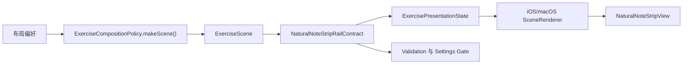

# 方案B分阶段计划

## 范围前提

- 保留当前 12 个 `PitchClass` 槽位，不把右侧 rail 收缩成 7 个自然音按钮。
- `20` 作为按钮默认边长，先作为内部布局 token，不新增 Settings 配置项。
- 本次只收口 `sideBySide + fretboardToNaturalNoteStrip + verticalRail` 的布局契约，不改训练语义、不改默认导航结构。
- 风险控制原则：只给 `naturalNoteStrip` 增加专用 contract 与专用嵌入路径，避免把所有 `.verticalRail` 一次性全改掉。

## 数据流目标

## 阶段 0：冻结语义边界

- 目标：先把“这次到底改什么、不改什么”写死，避免实现过程中再次漂移成视图层 patch。
- 关键不变量：
- `naturalNoteStrip` 仍然由 12 个 `PitchClass` 槽位组成，仍允许非自然音按钮标题为空。
- side 模式下右侧 rail 的宽度继续由内容决定，但高度改为“内容高度 + 容器内垂直居中”，不再靠父容器强行拉伸。
- `fretboard` 继续保持现有 `fillAvailableHeight` 语义；rail contract 不能反向破坏已经修好的 `fretboardLayoutContract`。
- 重点文件：
- [ExerciseScene.swift](/Users/shaun/Library/Mobile Documents/com~~apple~~CloudDocs/Develop/NoteMaster_Ver_1/NoteMaster_Ver_1/Shared/Exercise/ExerciseScene.swift)
- [ExercisePresentationState.swift](/Users/shaun/Library/Mobile Documents/com~~apple~~CloudDocs/Develop/NoteMaster_Ver_1/NoteMaster_Ver_1/Shared/Exercise/ExercisePresentationState.swift)
- [ExerciseCompositionPolicy.swift](/Users/shaun/Library/Mobile Documents/com~~apple~~CloudDocs/Develop/NoteMaster_Ver_1/NoteMaster_Ver_1/Shared/Exercise/ExerciseCompositionPolicy.swift)
- 本阶段产出：一组明确命名的 shared 不变量，作为后续 validation 的断言源。

## 阶段 1：在 Shared/Exercise 层引入 rail contract

- 目标：把 rail 的尺寸/对齐语义从平台视图里拿出来，变成和 `ExerciseFretboardLayoutContract` 同级的共享契约。
- 建议新增一个 rail contract，挂在 [ExercisePresentationState.swift](/Users/shaun/Library/Mobile Documents/com~~apple~~CloudDocs/Develop/NoteMaster_Ver_1/NoteMaster_Ver_1/Shared/Exercise/ExercisePresentationState.swift)；由 `ExerciseScene` 推导，再由 `ExercisePresentationState` 暴露。
- contract 字段建议最小化但足够表达这次需求：
- `slotModel = chromatic12Preserved`
- `buttonShape = square`
- `buttonExtent = 20`
- `mainAxisPolicy = contentSized`
- `crossAxisPolicy = fitContent`
- `verticalAlignment = centered`
- `appliesToSurface = naturalNoteStrip` 或等价的 surface 判定方式
- 不建议把细粒度尺寸继续塞进 `ExerciseSurfacePresentationStyle.verticalRail`，因为它现在只是粗粒度的 presentation style，不适合承载平台几何细节。
- 推导入口建议复用现有 scene 语义：只在 `sideBySide + fretboardToNaturalNoteStrip + answer.presentationStyle == .verticalRail` 时返回 rail contract，其他场景返回 `nil` 或默认值。
- 重点文件：
- [ExercisePresentationState.swift](/Users/shaun/Library/Mobile Documents/com~~apple~~CloudDocs/Develop/NoteMaster_Ver_1/NoteMaster_Ver_1/Shared/Exercise/ExercisePresentationState.swift)
- [ExerciseScene.swift](/Users/shaun/Library/Mobile Documents/com~~apple~~CloudDocs/Develop/NoteMaster_Ver_1/NoteMaster_Ver_1/Shared/Exercise/ExerciseScene.swift)
- [ExerciseCompositionPolicy.swift](/Users/shaun/Library/Mobile Documents/com~~apple~~CloudDocs/Develop/NoteMaster_Ver_1/NoteMaster_Ver_1/Shared/Exercise/ExerciseCompositionPolicy.swift)
- 阶段验收：shared 层已经能在不依赖 AppKit/UIKit 的前提下回答“当前 rail 是否启用、按钮多大、主轴高度如何决定、是否垂直居中”。

## 阶段 2：让 NaturalNoteStripView 变成纯内容尺寸视图

- 目标：把按钮几何与 intrinsic size 的决定权收回到 strip view 本身，但来源改为 shared contract，而不是平台魔法数。
- macOS 重点改造点：
- [macOSNaturalNoteStripView.swift](/Users/shaun/Library/Mobile Documents/com~~apple~~CloudDocs/Develop/NoteMaster_Ver_1/NoteMaster_Ver_1/Platform/macOS/Controls/macOSNaturalNoteStripView.swift) 的 `intrinsicContentSize`
- [macOSNaturalNoteStripView.swift](/Users/shaun/Library/Mobile Documents/com~~apple~~CloudDocs/Develop/NoteMaster_Ver_1/NoteMaster_Ver_1/Platform/macOS/Controls/macOSNaturalNoteStripView.swift) 的 `applyLayoutMode()`
- iOS 重点改造点：
- [iOSNaturalNoteStripView.swift](/Users/shaun/Library/Mobile Documents/com~~apple~~CloudDocs/Develop/NoteMaster_Ver_1/NoteMaster_Ver_1/Platform/iOS/Controls/iOSNaturalNoteStripView.swift) 的 `intrinsicContentSize`
- [iOSNaturalNoteStripView.swift](/Users/shaun/Library/Mobile Documents/com~~apple~~CloudDocs/Develop/NoteMaster_Ver_1/NoteMaster_Ver_1/Platform/iOS/Controls/iOSNaturalNoteStripView.swift) 的 `applyLayoutMode()`
- 具体策略：
- 不再让 `verticalRail` 的高度是 `noIntrinsicMetric`；改为按 `12 * buttonExtent + spacing + insets` 直接计算有限高度。
- 去掉 `fillEqually` 对多余高度的吞噬；改为“按钮固定正方形 + stack 按内容排布”。
- 垂直方向的 hugging / compression resistance 提升到足够高，明确声明“view 更愿意保持内容高度，而不是被父容器拉满”。
- iOS 侧要顺手去掉 `intrinsicContentSize` 里对 `layoutIfNeeded()` 的依赖，避免再次引入 reentrant layout；macOS 侧继续保持纯计算，不允许在 intrinsic size 里触发 `layoutSubtreeIfNeeded()`。
- 阶段验收：单独看 strip view，本身已经能稳定给出“宽度跟内容走、高度跟 12 个按钮总高度走”的结果，且按钮维持正方形。

## 阶段 3：在 renderer 里把 rail 改成“列占满，内容居中”

- 目标：让右侧列继续参与 side split 的整列布局，但 strip 内容本身不再被四边拉伸，而是在列内垂直居中。
- 当前拉长根因要被拆开处理：
- [macOSExerciseSceneRenderer.swift](/Users/shaun/Library/Mobile Documents/com~~apple~~CloudDocs/Develop/NoteMaster_Ver_1/NoteMaster_Ver_1/Platform/macOS/Exercise/macOSExerciseSceneRenderer.swift) 里的 `SurfaceSlotView.install(_:)` 现在会把子视图四边钉死在 slot 上。
- [iOSExerciseSceneRenderer.swift](/Users/shaun/Library/Mobile Documents/com~~apple~~CloudDocs/Develop/NoteMaster_Ver_1/NoteMaster_Ver_1/Platform/iOS/Exercise/iOSExerciseSceneRenderer.swift) 里的 `embed(_:in:contentInsets:)` 也是同样思路。
- 计划中的做法：
- slot 仍然铺满右侧整列，保证 side split 的大框架不变。
- 只对 `naturalNoteStrip + verticalRail` 走专用嵌入路径：保留水平方向的 fit-content 约束，但把垂直方向改为 `centerY` + 内容高度约束，避免 `top/bottom == slot` 的强拉伸。
- 不去改所有 surface 的通用嵌入逻辑，而是给 natural strip 单独开一条安装/嵌入分支，降低回归面。
- 重点文件：
- [macOSExerciseSceneRenderer.swift](/Users/shaun/Library/Mobile Documents/com~~apple~~CloudDocs/Develop/NoteMaster_Ver_1/NoteMaster_Ver_1/Platform/macOS/Exercise/macOSExerciseSceneRenderer.swift)
- [iOSExerciseSceneRenderer.swift](/Users/shaun/Library/Mobile Documents/com~~apple~~CloudDocs/Develop/NoteMaster_Ver_1/NoteMaster_Ver_1/Platform/iOS/Exercise/iOSExerciseSceneRenderer.swift)
- 阶段验收：side 模式下右侧 rail 所在列仍与左侧 fretboard 同高，但 strip 自身是内容高度并在列内垂直居中；stacked / horizontalStrip 行为不受影响。

## 阶段 4：同步 shared validation 与必要的 Settings 只读语义

- 目标：把方案 B 的新 contract 冻结成可回归的不变量，同时确保现有 settings/navigation 语义不被误伤。
- shared validation 主战场：
- [ExerciseCompositionValidation.swift](/Users/shaun/Library/Mobile Documents/com~~apple~~CloudDocs/Develop/NoteMaster_Ver_1/NoteMaster_Ver_1/Shared/Exercise/ExerciseCompositionValidation.swift)
- 这里建议新增或更新断言，明确 side + strip 场景除了现有 `verticalRail` / `fitContent` / `fillAvailableHeight` 之外，还应该输出新的 rail contract 字段。
- Settings/navigation 只做必要同步，不新增用户配置项：
- [SettingsPanelStateContext.swift](/Users/shaun/Library/Mobile Documents/com~~apple~~CloudDocs/Develop/NoteMaster_Ver_1/NoteMaster_Ver_1/Shared/Controls/SettingsPanelStateContext.swift)
- [SettingsNavigationValidation.swift](/Users/shaun/Library/Mobile Documents/com~~apple~~CloudDocs/Develop/NoteMaster_Ver_1/NoteMaster_Ver_1/Shared/Controls/SettingsNavigationValidation.swift)
- 预期是：`Vertical Viewport Height` 的显隐规则继续只由现有 `fretboardLayoutContract` 决定；rail contract 先保持内部布局契约，不外露到设置页。
- 若 settings/navigation 完全不需要感知 rail contract，则本阶段只需确认现有断言仍然成立，不为了“看起来统一”而强行引入 UI 开关。
- 阶段验收：shared 语义增加了 rail contract，但默认 layout、settings page tree、viewport route gate 都不发生意外回退。

## 阶段 5：执行双端回归与风险清理

- 目标：验证方案 B 不仅解决“太长”，还不能重新引入之前 side/stacked 反复出现过的布局崩溃问题。
- 自动化回归建议至少覆盖：
- [ExerciseCompositionValidation.swift](/Users/shaun/Library/Mobile Documents/com~~apple~~CloudDocs/Develop/NoteMaster_Ver_1/NoteMaster_Ver_1/Shared/Exercise/ExerciseCompositionValidation.swift) 中与 `verticalRail`、`requiresViewportPinnedHeight`、`fretboardLayoutContract` 相关的夹具。
- [SettingsNavigationValidation.swift](/Users/shaun/Library/Mobile Documents/com~~apple~~CloudDocs/Develop/NoteMaster_Ver_1/NoteMaster_Ver_1/Shared/Controls/SettingsNavigationValidation.swift) 中与 `fretboardViewport` 路由显隐、默认 side 导航树相关的夹具。
- 手工回归建议：
- macOS 与 iOS 都验证 side 默认启动、stacked/side 往返切换、窗口尺寸变化或设备旋转。
- side 模式确认左侧 fretboard 继续撑满可视区，右侧 strip 高度等于内容高度、按钮保持 `20x20` 正方形、整体垂直居中。
- 重点观察 natural strip 与 renderer 更新链路是否重新触发 layout 重入或 `EXC_BAD_ACCESS`。
- 阶段验收：视觉目标达成，且没有把问题从“拉长”转移成“切换崩溃”或“settings/navigation 断言失败”。

## 建议的落地顺序

- 第 1 批：只做 shared contract 与 validation 骨架，不碰平台约束，先把语义收口。
- 第 2 批：双端 `NaturalNoteStripView` 改成内容尺寸驱动，清理 intrinsic size 的重入风险。
- 第 3 批：双端 renderer 接入专用居中嵌入路径，完成 side 下最终视觉效果。
- 第 4 批：集中跑 validation 与双端回归，确认 side/stacked 与默认启动路径都稳定。

## 关键风险与应对

- 风险：把 `.verticalRail` 的通用语义改得过宽，误伤未来别的 rail surface。
- 应对：contract 先绑定 `naturalNoteStrip`，而不是把所有 `.verticalRail` 一刀切。
- 风险：在 `intrinsicContentSize` 或 layout 回调里再次触发布局，重演之前的 macOS/iOS 崩溃链。
- 应对：strip view 的尺寸计算必须保持纯函数化，不允许在 intrinsic size 里调用任何 layout flush。
- 风险：renderer 为了居中而篡改 split 主结构，导致 side 布局主轴 sizing 退化。
- 应对：保持“slot 铺满整列、内容在 slot 内居中”的两层模型，不改 split 主框架。

