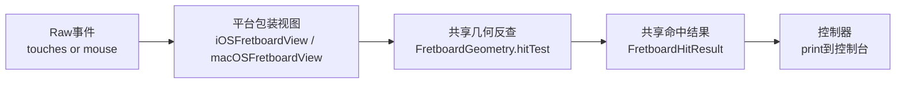

# 指板 Raw 事件命中分阶段计划

## 目标

- iOS 直接使用 `touchesBegan / touchesMoved / touchesEnded / touchesCancelled`。
- macOS 直接使用 `mouseDown / mouseDragged / mouseUp`。
- 命中算法只保留一份，放在共享几何层，不在 iOS/macOS 各写一套。
- 第一版先把命中结果输出到控制台，不引入手势识别器、不引入复杂业务状态。

## 当前架构切入点

- 平台事件入口最适合放在 [iOSFretboardView.swift](/Users/shaun/Library/Mobile Documents/com~~apple~~CloudDocs/Develop/NoteMaster_Ver_1/NoteMaster_Ver_1/Platform/iOS/iOSFretboardView.swift) 和 [macOSFretboardView.swift](/Users/shaun/Library/Mobile Documents/com~~apple~~CloudDocs/Develop/NoteMaster_Ver_1/NoteMaster_Ver_1/Platform/macOS/macOSFretboardView.swift)。它们已经是平台差异入口，并且已经持有 `configuration` 与 `bounds`。
- 共享命中真相应落在 [FretboardGeometry.swift](/Users/shaun/Library/Mobile Documents/com~~apple~~CloudDocs/Develop/NoteMaster_Ver_1/NoteMaster_Ver_1/Shared/Fretboard/FretboardGeometry.swift)。这里已经有 `drawingRect`、`displaySlots`、`stringYPositions`、`displaySlotRect(at:)`，正好补齐“点反查到弦/品”的能力。
- 控制器 [iOSViewController.swift](/Users/shaun/Library/Mobile Documents/com~~apple~~CloudDocs/Develop/NoteMaster_Ver_1/NoteMaster_Ver_1/Platform/iOS/iOSViewController.swift) 与 [macOSViewController.swift](/Users/shaun/Library/Mobile Documents/com~~apple~~CloudDocs/Develop/NoteMaster_Ver_1/NoteMaster_Ver_1/Platform/macOS/macOSViewController.swift) 继续只做装配与调试输出，不参与坐标计算。

## 数据流

## 阶段 1：补齐共享交互语义模型

- 在 `Shared/Fretboard` 下新增一个轻量共享文件，建议命名为 [FretboardInteraction.swift](/Users/shaun/Library/Mobile Documents/com~~apple~~CloudDocs/Develop/NoteMaster_Ver_1/NoteMaster_Ver_1/Shared/Fretboard/FretboardInteraction.swift)。
- 定义平台无关的事件阶段，例如 `began`、`moved`、`ended`、`cancelled`。
- 定义平台无关的命中结果，例如：
  - `phase`
  - `locationInView`
  - `stringIndex`
  - `fret`
  - `isInsideDrawingRect`
  - `distanceToNearestString`
- 第一版不做“音名圆点命中”与“品格命中”的双通道区分，只先输出“这次 raw 事件命中了哪根弦、哪一品”。

## 阶段 2：在共享几何层实现反向命中算法

- 在 [FretboardGeometry.swift](/Users/shaun/Library/Mobile Documents/com~~apple~~CloudDocs/Develop/NoteMaster_Ver_1/NoteMaster_Ver_1/Shared/Fretboard/FretboardGeometry.swift) 新增命中相关方法，建议拆成 3 层：
  - `displayPosition(forX:)`：根据 `drawingRect` 与 `displaySlotWidth` 反查 `0...maxFret`。
  - `nearestStringIndex(forY:)`：根据 `stringYPositions` 找最近弦。
  - `hitTest(_ point: CGPoint, phase: FretboardEventPhase)`：组装成完整 `FretboardHitResult`。
- 命中规则保持和绘制完全一致：
  - `x` 方向必须基于现有 `displaySlotRect(at:)` / `displaySlotWidth`。
  - `y` 方向必须基于现有 `stringYPositions` / `stringBandRect`。
  - 点落在 `drawingRect` 外时，不强行夹回内部，直接返回未命中或 `isInsideDrawingRect = false` 的结果。
- 这一阶段的重点是把“绘制坐标”和“交互坐标”统一到同一套几何真相，避免后续维护两套规则。

## 阶段 3：iOS 接入 raw touch

- 在 [iOSFretboardView.swift](/Users/shaun/Library/Mobile Documents/com~~apple~~CloudDocs/Develop/NoteMaster_Ver_1/NoteMaster_Ver_1/Platform/iOS/iOSFretboardView.swift) 里直接 override：
  - `touchesBegan`
  - `touchesMoved`
  - `touchesEnded`
  - `touchesCancelled`
- 第一版只处理单指主触点：
  - 从 `touches.first` 取点位。
  - 使用 `touch.location(in: self)` 获取本地坐标。
  - 用当前 `configuration + bounds` 构造 `FretboardGeometry` 并调用共享 `hitTest`。
- 在 view 层增加一个可选回调，例如 `onRawEvent`，只向外抛共享命中结果，不在 view 内写业务逻辑。
- 这一阶段不引入 `UIGestureRecognizer`，完全走 responder 链原始触摸事件。

## 阶段 4：macOS 接入 raw mouse

- 在 [macOSFretboardView.swift](/Users/shaun/Library/Mobile Documents/com~~apple~~CloudDocs/Develop/NoteMaster_Ver_1/NoteMaster_Ver_1/Platform/macOS/macOSFretboardView.swift) 里直接 override：
  - `mouseDown`
  - `mouseDragged`
  - `mouseUp`
- 使用 `convert(event.locationInWindow, from: nil)` 获取 view 本地坐标。
- 和 iOS 一样，用当前 `configuration + bounds` 构造 `FretboardGeometry`，调用共享 `hitTest`，再通过同名回调抛出结果。
- 这一阶段先明确目标是“屏幕上的点击/拖动位置”，不接入 `NSTouch` 触控板设备级触点，避免把设备坐标空间和 view 坐标空间混在一起。

## 阶段 5：控制器装配并打印命中结果

- 在 [iOSViewController.swift](/Users/shaun/Library/Mobile Documents/com~~apple~~CloudDocs/Develop/NoteMaster_Ver_1/NoteMaster_Ver_1/Platform/iOS/iOSViewController.swift) 与 [macOSViewController.swift](/Users/shaun/Library/Mobile Documents/com~~apple~~CloudDocs/Develop/NoteMaster_Ver_1/NoteMaster_Ver_1/Platform/macOS/macOSViewController.swift) 里给 `fretboardView` 赋值回调。
- 第一版只做控制台输出，建议格式固定，方便双平台对比，例如：
  - `phase=began string=2 fret=5 point=(x,y) inside=true`
- 控制器不解析坐标，只消费结果并输出日志，继续保持“装配层”职责。

## 阶段 6：验证与收口

- 静态验证：对新增/修改的共享交互与平台事件文件做 `swiftc -typecheck`。
- 行为验证至少覆盖这些场景：
  - 点击空弦区，是否稳定返回 `fret = 0`。
  - 点击普通品格区，是否稳定返回正确 `fret`。
  - 点击最上弦、最下弦，是否稳定命中正确 `stringIndex`。
  - 在指板外点击，是否明确输出未命中或 `inside=false`。
  - 拖动跨品、跨弦时，`moved` 日志是否连续且不跳坐标体系。
- 如果验证时发现“点在两根弦中间”语义不够稳定，再决定是否在后续迭代增加弦命中容差参数；第一版先不提前引入复杂阈值配置。

## 预期产物

- 一套共享的 raw 事件命中模型。
- 一套共享的几何反查 API。
- iOS 与 macOS 各自的原始事件入口，但不复制命中算法。
- 控制器可见的控制台日志输出链路，便于后续继续接状态管理、高亮或选中逻辑。

