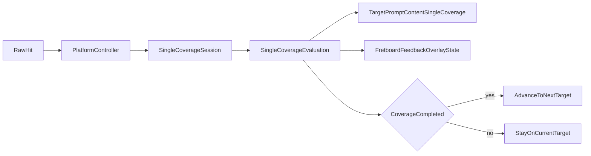

# Single Mode 覆盖反馈分阶段计划

## 目标

- 把 `single mode` 的完成条件改成：当前 `FretboardConfiguration` 范围内，所有目标 `PitchClass` 对应的 `FretboardCell` 都至少被正确点击一次，才切换到下一题。
- 正确点击立即标绿，并在当前题持续保留；错误点击立即标红，默认只保留最近一次错误反馈，到下一次点击或换题时清除。
- prompt 同步显示覆盖进度，例如 `C 3/7`，避免用户不知道为何还未过关。

## 当前架构锚点

- single 判题目前在 [FretboardNaturalNoteTrainer.swift](NoteMaster_Ver_1/Shared/Fretboard/FretboardNaturalNoteTrainer.swift) 中首次命中同名音就直接 `advanceToNextTarget(...)`。
- 控制器在 [macOSViewController.swift](NoteMaster_Ver_1/Platform/macOS/macOSViewController.swift) 与 [iOSViewController.swift](NoteMaster_Ver_1/Platform/iOS/iOSViewController.swift) 中仅根据 `evaluation.didAdvanceTarget` 决定是否刷新下一题。
- prompt 目前只有 [TargetPromptContent.swift](NoteMaster_Ver_1/Shared/Fretboard/TargetPromptContent.swift) 的 `.single(text)` / `.sequence(tokens,currentIndex)` 两种表达。
- 指板根 layer 目前只有 [FretboardLayer.swift](NoteMaster_Ver_1/Shared/Fretboard/FretboardLayer.swift) 的 `boardLayer + labelsLayer`，没有 per-cell 训练反馈层。
- validation 当前在 [FretboardValidation.swift](NoteMaster_Ver_1/Shared/Fretboard/FretboardValidation.swift) 中明确假设“第一次正确点击就推进目标音”。

```392:416:NoteMaster_Ver_1/Shared/Fretboard/FretboardNaturalNoteTrainer.swift
let answeredTargetPitchClass = targetPitchClass
let isCorrect = selectedPitch.pitchClass == answeredTargetPitchClass
let nextTargetPitchClass: PitchClass
if isCorrect {
    nextTargetPitchClass = advanceToNextTarget(using: &generator)
} else {
    nextTargetPitchClass = answeredTargetPitchClass
}
```

```80:121:NoteMaster_Ver_1/Shared/Fretboard/FretboardLayer.swift
private let boardLayer = FretboardBoardLayer()
private let labelsLayer = FretboardLabelsLayer()

private func configureLayer() {
    isOpaque = false
    drawsAsynchronously = false
    addSublayer(boardLayer)
    addSublayer(labelsLayer)
}
```

## 采用方案

- 采用 `shared SingleCoverageSession + controller projection + 独立 fretboard feedback overlay`。
- 不继续复用当前 single 的“一次答对即过关” `Evaluation` 语义；改为新增 single coverage 专用 session / evaluation / result，避免把 `didAdvanceTarget` 这类旧语义硬改得模糊。
- 不把训练反馈塞进 `NoteNameContentProvider` / `FretboardLabelContent`；红绿反馈通过独立 overlay layer 叠加到现有指板层级中。




## 阶段 1：补齐 shared 枚举基础

涉及文件：

- [FretboardConfiguration.swift](NoteMaster_Ver_1/Shared/Fretboard/FretboardConfiguration.swift)
- [FretboardValidation.swift](NoteMaster_Ver_1/Shared/Fretboard/FretboardValidation.swift)

工作内容：

- 在 `FretboardConfiguration` 上新增纯函数，用当前 `stringCount` 与 `fretRange` 枚举某个 `PitchClass` 在整块指板上的全部 `FretboardCell`。
- 保持该函数与现有 `notePitch(for:)` / `pitchClass(for:)` 的语义一致，避免控制器自己写双重循环。
- 在 validation 中增加基础断言，确保枚举出的 cell 集合与逐弦逐品解析结果一致，并覆盖空弦 `fret == 0`。

阶段产出：

- shared 有稳定的“当前题全部目标位置”真相源，后续 session 与 overlay 都复用这一能力。

## 阶段 2：把 single 升级为 coverage 状态机

涉及文件：

- [FretboardNaturalNoteTrainer.swift](NoteMaster_Ver_1/Shared/Fretboard/FretboardNaturalNoteTrainer.swift)
- [FretboardValidation.swift](NoteMaster_Ver_1/Shared/Fretboard/FretboardValidation.swift)

工作内容：

- 在 `FretboardNaturalNoteTrainerState` 中新增 single coverage 专用类型，例如：
  - `SingleCoverageSession`
  - `SingleCoverageEvaluation`
  - `SingleCoverageAnswerResult`
  - `SingleCoverageHitKind`（建议至少包含 `.correctNew`, `.correctRepeat`, `.wrong`）
- 新增 dedicated API，用 `inout session` 处理 single 点击，而不是继续复用旧 `handle(hitResult:configuration:)` 的“一次命中即换题”语义。
- 保留现有 ignore 规则：`nonEndedPhase`、`missingHitCell`、`unresolvedHitPitch`。
- 单次点击的 shared 语义建议固定为：
  - 命中新目标格：加入 `visitedCells`，返回 `.correctNew`
  - 命中已完成目标格：不重复计数，返回 `.correctRepeat`
  - 命中错误格：不推进，返回 `.wrong`
  - 当 `visitedCells` 覆盖 `requiredCells` 时，才 `advanceToNextTarget()` 并结束当前 coverage 回合
- 配置变化、模式切换、换题时统一重建 session，避免旧 session 对应旧指板范围。

阶段产出：

- single 的“题目完成”和“单次点击正确”被解耦，shared 层拥有可测试的 coverage 真相源。

## 阶段 3：扩展 prompt 内容模型与双端视图

涉及文件：

- [TargetPromptContent.swift](NoteMaster_Ver_1/Shared/Fretboard/TargetPromptContent.swift)
- [iOSTargetNotePromptView.swift](NoteMaster_Ver_1/Platform/iOS/Controls/iOSTargetNotePromptView.swift)
- [macOSTargetNotePromptView.swift](NoteMaster_Ver_1/Platform/macOS/Controls/macOSTargetNotePromptView.swift)

工作内容：

- 给 `TargetPromptContent` 增加 single coverage 的结构化表达，例如 `singleCoverage(text:visitedCount:totalCount:)`，不要把计数硬拼到 `.single(text)` 里。
- 双端 prompt 视图增加对应渲染分支，展示目标音 + 覆盖进度。
- accessibility / tooltip 同步更新，明确当前题进度，例如“Current target note C, 3 of 7 completed”。

阶段产出：

- 用户在不看指板反馈层时，也能知道当前题是否还未完成以及还剩多少位置。

## 阶段 4：新增独立指板反馈 overlay

涉及文件：

- [FretboardLayer.swift](NoteMaster_Ver_1/Shared/Fretboard/FretboardLayer.swift)
- [FretboardScene.swift](NoteMaster_Ver_1/Shared/Fretboard/FretboardScene.swift)
- [FretboardPalette.swift](NoteMaster_Ver_1/Shared/Fretboard/FretboardPalette.swift)
- 新文件：`NoteMaster_Ver_1/Shared/Fretboard/FretboardFeedbackLayer.swift`
- 新文件：`NoteMaster_Ver_1/Shared/Fretboard/FretboardFeedbackOverlayState.swift`（或等价命名）

工作内容：

- 新增独立 overlay state，至少表达：
  - `correctCells: Set<FretboardCell>`
  - `wrongCell: FretboardCell?`
- 在 `FretboardLayer` 中插入 `feedbackLayer`，层级建议为：`boardLayer -> feedbackLayer -> labelsLayer`，保证底板可见且文字仍位于最上层。
- `feedbackLayer` 基于 `FretboardScene.cellFrame(...)` 或 `labelAnchor(...)` 在对应格子上绘制半透明高亮，不改现有 `FretboardLabelsLayer` 的统一 badge 配色逻辑。
- 在 `FretboardPalette` 中补充语义色：正确绿色、错误红色；优先使用带透明度的填充而不是完全遮挡文本。
- overlay 需要继承并复用现有 `contextNormalizationMode`，保证 macOS vertical 与 iOS horizontal/vertical 坐标一致。

阶段产出：

- 指板层有独立的训练反馈通道，后续要扩展闪烁、动画或 hint 也不会污染基础音名渲染。

## 阶段 5：控制器接线与投影收口

涉及文件：

- [macOSViewController.swift](NoteMaster_Ver_1/Platform/macOS/macOSViewController.swift)
- [iOSViewController.swift](NoteMaster_Ver_1/Platform/iOS/iOSViewController.swift)
- 如需 view API 暴露 overlay state，则还会涉及：
  - [macOSFretboardView.swift](NoteMaster_Ver_1/Platform/macOS/macOSFretboardView.swift)
  - [iOSFretboardView.swift](NoteMaster_Ver_1/Platform/iOS/iOSFretboardView.swift)

工作内容：

- 双端控制器新增 single coverage 状态缓存，风格对齐当前 sequence：
  - `singleCoverageSession`
  - `singleCoverageLastEvaluation`
  - `currentSingleCoverageTargetPromptContent`
  - `currentFretboardFeedbackOverlayState`
- 将 single hit handler 改成：
  - 把 `FretboardHitResult` 交给新的 shared single coverage API
  - 根据 evaluation 更新 prompt 进度
  - 根据 evaluation 更新 overlay：正确格进绿色集合，错误格进入 `wrongCell`
  - 仅当 coverage 完成时切换到下一题，并清空上题的 overlay/session
- 新增/reset 辅助方法，保证 settings 改配置、切 exercise mode、切 display mode、重新生成题目时，single coverage session 与 overlay 同步重建。
- 让 single 路径的状态收口方式尽量接近 sequence，减少双端分叉。

阶段产出：

- iOS/macOS 都通过同一种 shared coverage 语义驱动 UI，single 不再是特例分支。

## 阶段 6：回归验证与验收

涉及文件：

- [FretboardValidation.swift](NoteMaster_Ver_1/Shared/Fretboard/FretboardValidation.swift)
- 如新增了纯 projection/overlay 状态函数，可视情况为其补充 shared 验证文件

工作内容：

- 重写 `validateNaturalNoteTrainer(...)` 的 single 断言，覆盖至少这些场景：
  - 非 `ended` 事件仍被忽略
  - 错误点击不推进 session，不换题
  - 首次正确点击只增加 coverage，不立即换题
  - 重复点击已完成目标格不重复计数
  - 最后一个未完成目标格被命中后才切下一题
  - 新目标音仍只从自然音集合中选择
- 对 overlay/prompt 的纯状态映射做能做的 shared 断言；UI 具体绘制保留人工验收。
- 人工验收建议至少覆盖：
  - iOS/macOS
  - horizontal/vertical 指板
  - 空弦命中
  - 重复点击已完成格
  - 错误后红色反馈清除与下一题重置

## 实施顺序建议

1. 先做 `FretboardConfiguration` 的目标 cell 枚举与 validation 基础，锁定 coverage 数据来源。
2. 再做 shared `SingleCoverageSession`，把“单次正确”和“整题完成”语义拆开。
3. 然后补 prompt 进度，让状态可见。
4. 再引入 `feedbackLayer` 与 overlay state，接上红/绿指板反馈。
5. 最后做双端控制器迁移与完整回归，确保 single 与 sequence 的状态同步方式风格一致。

## 主要风险与控制点

- 最大兼容性风险是旧 single `Evaluation` 的 `didAdvanceTarget == isCorrect` 假设；通过引入 single coverage 专用 result，避免在旧结构上硬改语义。
- 配置变化会改变 `requiredCells`，因此 session 绝不能跨配置复用；重建策略必须是显式且集中管理的。
- overlay 需要严格复用 `contextNormalizationMode`，否则 vertical macOS 容易出现反馈位置翻转。
- 指板反馈层应保持独立，避免让基础 `NoteNameContentProvider` 承担训练状态，导致后续显示逻辑耦合失控。

