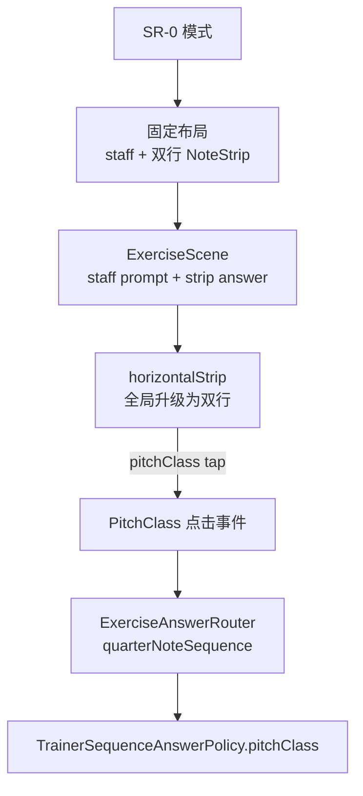

# SR-0 双行 NoteStrip 分阶段计划

## 目标

- 采用方案一：把现有 `horizontalStrip` 全局升级为双行横向 `NoteStrip`，而不是新增第二套横向 strip 语义。
- 新增 `SR-0`：上方 `staff` 出题，下方 `NoteStrip` 答题；固定 `treble clef`，固定 `pitchClass` 判题。
- 保持现有右侧 `verticalRail` 语义不变：左列半音、右列自然音，继续只用于 side-by-side rail 场景。
- 复用现有 quarter-note sequence 内核、`ExerciseAnswerRouter`、`ResolvedSequenceAnswer` 与 `TrainerSequenceAnswerPolicy.pitchClass`，不新增 comparator。

## 当前架构切口

- 共享层目前只有三种 surface 呈现语义：

```24:29:NoteMaster_Ver_1/Shared/Scene/SceneCore.swift
enum AppSurfacePresentationStyle: String, CaseIterable, Equatable, Hashable,
    Sendable {
    case standard
    case horizontalStrip
    case verticalRail
}
```

- 主场景组合里还没有 `staff -> naturalNoteStrip`：

```139:150:NoteMaster_Ver_1/Shared/Exercise/ExerciseCompositionPolicy.swift
private static func resolvedSceneSurfaces(
    for preferences: ExerciseLayoutPreferences
) -> (prompt: ExerciseSurfaceNode, answer: ExerciseSurfaceNode) {
    switch preferences.compositionPreset {
    case .staffToFretboard:
        return (.staffPrompt, .fretboardAnswer)
    case .staffToPiano:
        return (.staffPrompt, .pianoAnswer)
    case .targetPromptToFretboard:
        return (.targetPrompt, .fretboardAnswer)
    case .fretboardToNaturalNoteStrip:
        return (.fretboardPrompt, .naturalNoteStripAnswer)
```

- 双端 `horizontalStrip` 当前都是单行横排，而不是双行：

```141:146:NoteMaster_Ver_1/Platform/iOS/Controls/iOSNaturalNoteStripView.swift
private func applyCurrentConfiguration() {
    switch layoutMode {
    case .horizontalStrip:
        stackView.axis = .horizontal
        stackView.alignment = .fill
        stackView.distribution = .fillEqually
```

- `SR-1` / `SR-2` 已经证明 mode 级 fixed layout + fixed policy + shared validation 这条路径可行，`SR-0` 应沿用同一条架构线，而不是做 controller 特判。

```23:47:NoteMaster_Ver_1/Shared/Controls/TrainerDisplayState.swift
extension TrainerExerciseMode {
    var fixedSequenceAnswerPolicy: TrainerSequenceAnswerPolicy? {
        switch self {
        case .sr1:
            return .pitchClass
        case .sr2:
            return .exactNote
        case .single, .sequence, .positionPrompt:
            return nil
        }
    }

    var fixedExerciseLayoutPreferences: ExerciseLayoutPreferences? {
        switch self {
        case .sr1, .sr2:
            return .srPianoAnswer
```

- `ExerciseAnswerRouter` 已经能复用 sequence 内核；`SR-0` 只需要并入同一 mode 分支：

```93:136:NoteMaster_Ver_1/Shared/Exercise/ExerciseAnswerRouter.swift
switch trainerDisplayState.exerciseMode {
case .single:
    // ...
case .sequence, .sr1, .sr2:
    guard let answer = FretboardNaturalNoteTrainerState
        .resolvedSequenceAnswer(
            from: event,
            configuration: fretboardConfiguration
        ) else {
        // ...
    }

    return .routed(
        .quarterNoteSequence(
            event: event,
            answer: answer
        )
    )
```

## 目标架构




## 分阶段实施

### 阶段 0：冻结方案一的共享语义边界

- 明确把 `horizontalStrip` 的产品语义改写为“横向双行：上半音、下自然音”，并把这个定义写进 shared validation，而不是只改平台 view。
- 先梳理并更新与 `horizontalStrip` 相关的基线断言，特别是 stacked `fretboardToNaturalNoteStrip` 场景；同时保持 `verticalRail` 的 side-by-side 约束不变。
- 重点文件：[NoteMaster_Ver_1/Shared/Exercise/ExerciseCompositionValidationSceneCore.swift](NoteMaster_Ver_1/Shared/Exercise/ExerciseCompositionValidationSceneCore.swift)、[NoteMaster_Ver_1/Shared/Exercise/ExerciseCompositionValidation.swift](NoteMaster_Ver_1/Shared/Exercise/ExerciseCompositionValidation.swift)、[NoteMaster_Ver_1/Shared/Scene/SceneCore.swift](NoteMaster_Ver_1/Shared/Scene/SceneCore.swift)
- 阶段完成标准：validation 与手工清单都明确区分“底部双行 horizontalStrip”和“右侧 verticalRail”，后续实现不再依赖隐含约定。

### 阶段 1：抽取共享的双行 horizontalStrip 布局模型

- 在 shared 层建立 horizontalStrip 的行拓扑与顺序模型：上行使用 `PitchClass.accidentalCasesInOrder`，下行使用 `PitchClass.naturalCasesInOrder`；不要把这层逻辑散落到 iOS/macOS 两端各写一套。
- 优先复用现有 strip 共享类型所在区域，而不是引入 mode 特判；建议沿 [NoteMaster_Ver_1/Shared/Exercise/ExerciseNaturalNoteStripRailPlacement.swift](NoteMaster_Ver_1/Shared/Exercise/ExerciseNaturalNoteStripRailPlacement.swift) 与 [NoteMaster_Ver_1/Shared/Exercise/ExercisePresentationState.swift](NoteMaster_Ver_1/Shared/Exercise/ExercisePresentationState.swift) 扩展一条“horizontal layout context / resolved layout”分支。
- 让 renderer 未来能像传 `naturalNoteStripRailLayout` 一样，把双行布局信息传给双端视图；即使初版只是 row topology，也要在 shared 层产出稳定 contract。
- 重点文件：[NoteMaster_Ver_1/Shared/Exercise/ExerciseNaturalNoteStripRailPlacement.swift](NoteMaster_Ver_1/Shared/Exercise/ExerciseNaturalNoteStripRailPlacement.swift)、[NoteMaster_Ver_1/Shared/Exercise/ExercisePresentationState.swift](NoteMaster_Ver_1/Shared/Exercise/ExercisePresentationState.swift)、[NoteMaster_Ver_1/Shared/Fretboard/NotePitch.swift](NoteMaster_Ver_1/Shared/Fretboard/NotePitch.swift)
- 阶段完成标准：shared 层能表达“横向双行 strip”的顺序、分行、尺寸语义，且 `verticalRail` 仍走现有 staggered 两列 contract。

### 阶段 2：把双端 `NaturalNoteStripView` 的 `horizontalStrip` 升级为双行实现

- 重构 [NoteMaster_Ver_1/Platform/iOS/Controls/iOSNaturalNoteStripView.swift](NoteMaster_Ver_1/Platform/iOS/Controls/iOSNaturalNoteStripView.swift) 与 [NoteMaster_Ver_1/Platform/macOS/Controls/macOSNaturalNoteStripView.swift](NoteMaster_Ver_1/Platform/macOS/Controls/macOSNaturalNoteStripView.swift)，将 `horizontalStrip` 分支从“单行 12 按钮 stack”升级为“双行容器”。
- 保持 `verticalRail` 路径完全独立，避免方案一误伤右侧 rail 的 frame-based layout、intrinsic 尺寸和 title 显示策略。
- 同步更新 intrinsicContentSize、按钮分发、启用态、标题显示、spacing 和平台差异（UIKit 的 `UIStackView` / AppKit 的 `NSStackView`）。
- 重点文件：[NoteMaster_Ver_1/Platform/iOS/Controls/iOSNaturalNoteStripView.swift](NoteMaster_Ver_1/Platform/iOS/Controls/iOSNaturalNoteStripView.swift)、[NoteMaster_Ver_1/Platform/macOS/Controls/macOSNaturalNoteStripView.swift](NoteMaster_Ver_1/Platform/macOS/Controls/macOSNaturalNoteStripView.swift)、[NoteMaster_Ver_1/Platform/iOS/Exercise/iOSExerciseSceneRenderer.swift](NoteMaster_Ver_1/Platform/iOS/Exercise/iOSExerciseSceneRenderer.swift)、[NoteMaster_Ver_1/Platform/macOS/Exercise/macOSExerciseSceneRenderer.swift](NoteMaster_Ver_1/Platform/macOS/Exercise/macOSExerciseSceneRenderer.swift)
- 阶段完成标准：任何现有 `horizontalStrip` 场景在两端都渲染为双行，且 `verticalRail` 场景视觉与交互保持不变。

### 阶段 3：新增 `staff -> naturalNoteStrip` 组合，并引入 `SR-0` mode

- 在 [NoteMaster_Ver_1/Shared/Exercise/ExerciseLayoutPreferences.swift](NoteMaster_Ver_1/Shared/Exercise/ExerciseLayoutPreferences.swift) 新增 `ExerciseCompositionPreset.staffToNaturalNoteStrip`，以及与 `SR-0` 对应的固定 layout 常量，例如 `srNoteStripAnswer`。
- 在 [NoteMaster_Ver_1/Shared/Controls/TrainerDisplayState.swift](NoteMaster_Ver_1/Shared/Controls/TrainerDisplayState.swift) 新增 `TrainerExerciseMode.sr0`，固定 `fixedSequenceAnswerPolicy = .pitchClass`、`fixedSequenceClef = .treble`、`fixedExerciseLayoutPreferences = .srNoteStripAnswer`；`usesQuarterNoteSequenceKernel` 也应纳入 `sr0`。
- 在 [NoteMaster_Ver_1/Shared/Exercise/ExerciseCompositionPolicy.swift](NoteMaster_Ver_1/Shared/Exercise/ExerciseCompositionPolicy.swift) 扩展 `resolvedSceneSurfaces` 与 scene builder，使 `SR-0` 落成 `staffPrompt + naturalNoteStripAnswer` 的 stacked 主场景。
- 在 [NoteMaster_Ver_1/Shared/Exercise/ExerciseCompositionPolicy+Normalization.swift](NoteMaster_Ver_1/Shared/Exercise/ExerciseCompositionPolicy+Normalization.swift) 扩展 mode/preset 支持矩阵，使 `sr0` 像 `sr1/sr2` 一样收敛到固定 preset，而不是暴露为一般的自由组合。
- 重点文件：[NoteMaster_Ver_1/Shared/Controls/TrainerDisplayState.swift](NoteMaster_Ver_1/Shared/Controls/TrainerDisplayState.swift)、[NoteMaster_Ver_1/Shared/Exercise/ExerciseLayoutPreferences.swift](NoteMaster_Ver_1/Shared/Exercise/ExerciseLayoutPreferences.swift)、[NoteMaster_Ver_1/Shared/Exercise/ExerciseCompositionPolicy.swift](NoteMaster_Ver_1/Shared/Exercise/ExerciseCompositionPolicy.swift)、[NoteMaster_Ver_1/Shared/Exercise/ExerciseCompositionPolicy+Normalization.swift](NoteMaster_Ver_1/Shared/Exercise/ExerciseCompositionPolicy+Normalization.swift)
- 阶段完成标准：shared presentation 能稳定生成 `SR-0 = staff + 双行 NoteStrip`，并与现有 `SR-1 = staff + piano` 并存。

### 阶段 4：把 `SR-0` 接入现有 sequence 答题与反馈链路

- 在 [NoteMaster_Ver_1/Shared/Exercise/ExerciseAnswerRouter.swift](NoteMaster_Ver_1/Shared/Exercise/ExerciseAnswerRouter.swift) 将 `sr0` 纳入 `sequence / sr1 / sr2` 同组路由，继续走 `quarterNoteSequence`。
- 利用现有 `ExerciseAnswerEvent.pitchClass(..., from: .naturalNoteStrip)` 与 `FretboardNaturalNoteTrainerState.resolvedSequenceAnswer(...)`，保持 `SR-0` 不新增 comparator、不新增答题 carrier。
- 在双端 controller 中补齐所有 “sequence only / sr only” 条件分支，使 `SR-0` 与 `SR-1` 一样能生成 staff sequence presentation、wrong/correct feedback、题目推进与模式切换后的清理。
- 重点文件：[NoteMaster_Ver_1/Shared/Exercise/ExerciseAnswerRouter.swift](NoteMaster_Ver_1/Shared/Exercise/ExerciseAnswerRouter.swift)、[NoteMaster_Ver_1/Shared/Fretboard/FretboardNaturalNoteTrainer.swift](NoteMaster_Ver_1/Shared/Fretboard/FretboardNaturalNoteTrainer.swift)、[NoteMaster_Ver_1/Platform/iOS/iOSViewController.swift](NoteMaster_Ver_1/Platform/iOS/iOSViewController.swift)、[NoteMaster_Ver_1/Platform/macOS/macOSViewController.swift](NoteMaster_Ver_1/Platform/macOS/macOSViewController.swift)
- 阶段完成标准：`SR-0` 下点击双行 `NoteStrip` 能像 `SR-1` 钢琴答题一样驱动 shared sequence 反馈与进度推进。

### 阶段 5：把 `SR-0` 接入 settings、navigation 与 legacy bridge

- 在 [NoteMaster_Ver_1/Shared/Controls/SettingsPanelModel.swift](NoteMaster_Ver_1/Shared/Controls/SettingsPanelModel.swift) 新增 `setExerciseModeSr0`，并将默认 Exercise Mode 顺序调整为：`Single / Sequence / SR-0 / SR-1 / Position`。
- 在 [NoteMaster_Ver_1/Shared/Controls/SettingsPanelSnapshotBuilder.swift](NoteMaster_Ver_1/Shared/Controls/SettingsPanelSnapshotBuilder.swift) 与 [NoteMaster_Ver_1/Shared/Controls/SettingsNavigationSnapshotBuilder.swift](NoteMaster_Ver_1/Shared/Controls/SettingsNavigationSnapshotBuilder.swift) 为 `SR-0` 复用 fixed-presentation 隐藏规则，使 composition/layout/accessory/clef 等无效入口像 `SR-1` 一样消失。
- 在 [NoteMaster_Ver_1/Shared/Exercise/LegacyPageLayoutAdapter.swift](NoteMaster_Ver_1/Shared/Exercise/LegacyPageLayoutAdapter.swift) 与 [NoteMaster_Ver_1/Shared/Exercise/ExerciseCompositionPolicy.swift](NoteMaster_Ver_1/Shared/Exercise/ExerciseCompositionPolicy.swift) 扩展 legacy fallback，使 `SR-0` 在显式 legacy-compatible 路径下回落到可投影的 legacy 组合，而不是把 `staff + strip` 硬塞进 legacy page model。
- 重点文件：[NoteMaster_Ver_1/Shared/Controls/SettingsPanelModel.swift](NoteMaster_Ver_1/Shared/Controls/SettingsPanelModel.swift)、[NoteMaster_Ver_1/Shared/Controls/SettingsPanelSnapshotBuilder.swift](NoteMaster_Ver_1/Shared/Controls/SettingsPanelSnapshotBuilder.swift)、[NoteMaster_Ver_1/Shared/Controls/SettingsNavigationSnapshotBuilder.swift](NoteMaster_Ver_1/Shared/Controls/SettingsNavigationSnapshotBuilder.swift)、[NoteMaster_Ver_1/Shared/Exercise/LegacyPageLayoutAdapter.swift](NoteMaster_Ver_1/Shared/Exercise/LegacyPageLayoutAdapter.swift)、[NoteMaster_Ver_1/Shared/Exercise/ExerciseCompositionPolicy.swift](NoteMaster_Ver_1/Shared/Exercise/ExerciseCompositionPolicy.swift)
- 阶段完成标准：`SR-0` 在 settings 中可选、可见性正确、无无效深层页，legacy bridge 行为与 `SR-1` 一样可解释且可验证。

### 阶段 6：补 automated validation、runtime smoke 与回归清单

- 在 composition validation 中新增 `SR-0` 的 fixed layout / scene / non-legacy 断言，并同步改写原有 `horizontalStrip` 相关预期，使 stacked `fretboardToNaturalNoteStrip` 现在明确等于“双行 horizontalStrip”。
- 在 settings navigation validation 中新增 `SR-0` 的 root tree、fixed presentation 行隐藏、失效 route fallback 夹具；必要时将现有 `sr1_*` fixture 参数化为 SR 固定模式通用夹具。
- 在 fretboard validation 中新增 `SR-0` 的 `resolvedSequenceConfiguration` seam，锁住 `treble + pitchClass + usesQuarterNoteSequenceKernel`。
- 在 iOS/macOS 增加 `sr0-note-strip-answer` runtime smoke：切到 `SR-0`、验证 `staff + strip` 主场景、错答/正答反馈、切回 `single` 后的状态清理；同时保留并复跑现有 `sr1-piano-answer` smoke，防止方案一回归到 SR-1。
- 更新手工清单：确认 `positionPrompt + stacked` 现在也改为双行 horizontalStrip，`sideBySide` 仍是右侧 verticalRail，`SR-0` 与 `SR-1` 互切不残留高亮/缓存。
- 重点文件：[NoteMaster_Ver_1/Shared/Exercise/ExerciseCompositionValidation.swift](NoteMaster_Ver_1/Shared/Exercise/ExerciseCompositionValidation.swift)、[NoteMaster_Ver_1/Shared/Exercise/ExerciseCompositionValidationSceneCore.swift](NoteMaster_Ver_1/Shared/Exercise/ExerciseCompositionValidationSceneCore.swift)、[NoteMaster_Ver_1/Shared/Exercise/ExerciseCompositionValidationExercisePolicy.swift](NoteMaster_Ver_1/Shared/Exercise/ExerciseCompositionValidationExercisePolicy.swift)、[NoteMaster_Ver_1/Shared/Controls/SettingsNavigationValidation.swift](NoteMaster_Ver_1/Shared/Controls/SettingsNavigationValidation.swift)、[NoteMaster_Ver_1/Shared/Controls/SettingsNavigationValidationRootTree.swift](NoteMaster_Ver_1/Shared/Controls/SettingsNavigationValidationRootTree.swift)、[NoteMaster_Ver_1/Shared/Controls/SettingsNavigationValidationStateAndNavigation.swift](NoteMaster_Ver_1/Shared/Controls/SettingsNavigationValidationStateAndNavigation.swift)、[NoteMaster_Ver_1/Shared/Fretboard/FretboardValidation.swift](NoteMaster_Ver_1/Shared/Fretboard/FretboardValidation.swift)、[NoteMaster_Ver_1/Platform/iOS/iOSAppDelegate.swift](NoteMaster_Ver_1/Platform/iOS/iOSAppDelegate.swift)、[NoteMaster_Ver_1/Platform/macOS/macOSAppDelegate.swift](NoteMaster_Ver_1/Platform/macOS/macOSAppDelegate.swift)、[NoteMaster_Ver_1/Platform/iOS/iOSViewController.swift](NoteMaster_Ver_1/Platform/iOS/iOSViewController.swift)、[NoteMaster_Ver_1/Platform/macOS/macOSViewController.swift](NoteMaster_Ver_1/Platform/macOS/macOSViewController.swift)
- 阶段完成标准：shared validation、双端 smoke、以及方案一带来的全局 horizontalStrip 回归项全部通过，`SR-0` 与现有 `positionPrompt / SR-1 / SR-2` 行为边界清晰稳定。

## 实施原则

- 不走 controller 特判，不在平台层私自拼 `staff + strip` 场景；所有语义必须先落到 shared mode / preset / presentation contract。
- 不新增新的 comparator；`SR-0` 必须复用 `TrainerSequenceAnswerPolicy.pitchClass`。
- 方案一是全局语义升级，不是局部修补：任何仍使用 `horizontalStrip` 的 stacked 场景都要一起纳入回归矩阵。

