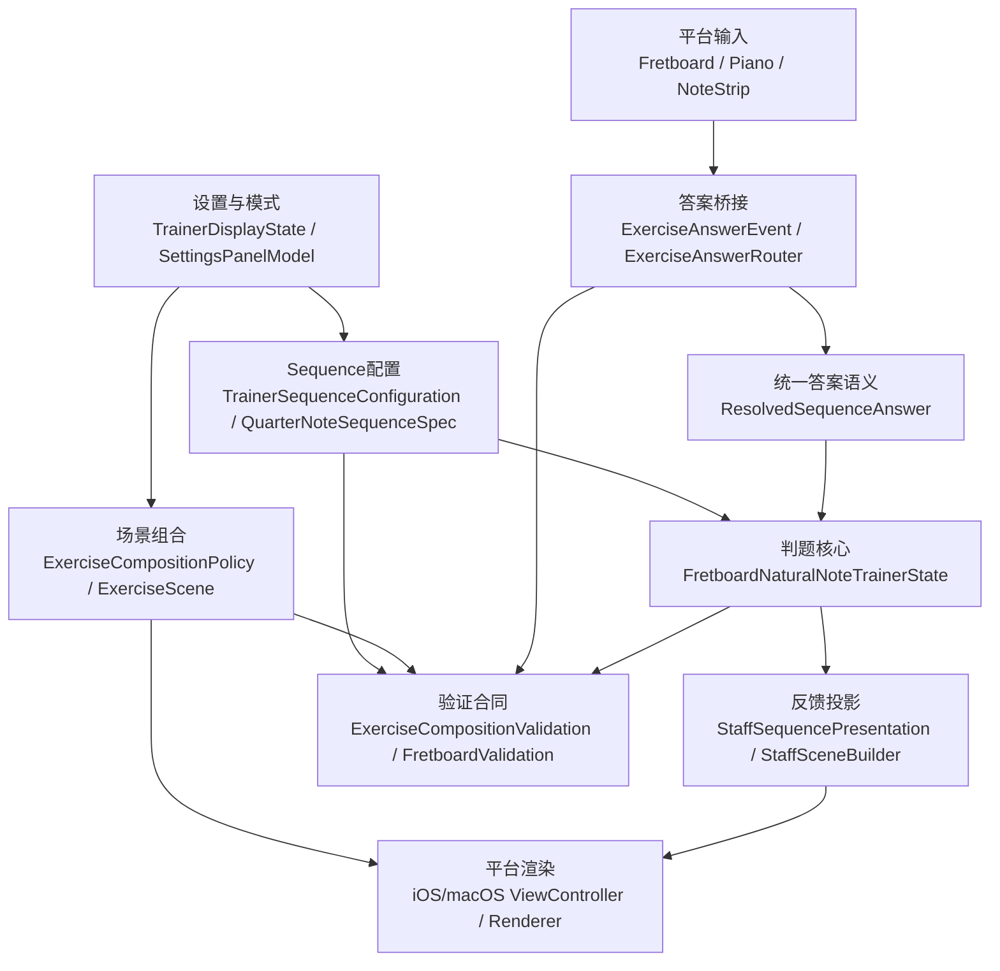
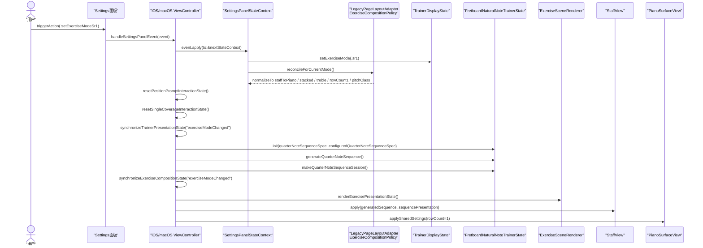
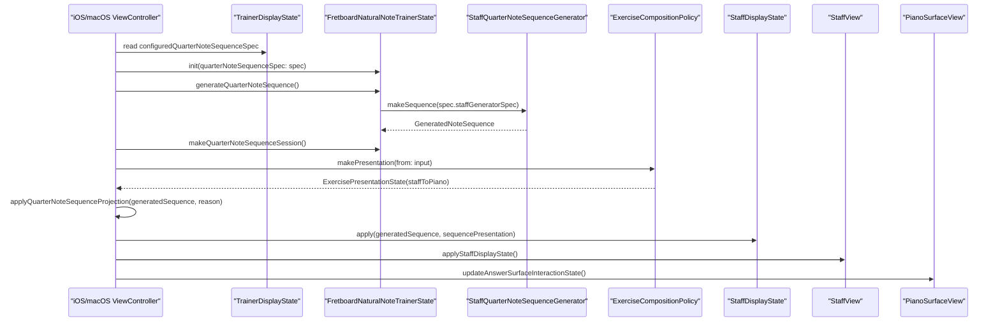
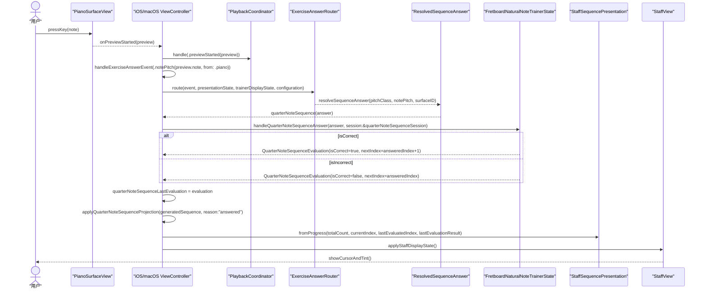
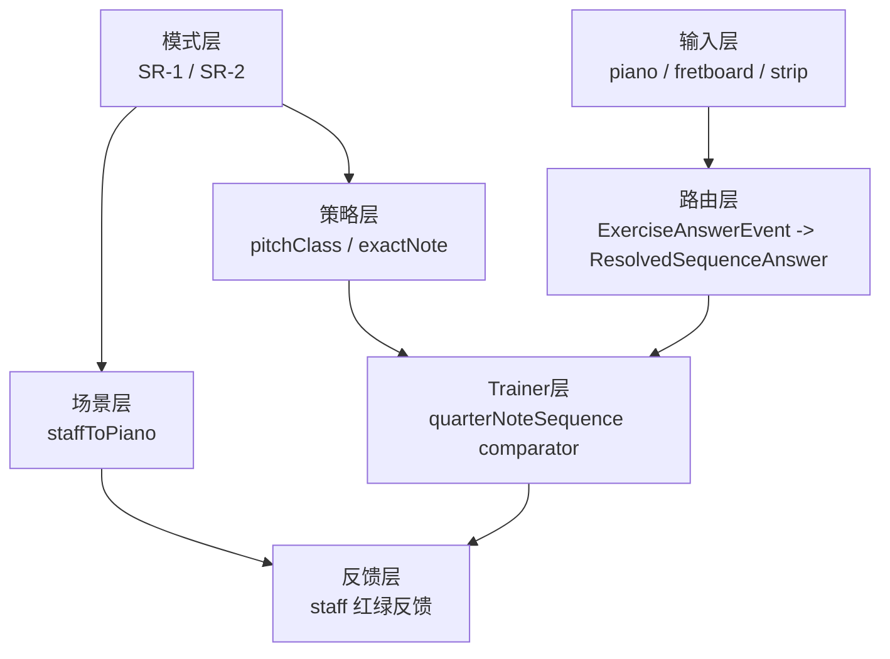

# SR-1 / SR-2 分阶段实施计划

## 已冻结决策

- `SR-1` / `SR-2` 继续复用现有 `quarterNoteSequence` 内容生成链路，不新增第二套 trainer 内核。关键入口仍是 `FretboardNaturalNoteTrainerState.handleQuarterNoteSequenceAnswer(...)`，文件在 [NoteMaster_Ver_1/Shared/Fretboard/FretboardNaturalNoteTrainer.swift](NoteMaster_Ver_1/Shared/Fretboard/FretboardNaturalNoteTrainer.swift)。
- `answerPolicy` 是判题规则，不是谱面内容；它应挂在 `TrainerSequenceConfiguration -> QuarterNoteSequenceSpec` 这条配置链上，而不是塞进 `GeneratedNoteSequence`。相关文件是 [NoteMaster_Ver_1/Shared/Controls/TrainerDisplayState.swift](NoteMaster_Ver_1/Shared/Controls/TrainerDisplayState.swift) 和 [NoteMaster_Ver_1/Shared/Fretboard/GeneratedNoteSequence.swift](NoteMaster_Ver_1/Shared/Fretboard/GeneratedNoteSequence.swift)。
- `SR-1` 固定为独立 `TrainerExerciseMode.sr1`，并强制归一化到 `compositionPreset = .staffToPiano`、`layoutPreset = .stacked`、`clef = .treble`、`piano rowCount = 1`、`answerPolicy = .pitchClass`。
- `SR-2` 未来只切 `answerPolicy = .exactNote`。`exactNote` 先定义为 `NotePitch` 级别，也就是“音名 + 八度”；暂不比较 spelling，不把 `C#` / `Db` 的记谱书写差异纳入这次 seam。
- `quarterNoteSequence` 继续只是内容引擎；`SR-1` / `SR-2` 只存在于 `TrainerExerciseMode`、composition 和 controller 层，不下沉成新的 trainer mode。
- `SR-1` 不走 legacy page 投影；`staffToPiano` 允许 `legacyPageDisplayState == nil`。相关约束在 [NoteMaster_Ver_1/Shared/Exercise/LegacyPageLayoutAdapter.swift](NoteMaster_Ver_1/Shared/Exercise/LegacyPageLayoutAdapter.swift) 和 [NoteMaster_Ver_1/Shared/Exercise/ExerciseSceneValidator.swift](NoteMaster_Ver_1/Shared/Exercise/ExerciseSceneValidator.swift)。

## 架构主线

- 当前 scene 组合入口是 `ExerciseCompositionPolicy.resolvedSceneSurfaces(for:)`，文件在 [NoteMaster_Ver_1/Shared/Exercise/ExerciseCompositionPolicy.swift](NoteMaster_Ver_1/Shared/Exercise/ExerciseCompositionPolicy.swift)。
- 当前 sequence 路由在 `ExerciseAnswerRouter.route(...)` 里先把输入坍缩成 `PitchClass`，文件在 [NoteMaster_Ver_1/Shared/Exercise/ExerciseAnswerRouter.swift](NoteMaster_Ver_1/Shared/Exercise/ExerciseAnswerRouter.swift)。
- 当前 sequence 判题在 trainer 里直接比较 `PitchClass == expectedPitchClass`，文件在 [NoteMaster_Ver_1/Shared/Fretboard/FretboardNaturalNoteTrainer.swift](NoteMaster_Ver_1/Shared/Fretboard/FretboardNaturalNoteTrainer.swift)。
- 当前 renderer 已经能挂 `.piano` surface；真正缺的是“让 piano 成为正式 answer surface”，而不是“让 renderer 学会显示钢琴”。相关文件是 [NoteMaster_Ver_1/Platform/iOS/Exercise/iOSExerciseSceneRenderer.swift](NoteMaster_Ver_1/Platform/iOS/Exercise/iOSExerciseSceneRenderer.swift) 和 [NoteMaster_Ver_1/Platform/macOS/Exercise/macOSExerciseSceneRenderer.swift](NoteMaster_Ver_1/Platform/macOS/Exercise/macOSExerciseSceneRenderer.swift)。

## 模块架构

### 模块边界

- `Sequence配置模块`
  - 职责：承载 mode 归一化后的 sequence 运行参数，包括 `clef`、`noteCount`、`includesAccidentals`、未来的 `answerPolicy`。
  - 现有落点：[NoteMaster_Ver_1/Shared/Controls/TrainerDisplayState.swift](NoteMaster_Ver_1/Shared/Controls/TrainerDisplayState.swift)
  - 设计要求：`SR-1` / `SR-2` 不直接改 trainer 内核，而是通过这里下发判题策略。
- `Sequence内容模块`
  - 职责：只生成谱面内容与期望音序，不携带判题规则。
  - 现有落点：[NoteMaster_Ver_1/Shared/Fretboard/GeneratedNoteSequence.swift](NoteMaster_Ver_1/Shared/Fretboard/GeneratedNoteSequence.swift)、[NoteMaster_Ver_1/Shared/Staff/StaffQuarterNoteSequenceGenerator.swift](NoteMaster_Ver_1/Shared/Staff/StaffQuarterNoteSequenceGenerator.swift)
  - 设计要求：继续保留 `writtenPitch` 作为 exactNote seam，但不把 `answerPolicy` 下沉进内容模型。
- `Exercise场景组合模块`
  - 职责：决定 prompt surface / answer surface / accessory surface 如何拼成 `ExerciseScene`。
  - 现有落点：[NoteMaster_Ver_1/Shared/Exercise/ExerciseScene.swift](NoteMaster_Ver_1/Shared/Exercise/ExerciseScene.swift)、[NoteMaster_Ver_1/Shared/Exercise/ExerciseCompositionPolicy.swift](NoteMaster_Ver_1/Shared/Exercise/ExerciseCompositionPolicy.swift)、[NoteMaster_Ver_1/Shared/Exercise/ExerciseLayoutPreferences.swift](NoteMaster_Ver_1/Shared/Exercise/ExerciseLayoutPreferences.swift)
  - 设计要求：`SR-1` 通过 `staffToPiano` 组合进入主场景，而不是把 piano 当附属面板临时拼接。
- `输入语义解析模块`
  - 职责：把 `fretboard` / `naturalNoteStrip` / `piano` 的平台输入统一解析成 sequence 可消费的答案载体。
  - 现有落点：[NoteMaster_Ver_1/Shared/Exercise/ExerciseAnswerEvent.swift](NoteMaster_Ver_1/Shared/Exercise/ExerciseAnswerEvent.swift)、[NoteMaster_Ver_1/Shared/Exercise/ExerciseAnswerRouter.swift](NoteMaster_Ver_1/Shared/Exercise/ExerciseAnswerRouter.swift)
  - 设计要求：这里负责“输入标准化”，不负责最终判题。
- `判题核心模块`
  - 职责：基于 `ResolvedSequenceAnswer + answerPolicy + expectedItem` 得出对错、推进游标、产出 evaluation。
  - 现有落点：[NoteMaster_Ver_1/Shared/Fretboard/FretboardNaturalNoteTrainer.swift](NoteMaster_Ver_1/Shared/Fretboard/FretboardNaturalNoteTrainer.swift)
  - 设计要求：所有 `SR-1` / `SR-2` 差异都应收口到 comparator，而不是散落在 controller 或 router。
- `反馈投影模块`
  - 职责：把 trainer evaluation 映射成 `StaffSequencePresentation`，再投影到五线谱颜色、游标和状态。
  - 现有落点：[NoteMaster_Ver_1/Platform/iOS/iOSViewController.swift](NoteMaster_Ver_1/Platform/iOS/iOSViewController.swift)、[NoteMaster_Ver_1/Platform/macOS/macOSViewController.swift](NoteMaster_Ver_1/Platform/macOS/macOSViewController.swift)、[NoteMaster_Ver_1/Shared/Staff/StaffScene.swift](NoteMaster_Ver_1/Shared/Staff/StaffScene.swift)、[NoteMaster_Ver_1/Shared/Staff/StaffSceneBuilder.swift](NoteMaster_Ver_1/Shared/Staff/StaffSceneBuilder.swift)
  - 设计要求：`SR-1` 与 `SR-2` 共用同一套反馈 UI，不新增第二套 staff 反馈机制。
- `平台桥接模块`
  - 职责：把 iOS / macOS 的 piano preview 事件、fretboard 点击事件接到共享答题链路，同时保留现有 playback。
  - 现有落点：[NoteMaster_Ver_1/Platform/iOS/Controls/iOSPianoSurfaceView.swift](NoteMaster_Ver_1/Platform/iOS/Controls/iOSPianoSurfaceView.swift)、[NoteMaster_Ver_1/Platform/macOS/Controls/macOSPianoSurfaceView.swift](NoteMaster_Ver_1/Platform/macOS/Controls/macOSPianoSurfaceView.swift)、[NoteMaster_Ver_1/Platform/iOS/iOSViewController.swift](NoteMaster_Ver_1/Platform/iOS/iOSViewController.swift)、[NoteMaster_Ver_1/Platform/macOS/macOSViewController.swift](NoteMaster_Ver_1/Platform/macOS/macOSViewController.swift)
  - 设计要求：保持“播放”和“判题”双路消费，不让任一路吞掉另一条链。
- `合同验证模块`
  - 职责：锁定 mode、preset、scene、router、trainer comparator 与 settings 的共享合同。
  - 现有落点：[NoteMaster_Ver_1/Shared/Exercise/ExerciseCompositionValidationExercisePolicy.swift](NoteMaster_Ver_1/Shared/Exercise/ExerciseCompositionValidationExercisePolicy.swift)、[NoteMaster_Ver_1/Shared/Exercise/ExerciseCompositionValidationSceneCore.swift](NoteMaster_Ver_1/Shared/Exercise/ExerciseCompositionValidationSceneCore.swift)、[NoteMaster_Ver_1/Shared/Fretboard/FretboardValidation.swift](NoteMaster_Ver_1/Shared/Fretboard/FretboardValidation.swift)
  - 设计要求：`SR-2` seam 在 UI 未开放前，也必须先被 shared validation 锁住。

### 依赖方向

- `TrainerDisplayState / Settings`
  - 只负责声明“当前模式需要什么策略和布局”，不直接做判题。
- `ExerciseCompositionPolicy / ExerciseScene`
  - 只负责场景拓扑和 surface 角色，不理解 `pitchClass` 或 `exactNote` 的判题细节。
- `ExerciseAnswerRouter`
  - 只负责把平台输入标准化成共享答案语义，不负责 sequence 进度推进。
- `FretboardNaturalNoteTrainerState`
  - 只负责 comparator、session 推进和 evaluation 输出，不决定 UI 布局。
- `iOS/macOS ViewController`
  - 只负责把共享状态投影到具体 view，并把平台事件桥接回 shared 层。
- `StaffSceneBuilder`
  - 只消费 `StaffSequencePresentation` 做显示，不碰具体判题规则。

### 预期目标架构

### SR-1 与 SR-2 的模块差异

- `SR-1`
  - 差异只体现在 `TrainerExerciseMode.sr1` 的归一化结果：`staffToPiano + stacked + treble + rowCount=1 + answerPolicy=.pitchClass`
  - `ResolvedSequenceAnswer.notePitch` 会被带上，但 comparator 当前只消费 `pitchClass`
- `SR-2`
  - 不改 scene、不改 renderer、不改平台输入桥
  - 只把 mode 归一化切到 `answerPolicy=.exactNote`
  - comparator 开始消费 `ResolvedSequenceAnswer.notePitch`

### 关键设计原则

- `判题策略上收`
  - `answerPolicy` 只能挂在 sequence 配置链，不进入 `GeneratedNoteSequence`
- `输入语义统一`
  - 不允许 controller 直接针对 `SR-1` 写临时 if/else 判题；所有输入都先变成共享答案载体
- `场景与判题解耦`
  - `staffToPiano` 只决定“谁显示、谁作答”，不决定“怎么判对错”
- `反馈单通道`
  - 仍然统一走 `StaffSequencePresentation -> StaffSceneBuilder`，不为 `SR-1` 新造一套红绿反馈 view model
- `SR-2 seam 先落地`
  - 即便 UI 暂时只有 `SR-1`，也要让 comparator、route shape、validation 先具备 exactNote 能力

## 关键时序图

### 切换训练模式时序

- 当前默认态按现有架构仍是 `positionPrompt + fretboardToNaturalNoteStrip`，也就是“左侧 `fretboard`、右侧竖排 `naturalNoteStrip`”。
- 目标态是 `SR-1 + staffToPiano`，也就是“上方 `treble staff`、下方单行 `piano`”。
- 下面的时序图描述的是预期实现落地后的主链路，尽量复用现有 `handleSettingsPanelEvent(...)`、`reconcileForCurrentMode()`、`synchronizeTrainerPresentationState(...)` 这些入口。

- 这个切换过程里最关键的不是 renderer，而是 `SettingsPanelStateContext -> reconcileForCurrentMode() -> synchronizeTrainerPresentationState(...)` 这条共享状态链。
- `SR-1` 的 mode 切换必须同时完成 3 件事：
  - 旧 `positionPrompt` session 和 overlay 状态被清理
  - `quarterNoteSequence` trainer 与 session 被新 spec 重建
  - scene 从 `fretboardToNaturalNoteStrip` 归一化为 `staffToPiano`

### SR-1 出题时序

- 这里的“出题”指：基于 `QuarterNoteSequenceSpec` 生成一条新的 `GeneratedNoteSequence`，并把它投影到五线谱 prompt 与单行键盘 answer surface。
- 现有实现里最接近这条主线的方法是 `synchronizeQuarterNoteSequencePresentation(...)`、`generateQuarterNoteSequence()`、`makeQuarterNoteSequenceSession()`、`applyQuarterNoteSequenceProjection(...)`。

- 这一阶段的关键约束：
  - `GeneratedNoteSequence` 仍然只承载内容，不承载 `answerPolicy`
  - `StaffDisplayState.apply(generatedSequence:, sequencePresentation:)` 继续只负责谱面投影
  - `PianoSurfaceView` 在 SR-1 下只是 answer surface，不负责自己判题

### SR-1 答题与判题时序

- 这里把“答题”和“判题”合并画成一条链，因为在 SR-1 下关键变化就是：`piano` 的 preview 事件要进入 sequence 答题管线，但同时仍要保留 playback。
- 图里的 `ResolvedSequenceAnswer` 和 `.notePitch(NotePitch)` 是目标实现里的新增共享契约。

- 这个时序里要特别锁住两条规则：
  - `previewStarted` 必须同时服务 playback 和答题，不能只走其中一路
  - `previewChanged` 只在 note 真变化时重投递答题事件，避免同一按键滑动过程重复判题
- `SR-1` 与 `SR-2` 在这条时序里的唯一业务差异，就是 `Trainer` 内部 comparator 读取的 `answerPolicy` 不同：
  - `SR-1`：消费 `answer.pitchClass`
  - `SR-2`：消费 `answer.notePitch`

## 现状根因锚点

- [NoteMaster_Ver_1/Shared/Controls/TrainerDisplayState.swift](NoteMaster_Ver_1/Shared/Controls/TrainerDisplayState.swift) 里 `TrainerSequenceConfiguration.quarterNoteSequenceSpec` 目前只传 `clef / noteCount / includesAccidentals`，这里就是 `answerPolicy` 最自然的挂载点。
- [NoteMaster_Ver_1/Shared/Exercise/ExerciseAnswerRouter.swift](NoteMaster_Ver_1/Shared/Exercise/ExerciseAnswerRouter.swift) 的 sequence 分支当前先把输入坍缩成 `PitchClass`，这是 SR-2 seam 现在被截断的第一处。
- [NoteMaster_Ver_1/Shared/Fretboard/FretboardNaturalNoteTrainer.swift](NoteMaster_Ver_1/Shared/Fretboard/FretboardNaturalNoteTrainer.swift) 的 `handleQuarterNoteSequenceAnswer(...)` 当前直接做 `pitchClass == expectedPitchClass`，这是判题逻辑必须收口到 comparator 的地方。
- [NoteMaster_Ver_1/Shared/Exercise/ExerciseCompositionPolicy.swift](NoteMaster_Ver_1/Shared/Exercise/ExerciseCompositionPolicy.swift) 的 `makePresentation(...)` 会把 `pianoPanelState.isVisible` 自动并进 `isPianoAccessoryVisible`，这是 `staffToPiano` 必须先处理主场景与 accessory 去重的根源。

## 非目标

- 这次不引入新的独立 trainer 内核，仍然复用 `quarterNoteSequence`。
- 这次不让 `answerPolicy` 成为用户自由切换的 settings 行；它由 mode 归一化决定。
- 这次不处理记谱 spelling 等价问题，`exactNote` 只比较 `NotePitch`。
- 这次不要求 `staffToPiano` 能投影回 legacy `PageDisplayState`。

## 阶段 0：冻结共享语义边界

- 目标：先把 `SR-1` / `SR-2` 的命名、判题边界和 ownership 定死，避免后续一边实现一边改定义。
- 关键文件：[NoteMaster_Ver_1/Shared/Controls/TrainerDisplayState.swift](NoteMaster_Ver_1/Shared/Controls/TrainerDisplayState.swift)、[NoteMaster_Ver_1/Shared/Fretboard/FretboardNaturalNoteTrainer.swift](NoteMaster_Ver_1/Shared/Fretboard/FretboardNaturalNoteTrainer.swift)、[NoteMaster_Ver_1/Shared/Fretboard/GeneratedNoteSequence.swift](NoteMaster_Ver_1/Shared/Fretboard/GeneratedNoteSequence.swift)。
- 具体动作：新增 `TrainerSequenceAnswerPolicy`，只保留 `.pitchClass` 和 `.exactNote` 两个 case；明确 `SR-1` 固定 `.pitchClass`、`SR-2` 固定 `.exactNote`；明确 `exactNote` 比较 `writtenPitch.notePitch` 与输入 `NotePitch`。
- 完成标准：只新增类型和语义注释，不改任何运行时行为；后续所有阶段直接沿用这套命名，不再返工。

## 阶段 1：把 answerPolicy 挂进现有 sequence 配置链路

- 目标：把“判题策略”放进已有配置通道，而不是另拉一条 SR 专属配置线。
- 关键文件：[NoteMaster_Ver_1/Shared/Controls/TrainerDisplayState.swift](NoteMaster_Ver_1/Shared/Controls/TrainerDisplayState.swift)、[NoteMaster_Ver_1/Shared/Fretboard/FretboardNaturalNoteTrainer.swift](NoteMaster_Ver_1/Shared/Fretboard/FretboardNaturalNoteTrainer.swift)、[NoteMaster_Ver_1/Platform/iOS/iOSViewController.swift](NoteMaster_Ver_1/Platform/iOS/iOSViewController.swift)、[NoteMaster_Ver_1/Platform/macOS/macOSViewController.swift](NoteMaster_Ver_1/Platform/macOS/macOSViewController.swift)。
- 具体动作：给 `TrainerSequenceConfiguration` 增加 `answerPolicy`；给 `QuarterNoteSequenceSpec` 同步增加 `answerPolicy`；补齐 `TrainerSequenceConfiguration.init(quarterNoteSequenceSpec:)` 与 `quarterNoteSequenceSpec` 的双向映射；在 `QuarterNoteSequenceEvaluation` 里预埋 `comparisonPolicy` 和 `expectedNotePitch` 只读投影；明确 `answerPolicy` 不进入 [NoteMaster_Ver_1/Shared/Fretboard/GeneratedNoteSequence.swift](NoteMaster_Ver_1/Shared/Fretboard/GeneratedNoteSequence.swift)，避免把“判题规则”污染成“谱面内容”。
- 完成标准：`single / sequence / positionPrompt` 全部编译通过，行为完全不变；控制器中的 `configuredQuarterNoteSequenceSpec` 自动带上新字段，不需要新入口。

## 阶段 2：抽出统一的 sequence 答案载体

- 目标：先解掉“router 只能产出裸 `PitchClass`”这个根问题，为 SR-1 的 piano 输入和 SR-2 的 exactNote 输入留通道。
- 关键文件：[NoteMaster_Ver_1/Shared/Exercise/ExerciseAnswerEvent.swift](NoteMaster_Ver_1/Shared/Exercise/ExerciseAnswerEvent.swift)、[NoteMaster_Ver_1/Shared/Exercise/ExerciseAnswerRouter.swift](NoteMaster_Ver_1/Shared/Exercise/ExerciseAnswerRouter.swift)、[NoteMaster_Ver_1/Shared/Fretboard/FretboardNaturalNoteTrainer.swift](NoteMaster_Ver_1/Shared/Fretboard/FretboardNaturalNoteTrainer.swift)。
- 具体动作：给 `ExerciseAnswerPayload` 增加 `.notePitch(NotePitch)`；引入 `ResolvedSequenceAnswer`，至少保留 `pitchClass`、`notePitch?`、`surfaceID`；让 sequence 路由不再返回裸 `pitchClass`，而是返回统一的 `ResolvedSequenceAnswer`；在 trainer 侧新增 `resolvedSequenceAnswer(...)` 辅助函数，统一从 `pitchClass` / `fretboardCell` / 未来的 `piano` 输入恢复 sequence 需要的语义；`single` 和 `positionPrompt` 先保持现有专用路由，避免这一阶段 blast radius 过大。
- 完成标准：现有指板和 notestrip 的 sequence 路由结果不变；shared 层已经能承载“既有 `pitchClass` 也有 `notePitch`”的答案输入。

## 阶段 3：把 sequence 判题从硬编码 PitchClass 改成按 policy 比较

- 目标：把 SR-2 最关键的 seam 真正埋进 trainer，而不是只在设置里挂一个字段。
- 关键文件：[NoteMaster_Ver_1/Shared/Fretboard/FretboardNaturalNoteTrainer.swift](NoteMaster_Ver_1/Shared/Fretboard/FretboardNaturalNoteTrainer.swift)、[NoteMaster_Ver_1/Shared/Fretboard/GeneratedNoteSequence.swift](NoteMaster_Ver_1/Shared/Fretboard/GeneratedNoteSequence.swift)。
- 具体动作：把 `handleQuarterNoteSequenceAnswer(...)` 的入参从 `PitchClass` 升级为 `ResolvedSequenceAnswer`；比较逻辑统一收口到 comparator：`.pitchClass` 比较 `resolved.pitchClass == expectedItem.answerPitchClass`，`.exactNote` 比较 `resolved.notePitch == expectedItem.writtenPitch.notePitch`；给 `QuarterNoteSequenceEvaluation` 增加 `answeredNotePitch`、`expectedNotePitch`、`comparisonPolicy`，并让 `debugSummary()` 打出 policy；[NoteMaster_Ver_1/Shared/Fretboard/GeneratedNoteSequence.swift](NoteMaster_Ver_1/Shared/Fretboard/GeneratedNoteSequence.swift) 只补 `expectedNotePitch` 一类的 computed property，不重构生成模型。
- 完成标准：在 UI 还没接 piano 之前，shared comparator 已经被测透；至少覆盖 4 组合同：`C6` 对 `C` 在 `.pitchClass` 为正确、`C6` 对 `C3` 在 `.pitchClass` 为正确、`C6` 对 `C3` 在 `.exactNote` 为错误、`C6` 对 `C6` 在 `.exactNote` 为正确。

## 阶段 4：新增 staffToPiano 组合，让 piano 成为正式 answer surface

- 目标：让 SR-1 像现在“指板 + notestrip”一样走正式 `ExerciseScene` 组合，而不是 controller 手工拼 UI。
- 关键文件：[NoteMaster_Ver_1/Shared/Exercise/ExerciseLayoutPreferences.swift](NoteMaster_Ver_1/Shared/Exercise/ExerciseLayoutPreferences.swift)、[NoteMaster_Ver_1/Shared/Exercise/ExerciseScene.swift](NoteMaster_Ver_1/Shared/Exercise/ExerciseScene.swift)、[NoteMaster_Ver_1/Shared/Exercise/ExerciseCompositionPolicy.swift](NoteMaster_Ver_1/Shared/Exercise/ExerciseCompositionPolicy.swift)、[NoteMaster_Ver_1/Shared/Exercise/ExerciseCompositionPolicy+Normalization.swift](NoteMaster_Ver_1/Shared/Exercise/ExerciseCompositionPolicy+Normalization.swift)、[NoteMaster_Ver_1/Shared/Exercise/ExerciseSceneValidator.swift](NoteMaster_Ver_1/Shared/Exercise/ExerciseSceneValidator.swift)、[NoteMaster_Ver_1/Platform/iOS/Exercise/iOSExerciseSceneRenderer.swift](NoteMaster_Ver_1/Platform/iOS/Exercise/iOSExerciseSceneRenderer.swift)、[NoteMaster_Ver_1/Platform/macOS/Exercise/macOSExerciseSceneRenderer.swift](NoteMaster_Ver_1/Platform/macOS/Exercise/macOSExerciseSceneRenderer.swift)。
- 具体动作：新增 `ExerciseCompositionPreset.staffToPiano`；新增 `ExerciseSurfaceNode.pianoAnswer`，roles 固定为 `[.answer]`；让 `resolvedSceneSurfaces(for:)` 支持返回 `(.staffPrompt, .pianoAnswer)`；`stacked` 下沿用已有 vertical split 规则，让 `staff.fitContent` 在上、`piano.weighted` 在下；把平台 renderer 里的 `pianoAccessoryView` 去语义化为可复用的 `pianoSurfaceView`；在 `makePresentation(...)` / normalization 阶段强制 `staffToPiano` 下 `isPianoAccessoryVisible = false`，避免主场景 piano 和 accessory piano 同时出现，触发 duplicate `.piano` surface 风险；明确 [NoteMaster_Ver_1/Shared/Exercise/LegacyPageLayoutAdapter.swift](NoteMaster_Ver_1/Shared/Exercise/LegacyPageLayoutAdapter.swift) 不尝试把 `staffToPiano` 反投影成 `PageDisplayState`。
- 完成标准：内部已能构造稳定的 `staff -> piano` stacked scene；`ExerciseSceneValidator` 不出现 duplicate surface / visibility 错乱；`LegacyPageLayoutAdapter` 不尝试把 `staffToPiano` 反投影成 `PageDisplayState`。

## 阶段 5：引入 SR-1 mode，并把 piano 输入接进答题管线

- 目标：把 mode、layout、policy、平台输入和 staff 反馈彻底串起来。
- 关键文件：[NoteMaster_Ver_1/Shared/Controls/TrainerDisplayState.swift](NoteMaster_Ver_1/Shared/Controls/TrainerDisplayState.swift)、[NoteMaster_Ver_1/Shared/Controls/SettingsPanelModel.swift](NoteMaster_Ver_1/Shared/Controls/SettingsPanelModel.swift)、[NoteMaster_Ver_1/Shared/Exercise/LegacyPageLayoutAdapter.swift](NoteMaster_Ver_1/Shared/Exercise/LegacyPageLayoutAdapter.swift)、[NoteMaster_Ver_1/Platform/iOS/iOSViewController.swift](NoteMaster_Ver_1/Platform/iOS/iOSViewController.swift)、[NoteMaster_Ver_1/Platform/macOS/macOSViewController.swift](NoteMaster_Ver_1/Platform/macOS/macOSViewController.swift)、[NoteMaster_Ver_1/Platform/iOS/Controls/iOSPianoSurfaceView.swift](NoteMaster_Ver_1/Platform/iOS/Controls/iOSPianoSurfaceView.swift)、[NoteMaster_Ver_1/Platform/macOS/Controls/macOSPianoSurfaceView.swift](NoteMaster_Ver_1/Platform/macOS/Controls/macOSPianoSurfaceView.swift)。
- 具体动作：新增 `TrainerExerciseMode.sr1`；让 `synchronizeTrainerPresentationState()` 在 `sr1` 下仍复用 `quarterNoteSequence` 内容生成，但固定归一化为 `staffToPiano + stacked + treble + rowCount=1 + rowOnly + answerPolicy=.pitchClass + isPianoAccessoryVisible=false`；不把 `answerPolicy` 暴露成单独 settings 行，而是由 mode 决定；在 SR-1 下隐藏或禁用 `pianoRowCount`、`pianoMovementScope`、staff bass 等会被 normalization 强拉回的设置项；把 piano 输入桥接为 exercise answer event：`previewStarted` 发送 `ExerciseAnswerEvent.notePitch(preview.note, from: .piano)`，`previewChanged` 只在音高变化时发送，`previewEnded` 清理 dedupe cache；让 `handlePianoSemanticEvent()` 变成双路：一路继续走 `playbackCoordinator`，一路在 SR-1 且 `.piano` 为 answer surface 时进入 `handleExerciseAnswerEvent(...)`；补上 `.piano` 的交互 enable/disable 联动。
- 完成标准：切到 `SR-1` 后界面稳定变成“treble staff + 单行 piano”；五线谱是 `C6` 时按 `C3` / `C4` 都算正确；钢琴播放反馈和答题反馈能共存，不互相吞事件。

## 阶段 6：补齐 validation，并把 SR-2 seam 真正封口

- 目标：确保 SR-2 以后不是再来一次大改，而只是开启已经埋好的 seam。
- 关键文件：[NoteMaster_Ver_1/Shared/Exercise/ExerciseCompositionValidationExercisePolicy.swift](NoteMaster_Ver_1/Shared/Exercise/ExerciseCompositionValidationExercisePolicy.swift)、[NoteMaster_Ver_1/Shared/Exercise/ExerciseCompositionValidationSceneCore.swift](NoteMaster_Ver_1/Shared/Exercise/ExerciseCompositionValidationSceneCore.swift)、[NoteMaster_Ver_1/Shared/Controls/SettingsNavigationValidationStateAndNavigation.swift](NoteMaster_Ver_1/Shared/Controls/SettingsNavigationValidationStateAndNavigation.swift)、[NoteMaster_Ver_1/Shared/Fretboard/FretboardValidation.swift](NoteMaster_Ver_1/Shared/Fretboard/FretboardValidation.swift)。
- 具体动作：补 SR-1 的 settings 可见性、选择状态和 normalization 合同；补 `staffToPiano` 的 surface state 合同，确保 `.staff` 是 prompt-only、`.piano` 是 answer-only；明确 `legacyPageDisplayState == nil` 对 SR-1 是允许且预期的；把 `.exactNote` comparator 即便 UI 未开放也先纳入 shared validation；补 accessory piano 与 main piano 不可同场共存的合同；在 iOS / macOS 侧补一轮 smoke 级验证，覆盖键盘输入、staff 红绿反馈、切模式后的状态清理。
- 完成标准：未来只需要新增 `TrainerExerciseMode.sr2`，并在 normalization 中把 `answerPolicy` 从 `.pitchClass` 切到 `.exactNote`；不需要再改 router 结构、不需要再改 trainer comparator、不需要再改 `staffToPiano` scene。

## 推荐交付切片

- `PR-1`：阶段 0-3。只做 shared 语义、policy comparator 和 sequence answer carrier，不开 SR-1 UI。
- `PR-2`：阶段 4-5。接 `staffToPiano` scene、`SR-1` mode、settings 归一化和 iOS/macOS piano 输入桥。
- `PR-3`：阶段 6。补 validation，确认 SR-2 seam 已经闭环。

## 主要回归风险

- `ExerciseCompositionPolicy+Normalization` 和 `SettingsPanelModel` 可能出现 silent reconcile，把用户选中的 mode / preset 悄悄打回默认。
- `LegacyPageLayoutAdapter` 和 `ExerciseSceneValidator.legacyPageDisplayState(for:)` 只认识旧的三种竖直二分组合，SR-1 若误走 legacy 会出现投影不一致。
- `ExerciseAnswerRouter` 如果 sequence 仍然只消费裸 `PitchClass`，SR-2 的 exactNote seam 会在 shared 层被提前截断。
- `makePresentation(...)` 当前会把 `pianoPanelState.isVisible` 并进 `isPianoAccessoryVisible`；若不在 `staffToPiano` 下强制去重，会直接制造 duplicate `.piano` surface。
- `ExerciseSceneValidator.validate(...)` 仍要求场景里至少有一个 prompt surface 和一个 answer surface；如果 `pianoAnswer` 的 roles 标错，会直接触发 `missingPromptSurface` / `missingAnswerSurface` 一类合同失败。
- `ExerciseCompositionValidationExercisePolicy.swift`、`ExerciseCompositionValidationSceneCore.swift`、`FretboardValidation.swift` 里有大量 mode / preset / settings 顺序的硬编码夹具，新增 `sr1` 与 `staffToPiano` 后如果不同步更新，会出现“功能正确但 validation 全红”的回归。

