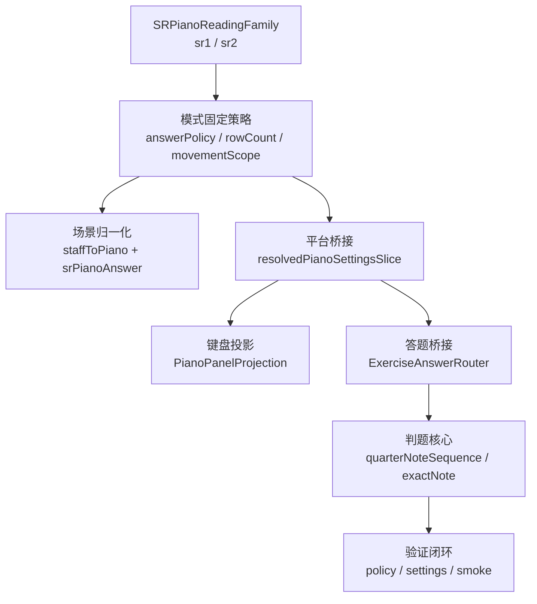

# SR-2 方案三分阶段计划

## 目标与边界

- 以现有的 `[SR-1 / SR-2` 基线计划](.cursor/plans/sr1判题分阶段_3443803b.plan.md)、`[TrainerDisplayState](NoteMaster_Ver_1/Shared/Controls/TrainerDisplayState.swift)`、`[ExerciseCompositionPolicy+Normalization](NoteMaster_Ver_1/Shared/Exercise/ExerciseCompositionPolicy+Normalization.swift)`、`[PianoPanelState](NoteMaster_Ver_1/Shared/Piano/PianoPanelState.swift)` 为基础，把 `sr1` / `sr2` 从“两个并列 mode case”提升为一个统一的 `staffToPiano reading family`。
- 不新增第二套 `trainer`、不新增新的 `ExerciseCompositionPreset`、不新增新的钢琴组件；继续复用现有 `quarterNoteSequence`、`staffToPiano`、`ExerciseAnswerRouter`、`FretboardNaturalNoteTrainerState`。
- `SR-1` 维持 `pitchClass + 1 row + rowOnly`；`SR-2` 在同一 family 中切到 `exactNote + 2 rows + rowOnly`。默认先保持 `rowOnly`，这样不会改变 SR 模式当前的操作习惯；如果后续产品确认需要两行联动，再单独把 `fixedPianoMovementScope` 切到 `.cascade`，不改变本计划的阶段划分。
- 这次的根因不是“再补一个 SR-2 if/else”，而是把 `SR-1 / SR-2` 的共享固定约束、差异矩阵、settings 可见性和 smoke 验证都收口到同一条链，避免以后继续散落在 controller / settings / validation 的多个分支里。

## 当前代码锚点

- 模式固定约束已经在 `[NoteMaster_Ver_1/Shared/Controls/TrainerDisplayState.swift](NoteMaster_Ver_1/Shared/Controls/TrainerDisplayState.swift)` 里，但 `sr1` / `sr2` 仍共享 `fixedPianoRowCount = 1`、`fixedPianoMovementScope = .rowOnly`，这是 `SR-2` 不能变成两行的根因。
- `sr1` / `sr2` 已经在 `[NoteMaster_Ver_1/Shared/Exercise/ExerciseCompositionPolicy+Normalization.swift](NoteMaster_Ver_1/Shared/Exercise/ExerciseCompositionPolicy+Normalization.swift)` 中强制归一化到 `staffToPiano`，说明 scene 侧已经具备统一 family 的土壤。
- 双端 controller 已经通过 `[NoteMaster_Ver_1/Platform/iOS/iOSViewController.swift](NoteMaster_Ver_1/Platform/iOS/iOSViewController.swift)` 和 `[NoteMaster_Ver_1/Platform/macOS/macOSViewController.swift](NoteMaster_Ver_1/Platform/macOS/macOSViewController.swift)` 的 `resolvedPianoSettingsSlice` 覆盖固定 `rowCount / movementScope`，所以两行能力不需要新 UI，只需要改 mode 固定值并补验证。
- 多行钢琴底层已经由 `[NoteMaster_Ver_1/Shared/Piano/PianoPanelState.swift](NoteMaster_Ver_1/Shared/Piano/PianoPanelState.swift)` 和 `PianoPanelProjection.resolvedRows(...)` 支持；扩行时会按 `-12 semitones` 追加新行，说明 `2 rows` 可以直接落在现有投影链路上。
- `exactNote` 判题语义已经在 `[NoteMaster_Ver_1/Shared/Fretboard/FretboardValidation.swift](NoteMaster_Ver_1/Shared/Fretboard/FretboardValidation.swift)` 被验证，当前缺口主要是 `SR-2` 没有 settings 入口、navigation fixture、runtime smoke 和手工 checklist。

## 目标结构

## 分阶段实施

### 阶段 0：冻结 `SRPianoReadingFamily` 的共享合同

- 目标：先把 `sr1` / `sr2` 的共享约束与差异矩阵从多个 `switch` 分支里提炼成单一语义入口，避免后续每加一条验证或 settings 逻辑都再写一遍 `case .sr1, .sr2`。
- 关键文件：`[NoteMaster_Ver_1/Shared/Controls/TrainerDisplayState.swift](NoteMaster_Ver_1/Shared/Controls/TrainerDisplayState.swift)`、`[NoteMaster_Ver_1/Shared/Exercise/ExerciseCompositionValidationExercisePolicy.swift](NoteMaster_Ver_1/Shared/Exercise/ExerciseCompositionValidationExercisePolicy.swift)`、`[NoteMaster_Ver_1/Shared/Fretboard/FretboardValidation.swift](NoteMaster_Ver_1/Shared/Fretboard/FretboardValidation.swift)`。
- 具体动作：
- 在 `TrainerExerciseMode` 或其扩展旁边引入统一的 family 语义，例如 `isSRPianoReadingMode`、`srPianoReadingConstraints` 或等价的集中结构，把 `clef`、`layoutPreferences`、`answerPolicy`、`rowCount`、`movementScope` 的固定矩阵收口到一个地方。
- 明确 family 的共享部分：两者都必须是 `treble + staffToPiano + srPianoAnswer + usesQuarterNoteSequenceKernel`；差异部分只允许落在 `answerPolicy` 与 `piano rowCount`，必要时也包括 `movementScope`。
- 先补 shared validation，确保这一步只是在收口合同，而不是改变 SR-1 当前行为。
- 完成标准：后续 controller / settings / validation 不再各自重新推导 `sr1` / `sr2` 的固定配置；SR-1 仍保持现状，SR-2 还未开放 UI，但 family 结构已经能表达它的差异。

### 阶段 1：把 family 约束接入 normalization 与 controller 共享链路

- 目标：让 scene、settings snapshot、controller 的钢琴设置覆盖都消费同一套 family 约束，而不是只在 `TrainerDisplayState` 上改完、其他层继续各自散写条件分支。
- 关键文件：`[NoteMaster_Ver_1/Shared/Exercise/ExerciseCompositionPolicy+Normalization.swift](NoteMaster_Ver_1/Shared/Exercise/ExerciseCompositionPolicy+Normalization.swift)`、`[NoteMaster_Ver_1/Shared/Exercise/ExerciseCompositionPolicy.swift](NoteMaster_Ver_1/Shared/Exercise/ExerciseCompositionPolicy.swift)`、`[NoteMaster_Ver_1/Platform/iOS/iOSViewController.swift](NoteMaster_Ver_1/Platform/iOS/iOSViewController.swift)`、`[NoteMaster_Ver_1/Platform/macOS/macOSViewController.swift](NoteMaster_Ver_1/Platform/macOS/macOSViewController.swift)`。
- 具体动作：
- 让 `normalizedPreferences(...)`、`fixedExerciseLayoutPreferences`、`resolvedPianoSettingsSlice`、以及 controller 中依赖 `usesQuarterNoteSequenceKernel` 的分支都以统一 family 约束为准。
- 明确 `SRPianoReadingFamily` 不允许 accessory piano 回灌主场景，继续沿用现有 `srPianoAnswer` 语义，不重新造一套 `sr2PianoAnswer` preset。
- 保留 `LegacyPageLayoutAdapter` 对 `staffToPiano` 的现有策略，不让 SR-2 因为开放入口而把 legacy bridge 再拉回主链。
- 完成标准：只要 mode 切到 family 成员，scene 与 controller 都会自动吃到一致的固定配置，不存在“shared 层是两行、平台层还是单行”的漂移。

### 阶段 2：在 family 内只让 `SR-2` 切到 `exactNote + 2 rows`

- 目标：用最小 blast radius 完成 `SR-2` 的真实产品差异，但这个“最小”是建立在前两阶段已经把根因收口之后，而不是继续临时 if/else。
- 关键文件：`[NoteMaster_Ver_1/Shared/Controls/TrainerDisplayState.swift](NoteMaster_Ver_1/Shared/Controls/TrainerDisplayState.swift)`、`[NoteMaster_Ver_1/Shared/Piano/PianoPanelState.swift](NoteMaster_Ver_1/Shared/Piano/PianoPanelState.swift)`、`[NoteMaster_Ver_1/Shared/Piano/PianoInteractionReducer.swift](NoteMaster_Ver_1/Shared/Piano/PianoInteractionReducer.swift)`。
- 具体动作：
- 把 `sr2` 的 family 差异固定为 `answerPolicy = .exactNote`、`fixedPianoRowCount = 2`、`fixedPianoMovementScope = .rowOnly`。
- 不改 `staffToPiano` scene，不改 renderer，不改键盘组件；直接复用 `PianoPanelProjection.resolvedRows(...)` 的多行扩展逻辑。
- 补一个共享层面的“行数合同”验证，至少锁死 `sr1 -> 1 row`、`sr2 -> 2 rows`，避免以后有人把两者重新合并回一行。
- 如果后续产品要改成两行联动，只允许替换 `fixedPianoMovementScope` 与对应 smoke 断言，不回头改阶段 0-1 的 family 结构。
- 完成标准：在不碰 scene 拓扑的前提下，`SR-2` 已经能从 mode 固定值自然驱动出两行钢琴。

### 阶段 3：开放 `SR-2` 的 settings / navigation 入口，并冻结无效项

- 目标：让用户能真实切到 `SR-2`，同时保证 settings 面板不会暴露一堆会被 fixed mode 立刻拉回的伪选项。
- 关键文件：`[NoteMaster_Ver_1/Shared/Controls/SettingsPanelModel.swift](NoteMaster_Ver_1/Shared/Controls/SettingsPanelModel.swift)`、`[NoteMaster_Ver_1/Shared/Controls/SettingsPanelSnapshotBuilder.swift](NoteMaster_Ver_1/Shared/Controls/SettingsPanelSnapshotBuilder.swift)`、`[NoteMaster_Ver_1/Shared/Controls/SettingsNavigationSnapshotBuilder.swift](NoteMaster_Ver_1/Shared/Controls/SettingsNavigationSnapshotBuilder.swift)`、`[NoteMaster_Ver_1/Shared/Controls/SettingsNavigationValidationRootTree.swift](NoteMaster_Ver_1/Shared/Controls/SettingsNavigationValidationRootTree.swift)`、`[NoteMaster_Ver_1/Shared/Controls/SettingsNavigationValidationStateAndNavigation.swift](NoteMaster_Ver_1/Shared/Controls/SettingsNavigationValidationStateAndNavigation.swift)`。
- 具体动作：
- 在 `SettingsActionID`、`exerciseMode` action 列表、标题、选中态、accessibility label 里加入 `setExerciseModeSr2`。
- 更新导航 subtitle 与 root tree，让 `SR-2` 与 `SR-1` / `SR-0` 一样成为正式 mode，而不是临时 debug 入口。
- 在 `SR-2` 下继续隐藏 `pianoRowCount`、`pianoMovementScope`、会被固定为 `treble` 的 bass clef 入口，以及其他会被 normalization 强制拉回的无效项。
- 补 `SR-2` 专属 navigation fixture，保证 UI 暴露出的页面和 fixed mode 的真实能力一致。
- 完成标准：settings 中能切到 `SR-2`，但用户不会看到一组“看起来能改、实际一退出就被 fixed mode 拉回”的无效控制项。

### 阶段 4：补 `SR-2` 的双端 runtime smoke，锁死 `exactNote + 两行 piano`

- 目标：把“同音名不同八度必须判错”从 shared validation 扩成真实 UI 路径上的运行时合同，并且覆盖两行钢琴是否真的被平台层应用。
- 关键文件：`[NoteMaster_Ver_1/Platform/iOS/iOSViewController.swift](NoteMaster_Ver_1/Platform/iOS/iOSViewController.swift)`、`[NoteMaster_Ver_1/Platform/macOS/macOSViewController.swift](NoteMaster_Ver_1/Platform/macOS/macOSViewController.swift)`、`[NoteMaster_Ver_1/Platform/iOS/iOSAppDelegate.swift](NoteMaster_Ver_1/Platform/iOS/iOSAppDelegate.swift)`、`[NoteMaster_Ver_1/Platform/macOS/macOSAppDelegate.swift](NoteMaster_Ver_1/Platform/macOS/macOSAppDelegate.swift)`。
- 具体动作：
- 复用现有 SR-0 / SR-1 已抽出的通用 smoke runner，新增 `SR-2` 场景而不是再写一套完全独立的脚本。
- `switch_to_sr2` 步骤必须断言：`staff` 与 `piano` 都可见、`resolvedPianoSettingsSlice.rowCount == 2`、`movementScope` 符合 fixed mode、且 answer surface 是主场景 piano 而不是 accessory。
- `wrong_exact_note` 步骤使用“同音名不同八度”的钢琴输入，确认五线谱走错误反馈、session 不推进。
- `correct_exact_note` 步骤使用完全相同的 `NotePitch`，确认走正确反馈并推进。
- `switch_back_to_single` 步骤确认旧的 sequence 高亮、旧的 piano answer enable 状态、以及上一题的 exact-note 缓存都被清理。
- 完成标准：iOS / macOS 都有可单独触发的 `SR-2` smoke 场景，且其断言能同时覆盖“判题正确性”和“两行钢琴是否真的生效”。

### 阶段 5：补齐 validation 聚合器、手工 checklist 与 SR 模式回归矩阵

- 目标：让 `SR-2` 不只是在 settings 和 smoke 里能跑通，而是被正式纳入 shared validation 与手工回归清单。
- 关键文件：`[NoteMaster_Ver_1/Shared/Exercise/ExerciseCompositionValidation.swift](NoteMaster_Ver_1/Shared/Exercise/ExerciseCompositionValidation.swift)`、`[NoteMaster_Ver_1/Shared/Exercise/ExerciseCompositionValidationExercisePolicy.swift](NoteMaster_Ver_1/Shared/Exercise/ExerciseCompositionValidationExercisePolicy.swift)`、`[NoteMaster_Ver_1/Shared/Fretboard/FretboardValidation.swift](NoteMaster_Ver_1/Shared/Fretboard/FretboardValidation.swift)`、`[NoteMaster_Ver_1/Shared/Controls/SettingsNavigationValidation.swift](NoteMaster_Ver_1/Shared/Controls/SettingsNavigationValidation.swift)`。
- 具体动作：
- 在 policy validation 中补 family 级断言：`sr1 / sr2` 都必须收敛到 `staffToPiano`，但 `answerPolicy` 与 `rowCount` 不同。
- 在 fretboard validation 中保留现有 `exactNote` seam，同时补 mode 级断言，明确 `SR-2` 的 `resolvedSequenceConfiguration.answerPolicy == .exactNote` 且不篡改 `noteCount / includesAccidentals`。
- 在 settings validation 里补 `SR-2` 的 root tree、fixed options、subtitle 和 selected-state 断言。
- 更新 manual checklist，把 `SR-2` 的“treble staff + 两行 piano + exactNote”纳入回归清单，同时确保 `SR-1` 仍是单行 piano 且 `pitchClass` 判题。
- 完成标准：以后即便没开 app，只跑 validation 也能知道 `SR-1` / `SR-2` 的 family 合同有没有被破坏。

### 阶段 6：按 SR 回归顺序做最终验证

- 目标：确保这次不是“SR-2 终于好了，但 SR-1 / SR-0 被顺手带坏了”。
- 验证顺序：
- 先跑 shared validation：`ExerciseCompositionValidation`、`SettingsNavigationValidation`、`FretboardValidation`。
- 再跑双端构建与 IDE lint，重点覆盖上面阶段里修改过的 shared / settings / controller 文件。
- 最后跑 runtime smoke：`SR-0`、`SR-1`、`SR-2` 三条都要过。`SR-1` 要继续断言单行 piano 与 `pitchClass`；`SR-2` 要断言两行 piano 与 `exactNote`；`SR-0` 要确保主场景仍然是双行 strip，不被 accessory piano 或 family 收口逻辑污染。
- 完成标准：三种 SR 模式的 scene、judge policy、answer surface、state cleanup 都能在同一次回归中自洽通过。

## 切片边界守则

- 前三阶段只做“family 收口 + SR-2 行数差异”，不引入新的 exercise scene 拓扑，也不重写 piano 渲染层。
- settings 暴露必须晚于 family 合同收口；否则 UI 先开放，shared 还没锁住，很容易出现“能选到 SR-2，但切进去还是一行”的半成品状态。
- smoke 必须复用现有通用 runner，不再复制一份 SR-1 逻辑做平行分叉；方案三的价值就在于减少未来 SR 家族的重复实现。
- 所有 `SR-2` 差异都应回到 family 配置矩阵上表达；如果某一步需要在 controller 里写 `if mode == .sr2 { ... }` 的临时判题分支，说明前面的 shared 收口还没做干净。

## 预期收益

- `SR-1` 与 `SR-2` 从“相似但分散的两个 mode”变成“一个 family + 两个固定差异项”，后续再加 `SR-3` 或改两行行为时，不需要再重新翻一遍 scene、settings、smoke。
- `SR-2` 的产品差异被明确压缩到 `answerPolicy` 与 `rowCount`，不会再误伤 `staffToPiano` 场景、legacy bridge、accessory piano 或 SR-1 的单行行为。
- validation、settings、controller 和 runtime smoke 会围绕同一条 family 合同收口，后续维护成本比继续堆独立 case 低得多。

