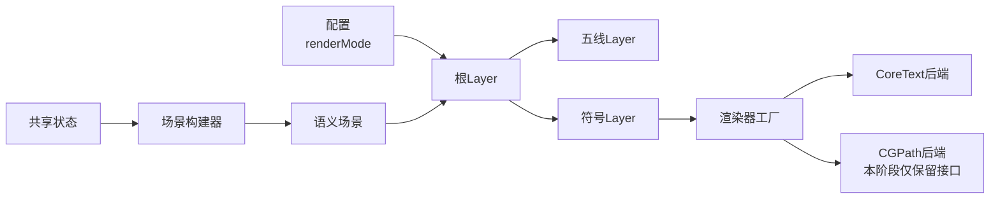

# Staff CoreText 首版计划

## 现状依据

- 现有共享绘制核心已经有可直接复用的骨架：`[FretboardConfiguration.swift](/Users/shaun/Library/Mobile Documents/com~apple~CloudDocs/Develop/NoteMaster_Ver_1/NoteMaster_Ver_1/Shared/Fretboard/FretboardConfiguration.swift)`、`[FretboardGeometry.swift](/Users/shaun/Library/Mobile Documents/com~apple~CloudDocs/Develop/NoteMaster_Ver_1/NoteMaster_Ver_1/Shared/Fretboard/FretboardGeometry.swift)`、`[FretboardLayer.swift](/Users/shaun/Library/Mobile Documents/com~apple~CloudDocs/Develop/NoteMaster_Ver_1/NoteMaster_Ver_1/Shared/Fretboard/FretboardLayer.swift)` 已经把“配置 / 几何 / 绘制”拆开。
- 平台包装层已经很薄：`[iOSFretboardView.swift](/Users/shaun/Library/Mobile Documents/com~apple~CloudDocs/Develop/NoteMaster_Ver_1/NoteMaster_Ver_1/Platform/iOS/iOSFretboardView.swift)` 用 `layerClass` 托管共享 layer，`[macOSFretboardView.swift](/Users/shaun/Library/Mobile Documents/com~apple~CloudDocs/Develop/NoteMaster_Ver_1/NoteMaster_Ver_1/Platform/macOS/macOSFretboardView.swift)` 用 `makeBackingLayer()` 托管共享 layer，这正好可以平移到 `Staff` 域。
- 当前项目里还没有自定义字体接入机制：`[NoteMaster_Ver_1.xcodeproj/project.pbxproj](/Users/shaun/Library/Mobile Documents/com~apple~CloudDocs/Develop/NoteMaster_Ver_1/NoteMaster_Ver_1.xcodeproj/project.pbxproj)` 使用 `GENERATE_INFOPLIST_FILE = YES`，且没有 `UIAppFonts` / `ATSApplicationFontsPath`；`[iOSAppDelegate.swift](/Users/shaun/Library/Mobile Documents/com~apple~CloudDocs/Develop/NoteMaster_Ver_1/NoteMaster_Ver_1/Platform/iOS/iOSAppDelegate.swift)` 与 `[macOSAppDelegate.swift](/Users/shaun/Library/Mobile Documents/com~apple~CloudDocs/Develop/NoteMaster_Ver_1/NoteMaster_Ver_1/Platform/macOS/macOSAppDelegate.swift)` 也没有字体 bootstrap。
- 仓库里已有 `[Bravura.otf](/Users/shaun/Library/Mobile Documents/com~apple~CloudDocs/Develop/NoteMaster_Ver_1/NoteMaster_Ver_1/Shared/Fonts/Bravura.otf)` 和 `[BravuraText.otf](/Users/shaun/Library/Mobile Documents/com~apple~CloudDocs/Develop/NoteMaster_Ver_1/NoteMaster_Ver_1/Shared/Fonts/BravuraText.otf)`，因此首版不需要重新选字体，只需要补接入与渲染管线。

## 目标架构

## 关键决策

- 采用“完整包含型”：不仅新增 `StaffLayer`，还一次性把 `SceneProvider`、`GlyphRenderer`、`renderMode` 切换点、子 layer 划分都建好，避免后续从“能画”再返工成“可迁移”。
- 当前只实现 `CoreText` 后端，不创建 `CGPathMusicGlyphRenderer.swift` 之类的真实实现文件。
- `MusicGlyphRenderMode` 仍然显式存在于配置中，保证未来切换不是改调用方协议，而只是补齐新的 renderer 并接上 factory。
- 坐标系不再走 `[FretboardLayer.swift](/Users/shaun/Library/Mobile Documents/com~apple~CloudDocs/Develop/NoteMaster_Ver_1/NoteMaster_Ver_1/Shared/Fretboard/FretboardLayer.swift)` 里那种依赖 `context.ctm.d < 0` 的运行时猜测；平台包装视图或平台注入的画布配置要显式声明逻辑坐标方向，shared 层只消费统一逻辑坐标。
- 首版只覆盖 `.trebleClef` 一个语义元素，但 `StaffScene` / `MusicGlyphRenderer` 的接口按未来 `.notehead`、`.stem`、`.beam`、`.rest`、`.accidental` 扩展来设计。

## 阶段 1：建立 `Shared/Staff` 域与配置边界

- 新增目录 `NoteMaster_Ver_1/Shared/Staff`，与现有 `Shared/Fretboard` 平行，避免把谱表逻辑混入指板域。
- 新增 `[StaffConfiguration.swift](/Users/shaun/Library/Mobile Documents/com~apple~CloudDocs/Develop/NoteMaster_Ver_1/NoteMaster_Ver_1/Shared/Staff/StaffConfiguration.swift)`。
- 在 `StaffConfiguration` 中定义：
  - `MusicGlyphRenderMode`：`.automatic`、`.coreText`、`.cgPath`
  - `LayoutMetrics`：`horizontalInsetRatio`、`verticalInsetRatio`、`staffLineCount`、`staffSpaceHeight`、`clefAreaWidthRatio`、`staffLineWidth`、`clefScale`
  - `preferredHeight`
  - `clef`：当前只需要 `.treble`
- 在 `MusicGlyphRenderMode` 和 `StaffConfiguration` 上直接写清楚注释：
  - `.cgPath` 为未来迁移保留
  - 本阶段 factory 仍只返回 `CoreText` renderer
  - 调用侧不应假设 `.cgPath` 已具备独立实现
- 新增 `[StaffDisplayState.swift](/Users/shaun/Library/Mobile Documents/com~apple~CloudDocs/Develop/NoteMaster_Ver_1/NoteMaster_Ver_1/Shared/Controls/StaffDisplayState.swift)` 或等价状态容器，职责对齐 `[FretboardDisplayState.swift](/Users/shaun/Library/Mobile Documents/com~apple~CloudDocs/Develop/NoteMaster_Ver_1/NoteMaster_Ver_1/Shared/Controls/FretboardDisplayState.swift)`：
  - 持有 `StaffConfiguration`
  - 计算属性派生 `sceneProvider`
  - 当前不引入按钮动作，只保证未来控制面板接入点稳定

## 阶段 2：实现 `StaffGeometry` 与 `StaffScene` 语义层

- 新增 `[StaffGeometry.swift](/Users/shaun/Library/Mobile Documents/com~apple~CloudDocs/Develop/NoteMaster_Ver_1/NoteMaster_Ver_1/Shared/Staff/StaffGeometry.swift)`。
- `StaffGeometry` 负责：
  - 从 `bounds` 推导 `drawingRect`
  - 计算五条线的 `y` 位置
  - 计算 `staffRect`
  - 计算 `clefRect` 或 `clefAnchor`
  - 提供逻辑坐标下的辅助方法，如 `lineY(at:)`、`spaceCenterY(at:)`
- 这里要特别避免把 `CTLine`、`CTFont`、`CGPath` 等后端类型混进去，保持与当前 `[FretboardGeometry.swift](/Users/shaun/Library/Mobile Documents/com~apple~CloudDocs/Develop/NoteMaster_Ver_1/NoteMaster_Ver_1/Shared/Fretboard/FretboardGeometry.swift)` 一样，只产出几何事实。
- 新增 `[StaffScene.swift](/Users/shaun/Library/Mobile Documents/com~apple~CloudDocs/Develop/NoteMaster_Ver_1/NoteMaster_Ver_1/Shared/Staff/StaffScene.swift)` 与 `[StaffSceneProvider.swift](/Users/shaun/Library/Mobile Documents/com~apple~CloudDocs/Develop/NoteMaster_Ver_1/NoteMaster_Ver_1/Shared/Staff/StaffSceneProvider.swift)`。
- `StaffScene` 至少包含：
  - `lineSegments`
  - `glyphs`
- `glyphs` 当前只放一个 `.trebleClef` 元素，但元素模型要自带：
  - `symbolID`
  - `anchor` 或 `frame`
  - `tintColor`
  - `renderHint`
- `anchor` 的设计要从一开始就区分“视觉外接框”和“音乐语义锚点”；也就是说，不让调用方直接传 `CTLine` 的 baseline，而是统一传“这个谱号应该锚到哪根线 / 哪个逻辑点”。这样未来从 CoreText 切到 CGPath 时，不会把布局协议一起推倒重来。

## 阶段 3：字体 bootstrap 与符号标识层

- 新增 `[MusicFontRegistry.swift](/Users/shaun/Library/Mobile Documents/com~apple~CloudDocs/Develop/NoteMaster_Ver_1/NoteMaster_Ver_1/Shared/Staff/MusicFontRegistry.swift)`。
- `MusicFontRegistry` 负责：
  - 从 bundle 查找 `Bravura.otf` / `BravuraText.otf`
  - 一次性注册字体
  - 向渲染器提供 `CTFont`
- 之所以不把字体接入先做在 `Info.plist`，是因为当前工程用的是生成式 plist，且仓库没有现成字体键；首版用运行时注册更贴合现有代码结构，也更容易在代码层验证失败原因。
- 在 `[iOSAppDelegate.swift](/Users/shaun/Library/Mobile Documents/com~apple~CloudDocs/Develop/NoteMaster_Ver_1/NoteMaster_Ver_1/Platform/iOS/iOSAppDelegate.swift)` 的 `application(_:didFinishLaunchingWithOptions:)` 和 `[macOSAppDelegate.swift](/Users/shaun/Library/Mobile Documents/com~apple~CloudDocs/Develop/NoteMaster_Ver_1/NoteMaster_Ver_1/Platform/macOS/macOSAppDelegate.swift)` 的 `applicationDidFinishLaunching(_:)` 中各调用一次 bootstrap，确保第一次 draw 之前字体已可用。
- 新增 `[MusicGlyph.swift](/Users/shaun/Library/Mobile Documents/com~apple~CloudDocs/Develop/NoteMaster_Ver_1/NoteMaster_Ver_1/Shared/Staff/MusicGlyph.swift)`，把 `.trebleClef` 映射到 Bravura 对应 glyph 标识。
- 这里的 symbol 标识不要直接写死在 `StaffGlyphLayer` 里，而是集中放在 `MusicGlyph` 层，避免未来 renderer 切换时符号映射散落。

## 阶段 4：实现渲染器抽象，但只落 `CoreText` 后端

- 新增 `[MusicGlyphRenderer.swift](/Users/shaun/Library/Mobile Documents/com~apple~CloudDocs/Develop/NoteMaster_Ver_1/NoteMaster_Ver_1/Shared/Staff/MusicGlyphRenderer.swift)`。
- 协议设计保持后端无关，例如：
  - 输入：`glyphItem`、`geometry`、`context`、`canvasOrientation`
  - 职责：把一个语义 glyph 画到指定逻辑区域
- 新增 `[CoreTextMusicGlyphRenderer.swift](/Users/shaun/Library/Mobile Documents/com~apple~CloudDocs/Develop/NoteMaster_Ver_1/NoteMaster_Ver_1/Shared/Staff/CoreTextMusicGlyphRenderer.swift)`。
- `CoreTextMusicGlyphRenderer` 负责：
  - 从 `MusicFontRegistry` 拿 Bravura `CTFont`
  - 基于 `MusicGlyph` 创建 attributed string / glyph run
  - 把 `treble clef` 按 `StaffScene` 提供的语义锚点落到逻辑坐标
  - 只在 renderer 内部处理 baseline 校正和 glyph optical bounds，不把这类细节外泄给 `SceneProvider`
- 新增 `[MusicGlyphRendererFactory.swift](/Users/shaun/Library/Mobile Documents/com~apple~CloudDocs/Develop/NoteMaster_Ver_1/NoteMaster_Ver_1/Shared/Staff/MusicGlyphRendererFactory.swift)`。
- 工厂分发规则建议固定为：
  - `.automatic` -> `CoreTextMusicGlyphRenderer`
  - `.coreText` -> `CoreTextMusicGlyphRenderer`
  - `.cgPath` -> `assertionFailure` 后回退到 `CoreTextMusicGlyphRenderer`
- 这个 `.cgPath` 分支当前只保留切换点和注释，不新增真实后端文件；注释内容要明确说明未来迁移时应在这里接入 `CGPath` renderer，而不是改 `SceneProvider` 或平台 view 协议。

## 阶段 5：实现 `StaffRootLayer` 与子 layer 组合

- 新增 `[StaffRootLayer.swift](/Users/shaun/Library/Mobile Documents/com~apple~CloudDocs/Develop/NoteMaster_Ver_1/NoteMaster_Ver_1/Shared/Staff/StaffRootLayer.swift)`。
- `StaffRootLayer` 负责：
  - 持有 `configuration`
  - 持有 `sceneProvider` 或 `scene`
  - 在 `bounds` / `configuration` 变化时重算 `StaffGeometry`
  - 分发数据给子 layer
- 根 layer 下至少拆两个子层：
  - `[StaffLinesLayer.swift](/Users/shaun/Library/Mobile Documents/com~apple~CloudDocs/Develop/NoteMaster_Ver_1/NoteMaster_Ver_1/Shared/Staff/StaffLinesLayer.swift)`：用 `CAShapeLayer` 或自定义 `CALayer` 画五线，纯几何，不依赖字体
  - `[StaffGlyphLayer.swift](/Users/shaun/Library/Mobile Documents/com~apple~CloudDocs/Develop/NoteMaster_Ver_1/NoteMaster_Ver_1/Shared/Staff/StaffGlyphLayer.swift)`：遍历 `StaffScene.glyphs` 并调用 `MusicGlyphRendererFactory`
- `StaffGlyphLayer` 要显式接收 `canvasOrientation` 或等价画布配置，不再像当前 `[FretboardLayer.swift](/Users/shaun/Library/Mobile Documents/com~apple~CloudDocs/Develop/NoteMaster_Ver_1/NoteMaster_Ver_1/Shared/Fretboard/FretboardLayer.swift)` 一样在共享层通过 `context.ctm.d < 0` 推断平台坐标方向。
- 未来 `CGPath` 迁移的注释应放在这 3 处：
  - `MusicGlyphRenderer` 协议：说明 renderer 是唯一后端切换点
  - `MusicGlyphRendererFactory`：说明 `.cgPath` 将接入未来实现
  - `StaffGlyphLayer`：说明它只消费 renderer 协议，不应直接依赖 CoreText

## 阶段 6：双平台包装视图与演示接入

- 新增 `[iOSStaffView.swift](/Users/shaun/Library/Mobile Documents/com~apple~CloudDocs/Develop/NoteMaster_Ver_1/NoteMaster_Ver_1/Platform/iOS/iOSStaffView.swift)` 和 `[macOSStaffView.swift](/Users/shaun/Library/Mobile Documents/com~apple~CloudDocs/Develop/NoteMaster_Ver_1/NoteMaster_Ver_1/Platform/macOS/macOSStaffView.swift)`。
- 复用当前 `FretboardView` 模式：
  - iOS 用 `layerClass`
  - macOS 用 `makeBackingLayer()`
  - 两边都负责 `contentsScale`
  - 两边都向 root layer 显式注入统一逻辑坐标约定
  - 当前先不做 hit testing / raw event 桥接
- 在 `[iOSViewController.swift](/Users/shaun/Library/Mobile Documents/com~apple~CloudDocs/Develop/NoteMaster_Ver_1/NoteMaster_Ver_1/Platform/iOS/iOSViewController.swift)` 和 `[macOSViewController.swift](/Users/shaun/Library/Mobile Documents/com~apple~CloudDocs/Develop/NoteMaster_Ver_1/NoteMaster_Ver_1/Platform/macOS/macOSViewController.swift)` 中新增 `staffView` 的演示接入。
- 演示阶段建议：
  - 先固定 `renderMode = .coreText`
  - 先固定 `clef = .treble`
  - 不在按钮面板暴露 `renderMode` 切换，避免把未实现的 `.cgPath` 提前变成可操作 UI
- 这一步的目的只是验证组件能在 iOS/macOS 上稳定显示，而不是完成完整谱面页面。

## 验证清单

- `Bravura` 字体是否在两个平台首次启动后可被 `CTFont` 成功解析。
- 同一组 `StaffGeometry` 在 iOS/macOS 上是否得到一致的五线间距与 clef 落位。
- `treble clef` 在窗口缩放、Retina / 非 Retina 比例变化时是否仍保持清晰。
- `.automatic` 与 `.coreText` 是否都走同一条稳定路径。
- 若有人手动把 `renderMode` 改为 `.cgPath`，当前是否会在 debug 明确提示“未实现”，同时安全回退到 `CoreText`。

## 本次不做

- 不新增 `CGPathMusicGlyphRenderer.swift`。
- 不在按钮面板或控制器 UI 上暴露真实的渲染后端切换按钮。
- 不实现 notehead、stem、beam、rest、accidental。
- 不实现谱面命中测试、拖拽、选中态、光标层。
- 不修改现有 `.md` 文档，仅通过代码注释说明未来迁移点。

## 实施顺序建议

1. 先搭 `StaffConfiguration`、`StaffGeometry`、`StaffScene`，把语义和几何边界定死。
2. 再接 `MusicFontRegistry` 和 `CoreTextMusicGlyphRenderer`，先让单个 `treble clef` 画出来。
3. 然后补 `StaffRootLayer` + `StaffLinesLayer` + `StaffGlyphLayer`，把场景跑通。
4. 最后再接 `iOSStaffView` / `macOSStaffView` 和现有控制器做双平台验证。

## 风险与规避

- 最大风险不是 `CoreText` 本身，而是把 baseline 校正、坐标翻转、glyph 映射散落到多处；本计划通过 `SceneProvider -> RendererFactory -> Renderer` 单路径收口。
- 第二个风险是把未来 `CGPath` 迁移点留在控制器或平台 view；本计划明确要求后端切换只能发生在 `MusicGlyphRendererFactory`。
- 第三个风险是字体接入不稳定；本计划优先用运行时 bootstrap，避免一开始就把问题扩散到生成式 plist 和构建设置层。

