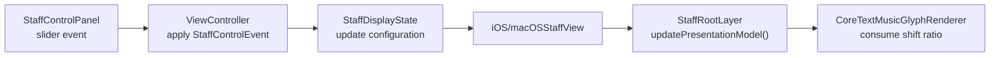

# StaffControlPanel 分阶段计划

## 目标

在不改造现有 `ButtonPanel` 的前提下，新增一个并行的 `StaffControlPanel`，用于调节 `treble clef` 的 `y` 偏移滑动条；保持参数仍落在 `[NoteMaster_Ver_1/Shared/Staff/StaffConfiguration.swift](NoteMaster_Ver_1/Shared/Staff/StaffConfiguration.swift)` 的 `trebleClefAnchorLogicalDownwardShiftRatio` 上，并通过现有 `StaffRootLayer` 重绘链实时生效。

## 关键决策

- 不扩展 `[NoteMaster_Ver_1/Shared/Controls/ButtonPanelModel.swift](NoteMaster_Ver_1/Shared/Controls/ButtonPanelModel.swift)` / `[NoteMaster_Ver_1/Platform/iOS/Controls/iOSButtonPanelView.swift](NoteMaster_Ver_1/Platform/iOS/Controls/iOSButtonPanelView.swift)` / `[NoteMaster_Ver_1/Platform/macOS/Controls/macOSButtonPanelView.swift](NoteMaster_Ver_1/Platform/macOS/Controls/macOSButtonPanelView.swift)`。这套类型当前深度绑定 `FretboardDisplayState + ButtonPanelActionID + 离散按钮`，不适合连续 slider 值。
- 复用同样的架构模式：`StaffDisplayState -> StaffControlPanelSnapshotBuilder -> iOS/macOSStaffControlPanelView -> ViewController -> StaffDisplayState.apply(...)`。
- slider 只改 `StaffConfiguration.trebleClefAnchorLogicalDownwardShiftRatio`；不改 `[NoteMaster_Ver_1/Shared/Staff/StaffRootLayer.swift](NoteMaster_Ver_1/Shared/Staff/StaffRootLayer.swift)` 与 `[NoteMaster_Ver_1/Shared/Staff/CoreTextMusicGlyphRenderer.swift](NoteMaster_Ver_1/Shared/Staff/CoreTextMusicGlyphRenderer.swift)` 的外部接口。
- 默认先做一个 section、一个 slider，范围建议 `-0.25 ... 0.25`，显示格式建议 `+0.11`，拖动时连续更新；如果后续要加第二个 staff 参数，直接沿用同一面板模型继续扩展。

## 阶段 1：共享控制域建模

在 `[NoteMaster_Ver_1/Shared/Controls/](NoteMaster_Ver_1/Shared/Controls/)` 新增一套 Staff 专用控制模型，而不是污染现有 ButtonPanel 类型。

- 新增 `[NoteMaster_Ver_1/Shared/Controls/StaffControlPanelModel.swift](NoteMaster_Ver_1/Shared/Controls/StaffControlPanelModel.swift)`
- 建模内容：`StaffControlEvent`、`StaffControlSectionID`、`StaffSliderControlItem`、`StaffControlSection`、`StaffControlPanelModel`
- 在 `[NoteMaster_Ver_1/Shared/Controls/StaffDisplayState.swift](NoteMaster_Ver_1/Shared/Controls/StaffDisplayState.swift)` 增加 `mutating func apply(_ event: StaffControlEvent)`
- 在共享层完成值约束与归一化，确保平台层只发事件，不自行 clamp

实施要点：

- `setTrebleClefAnchorLogicalDownwardShiftRatio(CGFloat)` 作为首个 event
- 共享层统一 clamp 到约定范围，避免 iOS/macOS 两边重复写限制逻辑
- 为后续更多 staff 参数保留 section/row 扩展位

## 阶段 2：共享快照与显示格式

把 `StaffDisplayState` 投影成平台无关的 slider 展示模型。

- 新增 `[NoteMaster_Ver_1/Shared/Controls/StaffControlPanelSnapshotBuilder.swift](NoteMaster_Ver_1/Shared/Controls/StaffControlPanelSnapshotBuilder.swift)`
- 从 `StaffDisplayState.configuration.trebleClefAnchorLogicalDownwardShiftRatio` 生成 slider 当前值、范围、标题和显示文本
- 共享层统一格式化 `+0.11 / -0.03` 这类值文本，避免平台各自拼字符串

实施要点：

- 先只做一个 section：`Clef`
- 先只做一个 row：`Anchor Y Offset`
- 平台层只消费 `model`，不直接理解 `StaffConfiguration`

## 阶段 3：iOS StaffControlPanelView

新增 iOS 面板视图，视觉风格对齐现有按钮面板，但内部控件改为 slider 行。

- 新增 `[NoteMaster_Ver_1/Platform/iOS/Controls/iOSStaffControlPanelView.swift](NoteMaster_Ver_1/Platform/iOS/Controls/iOSStaffControlPanelView.swift)`
- 结构建议：容器 `UIView` + 纵向 `UIStackView` + 单行 `UILabel(title)` / `UILabel(value)` / `UISlider`
- 对外接口保持和现有按钮面板一致的风格：`var model` + `var onEvent`

实施要点：

- 面板圆角、背景、内边距尽量对齐 `[NoteMaster_Ver_1/Platform/iOS/Controls/iOSButtonPanelView.swift](NoteMaster_Ver_1/Platform/iOS/Controls/iOSButtonPanelView.swift)`
- `UISlider` 使用 `.valueChanged` 连续回调，让 clef 拖动时实时重绘
- 视图本身只同步 model 与转发 event，不直接修改 `StaffDisplayState`

## 阶段 4：macOS StaffControlPanelView

实现与 iOS 对称的 macOS 版本，保证交互与布局一致。

- 新增 `[NoteMaster_Ver_1/Platform/macOS/Controls/macOSStaffControlPanelView.swift](NoteMaster_Ver_1/Platform/macOS/Controls/macOSStaffControlPanelView.swift)`
- 结构建议：`NSView` + `NSStackView` + `NSTextField(labelWithString:)` + `NSSlider`
- 对外接口与 iOS 对齐：`var model` + `var onEvent`

实施要点：

- 复用与 `[NoteMaster_Ver_1/Platform/macOS/Controls/macOSButtonPanelView.swift](NoteMaster_Ver_1/Platform/macOS/Controls/macOSButtonPanelView.swift)` 相同的容器视觉层次
- `NSSlider` 走 `target/action`，在拖动过程中同步配置
- 不引入平台特有业务状态，保持共享层单一事实来源

## 阶段 5：控制器接线与状态生命周期调整

把 slider 事件接进 Staff 状态流，并把新面板插入当前页面布局。

- 修改 `[NoteMaster_Ver_1/Platform/iOS/iOSViewController.swift](NoteMaster_Ver_1/Platform/iOS/iOSViewController.swift)`
- 修改 `[NoteMaster_Ver_1/Platform/macOS/macOSViewController.swift](NoteMaster_Ver_1/Platform/macOS/macOSViewController.swift)`

实施要点：

- 把当前 `private let staffDisplayState` 改成可变状态，并加 `didSet` 或单独的 `applyStaffDisplayState()`
- 新增 `staffControlPanelView`，布局顺序改为：`buttonPanelView -> staffControlPanelView -> staffView -> fretboardView`
- 控制器收到 `StaffControlEvent` 后，只做：复制状态 -> `apply(event)` -> 比较变化 -> 刷新 staff 面板与 staffView
- 拆分当前 `applyDisplayState()`，避免 slider 拖动时无意义刷新 fretboard 面板

## 阶段 6：验证与收口

完成交互验证、静态检查和边界行为确认。

- 验证拖动 slider 时 clef 实时上下移动，红色 bounds / 锚点 overlay 能同步反映变化
- 检查 iOS/macOS 两端 slider 文本显示与范围一致
- 对修改文件运行 `ReadLints`
- 用 `swiftc -parse-as-library -typecheck` 做整仓静态验证

验收标准：

- 不改现有 ButtonPanel 行为
- 不改 `StaffRootLayer` / renderer 的公开职责边界
- slider 改值后，`StaffConfiguration` 成为唯一生效来源
- iOS/macOS 页面结构与交互保持对称

