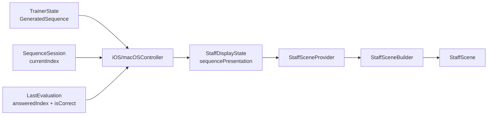

# Staff Sequence Cursor Feedback Plan

当前断点已经很明确：`[StaffDisplayState.swift](NoteMaster_Ver_1/Shared/Controls/StaffDisplayState.swift)` 的 `sceneProvider` 现在只知道 `clef / score / notationDisplayOptions / renderHint`；`[FretboardNaturalNoteTrainer.swift](NoteMaster_Ver_1/Shared/Fretboard/FretboardNaturalNoteTrainer.swift)` 虽然已经有 `QuarterNoteSequenceEvaluation.answeredIndex / nextIndex / isCorrect`；但 `[iOSViewController.swift](NoteMaster_Ver_1/Platform/iOS/iOSViewController.swift)` 和 `[macOSViewController.swift](NoteMaster_Ver_1/Platform/macOS/macOSViewController.swift)` 的 `applyQuarterNoteSequenceProjection(...)` 仍然只是把 `GeneratedNoteSequence` 投给 staff，所以 staff 这条链路里还没有“当前题是谁、上一击对错如何”的语义。

## 默认交互约定

- 红绿作用于“当前目标音对应的整颗记谱对象”，默认包含 `notehead`、显示出来的 `accidental`、`stem`、`ledger line`。
- 错误时游标不前进，当前目标音显示红色。
- 正确时游标立即前进到下一音，刚答中的那个音显示绿色。
- 序列完成后隐藏游标，保留最后一次判题颜色，直到下一次作答、重新生成序列、切模式或重建 session。

## 分阶段计划

1. 阶段 1：补齐 shared 的 staff sequence 展示状态。涉及 `[StaffDisplayState.swift](NoteMaster_Ver_1/Shared/Controls/StaffDisplayState.swift)`，必要时再在 `[StaffScene.swift](NoteMaster_Ver_1/Shared/Staff/StaffScene.swift)` 附近补一个小值类型。这里要引入一个明确的 `sequencePresentation` 语义，至少能表达 `cursorIndex`、`lastEvaluatedIndex`、`lastEvaluationResult`。同时把 `sceneProvider` 扩展成从这份状态统一派生，保留现有 `apply(generatedSequence:)` 作为兼容包装。这个阶段的验收标准是：不碰双端 view，也能在 shared state 层完整表达 `idle / wrong / correct / completed` 四种 staff 显示语义。
2. 阶段 2：把 sequence 展示语义打进 shared scene 构建链路。涉及 `[StaffSceneProvider.swift](NoteMaster_Ver_1/Shared/Staff/StaffSceneProvider.swift)`、`[StaffScene.swift](NoteMaster_Ver_1/Shared/Staff/StaffScene.swift)`、`[StaffSceneBuilder.swift](NoteMaster_Ver_1/Shared/Staff/StaffSceneBuilder.swift)`。这里要让 `StaffSceneProvider` 接受 `sequencePresentation`，然后在 `StaffSceneBuilder` 里按 note 的扁平顺序 `enumerated()` 生成每音样式：默认黑、错误红、正确绿。竖线游标建议进入 `StaffScene`，用新的 `StaffStrokeSemantic` 分支表示，例如 `sequenceCursor`，这样 `StaffGlyphLayer` 仍然只是 scene 消费者，不需要平台特判。这个阶段的验收标准是：同一份 `StaffScene` 就能表达游标和整颗 note 的反馈颜色，而不是在 iOS/macOS 上各算一遍 overlay。
3. 阶段 3：把 controller 现有的 sequence session 和判题结果接到 staff 投影。涉及 `[iOSViewController.swift](NoteMaster_Ver_1/Platform/iOS/iOSViewController.swift)` 和 `[macOSViewController.swift](NoteMaster_Ver_1/Platform/macOS/macOSViewController.swift)`。这里要新增一份平台侧暂存状态，例如 `quarterNoteSequenceLastEvaluation`，因为 `currentIndex` 本身无法表达“刚答错但 index 没动”这种状态。`handleQuarterNoteSequenceHitResult(...)` 在拿到 `QuarterNoteSequenceEvaluation` 后先落这份状态，再调用 `applyQuarterNoteSequenceProjection(...)`；而 `applyQuarterNoteSequenceProjection(...)` 要从“只投 `GeneratedNoteSequence`”升级成“投 `GeneratedNoteSequence + session.currentIndex + lastEvaluation`”。这个阶段的验收标准是：prompt、staff、session 三者始终吃同一条 sequence；错误时 staff 变红且游标不动，正确时上一音变绿且游标前进。
4. 阶段 4：补 shared validation 和回归夹具。涉及 `[StaffValidation.swift](NoteMaster_Ver_1/Shared/Staff/StaffValidation.swift)`，必要时补一点 `[FretboardValidation.swift](NoteMaster_Ver_1/Shared/Fretboard/FretboardValidation.swift)` 的对齐断言。这里建议扩展 `StaffValidationFixture`，让它能带 `sequencePresentation` 和对应期望值，至少覆盖 4 类自动化场景：初始游标、错误作答、正确作答、完成态无游标。除了新增游标和颜色断言，还要继续跑原有的 notehead 数量、X 递增、accidental 计数、ledger line 数量这些不变量，避免新语义把原记谱布局打坏。这个阶段的验收标准是：`StaffValidationRunner` 能自动证明 sequence 语义进入后，staff 的基础布局规则仍然成立。
5. 阶段 5：收口状态重置与兼容边界。涉及 `[iOSViewController.swift](NoteMaster_Ver_1/Platform/iOS/iOSViewController.swift)`、`[macOSViewController.swift](NoteMaster_Ver_1/Platform/macOS/macOSViewController.swift)`、`[StaffDisplayState.swift](NoteMaster_Ver_1/Shared/Controls/StaffDisplayState.swift)`。这里要统一清理几个重置点：重新生成序列、切换 `spec`、切换 `exerciseMode`、离开 `topContent=staff`、sequence 完成后再进入新序列。目标是防止旧的红绿状态泄漏到新题上，也避免双端 controller 出现不对称分支。这个阶段默认不把之前遗留的 `QuarterNoteSequencePrompt` 兼容层彻底清掉，只做必要收口，避免把“旧适配层清理”和“新 staff 语义接入”混成一个大改动。

## 范围边界

- 这份计划只覆盖 `topContent = staff` 且 `exerciseMode = sequence` 的游标与红绿反馈，不扩展到 prompt 组件的红绿态。
- 不新增平台专用 overlay 层，所有视觉语义都继续走 shared staff scene。
- 不改随机序列生成规则，也不改 settings 结构；这次只补显示语义和投影链路。

如果你认可这个拆法，我下一步就按阶段 1 开始。