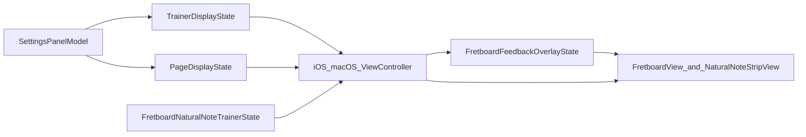

# 方案2分阶段实施计划

## 架构结论

- 保持 `[NoteMaster_Ver_1/Shared/Controls/PageDisplayState.swift](NoteMaster_Ver_1/Shared/Controls/PageDisplayState.swift)` 为页面编排唯一真相，不新增并行的 preset 状态机。
- 在 `[NoteMaster_Ver_1/Shared/Controls/TrainerDisplayState.swift](NoteMaster_Ver_1/Shared/Controls/TrainerDisplayState.swift)` 与 `[NoteMaster_Ver_1/Shared/Fretboard/FretboardNaturalNoteTrainer.swift](NoteMaster_Ver_1/Shared/Fretboard/FretboardNaturalNoteTrainer.swift)` 中新增第三训练模式，单独建 session/evaluation，不复用 `SingleCoverageSession`。
- 保持“共享层只负责题目与判题，时间效果由控制器驱动”的边界：红闪恢复白圈、绿圈停留 1 秒后跳下一题，由 iOS/macOS 控制器调度。
- 继续复用现有关键能力：`[NoteMaster_Ver_1/Shared/Fretboard/FretboardConfiguration.swift](NoteMaster_Ver_1/Shared/Fretboard/FretboardConfiguration.swift)` 的 `pitchClass(for:)` / `cells(for:)`，`[NoteMaster_Ver_1/Platform/iOS/Controls/iOSNaturalNoteStripView.swift](NoteMaster_Ver_1/Platform/iOS/Controls/iOSNaturalNoteStripView.swift)` 与 `[NoteMaster_Ver_1/Platform/macOS/Controls/macOSNaturalNoteStripView.swift](NoteMaster_Ver_1/Platform/macOS/Controls/macOSNaturalNoteStripView.swift)` 的 7 键按钮，`[NoteMaster_Ver_1/Shared/Fretboard/FretboardLayer.swift](NoteMaster_Ver_1/Shared/Fretboard/FretboardLayer.swift)` 的 board/feedback/labels 分层。

## Phase 1：扩展模式与页面状态面

目标：先把“第三训练模式 + 合法页面组合”变成可表达的状态，后续所有投影和 settings 都走统一管线。

- 修改 `[NoteMaster_Ver_1/Shared/Controls/TrainerDisplayState.swift](NoteMaster_Ver_1/Shared/Controls/TrainerDisplayState.swift)`
  - 为 `TrainerExerciseMode` 增加第三个 case，建议命名为 `positionPrompt` 或 `noteNameQuiz`。
  - 增加对应的便捷判断，例如 `isSequenceMode` 保持不变，再补一个 `isPositionPromptMode`。
- 修改 `[NoteMaster_Ver_1/Shared/Controls/PageDisplayState.swift](NoteMaster_Ver_1/Shared/Controls/PageDisplayState.swift)`
  - 扩展顶部/主内容状态以支持“上指板、下按钮”的合法组合。
  - 推荐做法：`PageTopContentMode` 增加 `.fretboard`；`PageMainContentMode` 保留 `.naturalNoteStrip`，由 normalize 约束新模式必须使用该组合。
  - 补一个集中式合法化 helper，避免控制器里散落判断。
- 修改 `[NoteMaster_Ver_1/Shared/Controls/SettingsPanelModel.swift](NoteMaster_Ver_1/Shared/Controls/SettingsPanelModel.swift)`
  - `exerciseMode` 行新增第三个 action。
  - 同步更新 `title`、`accessibilityLabel`、`isSelected`、`apply(to:)`。
  - 保持现有 segmented 风格，文案尽量收短，避免双端布局挤压。
- 修改 `[NoteMaster_Ver_1/Shared/Controls/SettingsPanelStateContext.swift](NoteMaster_Ver_1/Shared/Controls/SettingsPanelStateContext.swift)`
  - 不改结构，但要确保新 mode 与新 page 组合都能被 settings snapshot 完整承载。

交付结果：settings 能表达第三模式；`TrainerDisplayState + PageDisplayState` 能无歧义表示“上指板、下按钮”。

## Phase 2：新增共享训练引擎

目标：把“随机给出一个自然音格位，按钮作答，错不换题、对才换题”沉到共享 trainer，而不是写死在平台控制器里。

- 修改 `[NoteMaster_Ver_1/Shared/Fretboard/FretboardNaturalNoteTrainer.swift](NoteMaster_Ver_1/Shared/Fretboard/FretboardNaturalNoteTrainer.swift)`
  - 为内部 `ExerciseMode` 增加第三个 case，与 `TrainerDisplayState` 一一对应。
  - 新增独立类型：`PositionPromptSession`、`PositionPromptEvaluation`、`PositionPromptAnswerResult`。
  - 新增出题 API：基于当前 `FretboardConfiguration` 从自然音格位中随机选择一个 `FretboardCell`。
  - 新增判题 API：输入 `PitchClass`，输出 `evaluated` 或 `ignored`；错误不推进，正确才生成下一题。
  - 如需避免连续重复题，可在 session 内保留 `previousPromptCell` 或在生成函数里排除当前题。
- 复用 `[NoteMaster_Ver_1/Shared/Fretboard/FretboardConfiguration.swift](NoteMaster_Ver_1/Shared/Fretboard/FretboardConfiguration.swift)`
  - 继续用 `pitchClass(for:)` 进行位置判题。
  - 继续用 `cells(for:)` / 全量枚举做自然音题库筛选，不引入平台特有逻辑。
- 修改 `[NoteMaster_Ver_1/Shared/Fretboard/FretboardValidation.swift](NoteMaster_Ver_1/Shared/Fretboard/FretboardValidation.swift)`
  - 增加共享验证：
  - 只会抽到自然音格位。
  - 错误答案不推进题目。
  - 正确答案推进到下一题。
  - 连续判题时 session/evaluation 计数与期望一致。

交付结果：共享层已经能独立生成题目并判题，平台层只负责投影与时间效果。

## Phase 3：扩展指板反馈状态与渲染

目标：在不污染 single/sequence 语义的前提下，支持白圈目标、红闪错误、绿色正确停留。

- 修改 `[NoteMaster_Ver_1/Shared/Fretboard/FretboardFeedbackOverlayState.swift](NoteMaster_Ver_1/Shared/Fretboard/FretboardFeedbackOverlayState.swift)`
  - 将当前扁平 `correctCells + wrongCell` 扩成更有语义的状态模型。
  - 推荐做法：改为 enum 或分 mode 的嵌套状态，显式区分 `singleCoverage` 与 `positionPrompt`。
  - `positionPrompt` 至少要能表达：`targetCell`、当前相位（`neutralWhite` / `wrongFlash` / `correctHold`）。
- 修改 `[NoteMaster_Ver_1/Shared/Fretboard/FretboardFeedbackLayer.swift](NoteMaster_Ver_1/Shared/Fretboard/FretboardFeedbackLayer.swift)`
  - 保持单一 feedback layer，不新增并行 target layer。
  - 为新模式增加“白底圆圈/白描边圆圈”的绘制分支。
  - 在同一 cell 上支持错误红闪和正确绿停留的覆盖顺序。
- 修改 `[NoteMaster_Ver_1/Shared/Fretboard/FretboardPalette.swift](NoteMaster_Ver_1/Shared/Fretboard/FretboardPalette.swift)`
  - 新增白圈、白底、红闪、绿停留所需颜色常量。
- 保持 `[NoteMaster_Ver_1/Shared/Fretboard/FretboardLayer.swift](NoteMaster_Ver_1/Shared/Fretboard/FretboardLayer.swift)`、`[NoteMaster_Ver_1/Platform/iOS/iOSFretboardView.swift](NoteMaster_Ver_1/Platform/iOS/iOSFretboardView.swift)`、`[NoteMaster_Ver_1/Platform/macOS/macOSFretboardView.swift](NoteMaster_Ver_1/Platform/macOS/macOSFretboardView.swift)` 的对外接口尽量不变
  - 继续只暴露单一 `feedbackOverlayState` 属性，降低控制器改动面。

交付结果：共享渲染层已经支持新模式的视觉语义，且 singleCoverage 旧逻辑可原样映射。

## Phase 4：扩展页面编排与 settings 归一化

目标：让“第三训练模式 == 上指板、下按钮”成为控制器与 settings 的统一不变量。

- 修改 `[NoteMaster_Ver_1/Platform/iOS/iOSViewController.swift](NoteMaster_Ver_1/Platform/iOS/iOSViewController.swift)` 与 `[NoteMaster_Ver_1/Platform/macOS/macOSViewController.swift](NoteMaster_Ver_1/Platform/macOS/macOSViewController.swift)`
  - 扩展 `synchronizeTrainerPresentationState(reason:)`，增加第三模式分支。
  - 扩展 `normalizeSettingsPanelStateContextForTrainerMode(_:)`：第三模式时强制页面切到“top=fretboard, main=naturalNoteStrip”。
  - 保持 sequence 的既有 normalize 语义不变。
- 重新梳理页面槽位辅助判断
  - 不再把“指板可见”写死为 `mainContentMode == .fretboard`。
  - 新增更通用的 helper，例如“当前任一槽位是否显示指板”。
  - 所有 viewport、height constraint、scroll enable 的 guard 都统一切换到这个 helper。
- 处理 settings 面板的组合约束
  - 第三模式下禁止切到与模式冲突的 page 组合，或者允许用户切换但在 normalize 后自动收敛回合法组合。

交付结果：trainer mode、page state、settings normalize 三者形成闭环，不会出现模式与布局互相打架。

## Phase 5：iOS 先打通整条链路

目标：先在 iOS 上完整跑通，降低双端并行调试难度。

- 修改 `[NoteMaster_Ver_1/Platform/iOS/iOSViewController.swift](NoteMaster_Ver_1/Platform/iOS/iOSViewController.swift)`
  - 为第三模式新增控制器状态：`positionPromptSession`、`positionPromptLastEvaluation`、`positionPromptOverlayPhase`、待取消的延时任务/计时器。
  - 新增 `applyPositionPromptProjection(reason:)`、`resetPositionPromptInteractionState()`、`ensurePositionPromptSession()`。
  - 在 `configureLayout()` / `applyTopContentMode()` / `applyMainContentMode()` 中支持“上方指板，下方按钮”的实际约束切换。
  - 关键点：把当前只服务 `mainContent == .fretboard` 的高度约束与 viewport 刷新逻辑，推广到“指板在顶部也能正确刷新”。
- 接线 `[NoteMaster_Ver_1/Platform/iOS/Controls/iOSNaturalNoteStripView.swift](NoteMaster_Ver_1/Platform/iOS/Controls/iOSNaturalNoteStripView.swift)`
  - 为 `onPitchClassTap` 绑定新模式作答入口。
  - 在第三模式里忽略 `fretboardView.onRawEvent` 的判题作用，避免双输入通道混用。
- 时间效果策略
  - 错误：进入 `wrongFlash` 相位，短暂延时后恢复 `neutralWhite`，但 session 不变。
  - 正确：进入 `correctHold` 相位，1 秒后生成下一题并回到 `neutralWhite`。
  - 所有延时任务在 mode 切换、页面切换、重新出题时统一取消。

交付结果：iOS 上可完整演示第三模式，无需点指板，只通过下方按钮作答。

## Phase 6：macOS 对称落地

目标：保持双端结构一致，避免把新模式做成单平台特例。

- 修改 `[NoteMaster_Ver_1/Platform/macOS/macOSViewController.swift](NoteMaster_Ver_1/Platform/macOS/macOSViewController.swift)`
  - 同步 iOS 的新 session 状态、projection 方法、layout 切换、normalize 与延时调度。
  - 处理 macOS `NSScrollView` / 竖向指板宽度刷新在顶部槽位下的行为。
- 复用 `[NoteMaster_Ver_1/Platform/macOS/Controls/macOSNaturalNoteStripView.swift](NoteMaster_Ver_1/Platform/macOS/Controls/macOSNaturalNoteStripView.swift)`
  - 绑定 `onPitchClassTap`。
  - 保持按钮与 iOS 一致的题目推进节奏。

交付结果：macOS 与 iOS 行为一致，页面结构与状态机保持镜像。

## Phase 7：回归验证与收尾

目标：确保新模式接入后，single 与 sequence 不被破坏。

- 共享验证
  - 跑 `[NoteMaster_Ver_1/Shared/Fretboard/FretboardValidation.swift](NoteMaster_Ver_1/Shared/Fretboard/FretboardValidation.swift)` 中新增验证项。
- 双端手动回归
  - `Single -> Sequence -> 新模式 -> Single` 循环切换不残留旧反馈。
  - 第三模式下能稳定看到“上指板、下按钮”。
  - 答错时只红闪并回白，不换题；答对时变绿并在 1 秒后换题。
  - 指板横竖模式、不同乐器配置下仍能正常抽题和显示。
  - `sequenceRegenerateButton` 只在 sequence 可见。
- 代码清理
  - 删除临时 helper，统一新旧模式的命名和日志前缀。
  - 保持 iOS/macOS 两个控制器的方法命名和分段顺序一致，便于后续并行维护。

## 关键文件清单

- 共享训练与题目：`[NoteMaster_Ver_1/Shared/Fretboard/FretboardNaturalNoteTrainer.swift](NoteMaster_Ver_1/Shared/Fretboard/FretboardNaturalNoteTrainer.swift)`
- 共享判题基础：`[NoteMaster_Ver_1/Shared/Fretboard/FretboardConfiguration.swift](NoteMaster_Ver_1/Shared/Fretboard/FretboardConfiguration.swift)`
- 共享反馈状态与渲染：`[NoteMaster_Ver_1/Shared/Fretboard/FretboardFeedbackOverlayState.swift](NoteMaster_Ver_1/Shared/Fretboard/FretboardFeedbackOverlayState.swift)`, `[NoteMaster_Ver_1/Shared/Fretboard/FretboardFeedbackLayer.swift](NoteMaster_Ver_1/Shared/Fretboard/FretboardFeedbackLayer.swift)`, `[NoteMaster_Ver_1/Shared/Fretboard/FretboardPalette.swift](NoteMaster_Ver_1/Shared/Fretboard/FretboardPalette.swift)`
- 页面与设置：`[NoteMaster_Ver_1/Shared/Controls/TrainerDisplayState.swift](NoteMaster_Ver_1/Shared/Controls/TrainerDisplayState.swift)`, `[NoteMaster_Ver_1/Shared/Controls/PageDisplayState.swift](NoteMaster_Ver_1/Shared/Controls/PageDisplayState.swift)`, `[NoteMaster_Ver_1/Shared/Controls/SettingsPanelModel.swift](NoteMaster_Ver_1/Shared/Controls/SettingsPanelModel.swift)`
- 平台接入：`[NoteMaster_Ver_1/Platform/iOS/iOSViewController.swift](NoteMaster_Ver_1/Platform/iOS/iOSViewController.swift)`, `[NoteMaster_Ver_1/Platform/macOS/macOSViewController.swift](NoteMaster_Ver_1/Platform/macOS/macOSViewController.swift)`
- 按钮面板：`[NoteMaster_Ver_1/Platform/iOS/Controls/iOSNaturalNoteStripView.swift](NoteMaster_Ver_1/Platform/iOS/Controls/iOSNaturalNoteStripView.swift)`, `[NoteMaster_Ver_1/Platform/macOS/Controls/macOSNaturalNoteStripView.swift](NoteMaster_Ver_1/Platform/macOS/Controls/macOSNaturalNoteStripView.swift)`

