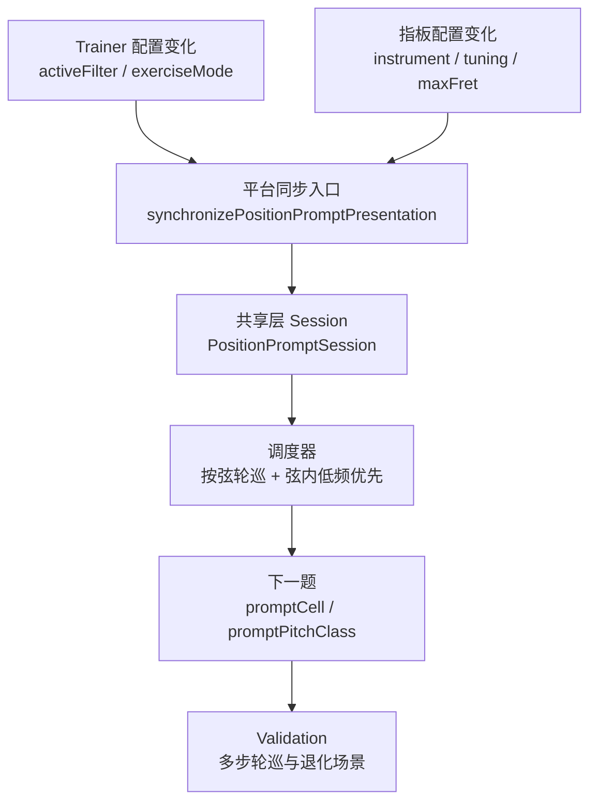

# Position Prompt 轮巡调度改造计划

## 目标

- 把 `position prompt` 的出题逻辑从“合法格子均匀随机”改成“当前过滤结果下，按有候选的弦轮巡；每轮每弦最多一次；同一根弦内优先选择历史出现次数更少的格子；同频次保持随机打散”。
- 保持当前交互语义不变：答错不推进题目，不消耗轮次；切换 `filter`、`instrument`、`tuning`、`maxFret` 后，旧轮次状态失效并重建。
- 改造只落在共享层调度与平台层 session 生命周期，不新增设置项，不做持久化。

## 当前架构挂点

- 共享层核心入口在 [FretboardNaturalNoteTrainer.swift](/Users/shaun/Library/Mobile Documents/com~~apple~~CloudDocs/Develop/NoteMaster_Ver_1/NoteMaster_Ver_1/Shared/Fretboard/FretboardNaturalNoteTrainer.swift)。当前 `makePositionPromptSession(..., excluding:)` 直接对候选数组执行 `resolvedCandidates.randomElement(using: &generator)`，这是本次调度替换的主挂点。
- 平台层 session 生命周期在 [macOSViewController.swift](/Users/shaun/Library/Mobile Documents/com~~apple~~CloudDocs/Develop/NoteMaster_Ver_1/NoteMaster_Ver_1/Platform/macOS/macOSViewController.swift) 和 [iOSViewController.swift](/Users/shaun/Library/Mobile Documents/com~~apple~~CloudDocs/Develop/NoteMaster_Ver_1/NoteMaster_Ver_1/Platform/iOS/iOSViewController.swift)。`ensurePositionPromptSession()` 负责复用/重建 session，`synchronizePositionPromptPresentation(reason:)` 负责 `reason` 分流与 reset 边界。
- 自动校验在 [FretboardValidation.swift](/Users/shaun/Library/Mobile Documents/com~~apple~~CloudDocs/Develop/NoteMaster_Ver_1/NoteMaster_Ver_1/Shared/Fretboard/FretboardValidation.swift)。当前它把 `candidateCells[0]` / `candidateCells[1]` 当作首题/次题，这与新调度策略不兼容，必须同步改写。

## 数据流

## 设计假设

- “一轮”不是硬编码 6 次，而是“当前过滤结果下有候选的弦数”。`guitar6` 常见场景是一轮 6 题，`bass4` / `bass5` 自动退化为 4 / 5 题；如果某些过滤条件让某根弦没有合法格子，该弦不计入本轮。
- “前面没有出现过的，或者出现次数少的，优先选中”解释为：同一根弦内先比较历史命中次数，选择最低次数的格子；若有多个并列最低，再随机打散。
- 调度状态是 session 级临时状态，不进入设置、不跨重启保留。

## 分阶段实施

### 阶段 1：共享层建模与语义收口

- 在 [FretboardNaturalNoteTrainer.swift](/Users/shaun/Library/Mobile Documents/com~~apple~~CloudDocs/Develop/NoteMaster_Ver_1/NoteMaster_Ver_1/Shared/Fretboard/FretboardNaturalNoteTrainer.swift) 的 `PositionPromptSession` 内新增调度状态，建议拆成嵌套的 `SchedulingState`，至少包含：
  - 当前轮剩余待出弦集合，如 `remainingStringsInRound`
  - 弦内格子历史命中计数，如 `cellHitCounts`
  - 当前候选池身份，如 `candidatePoolSignature`
- 把“候选池身份”定义清楚，确保当 `filter`、`instrument`、`tuning`、`stringCount`、`maxFret` 变化时，旧 session 能被判定为失效。
- 明确边界语义：
  - 答错不推进，不更新轮次和计数
  - 当前轮用尽后自动开启下一轮
  - 某根弦仅有 1 个合法格子时允许跨轮重复，但仍遵循先完成全弦轮巡

### 阶段 2：替换选题算法为“弦轮巡 + 弦内低频优先”

- 在 [FretboardNaturalNoteTrainer.swift](/Users/shaun/Library/Mobile Documents/com~~apple~~CloudDocs/Develop/NoteMaster_Ver_1/NoteMaster_Ver_1/Shared/Fretboard/FretboardNaturalNoteTrainer.swift) 中抽出纯选择器，例如 `selectNextPositionPrompt(...)`，输入为 `configuration`、`filter`、当前 `SchedulingState`、可选 `excludedCell`，输出为下一题 cell 与更新后的调度状态。
- 基于现有 `positionPromptCandidateCells(in:filter:)` 继续生成全集，但增加“按弦分组”的中间结构，避免在平台层复制算法。
- 选择规则按顺序实现：
  - 从 `remainingStringsInRound` 中选下一根弦；若为空则用“当前有候选的弦集合”重建新一轮
  - 在该弦候选里按 `cellHitCounts` 选出最低频格子集合
  - 在最低频集合内随机选择；若存在 `excludedCell`，优先排除当前格，但不允许把整个调度做成死路
  - 成功出题后更新该格命中计数与本轮剩余弦集合
- 让 `makePositionPromptSession(...)` 与 `handlePositionPromptAnswer(...)` 都通过同一套选择器推进，避免“首题逻辑”和“下一题逻辑”分叉。

### 阶段 3：平台层 session 生命周期与 reset 规则对齐

- 在 [macOSViewController.swift](/Users/shaun/Library/Mobile Documents/com~~apple~~CloudDocs/Develop/NoteMaster_Ver_1/NoteMaster_Ver_1/Platform/macOS/macOSViewController.swift) 和 [iOSViewController.swift](/Users/shaun/Library/Mobile Documents/com~~apple~~CloudDocs/Develop/NoteMaster_Ver_1/NoteMaster_Ver_1/Platform/iOS/iOSViewController.swift) 中，把“新调度状态是否仍匹配当前 trainer”纳入 `ensurePositionPromptSession()` / `positionPromptSessionMatchesCurrentTrainer(...)` 的判断。
- 收口 reset 边界：
  - `exerciseModeChanged`：沿用现有整段 reset
  - `positionPromptFilterChanged`：无论当前 overlay 是否在反馈期，都让旧调度失效，保证新 filter 从新轮次开始
  - 指板配置变化导致候选池身份变化时：强制重建 position prompt session
- 保持 iOS / macOS 两端逻辑镜像，避免一端保留轮次、一端清空轮次的分叉。

### 阶段 4：重写 validation 语义，去掉“首个候选/第二个候选”假设

- 在 [FretboardValidation.swift](/Users/shaun/Library/Mobile Documents/com~~apple~~CloudDocs/Develop/NoteMaster_Ver_1/NoteMaster_Ver_1/Shared/Fretboard/FretboardValidation.swift) 中，把当前依赖 `candidateCells[0]` / `candidateCells[1]` 的断言改成“基于 session 真值与调度不变量”的断言。
- 校验重点从“固定顺序”切换到“调度语义”：
  - 首题必须合法、自然音、命中过滤器
  - 连续多次答对时，一轮内每根有候选的弦恰好出现一次
  - 同一根弦内先消耗低频格子，再进入高频格子
  - 答错不推进、不改变 session
  - 单候选弦、单候选总池、过滤后只剩部分弦等退化场景不崩溃
- 若需要可引入一个轻量“调度预言机”纯函数，让 validation 与实现共享同一调度真相，而不是再手写一套顺序推断。

### 阶段 5：日志与回归验证

- 保留并增强 [FretboardNaturalNoteTrainer.swift](/Users/shaun/Library/Mobile Documents/com~~apple~~CloudDocs/Develop/NoteMaster_Ver_1/NoteMaster_Ver_1/Shared/Fretboard/FretboardNaturalNoteTrainer.swift) 现有 `PositionPrompt` debug log，增加轮次信息、当前弦、弦内最低频候选数量等字段，便于现场核对。
- 手工回归聚焦现有 `position prompt` 场景：
  - `guitar6` 默认 `C / E / F / B`
  - 极端音名过滤，如仅 `E`、仅 `B`
  - `bass4` / `bass5`
  - 切换 `noteName` / `fret` filter
  - 在 `wrongFlash` / `correctHold` 中切换 filter 或指板配置

## 关键风险

- [FretboardValidation.swift](/Users/shaun/Library/Mobile Documents/com~~apple~~CloudDocs/Develop/NoteMaster_Ver_1/NoteMaster_Ver_1/Shared/Fretboard/FretboardValidation.swift) 当前强依赖确定性 RNG 下的“首题 = 第一候选、次题 = 第二候选”，这是本次改造最大的连带影响点。
- 现有平台层在 `positionPromptFilterChanged` 时只有部分路径会主动 reset；若不统一收口，很容易出现“题面合法但轮次状态沿用旧过滤条件”的隐性 bug。
- `excludedCell` 与“某弦只剩 1 个候选格”之间要提前定义 fallback 规则，否则很容易在严格轮巡下做出无候选死路。

## 验收标准

- 在 `guitar6` 当前默认 `noteName` 过滤下，连续 6 次正确推进后，6 根有候选的弦各出现 1 次。
- 在任意过滤场景下，连续 `N` 次正确推进后，当前有候选的 `N` 根弦各出现 1 次。
- 同一根弦内，历史命中次数更少的格子会先被优先选中；同频次格子保持随机性。
- 答错不会推进题目、不会消耗当前轮次。
- 切换 `filter`、`instrument`、`tuning`、`maxFret` 后，不会残留旧轮次状态，也不会生成非法 prompt。

