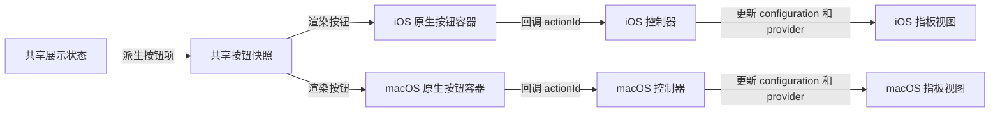

# 原生按钮组件分阶段计划

## 目标

在现有架构里新增一个独立按钮组件，保持当前分层不变：控制器负责组装，平台层负责原生按钮渲染，`Shared` 只负责按钮语义和展示状态。核心原则是两条：一是不把按钮并入现有 `FretboardLayer` 的自绘与 raw 命中链路；二是先建立单一状态源，避免 iOS/macOS 后续各自维护一套按钮状态。

当前最重要的接入点是 [iOSViewController](/Users/shaun/Library/Mobile%20Documents/com~apple~CloudDocs/Develop/NoteMaster_Ver_1/NoteMaster_Ver_1/Platform/iOS/iOSViewController.swift)、[macOSViewController](/Users/shaun/Library/Mobile%20Documents/com~apple~CloudDocs/Develop/NoteMaster_Ver_1/NoteMaster_Ver_1/Platform/macOS/macOSViewController.swift)、[iOSFretboardView](/Users/shaun/Library/Mobile%20Documents/com~apple~CloudDocs/Develop/NoteMaster_Ver_1/NoteMaster_Ver_1/Platform/iOS/iOSFretboardView.swift)、[macOSFretboardView](/Users/shaun/Library/Mobile%20Documents/com~apple~CloudDocs/Develop/NoteMaster_Ver_1/NoteMaster_Ver_1/Platform/macOS/macOSFretboardView.swift)、[FretboardConfiguration](/Users/shaun/Library/Mobile%20Documents/com~apple~CloudDocs/Develop/NoteMaster_Ver_1/NoteMaster_Ver_1/Shared/Fretboard/FretboardConfiguration.swift)、[NoteNameContentProvider](/Users/shaun/Library/Mobile%20Documents/com~apple~CloudDocs/Develop/NoteMaster_Ver_1/NoteMaster_Ver_1/Shared/Fretboard/NoteNameContentProvider.swift)、[FretboardContentProvider](/Users/shaun/Library/Mobile%20Documents/com~apple~CloudDocs/Develop/NoteMaster_Ver_1/NoteMaster_Ver_1/Shared/Fretboard/FretboardContentProvider.swift) 和 [NotePitch](/Users/shaun/Library/Mobile%20Documents/com~apple~CloudDocs/Develop/NoteMaster_Ver_1/NoteMaster_Ver_1/Shared/Fretboard/NotePitch.swift)。

## 数据流

## 阶段 1：收敛单一展示状态

目标：先把“当前页面有哪些可变展示状态”收敛成一份共享真相来源，而不是让按钮直接改视图属性。现有控制器里 `FretboardConfiguration` 和 `NoteNameContentProvider` 还是初始化常量，按钮接入前需要先把它们提升为可演化状态。

涉及文件：优先修改 [iOSViewController](/Users/shaun/Library/Mobile%20Documents/com~apple~CloudDocs/Develop/NoteMaster_Ver_1/NoteMaster_Ver_1/Platform/iOS/iOSViewController.swift) 和 [macOSViewController](/Users/shaun/Library/Mobile%20Documents/com~apple~CloudDocs/Develop/NoteMaster_Ver_1/NoteMaster_Ver_1/Platform/macOS/macOSViewController.swift)，并新增共享文件 `NoteMaster_Ver_1/Shared/Controls/FretboardDisplayState.swift`。

产出：新增 `FretboardDisplayState`，把 `configuration`、`visibility`、`spelling`、`showsOctave` 收到同一个结构里；控制器只持有这一个状态，并通过一个 `applyDisplayState()` 入口把状态投射到平台指板视图上。

默认首批按钮范围：直接绑定项目里已经存在的状态，优先做 `visibility`、`spelling`、`showsOctave`。`instrument/tuning` 放到后续阶段扩展，这样第一轮能在最小风险下跑通组件链路。

验收：任意一次按钮动作都只修改 `FretboardDisplayState`，而不是散落地改多个 UI 属性。

## 阶段 2：建立共享按钮语义模型

目标：把“按钮是什么、当前长什么样、点了发什么 action”从平台实现里抽出来，形成一套共享的语义层，解决根因上的跨平台分叉问题。

涉及文件：新增 `NoteMaster_Ver_1/Shared/Controls/ButtonPanelModel.swift`、`NoteMaster_Ver_1/Shared/Controls/ButtonPanelSnapshotBuilder.swift`，复用 [FretboardContentProvider](/Users/shaun/Library/Mobile%20Documents/com~apple~CloudDocs/Develop/NoteMaster_Ver_1/NoteMaster_Ver_1/Shared/Fretboard/FretboardContentProvider.swift)、[NotePitch](/Users/shaun/Library/Mobile%20Documents/com~apple~CloudDocs/Develop/NoteMaster_Ver_1/NoteMaster_Ver_1/Shared/Fretboard/NotePitch.swift)、[FretboardConfiguration](/Users/shaun/Library/Mobile%20Documents/com~apple~CloudDocs/Develop/NoteMaster_Ver_1/NoteMaster_Ver_1/Shared/Fretboard/FretboardConfiguration.swift) 中已有领域类型。

产出：定义 `ButtonPanelActionID`、`ButtonPanelItem`、`ButtonPanelModel`，再提供一个纯函数或 builder，把 `FretboardDisplayState` 映射成平台无关的按钮快照。这个阶段只输出按钮标题、选中态、可用态、分组信息，不输出任何 `CGRect`、平台字体、颜色或绘制参数。

建议动作集合：`setVisibilityAll`、`setVisibilityNaturalOnly`、`setVisibilityAccidentalOnly`、`setVisibilityNone`、`setSpellingSharp`、`setSpellingFlat`、`toggleShowsOctave`。这些动作都能直接回写到现有共享模型，不需要为第一版新增领域概念。

验收：iOS/macOS 两端都能只依赖 `ButtonPanelModel` 渲染按钮，不自行拼接业务标题和选中规则。

## 阶段 3：实现 iOS 原生按钮容器

目标：在 iOS 侧落一个真正独立的组件，而不是在控制器里散堆按钮代码。组件职责仅限于渲染、布局、点击回调和按钮状态刷新。

涉及文件：新增 `NoteMaster_Ver_1/Platform/iOS/Controls/iOSButtonPanelView.swift`。如有必要，再补一个很薄的 `iOSButtonPanelStyle.swift` 存放平台样式常量。

实现方式：使用 `UIView + UIStackView + UIButton`。按钮容器对外暴露 `model` 和 `onAction`；内部根据 `ButtonPanelModel` 创建或复用按钮，并把 `isSelected`、`isEnabled`、标题同步到 `UIButton`。优先使用系统原生能力处理高亮、禁用、可访问性和触控反馈。

布局建议：第一版做单行横向工具条，放在指板上方，超出宽度时优先压缩文本而不是引入自定义滚动容器；如果动作数增长，再评估分组或换行策略。

验收：iOS 上点击任一按钮都能稳定发出共享 `actionId`，按钮选中态与当前 `model` 一致，不依赖指板的 touch 命中逻辑。

## 阶段 4：实现 macOS 原生按钮容器

目标：保持与 iOS 相同的组件协议，但完全使用 AppKit 原生控件，避免把 UIKit 的交互习惯硬搬到 macOS。

涉及文件：新增 `NoteMaster_Ver_1/Platform/macOS/Controls/macOSButtonPanelView.swift`。如有必要，再补一个 `macOSButtonPanelStyle.swift`。

实现方式：使用 `NSView + NSStackView + NSButton`。对外暴露与 iOS 一致的 `model` 和 `onAction`；内部把共享按钮快照映射成 `NSButton` 的标题、开关态和禁用态。针对 macOS 保留键盘焦点、hover 和按钮样式的原生行为。

对齐要求：公开 API、动作 ID、模型刷新方式与 iOS 保持一致，但内部布局和样式实现不强求逐行镜像；平台特有行为应留在各自容器内部解决。

验收：macOS 与 iOS 使用同一套共享动作模型，点击行为和状态映射一致，平台交互表现保持原生。

## 阶段 5：在控制器层完成装配与状态回写

目标：把按钮组件接到现有页面里，同时保持当前控制器“只做组装和状态编排”的角色，不把业务逻辑回流进平台视图。

涉及文件：修改 [iOSViewController](/Users/shaun/Library/Mobile%20Documents/com~apple~CloudDocs/Develop/NoteMaster_Ver_1/NoteMaster_Ver_1/Platform/iOS/iOSViewController.swift) 和 [macOSViewController](/Users/shaun/Library/Mobile%20Documents/com~apple~CloudDocs/Develop/NoteMaster_Ver_1/NoteMaster_Ver_1/Platform/macOS/macOSViewController.swift)。

实现方式：在控制器里新增 `buttonPanelView`，与 `fretboardView` 并列挂到根视图上；按钮点击后由控制器解释 `actionId`，更新 `FretboardDisplayState`，再统一调用 `applyDisplayState()` 刷新 `fretboardView.configuration` 和 `fretboardView.contentProvider`。这样可以保持 [iOSFretboardView](/Users/shaun/Library/Mobile%20Documents/com~apple~CloudDocs/Develop/NoteMaster_Ver_1/NoteMaster_Ver_1/Platform/iOS/iOSFretboardView.swift) / [macOSFretboardView](/Users/shaun/Library/Mobile%20Documents/com~apple~CloudDocs/Develop/NoteMaster_Ver_1/NoteMaster_Ver_1/Platform/macOS/macOSFretboardView.swift) 继续只承担“显示和事件桥接”职责。

布局建议：根视图采用纵向编排，按钮容器贴安全区顶部或窗口内容区顶部，指板视图位于其下方并保持原有高度约束。不要把按钮加进 `FretboardLayer`，也不要把按钮点击转换成 `FretboardHitResult`。

验收：两端控制器的状态更新链路都收敛成“按钮 action -> displayState -> applyDisplayState -> 指板刷新”，不出现平台分叉的业务逻辑。

## 阶段 6：扩展动作、交互打磨与验证

目标：在第一轮链路稳定后，再扩到更高价值动作，并补齐交互一致性与回归验证，避免一开始把范围铺太大。

优先扩展项：第二批再接 `instrument/tuning` 切换，因为 [InstrumentType](/Users/shaun/Library/Mobile%20Documents/com~apple~CloudDocs/Develop/NoteMaster_Ver_1/NoteMaster_Ver_1/Shared/Fretboard/InstrumentType.swift) 和 [InstrumentTuning](/Users/shaun/Library/Mobile%20Documents/com~apple~CloudDocs/Develop/NoteMaster_Ver_1/NoteMaster_Ver_1/Shared/Fretboard/InstrumentTuning.swift) 已经具备共享基础，但这会牵涉弦数变化、按钮数增长和布局压缩，适合作为第二阶段能力，不建议和第一轮按钮链路同时落地。

验证清单：检查 iOS/macOS 上的按钮标题、选中态、禁用态、点击回调、切换后指板刷新、窗口缩放时布局稳定性，以及 `visibility/spelling/showsOctave` 组合切换后的表现是否一致。最后再对新增/修改文件做 lint 检查，确保没有引入平台侧样式或约束错误。

验收：第一轮组件可稳定承载现有显示配置类动作；第二轮再安全接入乐器/调弦切换，而无需推翻按钮组件边界。

## 关键决策

方案一的根因修复点不是“先画出按钮”，而是“先建立共享语义模型和单一状态源，再由平台原生控件消费这份模型”。这样后续不管增加按钮、改分组还是扩到更多控制项，都不会再次回到把业务规则散落在 `UIViewController` / `NSViewController` 和平台按钮代码里的旧问题。