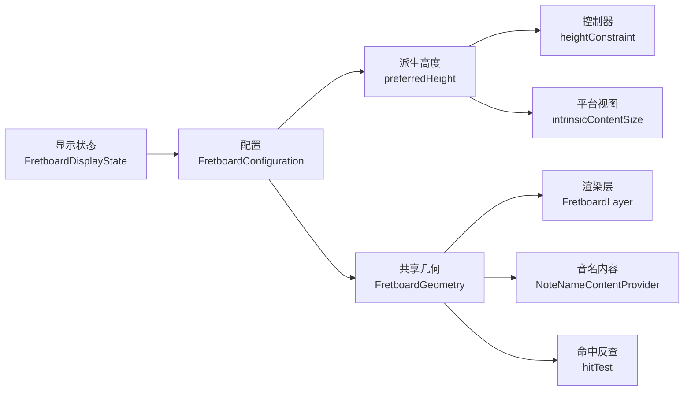

# 固定弦高布局方案

## 目标

- 把当前“总高度固定、弦位在已有高度里均分”的模型，改成“每根弦占固定弦高，弦位处于弦高中心”。
- 让 `preferredHeight` 从 `stringCount` 和固定弦高派生，而不是继续作为独立真相。
- 保持现有平台职责边界不变：控制器和平台视图继续只消费 `configuration.preferredHeight`，不自行计算高度。

## 当前根因

- [FretboardConfiguration.swift](/Users/shaun/Library/Mobile Documents/com~~apple~~CloudDocs/Develop/NoteMaster_Ver_1/NoteMaster_Ver_1/Shared/Fretboard/FretboardConfiguration.swift) 里 `preferredHeight` 是存储值，导致高度独立于弦数。
- [ButtonPanelModel.swift](/Users/shaun/Library/Mobile Documents/com~~apple~~CloudDocs/Develop/NoteMaster_Ver_1/NoteMaster_Ver_1/Shared/Controls/ButtonPanelModel.swift) 切换乐器时只改 `tuning`，不会触碰高度。
- [FretboardGeometry.swift](/Users/shaun/Library/Mobile Documents/com~~apple~~CloudDocs/Develop/NoteMaster_Ver_1/NoteMaster_Ver_1/Shared/Fretboard/FretboardGeometry.swift) 现在用 `makeDistributedPositions` 把弦位在当前总高中均分，所以弦越多越挤。
- [NoteNameContentProvider.swift](/Users/shaun/Library/Mobile Documents/com~~apple~~CloudDocs/Develop/NoteMaster_Ver_1/NoteMaster_Ver_1/Shared/Fretboard/NoteNameContentProvider.swift) 的 badge 尺寸依赖 `geometry.stringSpacing`，因此多弦时圆点也会变小。

## 方案决策

- 以共享配置层为真相：在 [FretboardConfiguration.swift](/Users/shaun/Library/Mobile Documents/com~~apple~~CloudDocs/Develop/NoteMaster_Ver_1/NoteMaster_Ver_1/Shared/Fretboard/FretboardConfiguration.swift) 引入固定弦高（建议命名为 `stringLaneHeight`），并让 `preferredHeight` 变成派生值。
- 保留现有 `verticalInsetRatio` 与 `stringEdgeInsetRatio` 的语义，先不改成固定 pt，避免这一轮把视觉风格也一起推翻。
- 让 [FretboardGeometry.swift](/Users/shaun/Library/Mobile Documents/com~~apple~~CloudDocs/Develop/NoteMaster_Ver_1/NoteMaster_Ver_1/Shared/Fretboard/FretboardGeometry.swift) 改为“lane-centered”排弦，而不是“首尾均分”排弦。
- 平台层继续用 `configuration.preferredHeight` 更新 `intrinsicContentSize` 和高度约束，因此 [iOSFretboardView.swift](/Users/shaun/Library/Mobile Documents/com~~apple~~CloudDocs/Develop/NoteMaster_Ver_1/NoteMaster_Ver_1/Platform/iOS/iOSFretboardView.swift)、[macOSFretboardView.swift](/Users/shaun/Library/Mobile Documents/com~~apple~~CloudDocs/Develop/NoteMaster_Ver_1/NoteMaster_Ver_1/Platform/macOS/macOSFretboardView.swift)、[iOSViewController.swift](/Users/shaun/Library/Mobile Documents/com~~apple~~CloudDocs/Develop/NoteMaster_Ver_1/NoteMaster_Ver_1/Platform/iOS/iOSViewController.swift)、[macOSViewController.swift](/Users/shaun/Library/Mobile Documents/com~~apple~~CloudDocs/Develop/NoteMaster_Ver_1/NoteMaster_Ver_1/Platform/macOS/macOSViewController.swift) 只需要跟着消费新语义，不单独持有公式。

## 数据流

## 分阶段实施

### 阶段 1：重定义配置层的垂直真相

- 在 [FretboardConfiguration.swift](/Users/shaun/Library/Mobile Documents/com~~apple~~CloudDocs/Develop/NoteMaster_Ver_1/NoteMaster_Ver_1/Shared/Fretboard/FretboardConfiguration.swift) 的 `LayoutMetrics` 中新增固定弦高字段，例如 `stringLaneHeight`。
- 把 `preferredHeight` 改成派生值，不再作为独立真相存储；公式以现有 ratio inset 为基础推导总高。
- 公式建议固定为：
  - `stringBandHeight = CGFloat(stringCount) * stringLaneHeight`
  - `drawingHeight = stringBandHeight / (1 - 2 * stringEdgeInsetRatio)`
  - `preferredHeight = drawingHeight / (1 - 2 * verticalInsetRatio)`
- 在这一层统一处理 ratio 的安全边界，避免出现 `>= 0.5` 时公式失效。
- 更新 [FretboardDisplayState.swift](/Users/shaun/Library/Mobile Documents/com~~apple~~CloudDocs/Develop/NoteMaster_Ver_1/NoteMaster_Ver_1/Shared/Controls/FretboardDisplayState.swift) 的默认配置，去掉硬编码的 `preferredHeight: 180` 依赖，改为依赖新的默认弦高。

### 阶段 2：把几何层改成 lane-centered 排弦

- 在 [FretboardGeometry.swift](/Users/shaun/Library/Mobile Documents/com~~apple~~CloudDocs/Develop/NoteMaster_Ver_1/NoteMaster_Ver_1/Shared/Fretboard/FretboardGeometry.swift) 里把 `stringYPositions` 从 `makeDistributedPositions` 改为按固定 lane height 计算：
  - 每根弦中心 = `stringBandRect.minY + stringLaneHeight * (index + 0.5)`。
- 让 `stringSpacing` 与 `stringLaneHeight` 语义一致，不再由首尾均分反推。
- 保持 `hitTest`、`nearestStringMatch` 继续复用同一套 `stringYPositions`，确保 raw 事件命中逻辑自动跟上新的垂直模型。

### 阶段 3：收紧受弦距影响的渲染依赖

- 在 [FretboardGeometry.swift](/Users/shaun/Library/Mobile Documents/com~~apple~~CloudDocs/Develop/NoteMaster_Ver_1/NoteMaster_Ver_1/Shared/Fretboard/FretboardGeometry.swift) 检查并调整 `markerDiameter`、`markerDoubleDotOffset`、`markerCenters(for:)`：
  - 让 vertical reference 与新弦列模型一致。
  - 优先考虑把 marker 垂直中心从 `drawingRect.midY` 调整为弦列几何中心，避免弦列和品记视觉中心分离。
- 在 [NoteNameContentProvider.swift](/Users/shaun/Library/Mobile Documents/com~~apple~~CloudDocs/Develop/NoteMaster_Ver_1/NoteMaster_Ver_1/Shared/Fretboard/NoteNameContentProvider.swift) 复核 `resolvedBadgeDiameter`，确认它在新 `stringSpacing` 语义下自然得到稳定 badge 尺寸，不需要再额外引入第二套高度常量。

### 阶段 4：让现有状态传播链自动吃到派生高度

- [ButtonPanelModel.swift](/Users/shaun/Library/Mobile Documents/com~~apple~~CloudDocs/Develop/NoteMaster_Ver_1/NoteMaster_Ver_1/Shared/Controls/ButtonPanelModel.swift) 继续只改 `tuning`，不新增“改高度”逻辑；高度变化由 `configuration.preferredHeight` 自动派生。
- [iOSViewController.swift](/Users/shaun/Library/Mobile Documents/com~~apple~~CloudDocs/Develop/NoteMaster_Ver_1/NoteMaster_Ver_1/Platform/iOS/iOSViewController.swift) 和 [macOSViewController.swift](/Users/shaun/Library/Mobile Documents/com~~apple~~CloudDocs/Develop/NoteMaster_Ver_1/NoteMaster_Ver_1/Platform/macOS/macOSViewController.swift) 继续用 `displayState.configuration.preferredHeight` 更新 `fretboardHeightConstraint`，但要验证切换 4/5/6 弦后约束常量会自动变化。
- [iOSFretboardView.swift](/Users/shaun/Library/Mobile Documents/com~~apple~~CloudDocs/Develop/NoteMaster_Ver_1/NoteMaster_Ver_1/Platform/iOS/iOSFretboardView.swift) 和 [macOSFretboardView.swift](/Users/shaun/Library/Mobile Documents/com~~apple~~CloudDocs/Develop/NoteMaster_Ver_1/NoteMaster_Ver_1/Platform/macOS/macOSFretboardView.swift) 继续通过 `intrinsicContentSize.height = configuration.preferredHeight` 消费结果，不新增平台公式。

### 阶段 5：验证与收口

- 静态检查：覆盖 [FretboardConfiguration.swift](/Users/shaun/Library/Mobile Documents/com~~apple~~CloudDocs/Develop/NoteMaster_Ver_1/NoteMaster_Ver_1/Shared/Fretboard/FretboardConfiguration.swift)、[FretboardGeometry.swift](/Users/shaun/Library/Mobile Documents/com~~apple~~CloudDocs/Develop/NoteMaster_Ver_1/NoteMaster_Ver_1/Shared/Fretboard/FretboardGeometry.swift)、[NoteNameContentProvider.swift](/Users/shaun/Library/Mobile Documents/com~~apple~~CloudDocs/Develop/NoteMaster_Ver_1/NoteMaster_Ver_1/Shared/Fretboard/NoteNameContentProvider.swift)、双平台 view 与双平台 controller。
- 行为验证重点覆盖：
  - `guitar6 / bass4 / bass5` 切换时总高是否随弦数变化。
  - 相邻弦中心距是否保持稳定。
  - 音名圆点尺寸是否随多弦场景保持可读。
  - raw 命中日志是否仍返回正确 `stringIndex` / `fret`。
- 如果验证发现弦数少时品记或圆角观感失衡，再单独微调 marker 比例和圆角；这一步只做视觉校准，不改回高度真相。

## 预期结果

- 4 弦、5 弦、6 弦切换时，指板高度会跟随弦数自然变化，不再把多弦场景压缩在同一固定总高里。
- 每根弦都有固定弦高，弦位于各自弦高的中线，垂直节奏稳定。
- 高度公式只存在于共享配置/几何链路中，不会泄漏到控制器或平台视图。
- 音名 badge、命中反查、控制台日志链路会自动跟着新的弦列布局工作。

