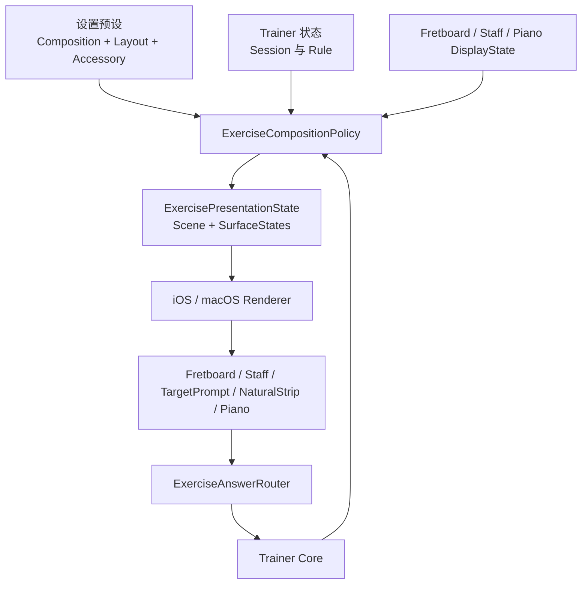

# 练习场景树迁移计划

## 现状锚点

- `[NoteMaster_Ver_1/Shared/Controls/PageDisplayState.swift](NoteMaster_Ver_1/Shared/Controls/PageDisplayState.swift)` 仍以 `topContentMode` / `mainContentMode` 作为页面编排唯一真相；这个模型只能表达双槽位，无法直接承载“单 `fretboard` 同时出题答题”或三段式/浮层式/可折叠辅助区。
- `[NoteMaster_Ver_1/Platform/iOS/iOSViewController.swift](NoteMaster_Ver_1/Platform/iOS/iOSViewController.swift)` 与 `[NoteMaster_Ver_1/Platform/macOS/macOSViewController.swift](NoteMaster_Ver_1/Platform/macOS/macOSViewController.swift)` 通过 `applyFretboardHostPlacement()`、`applyTopContentMode()`、`applyMainContentMode()` 把同一个 `fretboardHostView` 在 `topContentHostView` / `mainContentHostView` 间搬移，说明当前“角色”和“位置”已经硬耦合在平台控制器中。
- `[NoteMaster_Ver_1/Shared/Controls/SettingsPanelModel.swift](NoteMaster_Ver_1/Shared/Controls/SettingsPanelModel.swift)`、`[NoteMaster_Ver_1/Shared/Controls/SettingsPanelSnapshotBuilder.swift](NoteMaster_Ver_1/Shared/Controls/SettingsPanelSnapshotBuilder.swift)`、`[NoteMaster_Ver_1/Shared/Controls/SettingsNavigationSnapshotBuilder.swift](NoteMaster_Ver_1/Shared/Controls/SettingsNavigationSnapshotBuilder.swift)` 仍围绕 `Page` / `Top Content` / `Main Content` 建模；`[NoteMaster_Ver_1/Shared/Controls/SettingsPanelStateContext.swift](NoteMaster_Ver_1/Shared/Controls/SettingsPanelStateContext.swift)` 也直接持有 `pageDisplayState`。
- `positionPrompt` 的题目提示已经能投影到 `fretboard` overlay，但答题入口仍在控制器里被硬路由到 `naturalNoteStripView`；这意味着“单 `fretboard` 自答”不需要重写整个 trainer，只需要先把 scene、renderer、answer router 拆开。

## 目标架构

## 阶段 0：冻结迁移基线

- 目标：先把当前可见行为冻结下来，避免后续把“旧逻辑偶然行为”误当成新架构的一部分。
- 主要改动文件：`[NoteMaster_Ver_1/Shared/Controls/SettingsNavigationValidation.swift](NoteMaster_Ver_1/Shared/Controls/SettingsNavigationValidation.swift)`、`[NoteMaster_Ver_1/Shared/Fretboard/FretboardValidation.swift](NoteMaster_Ver_1/Shared/Fretboard/FretboardValidation.swift)`、`[NoteMaster_Ver_1/Shared/Piano/PianoValidation.swift](NoteMaster_Ver_1/Shared/Piano/PianoValidation.swift)`，新增一个 shared 验证文件，例如 [NoteMaster_Ver_1/Shared/Exercise/ExerciseCompositionValidation.swift](NoteMaster_Ver_1/Shared/Exercise/ExerciseCompositionValidation.swift)。
- 需要冻结的组合：默认 `staff -> fretboard` 上下布局、sequence `staff -> fretboard`、position prompt `fretboard -> naturalNoteStrip`、settings 打开/关闭时的状态同步、`pianoVisible` 和竖版 viewport 的现有行为。
- 完成条件：在不改渲染实现的前提下，有一组 shared validation 能明确告诉我们“哪些行为必须保留，哪些行为允许在 cutover 时替换”。

## 阶段 1：建立 shared 场景树契约

- 目标：先在 shared 层建立方案 3 的核心语义，但暂时不切换平台渲染。
- 新增文件： [NoteMaster_Ver_1/Shared/Exercise/ExerciseLayoutPreferences.swift](NoteMaster_Ver_1/Shared/Exercise/ExerciseLayoutPreferences.swift)、[NoteMaster_Ver_1/Shared/Exercise/ExerciseScene.swift](NoteMaster_Ver_1/Shared/Exercise/ExerciseScene.swift)、[NoteMaster_Ver_1/Shared/Exercise/ExercisePresentationState.swift](NoteMaster_Ver_1/Shared/Exercise/ExercisePresentationState.swift)、[NoteMaster_Ver_1/Shared/Exercise/ExerciseAnswerEvent.swift](NoteMaster_Ver_1/Shared/Exercise/ExerciseAnswerEvent.swift)。
- 核心类型：`ExerciseCompositionPreset`、`ExerciseLayoutPreset`、`ExerciseAccessoryPresentation`、`ExerciseRole`、`ExerciseSurfaceID`、`ExerciseSurfaceKind`、`ExerciseSceneNode`、`ExerciseSurfaceState`、`ExercisePresentationState`。
- 现有文件调整：`[NoteMaster_Ver_1/Shared/Controls/SettingsPanelStateContext.swift](NoteMaster_Ver_1/Shared/Controls/SettingsPanelStateContext.swift)` 先并存 `exerciseLayoutPreferences` 与 `pageDisplayState`；`[NoteMaster_Ver_1/Shared/Controls/TrainerDisplayState.swift](NoteMaster_Ver_1/Shared/Controls/TrainerDisplayState.swift)` 增加 `PositionPromptAnswerRule` 的 shared 定义，但首版只落地 `samePitchClass`。
- 完成条件：shared 层已经能无平台依赖地表达三类基础场景：`上下`、`左右`、`单 surface`，且一个 surface 可以同时持有 `.prompt` 与 `.answer`。

## 阶段 2：设置项并行迁移到“预设模型”

- 目标：把用户设置从“坑位里放什么”迁到“组合预设 + 布局预设 + 辅助区策略”，但短期仍可映射回旧 `PageDisplayState`。
- 主要改动文件：`[NoteMaster_Ver_1/Shared/Controls/SettingsPanelModel.swift](NoteMaster_Ver_1/Shared/Controls/SettingsPanelModel.swift)`、`[NoteMaster_Ver_1/Shared/Controls/SettingsPanelSnapshotBuilder.swift](NoteMaster_Ver_1/Shared/Controls/SettingsPanelSnapshotBuilder.swift)`、`[NoteMaster_Ver_1/Shared/Controls/SettingsNavigationSnapshotBuilder.swift](NoteMaster_Ver_1/Shared/Controls/SettingsNavigationSnapshotBuilder.swift)`、`[NoteMaster_Ver_1/Shared/Controls/SettingsNavigationModel.swift](NoteMaster_Ver_1/Shared/Controls/SettingsNavigationModel.swift)`、`[NoteMaster_Ver_1/Shared/Controls/SettingsPanelStateContext.swift](NoteMaster_Ver_1/Shared/Controls/SettingsPanelStateContext.swift)`。
- 废弃的用户设置：`SettingsSectionID.page`、`SettingsChoiceRowID.topContent`、`SettingsChoiceRowID.mainContent`、`SettingsActionID.setTopContent...`、`SettingsActionID.setMainContent...`。
- 新增的用户设置：`Composition Preset`、`Layout Preset`、`Accessory Presentation`、`Natural Strip Visible`、`Piano Accessory Visible`、`Accessory Expanded`；把 `pianoVisible` 从 `Piano` 迁到 `Accessories`；把 `verticalHostHeightRatio` 从“页面 Layout”迁到 `Fretboard Vertical Viewport Height`。
- 兼容策略：新增一个 bridge 文件，例如 [NoteMaster_Ver_1/Shared/Exercise/LegacyPageLayoutAdapter.swift](NoteMaster_Ver_1/Shared/Exercise/LegacyPageLayoutAdapter.swift)，把新的预设组合先投影回旧 `PageDisplayState`，保证 settings 可先上线而不必同步完成 renderer 抽离。
- 完成条件：用户界面里不再出现 `Top Content` / `Main Content`，但现有画面仍能正常工作。

## 阶段 3：抽取 composition policy 与 validator

- 目标：把“trainer 模式决定布局”“settings 决定布局”“旧 page 归一化规则”全部收口到 shared policy。
- 新增文件： [NoteMaster_Ver_1/Shared/Exercise/ExerciseCompositionPolicy.swift](NoteMaster_Ver_1/Shared/Exercise/ExerciseCompositionPolicy.swift)、[NoteMaster_Ver_1/Shared/Exercise/ExerciseSceneValidator.swift](NoteMaster_Ver_1/Shared/Exercise/ExerciseSceneValidator.swift)。
- 输入：`TrainerDisplayState`、`FretboardNaturalNoteTrainerState`、`FretboardDisplayState`、`StaffDisplayState`、`PianoPanelState`、`ExerciseLayoutPreferences`。
- 输出：`ExercisePresentationState`，至少包含 `ExerciseScene` 与每个 surface 的 prompt/answer/visibility/interaction state。
- 要迁出的旧逻辑：`[NoteMaster_Ver_1/Platform/iOS/iOSViewController.swift](NoteMaster_Ver_1/Platform/iOS/iOSViewController.swift)` / `[NoteMaster_Ver_1/Platform/macOS/macOSViewController.swift](NoteMaster_Ver_1/Platform/macOS/macOSViewController.swift)` 里的 `normalizeSettingsPanelStateContextForTrainerMode()`、`synchronizeTrainerPresentationState()` 及三个 `synchronize*Presentation()` 中和“页面编排”直接相关的判断；`[NoteMaster_Ver_1/Shared/Controls/PageDisplayState.swift](NoteMaster_Ver_1/Shared/Controls/PageDisplayState.swift)` 里的 `normalizeFretboardPlacement` 规则也要迁为 `ExerciseSceneValidator` 里的约束。
- 首批支持的组合：`targetPrompt -> fretboard`、`staff -> fretboard`、`fretboard -> naturalNoteStrip`、`single fretboard self-answer`；首批布局：`stacked`、`sideBySide`、`singleSurface`。`threePane` / `overlay` / `collapsibleAccessory` 的 node 结构在本阶段先预留，但不立即上线。
- 完成条件：shared 层已经有单一真相决定“谁出题、谁答题、怎么摆”，控制器不再决定页面语义，只消费 policy 输出。

## 阶段 4：抽离平台 renderer，复用现有 surface 实例

- 目标：让 iOS/macOS 控制器从“自己决定布局”变成“把 `ExerciseScene` 渲染出来”。
- 新增文件： [NoteMaster_Ver_1/Platform/iOS/Exercise/iOSExerciseSceneRenderer.swift](NoteMaster_Ver_1/Platform/iOS/Exercise/iOSExerciseSceneRenderer.swift)、[NoteMaster_Ver_1/Platform/macOS/Exercise/macOSExerciseSceneRenderer.swift](NoteMaster_Ver_1/Platform/macOS/Exercise/macOSExerciseSceneRenderer.swift)，必要时加一个 shared surface registry 协议文件，例如 [NoteMaster_Ver_1/Shared/Exercise/ExerciseSurfaceRegistry.swift](NoteMaster_Ver_1/Shared/Exercise/ExerciseSurfaceRegistry.swift)。
- 复用的现有 view：`fretboardView`、`staffView`、`targetNotePromptView`、`naturalNoteStripView`、`pianoKeyboardView`；不新增第二份 `fretboard` 真实实例，只改变它在树中的角色与宿主位置。
- 要从控制器迁出的函数：`applyPageDisplayState()`、`applyFretboardHostPlacement()`、`applyTopContentMode()`、`applyMainContentMode()`；`rebuildVerticalFretboardHostHeightConstraint()`、`updateFretboardLayoutModeConstraints()`、`syncVerticalFretboardContentWidthConstraint()` / macOS 对应函数保留为 renderer 的几何实现细节。
- 控制器新职责：持有 current `ExercisePresentationState`，在状态变更后调用 renderer；继续保留平台手势/scroll/view lifecycle。
- 完成条件：同一个 `ExerciseScene` 能在 iOS/macOS 上渲染出一致的“上下”“左右”“单区域”结构，且不再依赖 `topContentHostView` / `mainContentHostView` 作为业务语义。

## 阶段 5：统一 answer router，打通单 `fretboard` 自答

- 目标：把当前“哪个 view 才能答题”的硬编码，改成统一事件路由。
- 新增文件： [NoteMaster_Ver_1/Shared/Exercise/ExerciseAnswerRouter.swift](NoteMaster_Ver_1/Shared/Exercise/ExerciseAnswerRouter.swift) 或平台协调器文件 [NoteMaster_Ver_1/Platform/iOS/Exercise/iOSExerciseAnswerRouter.swift](NoteMaster_Ver_1/Platform/iOS/Exercise/iOSExerciseAnswerRouter.swift)、[NoteMaster_Ver_1/Platform/macOS/Exercise/macOSExerciseAnswerRouter.swift](NoteMaster_Ver_1/Platform/macOS/Exercise/macOSExerciseAnswerRouter.swift)。
- 主要改动文件：`[NoteMaster_Ver_1/Platform/iOS/iOSViewController.swift](NoteMaster_Ver_1/Platform/iOS/iOSViewController.swift)`、`[NoteMaster_Ver_1/Platform/macOS/macOSViewController.swift](NoteMaster_Ver_1/Platform/macOS/macOSViewController.swift)`、`[NoteMaster_Ver_1/Shared/Fretboard/FretboardNaturalNoteTrainer.swift](NoteMaster_Ver_1/Shared/Fretboard/FretboardNaturalNoteTrainer.swift)`。
- 首批路由事件：`pitchClass`、`fretboardCell`。在“单 `fretboard` 自答”首版里，先把 `FretboardCell` 解析成 `PitchClass`，继续复用现有 `handlePositionPromptAnswer(_ pitchClass: ...)`；但事件模型必须保留 `cell`，为后续“必须换弦/不能点提示位”留下升级口。
- 要删除的硬编码：`positionPrompt` 模式下 `handleFretboardTrainerHitResult()` 直接 `return` 的分支；把 `naturalNoteStripView` 从“唯一答题入口”降级为“一个可选 answer surface”。
- 完成条件：`上下`、`左右`、`单 fretboard` 三种场景共享同一套出题/答题时序：surface 发事件 -> answer router -> trainer -> policy -> renderer。

## 阶段 6：正式切走旧 `PageDisplayState` 链路

- 目标：把 `PageDisplayState` 从“业务驱动主路径”降级为兼容桥，最后彻底删除。
- 主要改动文件：`[NoteMaster_Ver_1/Shared/Controls/PageDisplayState.swift](NoteMaster_Ver_1/Shared/Controls/PageDisplayState.swift)`、`[NoteMaster_Ver_1/Shared/Controls/SettingsPanelStateContext.swift](NoteMaster_Ver_1/Shared/Controls/SettingsPanelStateContext.swift)`、`[NoteMaster_Ver_1/Shared/Controls/SettingsPanelModel.swift](NoteMaster_Ver_1/Shared/Controls/SettingsPanelModel.swift)`、`[NoteMaster_Ver_1/Platform/iOS/iOSViewController.swift](NoteMaster_Ver_1/Platform/iOS/iOSViewController.swift)`、`[NoteMaster_Ver_1/Platform/macOS/macOSViewController.swift](NoteMaster_Ver_1/Platform/macOS/macOSViewController.swift)`。
- 切换方式：先让 controllers 以 `exercisePresentationState` / `exerciseLayoutPreferences` 为第一真相；`synchronize*Presentation()` 只更新 trainer/session 与 recomposition，不再直接写 `pageDisplayState`；等 validation 通过后，再删除 settings 和 controller 里的全部 `top/main` 相关符号。
- 清理范围：删除旧 `Page` section、旧 action、旧 snapshot 分支、旧 `apply(to: PageDisplayState)`、旧 `normalizeFretboardPlacement` 调用路径。
- 完成条件：仓库里不再有任何用户可见设置或核心业务逻辑依赖 `topContentMode` / `mainContentMode`。

## 阶段 7：开启高级布局与辅助区

- 目标：在核心链路稳定后，再打开方案 3 真正的扩展能力，避免一次性把复杂度堆到首版 cutover。
- 主要改动文件：`[NoteMaster_Ver_1/Shared/Exercise/ExerciseCompositionPolicy.swift](NoteMaster_Ver_1/Shared/Exercise/ExerciseCompositionPolicy.swift)`、`[NoteMaster_Ver_1/Platform/iOS/Exercise/iOSExerciseSceneRenderer.swift](NoteMaster_Ver_1/Platform/iOS/Exercise/iOSExerciseSceneRenderer.swift)`、`[NoteMaster_Ver_1/Platform/macOS/Exercise/macOSExerciseSceneRenderer.swift](NoteMaster_Ver_1/Platform/macOS/Exercise/macOSExerciseSceneRenderer.swift)`、`[NoteMaster_Ver_1/Shared/Fretboard/FretboardNaturalNoteTrainer.swift](NoteMaster_Ver_1/Shared/Fretboard/FretboardNaturalNoteTrainer.swift)`。
- 打开的能力：`threePane`、`overlay`、`collapsibleAccessory`；把钢琴和 `naturalNoteStrip` 正式作为 accessory scene node 参与编排，而不是由控制器在页面底部额外挂一段。
- 进阶答题规则：只有当要暴露 `samePitchClass` 以外的 rule 时，再把 `positionPrompt` 从 `PitchClass` 判题升级为 cell-aware 判题，避免在 scene cutover 阶段把 domain 改动和布局改动搅在一起。
- 完成条件：新增布局不再需要给控制器加新的 `if exerciseMode == ...` 分支，只扩展 policy 与 renderer 节点处理。

## 关键迁移原则

- 先并存，后切换：`ExerciseLayoutPreferences` / `ExercisePresentationState` 与 `PageDisplayState` 至少并存 2 个阶段，避免 settings、renderer、trainer 一次性联动大爆炸。
- 用户只配预设，不直接配树：settings 暴露 `Composition Preset`、`Layout Preset`、`Accessory Strategy`，不暴露自由拼装的 scene 编辑器。
- 共享层只做语义，不碰 UIKit/AppKit：scene、policy、validator、answer event 都放 shared；平台层只负责 renderer 和具体 view 约束。
- 单实例多角色，不做重复 view：一个 `fretboard` 逻辑 surface 可以同时承担 `.prompt` 与 `.answer`，但平台层仍复用同一个 `fretboardView` 实例，不引入双实例同步成本。

## 验证与验收

- Shared validation：覆盖 composition preset × layout preset × trainer mode 的兼容矩阵，确保 policy 输出合法 scene。
- Settings validation：确保路由树在 `Exercise` / `Position Prompt` / `Accessories` 新分组下仍能通过 `reconciledPath` 正常收敛。
- 平台回归：iOS 与 macOS 都要手工回归默认模式、sequence、position prompt、左右布局、单 `fretboard` 自答、settings 打开关闭、竖版 viewport、piano accessory。
- Cutover 验收标准：删除 `top/main` 设置后，现有三种主训练流程在新 scene 栈上都可工作；新增一个布局不再要求向两个控制器复制新的宿主区逻辑。

