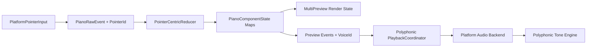

# 方案三分阶段计划

## 目标与现状

当前链路在四层都还是单值模型：

- 状态层只有一个 `preview` 和一个 `activeInteraction`，见 [PianoState.swift](NoteMaster_Ver_1/Shared/Piano/PianoState.swift) 与 [PianoInteraction.swift](NoteMaster_Ver_1/Shared/Piano/PianoInteraction.swift)。
- reducer 只围绕单个活动交互分支，见 [PianoInteractionReducer.swift](NoteMaster_Ver_1/Shared/Piano/PianoInteractionReducer.swift)。
- 渲染层每行只支持一个 `previewedNote`，见 [PianoKeyboardLayer.swift](NoteMaster_Ver_1/Shared/Piano/PianoKeyboardLayer.swift) 与 [PianoRowLayer.swift](NoteMaster_Ver_1/Shared/Piano/PianoRowLayer.swift)。
- 播放层只有一个 `currentPreview` 与单 voice 协议，见 [PlaybackCoordinator.swift](NoteMaster_Ver_1/Shared/Playback/PlaybackCoordinator.swift) 与 [AVFoundationTonePlaybackEngine.swift](NoteMaster_Ver_1/Shared/Playback/AVFoundationTonePlaybackEngine.swift)。

本计划按你确认的边界执行：iOS / macOS 都纳入完整多 pointer 输入源升级，而不是只让 iOS 先行。

## Phase 1：冻结共享身份与契约

目标：先把“谁在按、谁在发声、谁在结束”定义清楚，避免后续每层各自发明 id。

关键文件：

- [PianoInteraction.swift](NoteMaster_Ver_1/Shared/Piano/PianoInteraction.swift)
- [PianoState.swift](NoteMaster_Ver_1/Shared/Piano/PianoState.swift)
- [PlaybackCoordinator.swift](NoteMaster_Ver_1/Shared/Playback/PlaybackCoordinator.swift)

动作：

- 为共享输入链引入稳定的 `PointerId` / `PreviewId` / `VoiceId` 概念，至少保证 `previewStarted` 与 `previewEnded` 能唯一对上同一条活动声部。
- 扩展 `PianoRawEvent`，让 raw 层不再只有 `phase + locationInView`，而是携带 pointer 身份。
- 把 `PianoPreviewState` 升级为带身份的活动 preview 载体，或者新增专门的 `ActivePreview` / `PreviewDescriptor` 类型。
- 定义 `Playback` 层与 `Piano` 层之间的 identity 对齐规则：推荐直接让 playback voice 复用 preview/voice id，而不是再次生成一套无关 id。
- 冻结“单操作与多操作”的边界：button/scale 是否继续单 owner，keys 是否允许多 pointer 并发。建议保留 `buttonPressed` / `scaleDrag` 为单 owner，把多并发首先限定在 `keys` preview 上，降低整体爆炸半径。

验收闸门：

- 共享类型层不再依赖单个 `preview` / 单个 `currentPreview` 才能表达活动声部。
- identity 规则能覆盖：同音重复按下、跨行同音、延迟 ended、复数活动音同时存在。

## Phase 2：重构 Shared/Piano 状态机

目标：把当前“全局唯一 activeInteraction”的 reducer 改成 pointer-centric，多路输入互不覆盖。

关键文件：

- [PianoState.swift](NoteMaster_Ver_1/Shared/Piano/PianoState.swift)
- [PianoInteraction.swift](NoteMaster_Ver_1/Shared/Piano/PianoInteraction.swift)
- [PianoInteractionReducer.swift](NoteMaster_Ver_1/Shared/Piano/PianoInteractionReducer.swift)
- [PianoGeometry.swift](NoteMaster_Ver_1/Shared/Piano/PianoGeometry.swift)

动作：

- 把 `PianoComponentState.preview` 改为按 pointer / preview id 建模的集合或映射表。
- 把 `activeInteraction` 拆成 pointer-centric 结构；至少把 `keyGlissando` 从“全局唯一槽位”升级成按 pointer 跟踪。
- 调整 `reduceWithoutActiveInteraction` / `reduceKeyGlissando` / `endPreview` 等路径，使第二个 pointer 的 `began` 不再被第一个活动 pointer 全局屏蔽。
- 重写 `PianoGeometry.isInsideActiveZone(...)` 的语义，使 active zone 判断与“当前 pointer 会话”绑定，而不是和单个全局交互绑定。
- 明确互斥策略：例如 button/scale 是否抢占 keys、settings 中断是否清空全部 pointer、rows 替换时怎样精确结束受影响 preview。

验收闸门：

- 多个 keys pointer 可以并发进入、并各自独立 ended/cancelled。
- 原有按钮/scale 语义不因 pointer-centric 改造而串味。
- 不出现“旧 pointer 的 ended 误关闭新 pointer 声部”的状态错误。

## Phase 3：升级渲染与高亮投影

目标：让键盘 UI 能真实表达多活动 preview，而不是后端已复音、前端还只有一个高亮音。

关键文件：

- [PianoKeyboardLayer.swift](NoteMaster_Ver_1/Shared/Piano/PianoKeyboardLayer.swift)
- [PianoRowLayer.swift](NoteMaster_Ver_1/Shared/Piano/PianoRowLayer.swift)
- [PianoSceneBuilder.swift](NoteMaster_Ver_1/Shared/Piano/PianoSceneBuilder.swift)（只在必要时）

动作：

- 将 `PianoRowRenderState.previewedNote` 升级为 `previewedNotes`（推荐 `Set<NotePitch>`，必要时可演进成 `Dictionary<NotePitch, Int>` 以支持重复命中计数）。
- 在 `PianoKeyboardLayer.renderState(for:state:)` 中，从组件状态聚合同一行的全部活动 preview。
- 在 `PianoRowLayer` 中把白键/黑键高亮判断从 `== one note` 改成 `contains in note set`。
- 校正 rows transition presentation override 与多 preview 并存时的状态投影，避免行动画期间把活动音高亮抹掉。

验收闸门：

- 同一行两个音、跨行两个音、同一行快速交替两音，都能同时或稳定地显示正确高亮。
- rows transition / resize / settings rebuild 时，多 preview 不会错误丢失或串到错误行。

## Phase 4：平台输入宿主完整拉齐

目标：两端都产出稳定的多 pointer raw event，而不是共享层支持了多 pointer，平台层还在单 touch / 单 mouse 序列里截断。

关键文件：

- [iOSPianoKeyboardView.swift](NoteMaster_Ver_1/Platform/iOS/Controls/iOSPianoKeyboardView.swift)
- [macOSPianoKeyboardView.swift](NoteMaster_Ver_1/Platform/macOS/Controls/macOSPianoKeyboardView.swift)
- [iOSPianoSurfaceView.swift](NoteMaster_Ver_1/Platform/iOS/Controls/iOSPianoSurfaceView.swift)
- [macOSPianoSurfaceView.swift](NoteMaster_Ver_1/Platform/macOS/Controls/macOSPianoSurfaceView.swift)
- [iOSPlayViewController.swift](NoteMaster_Ver_1/Platform/iOS/Play/iOSPlayViewController.swift)
- [macOSPlayViewController.swift](NoteMaster_Ver_1/Platform/macOS/Play/macOSPlayViewController.swift)
- [iOSViewController.swift](NoteMaster_Ver_1/Platform/iOS/iOSViewController.swift)
- [macOSViewController.swift](NoteMaster_Ver_1/Platform/macOS/macOSViewController.swift)

动作：

- iOS：把 `isMultipleTouchEnabled = false` 升级为多 touch 模式，并将 `activeTouch` / `resolvedTrackedTouch(...)` 改为 `UITouch -> PointerId` 映射表。
- macOS：引入明确的 pointer source 抽象，不能继续只依赖单 `isMouseSequenceActive`。这一步需要把 `mouseDown/Dragged/Up` 改造成可表示并发 pointer 的输入源层；具体底层可以用 AppKit 支持的触摸/指针源，但共享给 reducer 的必须是统一 `PointerId`。
- surface / controller 层尽量只做事件接线，不在 controller 内重复发明 pointer 规则。
- 同步梳理 `interruptActiveInteraction()`、settings 变化、mode 切换、view disappear 对多 pointer 的清空语义，避免局部只清一个 pointer、全局音频还在发声。

验收闸门：

- iOS 与 macOS 都能产出多 pointer raw event，不再显式卡在单 touch / 单 mouse sequence。
- 宿主滚动、interaction blocker、页面切换不会造成 pointer 泄漏或双重 ended。

## Phase 5：Playback 复音化

目标：把“多活动 preview”真正映射成多活动声部，而不是只在 UI 层多高亮、音频层仍单音替换。

关键文件：

- [PlaybackCoordinator.swift](NoteMaster_Ver_1/Shared/Playback/PlaybackCoordinator.swift)
- [AVFoundationTonePlaybackEngine.swift](NoteMaster_Ver_1/Shared/Playback/AVFoundationTonePlaybackEngine.swift)
- [iOSPlaybackAudioBackend.swift](NoteMaster_Ver_1/Platform/iOS/Playback/iOSPlaybackAudioBackend.swift)
- [macOSPlaybackAudioBackend.swift](NoteMaster_Ver_1/Platform/macOS/Playback/macOSPlaybackAudioBackend.swift)
- [iOSRootViewController.swift](NoteMaster_Ver_1/Platform/iOS/iOSRootViewController.swift)
- [macOSRootViewController.swift](NoteMaster_Ver_1/Platform/macOS/macOSRootViewController.swift)

动作：

- 将 `PlaybackAudioBackend` 从 `startPreview / replacePreview / stopPreview` 升级为按 `VoiceId` 寻址的多声部协议。
- 将 `PlaybackCoordinator.currentPreview` 改为活动 voice 映射表，`forceStop` 改为全停逻辑。
- 将 `AVFoundationTonePlaybackEngine` 从单 `RenderState` 振荡器改成 voice mixer：为每个活动 voice 维护独立频率/幅度/相位状态，并在 `renderAudio` 中混音。
- iOS 后端保留 `AVAudioSession` 管理，但避免每条 voice 都重复重配 session。
- root/controller 注入层尽量保持一套 coordinator 注入结构不变，只升级其内部 voice 能力。

验收闸门：

- 两个活动音可以并发发声，并可独立 ended。
- 某一个 voice 的 stale ended 不会误停另一个 voice。
- mode 切换 / settings 改动 / view disappear 仍能可靠 stop all。

## Phase 6：Validation、回归与双模式收尾

目标：让 pointer-centric + polyphony 升级可回归、可维护，而不是只靠手动弹琴验证。

关键文件：

- [PianoValidation.swift](NoteMaster_Ver_1/Shared/Piano/PianoValidation.swift) 及同目录 `PianoValidation*.swift`
- [PlaybackValidation.swift](NoteMaster_Ver_1/Shared/Playback/PlaybackValidation.swift)
- [iOSAppDelegate.swift](NoteMaster_Ver_1/Platform/iOS/iOSAppDelegate.swift)
- [macOSAppDelegate.swift](NoteMaster_Ver_1/Platform/macOS/macOSAppDelegate.swift)

动作：

- 新增/重写 Piano validation：
  - raw / pointer 契约
  - reducer 多 pointer 并发
  - geometry / active zone
  - keyboard layer 多音高亮
- 新增/重写 Playback validation：
  - 多 voice 并发 start
  - 单 voice update
  - 单 voice stop
  - stale ended 隔离
  - stop all
- 更新 startup validation 挂链，确保 iOS / macOS Debug 启动能尽早暴露回归。
- 补一套手工 smoke checklist：双指和弦、快速交替、glissando 与和弦并发、切 mode/关页面时全停。

验收闸门：

- iOS / macOS Debug 构建通过。
- Piano / Playback 相关 validation 全部通过。
- `play` mode 和 `exercise accessory piano` 在多 pointer / 复音下都不回退。

## 实施顺序建议

- 先做 Phase 1，再做 Phase 2；这是整个方案的地基。
- Phase 3 和 Phase 5 可以并行设计，但建议先落 Phase 3 的数据投影，再落 Phase 5 的 voice mixer，这样 UI 与音频能共享同一套 identity 模型。
- Phase 4 要等 Phase 1 至 Phase 2 的共享契约稳定后再做，否则平台层会不断返工。
- Phase 6 不要最后一次性补，建议每完成一个主阶段就同步补对应 validation，再集中做双平台 smoke。

