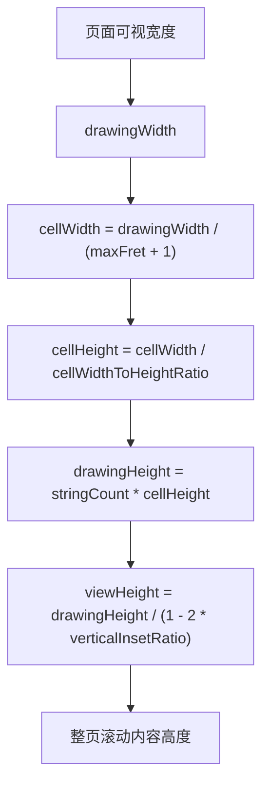

# 指板动态宽高改造计划

## 目标与约束

- 目标：把指板从“固定 `stringLaneHeight` 推导总高”切换为“固定 cell 宽高比，由宽度优先反推高度”。
- 页面策略：采用整页滚动，不做指板局部滚动。
- 已确认约束：空弦区不单独建模，仍与其他列一起按 `maxFret + 1` 等宽处理；`fretLineWidth`、`stringLineWidth` 保持固定点值，不随放大变化；`iOS` 上整页自然滚动优先，允许指板拖动事件被取消或不连续。

## 现状基线

- 当前高度真相在 [NoteMaster_Ver_1/Shared/Fretboard/FretboardConfiguration.swift](NoteMaster_Ver_1/Shared/Fretboard/FretboardConfiguration.swift)：`LayoutMetrics.stringLaneHeight -> preferredHeight(forStringCount:) -> configuration.preferredHeight`。
- 当前几何在 [NoteMaster_Ver_1/Shared/Fretboard/FretboardGeometry.swift](NoteMaster_Ver_1/Shared/Fretboard/FretboardGeometry.swift)：横向按 `displayPositionCount = maxFret + 1` 等分，纵向通过 `resolvedStringLaneHeight(in:)` 压缩到可用高度。
- 当前平台尺寸出口在 [NoteMaster_Ver_1/Platform/iOS/iOSFretboardView.swift](NoteMaster_Ver_1/Platform/iOS/iOSFretboardView.swift) 与 [NoteMaster_Ver_1/Platform/macOS/macOSFretboardView.swift](NoteMaster_Ver_1/Platform/macOS/macOSFretboardView.swift)：`intrinsicContentSize.height = configuration.preferredHeight`，高度与宽度无关。
- 当前页面布局在 [NoteMaster_Ver_1/Platform/iOS/iOSViewController.swift](NoteMaster_Ver_1/Platform/iOS/iOSViewController.swift) 与 [NoteMaster_Ver_1/Platform/macOS/macOSViewController.swift](NoteMaster_Ver_1/Platform/macOS/macOSViewController.swift)：四个子视图直接挂在根视图上，最后由 `fretboardView.bottom <= safeArea.bottom` 收口，尚无整页滚动容器。

## 阶段 1：重构共享尺寸真相

- 修改 [NoteMaster_Ver_1/Shared/Fretboard/FretboardConfiguration.swift](NoteMaster_Ver_1/Shared/Fretboard/FretboardConfiguration.swift)。
- 用 `cellWidthToHeightRatio` 替代 `LayoutMetrics.stringLaneHeight` 作为一等公民。
- 新增宽度驱动的尺寸 API，建议收口为以下两类之一，并全仓统一只保留一种真相：
  - `preferredHeight(forWidth:)`
  - 或 `heightToWidthMultiplier(for:)`
- 保留 `horizontalInsetRatio`、`verticalInsetRatio`、`maxFret`、`stringCount`，但让它们服务于“宽度反推高度”，不再服务于“固定弦高”。
- 明确空弦列语义不变：`displayPositionCount` 仍是 `maxFret + 1`，`fret == 0` 仍表示空弦区域，只是不单独做额外宽度模型。
- 预期结果：共享层能够在给定宽度时计算唯一高度，不再依赖与宽度解耦的 `preferredHeight(forStringCount:)`。

## 阶段 2：重构共享几何与渲染依赖

- 修改 [NoteMaster_Ver_1/Shared/Fretboard/FretboardGeometry.swift](NoteMaster_Ver_1/Shared/Fretboard/FretboardGeometry.swift)。
- 让 `displaySlotWidth` 继续基于 `drawingRect.width / (maxFret + 1)`，但把纵向 `stringLaneHeight` 改成由 `cellWidth` 和 `cellWidthToHeightRatio` 推导，而不是 `min(preferredLaneHeight, availableLaneHeight)`。
- 删除或退役 `resolvedStringLaneHeight(in:)` 这种“压缩到可用高度”的旧路径，避免双重真相并存。
- 保持 `displayPosition(forX:)`、`hitTest(_:phase:)`、`FretboardCell.fret` 的语义与视觉列一致，确保 `0...maxFret` 的命中语义不回归。
- 审核 [NoteMaster_Ver_1/Shared/Fretboard/NoteNameContentProvider.swift](NoteMaster_Ver_1/Shared/Fretboard/NoteNameContentProvider.swift) 与 [NoteMaster_Ver_1/Shared/Fretboard/FretboardLayer.swift](NoteMaster_Ver_1/Shared/Fretboard/FretboardLayer.swift)：
  - `badgeDiameter`、文字排版、marker 位置继续跟随几何；
  - `fretLineWidth`、`stringLineWidth` 保持固定点值，不引入按视图尺寸缩放的逻辑。
- 预期结果：几何、渲染、命中三条链路共享同一套 cell 比例真相。

## 阶段 3：改造双平台指板尺寸出口

- 修改 [NoteMaster_Ver_1/Platform/iOS/iOSFretboardView.swift](NoteMaster_Ver_1/Platform/iOS/iOSFretboardView.swift) 与 [NoteMaster_Ver_1/Platform/macOS/macOSFretboardView.swift](NoteMaster_Ver_1/Platform/macOS/macOSFretboardView.swift)。
- 不再把 `intrinsicContentSize.height = configuration.preferredHeight` 当成主尺寸真相；改为“宽度驱动高度”的单一出口。
- 推荐实现：由指板视图自身维护 `heightAnchor = widthAnchor * multiplier` 约束，并在 `configuration` 变化时刷新 multiplier。
- 保持 `needsDisplayOnBoundsChange`、`invalidateIntrinsicContentSize()`、`contentsScale` 更新逻辑的有效性，但避免继续通过固定 intrinsic 高度与新比例约束并行输出两套真相。
- 对比策略：按钮面板和 staff 控制面板仍保留各自 `intrinsicContentSize`；staff 视图是否保持现有固定高度策略，不纳入本次指板改造范围。
- 预期结果：指板宽度由页面容器给定，高度由宽度自动联动。

## 阶段 4：把页面改成整页滚动

- 修改 [NoteMaster_Ver_1/Platform/iOS/iOSViewController.swift](NoteMaster_Ver_1/Platform/iOS/iOSViewController.swift) 与 [NoteMaster_Ver_1/Platform/macOS/macOSViewController.swift](NoteMaster_Ver_1/Platform/macOS/macOSViewController.swift)。
- 引入根滚动容器：
  - iOS：`UIScrollView + contentView`
  - macOS：`NSScrollView + document/contentView`
- 把 `buttonPanelView`、`staffControlPanelView`、`staffView`、`fretboardView` 全部迁入内容容器，保留现有纵向顺序和 spacing 常量。
- 用“内容容器宽度 = 可视宽度”来固定整页内容宽度，只允许纵向滚动。
- 把最后一个视图的底边改为“贴内容容器底边”，移除当前 `fretboardView.bottom <= safeArea.bottom` 这种视口收口方式。
- 预期结果：窗口拉宽时指板随宽度变高；当总内容高于视口时，由整页滚动自然承载。

## 阶段 5：落实 iOS 滚动优先的交互边界

- 触及 [NoteMaster_Ver_1/Platform/iOS/iOSFretboardView.swift](NoteMaster_Ver_1/Platform/iOS/iOSFretboardView.swift) 与 [NoteMaster_Ver_1/Shared/Fretboard/FretboardInteraction.swift](NoteMaster_Ver_1/Shared/Fretboard/FretboardInteraction.swift) 的行为验证。
- 本阶段不以“保住连续拖动命中”为目标，不额外引入复杂的手势协调器。
- 接受 `UIScrollView` 抢占纵向拖动后出现的 `cancelled` 或中断；只要求：
  - 点击/短触摸仍可得到正确 hit 结果；
  - 页面滚动行为自然，不被指板阻塞；
  - 不出现错误坐标或明显的事件风暴。
- 若验证后发现产品确实需要连续拖动交互，再单开后续任务处理 scroll 与 raw touch 的竞争，不把这部分塞进当前主改造链路。

## 阶段 6：验证与回归

- 宽度变化验证：在 iOS 与 macOS 上拉宽窗口或改变可视宽度，确认指板高度按比例联动变化。
- 弦数变化验证：切换 `guitar6 / bass4 / bass5`，确认 `stringCount` 变化仍正确影响总高，且 `fret == 0` 命中语义不变。
- 页面滚动验证：总内容高度超过视口时，确认整页可滚，按钮面板、staff、指板顺序与约束稳定。
- 命中验证：点击指板内外、空弦列、普通品位，确认 `FretboardGeometry.hitTest` 与可见几何一致。
- 平台差异验证：
  - iOS：纵向滚动优先时允许 `cancelled`；
  - macOS：窗口 live resize 时指板重绘和高度联动稳定。
- 工程质量验证：改动后对已编辑 Swift 文件跑 IDE 诊断与类型检查，优先清理因双重尺寸真相残留引入的约束警告或编译问题。

## 关键落点

- 这次改造的根因位于共享几何真相，不是在控制器里再补一个“动态高度常量”。
- 平台层要做的是消费共享比例真相，并把页面容器切到整页滚动。
- 第一版明确不追求 iOS 上的连续拖动优先，先保证宽度联动、页面滚动和点击命中三件事闭环。

