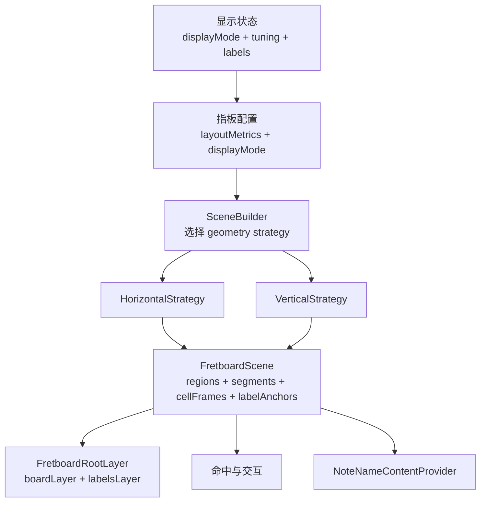

# 指板竖向 Scene 化改造计划

## 目标与边界

- 目标：按方案 C 把指板从“横向几何直接驱动绘制”升级为“`displayMode + geometry strategy + scene + pure render layers`”，并新增 vertical 模式。
- 已确认的 vertical 语义：品位从上到下递增；弦从左到右低音到高音；音名文字保持正立；页面仍是整页纵向滚动，但指板不再占满宽度，而是占满外层 host 高度、宽度自适应并居中。
- 当前最关键的横向耦合点在 [NoteMaster_Ver_1/Shared/Fretboard/FretboardGeometry.swift](NoteMaster_Ver_1/Shared/Fretboard/FretboardGeometry.swift) 的 `displayPosition(forX:)` / `nearestStringIndex(forY:)`、[NoteMaster_Ver_1/Shared/Fretboard/FretboardLayer.swift](NoteMaster_Ver_1/Shared/Fretboard/FretboardLayer.swift) 的 `drawFrets` / `drawStrings`、[NoteMaster_Ver_1/Shared/Fretboard/NoteNameContentProvider.swift](NoteMaster_Ver_1/Shared/Fretboard/NoteNameContentProvider.swift) 的 `makeLabelContent`、以及 [NoteMaster_Ver_1/Shared/Fretboard/InstrumentTuning.swift](NoteMaster_Ver_1/Shared/Fretboard/InstrumentTuning.swift) 的 `openStringsTopToBottom` 命名。
- 当前平台尺寸出口是 [NoteMaster_Ver_1/Platform/iOS/iOSFretboardView.swift](NoteMaster_Ver_1/Platform/iOS/iOSFretboardView.swift) 与 [NoteMaster_Ver_1/Platform/macOS/macOSFretboardView.swift](NoteMaster_Ver_1/Platform/macOS/macOSFretboardView.swift) 的 `intrinsicContentSize.height = resolvedHeight(forAvailableWidth:)`，控制器里 [NoteMaster_Ver_1/Platform/iOS/iOSViewController.swift](NoteMaster_Ver_1/Platform/iOS/iOSViewController.swift) / [NoteMaster_Ver_1/Platform/macOS/macOSViewController.swift](NoteMaster_Ver_1/Platform/macOS/macOSViewController.swift) 也仍把指板左右贴满 `contentView`。
- 可复用模式来自 [NoteMaster_Ver_1/Shared/Staff/StaffScene.swift](NoteMaster_Ver_1/Shared/Staff/StaffScene.swift)、[NoteMaster_Ver_1/Shared/Staff/StaffSceneProvider.swift](NoteMaster_Ver_1/Shared/Staff/StaffSceneProvider.swift)、[NoteMaster_Ver_1/Shared/Staff/StaffRootLayer.swift](NoteMaster_Ver_1/Shared/Staff/StaffRootLayer.swift)：配置、几何、scene、root-layer 分层已经被证明能落地，但不直接照搬 `Staff` 的所有细节。
- 现状限制：仓库当前只有一个 app target，暂无现成 `Tests` target；因此首轮计划先保证 scene/strategy 可验证出口与手工回归路径，不把“新建测试 target”当作主链路阻塞项。

## 目标架构

## 阶段 1：建立共享语义接缝，不先动渲染结果

- 触达文件：[NoteMaster_Ver_1/Shared/Fretboard/FretboardConfiguration.swift](NoteMaster_Ver_1/Shared/Fretboard/FretboardConfiguration.swift)、[NoteMaster_Ver_1/Shared/Controls/FretboardDisplayState.swift](NoteMaster_Ver_1/Shared/Controls/FretboardDisplayState.swift)、[NoteMaster_Ver_1/Shared/Fretboard/InstrumentTuning.swift](NoteMaster_Ver_1/Shared/Fretboard/InstrumentTuning.swift)。
- 新增 `FretboardDisplayMode`，至少包含 `horizontal` 与本次 vertical 模式；vertical 的对外语义先固定为“品位沿 Y 轴向下、弦沿 X 轴从低到高”。
- 把 `InstrumentTuning` 里带屏幕方向含义的 `openStringsTopToBottom` 重命名为不绑 `x/y/top/bottom` 的显示序字段，例如“按显示轴顺序排列的空弦数组”，避免后面 vertical 落地时语义反转。
- 在 `FretboardConfiguration` 补齐与 `resolvedHeight(forAvailableWidth:)` 对称的“高度反推宽度”出口，并把 `LayoutMetrics` 中过于横向化的命名标记为待迁移；本阶段允许先保留旧 API 作为兼容层，但真相出口只能收口到一套。
- 在 `FretboardDisplayState` 中接入 `displayMode`，先不要求 UI 暴露，只要求共享状态可以显式构造 horizontal / vertical 两种配置。
- 阶段验收：不改视觉表现的前提下，horizontal 仍保持现状；共享层已经能表达 vertical 模式，且不再依赖“top/bottom”命名来描述弦序。

## 阶段 2：引入 scene 与 geometry strategy，并先做 horizontal 等价迁移

- 触达文件：[NoteMaster_Ver_1/Shared/Fretboard/FretboardGeometry.swift](NoteMaster_Ver_1/Shared/Fretboard/FretboardGeometry.swift)、[NoteMaster_Ver_1/Shared/Fretboard/FretboardInteraction.swift](NoteMaster_Ver_1/Shared/Fretboard/FretboardInteraction.swift)。
- 新增文件建议：[NoteMaster_Ver_1/Shared/Fretboard/FretboardScene.swift](NoteMaster_Ver_1/Shared/Fretboard/FretboardScene.swift)、[NoteMaster_Ver_1/Shared/Fretboard/FretboardGeometryStrategy.swift](NoteMaster_Ver_1/Shared/Fretboard/FretboardGeometryStrategy.swift)、[NoteMaster_Ver_1/Shared/Fretboard/FretboardSceneBuilder.swift](NoteMaster_Ver_1/Shared/Fretboard/FretboardSceneBuilder.swift)、[NoteMaster_Ver_1/Shared/Fretboard/HorizontalFretboardGeometryStrategy.swift](NoteMaster_Ver_1/Shared/Fretboard/HorizontalFretboardGeometryStrategy.swift)。
- `FretboardScene` 不直接暴露“横线/竖线”概念，而是收口为与轴向无关的图元：`drawingRegion`、`fretboardRegion`、`nutRegion`、`stringSegments`、`fretSegments`、`markerPlacements`、`cellFrames`、`labelAnchors`。
- `FretboardGeometryStrategy` 负责两件事：给定 `configuration + bounds` 产出 `FretboardScene`；给定点击点产出 `FretboardHitResult`。这样命中与绘制共享同一份几何真相，避免 vertical 之后再出现“看见的格子”和“命中的格子”不是同一套映射。
- 当前 [NoteMaster_Ver_1/Shared/Fretboard/FretboardGeometry.swift](NoteMaster_Ver_1/Shared/Fretboard/FretboardGeometry.swift) 的逻辑先整体迁入 `HorizontalFretboardGeometryStrategy`，目标不是立刻变优雅，而是先拿到 horizontal 场景等价输出。
- `FretboardCell` 与 `FretboardHitResult` 继续保持稳定领域模型，避免把 `x/y` 细节泄漏到控制器层。
- 阶段验收：horizontal 模式下，scene 导出的 `cellFrames`、品位/弦线段与当前屏幕效果一致；命中逻辑仍保持 `fret == 0...maxFret` 的语义不变。

## 阶段 3：把现有单层绘制迁到 root-layer + scene 消费的纯渲染管线

- 触达文件：[NoteMaster_Ver_1/Shared/Fretboard/FretboardLayer.swift](NoteMaster_Ver_1/Shared/Fretboard/FretboardLayer.swift)、[NoteMaster_Ver_1/Shared/Fretboard/FretboardContentProvider.swift](NoteMaster_Ver_1/Shared/Fretboard/FretboardContentProvider.swift)、[NoteMaster_Ver_1/Shared/Fretboard/NoteNameContentProvider.swift](NoteMaster_Ver_1/Shared/Fretboard/NoteNameContentProvider.swift)。
- 新增文件建议：[NoteMaster_Ver_1/Shared/Fretboard/FretboardRootLayer.swift](NoteMaster_Ver_1/Shared/Fretboard/FretboardRootLayer.swift)、[NoteMaster_Ver_1/Shared/Fretboard/FretboardBoardLayer.swift](NoteMaster_Ver_1/Shared/Fretboard/FretboardBoardLayer.swift)、[NoteMaster_Ver_1/Shared/Fretboard/FretboardLabelsLayer.swift](NoteMaster_Ver_1/Shared/Fretboard/FretboardLabelsLayer.swift)。
- 参考 [NoteMaster_Ver_1/Shared/Staff/StaffRootLayer.swift](NoteMaster_Ver_1/Shared/Staff/StaffRootLayer.swift) 的同步方式，但不要照抄 `Staff` 的 lines/glyph 重复计算：`FretboardRootLayer` 应持有单一 `sceneBuilder`，由 `boardLayer` 与 `labelsLayer` 共同消费同一份 `FretboardScene`。
- `FretboardBoardLayer` 只画固定 chrome：背景、琴枕、品丝、弦、marker、边框；`FretboardLabelsLayer` 只画 badge 与文字。这样后面模式切换或 label 变化时，失效边界更清晰。
- `FretboardContentProviding` 的输入改为消费 `FretboardScene` 或至少消费 scene 提供的 `labelAnchors`，不再依赖 `slotRect.midX + stringY` 这种轴向硬编码。
- 阶段验收：horizontal 屏幕表现与当前 `FretboardLayer` 基本一致，文字仍保持现有正立绘制，不引入额外旋转或坐标翻转副作用。

## 阶段 4：实现 vertical strategy，并把正立文字与命中一起收口

- 触达文件：[NoteMaster_Ver_1/Shared/Fretboard/NoteNameContentProvider.swift](NoteMaster_Ver_1/Shared/Fretboard/NoteNameContentProvider.swift)、[NoteMaster_Ver_1/Shared/Fretboard/FretboardInteraction.swift](NoteMaster_Ver_1/Shared/Fretboard/FretboardGeometryStrategy.swift)。
- 新增文件建议：[NoteMaster_Ver_1/Shared/Fretboard/VerticalFretboardGeometryStrategy.swift](NoteMaster_Ver_1/Shared/Fretboard/VerticalFretboardGeometryStrategy.swift)。
- vertical 规则在策略层一次性定死：`fret` 沿 Y 轴从上到下递增；`stringIndex` 沿 X 轴从左到右对应低音到高音；`nutRegion` 变为顶部横条；`fretSegments` 变为横线；`stringSegments` 变为竖线；双点 marker 的偏移从当前的 `±Y` 切到沿弦轴的 `±X`。
- label anchor 不做旋转补丁，而是直接由 vertical scene 给出正立的 `center` / `maxSize`；`FretboardLabelsLayer` 保持现有文本绘制朝向，这样 vertical 模式下文字天然正立。
- 命中不再走 `displayPosition(forX:) + nearestStringIndex(forY:)` 这类横向 API，而是由 strategy 基于 scene 的 `cellFrames` 或统一轴向映射返回 `FretboardHitResult`。
- 阶段验收：vertical 模式能正确命中空弦区和普通品位；`guitar6 / bass4 / bass5` 都保持“左低右高”；文字、marker、琴枕与可见几何一致。

## 阶段 5：把平台层改成 host 高度驱动、指板宽度自适应且居中

- 触达文件：[NoteMaster_Ver_1/Platform/iOS/iOSFretboardView.swift](NoteMaster_Ver_1/Platform/iOS/iOSFretboardView.swift)、[NoteMaster_Ver_1/Platform/macOS/macOSFretboardView.swift](NoteMaster_Ver_1/Platform/macOS/macOSFretboardView.swift)、[NoteMaster_Ver_1/Platform/iOS/iOSViewController.swift](NoteMaster_Ver_1/Platform/iOS/iOSViewController.swift)、[NoteMaster_Ver_1/Platform/macOS/macOSViewController.swift](NoteMaster_Ver_1/Platform/macOS/macOSViewController.swift)。
- 平台视图改为 mode-aware intrinsic：horizontal 继续走“宽度驱动高度”，vertical 则改为“高度驱动宽度”；`layoutSubviews` / `setFrameSize` 的 `invalidateIntrinsicContentSize()` 触发条件也要从“只看宽度变化”扩展为“看当前驱动轴变化”。
- 控制器层引入 `fretboardHostView` 与单独的 `fretboardHostHeightConstraint`；host 继续参与整页纵向布局，`fretboardView` 则只需要上下贴 host、水平居中，不再左右拉满 `contentView`。
- 这一步是实现“通过调整指板外层容器高度，平衡和五线谱、按钮面板的占比”的关键出口；也就是说，比例调节应发生在 host 层，而不是在指板 view 自己内部强行算一个固定高度。
- [NoteMaster_Ver_1/Platform/iOS/iOSViewController.swift](NoteMaster_Ver_1/Platform/iOS/iOSViewController.swift) 与 [NoteMaster_Ver_1/Platform/macOS/macOSViewController.swift](NoteMaster_Ver_1/Platform/macOS/macOSViewController.swift) 现有滚动容器结构可以复用，vertical 模式无需再引入局部 scroll view。
- 阶段验收：调整 host 高度时，指板宽度会自适应变化并保持居中；staff 与按钮面板维持现有栈式布局，不出现约束冲突或横向被撑满的问题。

## 阶段 6：把 displayMode 接入显示状态与按钮面板

- 触达文件：[NoteMaster_Ver_1/Shared/Controls/ButtonPanelModel.swift](NoteMaster_Ver_1/Shared/Controls/ButtonPanelModel.swift)、[NoteMaster_Ver_1/Shared/Controls/ButtonPanelSnapshotBuilder.swift](NoteMaster_Ver_1/Shared/Controls/ButtonPanelSnapshotBuilder.swift)、[NoteMaster_Ver_1/Shared/Controls/FretboardDisplayState.swift](NoteMaster_Ver_1/Shared/Controls/FretboardDisplayState.swift)。
- 由于 [NoteMaster_Ver_1/Platform/iOS/Controls/iOSButtonPanelView.swift](NoteMaster_Ver_1/Platform/iOS/Controls/iOSButtonPanelView.swift) 与 [NoteMaster_Ver_1/Platform/macOS/Controls/macOSButtonPanelView.swift](NoteMaster_Ver_1/Platform/macOS/Controls/macOSButtonPanelView.swift) 是按 `sections` 动态渲染的，新增一个 `displayMode` section 的改造面相对可控。
- 增加 `setDisplayModeHorizontal` / `setDisplayModeVertical` 之类的 action，并让 `FretboardDisplayState.apply(_:)` 负责模式切换，保持平台控制器只消费共享状态、不自行解释业务动作。
- 默认值仍保持 horizontal，这样不会打断已有使用路径；vertical 可以先作为显式切换项，也可以在首轮实现时临时由默认配置打开。
- 如果本轮只想完成底层能力、暂不暴露用户切换入口，这一阶段可以顺延，但 `FretboardDisplayState` 里的 `displayMode` 仍应在前面阶段接好。
- 阶段验收：iOS/macOS 均可通过共享状态切换横向/竖向；按钮模型、快照构建与实际视图布局同步刷新。

## 阶段 7：验证、回归与后续硬化

- 现有仓库没有现成 `Tests` target，因此首轮验证以“scene 可观察输出 + 双平台手工回归矩阵”为主，不把新建测试 target 绑定进主改造路径。
- 最低回归矩阵：horizontal 回归不变；vertical 下 `guitar6 / bass4 / bass5` 的弦序正确；空弦区与普通品位命中一致；窗口/设备尺寸变化时 host 高度调节有效；iOS 滚动与点击共存，macOS live resize 不闪烁。
- 若要给这个架构长期托底，再单开一个工程层阶段：给 `NoteMaster_Ver_1.xcodeproj/project.pbxproj` 增加 `Tests` target，优先覆盖 `FretboardSceneBuilder`、`HorizontalFretboardGeometryStrategy`、`VerticalFretboardGeometryStrategy` 的纯几何 fixture，不直接从 UI 层写脆弱快照测试。
- 这一阶段的退出标准不是“所有未来模式一次做完”，而是：scene/strategy 已经成为唯一几何真相，vertical 能稳定运行，未来再加镜像、左手模式、局部可视区时不需要回头拆平台层和渲染层。

## 实施顺序建议

- 先做阶段 1 到阶段 3，把 horizontal 行为完整迁入新架构，再开始写 vertical strategy；不要一边抽 scene、一边直接改 vertical，不然很容易把回归面和新功能面混在一起。
- 阶段 4 完成后再进入平台尺寸改造；否则一旦 vertical 视觉不对，很难判断是 scene 轴向错误还是 Auto Layout 出口错误。
- 阶段 6 可以晚于阶段 5，这样模式切换接入时面对的是已经稳定的 vertical 布局，而不是半成品。
- 若你希望把风险再拆小，可以把“root-layer 子层拆分”和“vertical strategy”分两次提交；但从代码真相角度，这两步最好不要跨太远，否则中间态会同时存在旧 layer 和新 scene 两套绘制路径。

