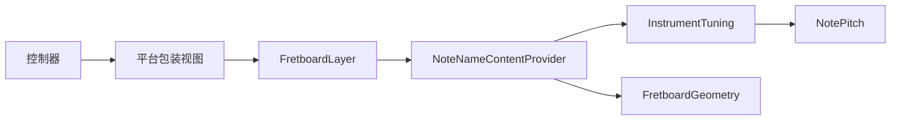

# 指板音名显示计划

## 目标边界

- `marker` 继续由 [FretboardLayer.swift](/Users/shaun/Library/Mobile Documents/com~~apple~~CloudDocs/Develop/NoteMaster_Ver_1/NoteMaster_Ver_1/Shared/Fretboard/FretboardLayer.swift) 固定绘制，始终显示，不进入 provider 语义。
- `openStrings` 顺序固定为“视觉上从上到下”，必须与 [FretboardGeometry.swift](/Users/shaun/Library/Mobile Documents/com~~apple~~CloudDocs/Develop/NoteMaster_Ver_1/NoteMaster_Ver_1/Shared/Fretboard/FretboardGeometry.swift) 的 `stringIndex` 语义严格对齐。
- 音名显示策略由 provider 负责，首版支持“显示自然音 / 显示变化音”组合，不把这类开关混入 marker 或平台层。

## 目标结构

## 阶段 1：建立音高与调弦数据层

- 新增 [NotePitch.swift](/Users/shaun/Library/Mobile Documents/com~~apple~~CloudDocs/Develop/NoteMaster_Ver_1/NoteMaster_Ver_1/Shared/Fretboard/NotePitch.swift)，定义 `PitchClass`、`NotePitch`，支持“按半音递增”和从结构生成 `G3`、`A2` 这类显示文本。
- 新增 [InstrumentTuning.swift](/Users/shaun/Library/Mobile Documents/com~~apple~~CloudDocs/Develop/NoteMaster_Ver_1/NoteMaster_Ver_1/Shared/Fretboard/InstrumentTuning.swift)，定义 `openStringsTopToBottom`，并提供 `guitar6`、`bass4`、`bass5` 的标准调弦。
- 保持 [InstrumentType.swift](/Users/shaun/Library/Mobile Documents/com~~apple~~CloudDocs/Develop/NoteMaster_Ver_1/NoteMaster_Ver_1/Shared/Fretboard/InstrumentType.swift) 继续只表达乐器类别和弦数，不让它成为运行期调弦真相来源。
- 关键约束：`openStringsTopToBottom[0]` 必须对应几何层最上方那根弦，后续所有 provider 都按这个约定运行。

## 阶段 2：把 `FretboardConfiguration` 升级为以 tuning 为权威

- 修改 [FretboardConfiguration.swift](/Users/shaun/Library/Mobile Documents/com~~apple~~CloudDocs/Develop/NoteMaster_Ver_1/NoteMaster_Ver_1/Shared/Fretboard/FretboardConfiguration.swift)，把当前以 `instrument` 为核心的配置，升级为以 `tuning` 为权威。
- 建议结构是：`tuning + maxFret + preferredHeight + layoutMetrics + markerLayout`。
- `instrument` 改为从 `tuning.instrument` 派生；`stringCount` 改为从 `tuning.openStringsTopToBottom.count` 派生，避免 `instrument` 和空弦配置出现双重真相。
- 保持 [FretboardGeometry.swift](/Users/shaun/Library/Mobile Documents/com~~apple~~CloudDocs/Develop/NoteMaster_Ver_1/NoteMaster_Ver_1/Shared/Fretboard/FretboardGeometry.swift) 继续只消费 `configuration` 的值语义，不引入音乐推算逻辑。

## 阶段 3：新增内容 provider 层

- 新增 [FretboardContentProvider.swift](/Users/shaun/Library/Mobile Documents/com~~apple~~CloudDocs/Develop/NoteMaster_Ver_1/NoteMaster_Ver_1/Shared/Fretboard/FretboardContentProvider.swift)，定义：
- `FretboardLabelContent`：单个文本标签的内容、位置、尺寸约束。
- `FretboardContentProviding`：统一的内容生成协议。
- `NoteLabelVisibility`：表达“自然音 / 变化音”显示组合，替代之前不准确的 `showsNoteLabels` / `showsPositionMarkers` 思路。
- 新增 [NoteNameContentProvider.swift](/Users/shaun/Library/Mobile Documents/com~~apple~~CloudDocs/Develop/NoteMaster_Ver_1/NoteMaster_Ver_1/Shared/Fretboard/NoteNameContentProvider.swift)，负责根据 `tuning + geometry + visibility` 生成每根弦、每一品的音名标签。
- provider 只做“要显示什么”和“文本锚点在哪里”的推导，不控制 marker，也不直接绘制。

## 阶段 4：把音名推导与几何保持解耦

- 保持 [FretboardGeometry.swift](/Users/shaun/Library/Mobile Documents/com~~apple~~CloudDocs/Develop/NoteMaster_Ver_1/NoteMaster_Ver_1/Shared/Fretboard/FretboardGeometry.swift) 继续只提供 `displaySlotRect(at:)`、`yPositionForString(_:)`、`stringSpacing` 等纯几何信息。
- provider 直接组合这些现有几何结果来定位文本，首版尽量不把 `NotePitch`、`PitchClass` 或显示策略回灌进几何层。
- 只有当文字定位逻辑在多个 provider 中重复时，才考虑给几何层补一个纯几何辅助，例如 `labelAnchor` 或 `contentRect`，但依然不能让几何层知道音高语义。

## 阶段 5：把 provider 接入共享 `FretboardLayer`

- 修改 [FretboardLayer.swift](/Users/shaun/Library/Mobile Documents/com~~apple~~CloudDocs/Develop/NoteMaster_Ver_1/NoteMaster_Ver_1/Shared/Fretboard/FretboardLayer.swift)，新增单独的 `contentProvider` 属性，并在 `init(layer:)` 中正确复制它。
- 在现有绘制管线中加入 `drawLabels(in:geometry:)`，顺序保持为：背景、指板主体、marker、品丝、上弦枕、弦线、音名文本、边框。
- 文本渲染继续留在共享 layer 中，避免把文字绘制拆回 iOS / macOS。首版优先使用共享可用的文本绘制方案，不引入平台专属 label 控件。
- `marker` 的现有绘制逻辑不改语义，只保证它与文字渲染彼此独立。

## 阶段 6：平台包装视图只透传 provider

- 修改 [iOSFretboardView.swift](/Users/shaun/Library/Mobile Documents/com~~apple~~CloudDocs/Develop/NoteMaster_Ver_1/NoteMaster_Ver_1/Platform/iOS/iOSFretboardView.swift) 和 [macOSFretboardView.swift](/Users/shaun/Library/Mobile Documents/com~~apple~~CloudDocs/Develop/NoteMaster_Ver_1/NoteMaster_Ver_1/Platform/macOS/macOSFretboardView.swift)，增加一个与 `FretboardLayer.contentProvider` 对称的属性。
- 包装视图职责仍保持极薄：转发 `configuration`、转发 `contentProvider`、同步 `contentsScale`。
- 平台包装视图不得出现任何音高推算、自然音/变化音判断或弦序解释逻辑。

## 阶段 7：控制器装配默认调弦与默认显示策略

- 修改 [iOSViewController.swift](/Users/shaun/Library/Mobile Documents/com~~apple~~CloudDocs/Develop/NoteMaster_Ver_1/NoteMaster_Ver_1/Platform/iOS/iOSViewController.swift) 和 [macOSViewController.swift](/Users/shaun/Library/Mobile Documents/com~~apple~~CloudDocs/Develop/NoteMaster_Ver_1/NoteMaster_Ver_1/Platform/macOS/macOSViewController.swift)，把当前 `FretboardConfiguration` 初始化改为基于标准调弦。
- 控制器层负责选择：当前乐器、标准调弦、`maxFret`、`preferredHeight`、以及 `NoteNameContentProvider` 的默认 `visibility`。
- 首版默认建议：吉他标准调弦、显示自然音和变化音都开启、音名带八度。
- 控制器层只负责装配和下发，不实现任何 `string + fret -> 音名` 的算法。

## 阶段 8：视觉与行为验证

- 验证吉他 `6 * 13`、四弦贝斯 `4 * 13`、五弦贝斯 `5 * 13` 下的文本密度，重点看 `0` 品空弦、`12` 品双圆点区域和窄屏宽度下是否可读。
- 验证“只显示自然音”“只显示变化音”“两者都显示”三种组合是否正确，且 marker 始终存在。
- 验证字符串顺序没有反：顶部弦显示必须对应 `openStringsTopToBottom[0]`。
- 对最近改动文件执行类型检查与 lints，确保 provider 透传和共享文本绘制没有引入平台侧诊断问题。

## 实施顺序建议

1. 先补 `NotePitch` 与 `InstrumentTuning`，把音乐数据层定稳。
2. 再升级 `FretboardConfiguration`，让 tuning 成为单一真相来源。
3. 然后新增 provider 协议和 `NoteNameContentProvider`，把“显示自然音/变化音”的组合跑通。
4. 再把 provider 接到 `FretboardLayer`，完成共享文本绘制。
5. 最后透传到包装视图和控制器，接入默认调弦与默认显示策略。

## 风险与提前规避

- 最大风险是让 `instrument` 和 `tuning` 同时成为真相来源；计划通过让 `tuning` 成为配置权威来规避。
- 第二个风险是把音高语义塞进 [FretboardGeometry.swift](/Users/shaun/Library/Mobile Documents/com~~apple~~CloudDocs/Develop/NoteMaster_Ver_1/NoteMaster_Ver_1/Shared/Fretboard/FretboardGeometry.swift)；计划明确几何层只提供位置，不参与音名推导。
- 第三个风险是 provider 逻辑回流到平台包装视图或控制器；计划要求平台层只装配和透传，不做音乐规则判断。
- 第四个风险是文本与弦线/marker 发生视觉拥挤；计划把字体大小、垂直偏移和标签尺寸控制放在 provider 与共享渲染层之间统一调整。

