# 按钮步进动画计划

## 目标

- 先把当前只服务 `B` 区的 `scale snap` 动画命名和入口抽象成通用的 `rows transition` 能力。
- 再让 `A` 区左右按钮步进复用这套通用过渡链路，使按钮点击后的键盘移动不再瞬时跳变。
- 默认沿用当前 `B` 区动画语义：动画期间由 layer 使用 presentation rows 渲染，动画完成后再提交最终 `rows` 并发出最终 `rowsChanged`。

## 关键现状

- 当前 `B` 区已经具备一套可复用的 rows 过渡能力，但命名仍绑定在 `scale snap`：
- `[NoteMaster_Ver_1/Shared/Piano/PianoPresentation.swift](NoteMaster_Ver_1/Shared/Piano/PianoPresentation.swift)`
- `[NoteMaster_Ver_1/Shared/Piano/PianoKeyboardLayer.swift](NoteMaster_Ver_1/Shared/Piano/PianoKeyboardLayer.swift)`
- `[NoteMaster_Ver_1/Platform/iOS/Controls/iOSPianoKeyboardView.swift](NoteMaster_Ver_1/Platform/iOS/Controls/iOSPianoKeyboardView.swift)`
- `[NoteMaster_Ver_1/Platform/macOS/Controls/macOSPianoKeyboardView.swift](NoteMaster_Ver_1/Platform/macOS/Controls/macOSPianoKeyboardView.swift)`
- 当前 `A` 区按钮结束时仍然直接同步提交目标 rows：

```swift
// 按钮 ended 后立即写 nextState.rows，并同步发 rowsChanged。
if endedInsideSameButton {
    let nextRows = applyButtonStep(
        state.rows,
        triggerRowIndex: interaction.rowIndex,
        direction: interaction.direction,
        movementScope: interaction.movementScope,
        configuration: configuration
    )
    nextState.rows = nextRows
    if nextRows != state.rows {
        semanticEvents.append(.rowsChanged(nextRows))
    }
}
```

## 目标流转

```mermaid
flowchart LR
    buttonEnd[ButtonEnded] --> reducer[ReducerBuildTransitionPlan]
    reducer --> reduction[ReductionWithPresentationCommand]
    reduction --> wrapper[PlatformWrapperConsumeCommand]
    wrapper --> layer[SharedKeyboardLayerAnimateRows]
    layer --> complete[AnimationCompletion]
    complete --> commit[CommitFinalRowsAndEmitRowsChanged]
```




## 分阶段实施

### 阶段 1：把 `scale snap` 动画抽象成通用 `rows transition`

- 重命名或泛化以下 shared 类型/命令，使其不再暗示“只服务 B 区 scale 吸附”：
- `[NoteMaster_Ver_1/Shared/Piano/PianoPresentation.swift](NoteMaster_Ver_1/Shared/Piano/PianoPresentation.swift)`
- `[NoteMaster_Ver_1/Shared/Piano/PianoInteractionReducer.swift](NoteMaster_Ver_1/Shared/Piano/PianoInteractionReducer.swift)`
- `[NoteMaster_Ver_1/Shared/Piano/PianoKeyboardLayer.swift](NoteMaster_Ver_1/Shared/Piano/PianoKeyboardLayer.swift)`
- 推荐抽象方向：
- `PianoScaleSnapAnimationPlan` -> `PianoRowsTransitionPlan`
- `.animateScaleSnap(...)` -> `.animateRowsTransition(...)`
- `startScaleSnapAnimation(...)` -> `startRowsTransitionAnimation(...)`
- `activeScaleSnapAnimation` / `scaleSnapTimer` / `cancelScaleSnapAnimation(...)` 等同步改为通用命名
- 保持行为不变：这一阶段只做抽象，不改变当前 `B` 区吸附动画的语义、时长和中断策略。

### 阶段 2：统一 shared layer / wrapper 的通用过渡入口

- 让 `[NoteMaster_Ver_1/Shared/Piano/PianoKeyboardLayer.swift](NoteMaster_Ver_1/Shared/Piano/PianoKeyboardLayer.swift)` 的动画运行时状态与 API 全部基于通用 `rows transition` 命名。
- 让 iOS / macOS wrapper 的 `applyPresentationCommand(_:)`、`finalize...Animation(...)`、`cancel...Animation(...)`、`materialize...AnimationForNewInteractionIfNeeded()` 全部切换到通用命名。
- 确认 `[NoteMaster_Ver_1/Platform/iOS/Controls/iOSPianoKeyboardView.swift](NoteMaster_Ver_1/Platform/iOS/Controls/iOSPianoKeyboardView.swift)` 与 `[NoteMaster_Ver_1/Platform/macOS/Controls/macOSPianoKeyboardView.swift](NoteMaster_Ver_1/Platform/macOS/Controls/macOSPianoKeyboardView.swift)` 在新命名下仍保持和当前 `B` 区相同的时序：
- reducer 只给 plan
- layer 播动画
- wrapper 在完成时提交最终 rows

### 阶段 3：把按钮步进接到通用过渡计划

- 在 `[NoteMaster_Ver_1/Shared/Piano/PianoInteractionReducer.swift](NoteMaster_Ver_1/Shared/Piano/PianoInteractionReducer.swift)` 中改造 `reduceButtonPress(...).ended` 分支。
- 继续保留 `applyButtonStep(...)` 作为“按钮点击后目标 rows 的计算器”。
- 新语义改为：
- `fromRows = state.rows`
- `toRows = applyButtonStep(...)`
- `nextState.rows` 保持为 `fromRows`
- `nextState.activeInteraction = nil`
- 输出 `.animateRowsTransition(plan)`
- 不在按钮 ended 的 reducer 内立即发 `.rowsChanged(toRows)`
- 如果 `toRows == fromRows`，则保持 no-op，不启动动画。
- `cascade` / `rowOnly` 继续沿用 `applyButtonStep(...)` 已经算好的受影响行。

### 阶段 4：处理按钮动画的中断、复点和外部覆盖

- 复用当前 `B` 区已有的中断策略：
- 新一轮 `began` 到来前，先物化当前过渡帧 rows，再进入新的 hit test / reducer。
- 外部 `rows` 替换、`configuration` 变化、行数变化时，统一取消当前过渡动画，避免视觉位置与逻辑位置分叉。
- 校对连续快速点左 / 右按钮时的语义：
- 每次新点击都从当前 presentation frame 物化后的 rows 出发
- 不回退到旧的 snapped 终点

### 阶段 5：更新 validation 与手工回归清单

- 更新 `[NoteMaster_Ver_1/Shared/Piano/PianoValidation.swift](NoteMaster_Ver_1/Shared/Piano/PianoValidation.swift)`：
- 原有按钮 fixture 不再断言“按钮 ended 一次 reduction 就立即写最终 rows 并发最终 rowsChanged”
- 改为断言“按钮 ended 输出通用 rows transition 命令，最终 rows 在动画完成后提交”
- 视需要新增 fixture：
- `button_step_emits_rows_transition_on_finish`
- `button_transition_preserves_rowOnly_and_cascade_targets`
- `button_transition_interrupt_materializes_current_frame`
- 更新手工回归清单，重点验证：
- 左 / 右按钮点击后，键盘以短动画移动而不是跳变
- `rowOnly` 与 `cascade` 都正确
- 连续快速点击按钮时不会出现反跳或错位
- 动画中切换设置或外部覆盖 rows 时不会残留 presentation override

### 阶段 6：收口与兼容性检查

- 确认 `B` 区现有吸附动画在抽象改名后行为完全不变。
- 确认 `[NoteMaster_Ver_1/Shared/Piano/PianoPresentation.swift](NoteMaster_Ver_1/Shared/Piano/PianoPresentation.swift)` 的插值 helper 仍适用于按钮步进，不需要单独写第二套按钮动画数学。
- 确认 controller 层无需改动：
- `[NoteMaster_Ver_1/Platform/iOS/iOSViewController.swift](NoteMaster_Ver_1/Platform/iOS/iOSViewController.swift)`
- `[NoteMaster_Ver_1/Platform/macOS/macOSViewController.swift](NoteMaster_Ver_1/Platform/macOS/macOSViewController.swift)`
- 按钮动画仍由 shared layer + wrapper 在组件内部闭环完成。

## 文件范围

- Shared 抽象与过渡计划：
- `[NoteMaster_Ver_1/Shared/Piano/PianoPresentation.swift](NoteMaster_Ver_1/Shared/Piano/PianoPresentation.swift)`
- Shared reducer：
- `[NoteMaster_Ver_1/Shared/Piano/PianoInteractionReducer.swift](NoteMaster_Ver_1/Shared/Piano/PianoInteractionReducer.swift)`
- Shared layer：
- `[NoteMaster_Ver_1/Shared/Piano/PianoKeyboardLayer.swift](NoteMaster_Ver_1/Shared/Piano/PianoKeyboardLayer.swift)`
- 平台 wrapper：
- `[NoteMaster_Ver_1/Platform/iOS/Controls/iOSPianoKeyboardView.swift](NoteMaster_Ver_1/Platform/iOS/Controls/iOSPianoKeyboardView.swift)`
- `[NoteMaster_Ver_1/Platform/macOS/Controls/macOSPianoKeyboardView.swift](NoteMaster_Ver_1/Platform/macOS/Controls/macOSPianoKeyboardView.swift)`
- 校验：
- `[NoteMaster_Ver_1/Shared/Piano/PianoValidation.swift](NoteMaster_Ver_1/Shared/Piano/PianoValidation.swift)`

## 风险与收口原则

- 以当前 `B` 区动画时序为唯一参照，不引入“按钮立即提交逻辑 state、只做视觉补动画”的第二套语义。
- 不改 `[NoteMaster_Ver_1/Shared/Piano/PianoSceneBuilder.swift](NoteMaster_Ver_1/Shared/Piano/PianoSceneBuilder.swift)` 和 `[NoteMaster_Ver_1/Shared/Piano/PianoRowLayer.swift](NoteMaster_Ver_1/Shared/Piano/PianoRowLayer.swift)` 的逐键绘制逻辑，继续复用“中间帧 rows -> scene”链路。
- 按钮接动画后，所有 `rowsChanged` 最终以动画完成时提交的 rows 为准，避免外部 host 持有的状态与画面不同步。

