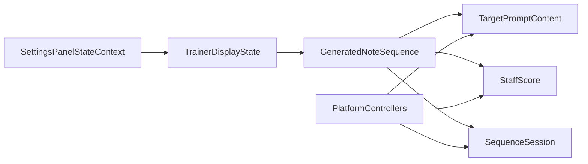

# 统一序列真相源方案

## 范围与假设

- 已确认：音名组件和五线谱不需要同时显示，沿用 [NoteMaster_Ver_1/Shared/Controls/PageDisplayState.swift](NoteMaster_Ver_1/Shared/Controls/PageDisplayState.swift) 现有的顶部二选一结构，不做双显示布局改造。
- 本轮目标：在控制面板增加 `Exercise Mode`（`Single` / `Sequence`），并让 `Sequence` 模式下的同一份随机结果同时支持：
  - 音名组件显示
  - 五线谱绘制
  - 指板顺序判题
- 非目标：本轮不新增并排双显示，不把训练模式塞进 `PageDisplayState`，也不扩展自然音条作为 `Sequence` 模式输入源。

## 现有接缝

- [NoteMaster_Ver_1/Shared/Fretboard/FretboardNaturalNoteTrainer.swift](NoteMaster_Ver_1/Shared/Fretboard/FretboardNaturalNoteTrainer.swift) 里的 `QuarterNoteSequencePrompt` 当前是 `score + expectedPitchClasses`，更偏五线谱结果，而不是多 UI 共享真相源。
- [NoteMaster_Ver_1/Platform/iOS/Controls/iOSTargetNotePromptView.swift](NoteMaster_Ver_1/Platform/iOS/Controls/iOSTargetNotePromptView.swift) 和 [NoteMaster_Ver_1/Platform/macOS/Controls/macOSTargetNotePromptView.swift](NoteMaster_Ver_1/Platform/macOS/Controls/macOSTargetNotePromptView.swift) 现在只接受单值 `Prompt`，不能表达序列和当前答题 index。
- [NoteMaster_Ver_1/Shared/Controls/SettingsPanelStateContext.swift](NoteMaster_Ver_1/Shared/Controls/SettingsPanelStateContext.swift) 目前只有 `fretboardDisplayState / staffDisplayState / pageDisplayState`，没有 trainer / exercise mode 的 shared 状态位。
- [NoteMaster_Ver_1/Shared/Controls/SettingsPanelModel.swift](NoteMaster_Ver_1/Shared/Controls/SettingsPanelModel.swift) 当前 `Page` section 只管 `Top Content / Main Content`，还没有训练模式切换入口。
- [NoteMaster_Ver_1/Shared/Controls/PageDisplayState.swift](NoteMaster_Ver_1/Shared/Controls/PageDisplayState.swift) 现有 `PageTopContentMode.staff` / `.targetPrompt` 正好适合“同一份数据、二选一显示”的页面假设，因此不需要再把布局层做大。

## 数据流

## 阶段 1：抽共享随机序列真相源，不再让 staff 结果充当唯一真相

- 新增共享类型文件，建议放在 [NoteMaster_Ver_1/Shared/Fretboard/GeneratedNoteSequence.swift](NoteMaster_Ver_1/Shared/Fretboard/GeneratedNoteSequence.swift)。
- 抽出比 `QuarterNoteSequencePrompt` 更底层的共享结果，例如：
  - `GeneratedNoteSequenceItem { writtenPitch: StaffPitch, answerPitchClass: PitchClass }`
  - `GeneratedNoteSequence { clef, items }`
- 让这份共享结果同时能派生：
  - `StaffScore`：给五线谱使用
  - `displayPitchClasses` 或 `displayTokens`：给音名组件使用
- 调整 [NoteMaster_Ver_1/Shared/Staff/StaffQuarterNoteSequenceGenerator.swift](NoteMaster_Ver_1/Shared/Staff/StaffQuarterNoteSequenceGenerator.swift)，让 generator 直接返回共享序列真相，而不是把 `StaffScore` 当成唯一输出。
- 在这一阶段保留 [NoteMaster_Ver_1/Shared/Fretboard/FretboardNaturalNoteTrainer.swift](NoteMaster_Ver_1/Shared/Fretboard/FretboardNaturalNoteTrainer.swift) 里现有 `QuarterNoteSequencePrompt` 的兼容适配层，避免 controller 和 validation 一次性全部重写。

## 阶段 2：升级 prompt 共享内容模型和双平台音名组件

- 在共享层新增 prompt 内容模型，建议与共享序列放在一起，或者放在 [NoteMaster_Ver_1/Shared/Fretboard/FretboardNaturalNoteTrainer.swift](NoteMaster_Ver_1/Shared/Fretboard/FretboardNaturalNoteTrainer.swift) 旁边的独立文件中，例如：
  - `TargetPromptContent.single(PitchClass)`
  - `TargetPromptContent.sequence(tokens: [String], currentIndex: Int)`
- 升级 [NoteMaster_Ver_1/Platform/iOS/Controls/iOSTargetNotePromptView.swift](NoteMaster_Ver_1/Platform/iOS/Controls/iOSTargetNotePromptView.swift) 和 [NoteMaster_Ver_1/Platform/macOS/Controls/macOSTargetNotePromptView.swift](NoteMaster_Ver_1/Platform/macOS/Controls/macOSTargetNotePromptView.swift)，从“单 label 单字符串”升级为：
  - 单音模式保持当前视觉不变
  - 序列模式支持展示一串音名，并高亮 `currentIndex`
- 这里的重点是：view 只吃共享 `TargetPromptContent`，不要在平台 view 里自己拼业务字符串、自己推断当前题。

## 阶段 3：把训练模式提升为 shared settings state，而不是 controller 私有变量

- 新增训练模式共享状态，建议放在 [NoteMaster_Ver_1/Shared/Controls/TrainerDisplayState.swift](NoteMaster_Ver_1/Shared/Controls/TrainerDisplayState.swift)。
- 这个状态至少要表达：
  - `exerciseMode: single / sequence`
  - `sequence` 模式下的配置（最少先包括 `clef`、`noteCount`、`includesAccidentals`）
- 扩展 [NoteMaster_Ver_1/Shared/Controls/SettingsPanelStateContext.swift](NoteMaster_Ver_1/Shared/Controls/SettingsPanelStateContext.swift)，把 trainer state 纳入统一 settings 真相源。
- 扩展 [NoteMaster_Ver_1/Shared/Controls/SettingsPanelModel.swift](NoteMaster_Ver_1/Shared/Controls/SettingsPanelModel.swift)：
  - 新增 `Trainer` 或 `Exercise` section（推荐单独 section，不污染 `Page`）
  - 新增 `Exercise Mode` choice row：`Single` / `Sequence`
  - 若需要，再逐步暴露 `clef` / `noteCount` / `includesAccidentals`
- 保持 [NoteMaster_Ver_1/Shared/Controls/PageDisplayState.swift](NoteMaster_Ver_1/Shared/Controls/PageDisplayState.swift) 只负责布局，不让它承担“训练业务模式”的职责。

## 阶段 4：controller 改成“同一份序列 -> prompt 或 staff 二选一投影”

- 改 [NoteMaster_Ver_1/Platform/iOS/iOSViewController.swift](NoteMaster_Ver_1/Platform/iOS/iOSViewController.swift) 和 [NoteMaster_Ver_1/Platform/macOS/macOSViewController.swift](NoteMaster_Ver_1/Platform/macOS/macOSViewController.swift)。
- 新增一个统一的 controller helper，把共享 `GeneratedNoteSequence` 投影到：
  - `TargetPromptContent`（给 `targetNotePromptView`）
  - `StaffDisplayState.score`（给 `staffView`）
- 保留顶部区域现有切换逻辑：
  - `topContentMode == .targetPrompt` 时显示音名序列组件
  - `topContentMode == .staff` 时显示同一份序列的五线谱
- 这里要显式移除当前 quarter-note 模式里“强制 `topContent = .staff`”的归一化逻辑；否则 sequence 模式永远切不到音名组件。
- 仍然可以先保留 `mainContent = .fretboard` 作为 sequence 模式的答题输入源，避免把输入问题和显示问题同时扩散。
- 让现有 `startQuarterNoteSequenceExercise(with:)` 从“隐藏的内部入口”升级成 controller 内部统一同步管线的一部分，而不是额外平行分支。

## 阶段 5：把顺序判题状态机迁移到共享序列真相源上

- 更新 [NoteMaster_Ver_1/Shared/Fretboard/FretboardNaturalNoteTrainer.swift](NoteMaster_Ver_1/Shared/Fretboard/FretboardNaturalNoteTrainer.swift) 中的 `QuarterNoteSequenceSession` / `QuarterNoteSequenceEvaluation`，让它们对齐新的共享序列真相源，而不是继续绑死在旧 `QuarterNoteSequencePrompt` 壳上。
- controller 继续复用当前指板点击作为 sequence 模式输入：
  - cell -> `NotePitch` -> `PitchClass`
  - `PitchClass` -> shared answer API
- prompt 组件的高亮 index 与 staff 对应题目必须共用同一个 `session.currentIndex`，不能各自维护。
- 这一阶段要确保：
  - 答错时 prompt 与 staff 都停留在同一题
  - 答对时 prompt 高亮与五线谱当前题同步推进
  - 完成态在两个显示路径上都一致

## 阶段 6：补验证并清理临时适配层

- 扩展 [NoteMaster_Ver_1/Shared/Fretboard/FretboardValidation.swift](NoteMaster_Ver_1/Shared/Fretboard/FretboardValidation.swift)，覆盖：
  - 同一份共享序列能同时投影出 prompt 序列和 `StaffScore`
  - prompt 高亮 index 与 `session.currentIndex` 一致
  - sequence 模式下切 `topContentMode` 不会重生成不同题目
  - settings 切换 `Exercise Mode` 时 state 真相源不会漂移
- 如果阶段 1 的兼容适配层已经没有调用方，则在这一阶段删掉旧 `QuarterNoteSequencePrompt` 的冗余职责，把它收缩成薄别名或完全移除。
- 最终让“随机序列”在 shared 层只有一份真相源，prompt / staff / session 都只是投影或消费端。