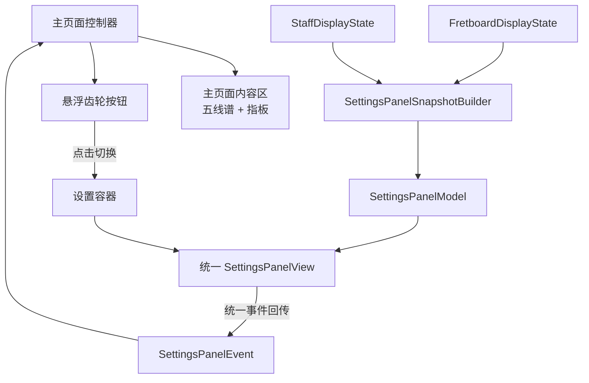

# 方案 D 分阶段计划

## 目标形态

主页面只保留内容区与设置入口：`staffView`、`fretboardHostView`、左上角悬浮齿轮按钮。所有设置项统一进入一个设置容器，并由一套新的共享设置模型驱动。

## 当前代码基线

- 现状是 3 套并行设置体系：离散按钮在 [NoteMaster_Ver_1/Shared/Controls/ButtonPanelModel.swift](NoteMaster_Ver_1/Shared/Controls/ButtonPanelModel.swift)，五线谱 option/slider 在 [NoteMaster_Ver_1/Shared/Controls/StaffControlPanelModel.swift](NoteMaster_Ver_1/Shared/Controls/StaffControlPanelModel.swift)，指板高度 slider 在 [NoteMaster_Ver_1/Shared/Controls/FretboardControlPanelModel.swift](NoteMaster_Ver_1/Shared/Controls/FretboardControlPanelModel.swift)。
- 两个平台控制器当前直接持有 3 个 panel view，并把它们放进主页面滚动内容里：见 [NoteMaster_Ver_1/Platform/iOS/iOSViewController.swift](NoteMaster_Ver_1/Platform/iOS/iOSViewController.swift) 和 [NoteMaster_Ver_1/Platform/macOS/macOSViewController.swift](NoteMaster_Ver_1/Platform/macOS/macOSViewController.swift)。
- 这 3 套 panel 的共同结构已经很明显：section + row + 选择项/slider，因此适合统一成一套 `SettingsPanel` 域模型，而不是继续并排维护 3 个 panel view。

## 阶段 1：统一共享设置域模型

### 目标

新增一套真正的 `SettingsPanel` 共享模型，替代当前三套并行 panel model。

### 主要改动

- 新增 [NoteMaster_Ver_1/Shared/Controls/SettingsPanelModel.swift](NoteMaster_Ver_1/Shared/Controls/SettingsPanelModel.swift)
- 在共享层定义：
  - `SettingsSectionID`
  - `SettingsSection`
  - `SettingsRow`
  - `SettingsChoiceRow`
  - `SettingsSliderRow`
  - `SettingsSelectionStyle`（对齐当前 `singleSelection` / `independent`）
  - `SettingsPresentationStyle`（对齐当前 chips / segmented）
  - `SettingsActionID`（承接 instrument / displayMode / labels / spelling / octave / clef 等离散动作）
  - `SettingsSliderID`（承接 clefScale / clefVerticalTrim / clefAnchorYOffset / verticalHostHeightRatio）
  - `SettingsPanelEvent`（统一为 `.triggerAction(SettingsActionID)` 与 `.setSliderValue(SettingsSliderID, CGFloat)`）
- 把当前散落在旧 model 文件中的状态迁移和 clamp 规则迁到新的共享设置域：
  - 参考 [NoteMaster_Ver_1/Shared/Controls/ButtonPanelModel.swift](NoteMaster_Ver_1/Shared/Controls/ButtonPanelModel.swift)
  - 参考 [NoteMaster_Ver_1/Shared/Controls/StaffControlPanelModel.swift](NoteMaster_Ver_1/Shared/Controls/StaffControlPanelModel.swift)
  - 参考 [NoteMaster_Ver_1/Shared/Controls/FretboardControlPanelModel.swift](NoteMaster_Ver_1/Shared/Controls/FretboardControlPanelModel.swift)

### 设计约束

- 不把业务逻辑重新下放到控制器；状态迁移和范围约束仍然收口在共享层。
- 不保留“ButtonPanel/StaffControlPanel/FretboardControlPanel”命名作为长期真相，这一阶段就把新的 settings 域命名立住。

## 阶段 2：统一快照构建器

### 目标

用一套 `SettingsPanelSnapshotBuilder` 从 `FretboardDisplayState` 和 `StaffDisplayState` 派生完整设置面板模型。

### 主要改动

- 新增 [NoteMaster_Ver_1/Shared/Controls/SettingsPanelSnapshotBuilder.swift](NoteMaster_Ver_1/Shared/Controls/SettingsPanelSnapshotBuilder.swift)
- 将当前 3 套 builder 的派生逻辑合并进新的 builder：
  - [NoteMaster_Ver_1/Shared/Controls/ButtonPanelSnapshotBuilder.swift](NoteMaster_Ver_1/Shared/Controls/ButtonPanelSnapshotBuilder.swift)
  - [NoteMaster_Ver_1/Shared/Controls/StaffControlPanelSnapshotBuilder.swift](NoteMaster_Ver_1/Shared/Controls/StaffControlPanelSnapshotBuilder.swift)
  - [NoteMaster_Ver_1/Shared/Controls/FretboardControlPanelSnapshotBuilder.swift](NoteMaster_Ver_1/Shared/Controls/FretboardControlPanelSnapshotBuilder.swift)
- 统一 section 分组建议：
  - `Fretboard`：instrument、displayMode、labels、spelling、octave
  - `Staff`：clef、clefScale、verticalTrim、anchorYOffset
  - `Layout`：vertical fretboard height（仅 vertical 模式出现）
- 把“某个设置项是否显示”的逻辑收口到 builder：
  - 当前 `verticalHostHeightRatio` 只在 `displayMode == .vertical` 时显示，这个条件不再由控制器层单独解释

### 输出结果

- 控制器以后只需要给 `SettingsPanelModel`
- 平台 view 以后只需要消费统一的 row 类型

## 阶段 3：实现统一平台视图

### 目标

以 `SettingsPanelModel` 为唯一输入，实现新的统一 settings panel 视图，而不是继续保留 3 个平行 panel view。

### 主要改动

- 新增 [NoteMaster_Ver_1/Platform/iOS/Controls/iOSSettingsPanelView.swift](NoteMaster_Ver_1/Platform/iOS/Controls/iOSSettingsPanelView.swift)
- 新增 [NoteMaster_Ver_1/Platform/macOS/Controls/macOSSettingsPanelView.swift](NoteMaster_Ver_1/Platform/macOS/Controls/macOSSettingsPanelView.swift)
- 平台层渲染统一的 2 类 row：
  - `choice row`：支持 `chips` 和 `segmented`
  - `slider row`
- 视觉与交互复用现有成熟实现：
  - 离散 chips 的视觉参考 [NoteMaster_Ver_1/Platform/iOS/Controls/iOSButtonPanelView.swift](NoteMaster_Ver_1/Platform/iOS/Controls/iOSButtonPanelView.swift) 与 macOS 对应文件
  - segmented/slider row 的结构参考 [NoteMaster_Ver_1/Platform/iOS/Controls/iOSStaffControlPanelView.swift](NoteMaster_Ver_1/Platform/iOS/Controls/iOSStaffControlPanelView.swift) 与 macOS 对应文件
- 统一 `accessibilityIdentifier` 命名，避免旧 panel 名称继续泄漏到新结构中

### 实施策略

- 这一阶段先新增，不立刻删除旧 view
- 编译通过后再让控制器切到新 view

## 阶段 4：设置容器与悬浮齿轮入口

### 目标

把统一 settings panel 放进一个独立设置容器，主页面只保留五线谱和指板。

### 主要改动

- 新增平台设置容器：
  - [NoteMaster_Ver_1/Platform/iOS/Controls/iOSSettingsContainerView.swift](NoteMaster_Ver_1/Platform/iOS/Controls/iOSSettingsContainerView.swift)
  - [NoteMaster_Ver_1/Platform/macOS/Controls/macOSSettingsContainerView.swift](NoteMaster_Ver_1/Platform/macOS/Controls/macOSSettingsContainerView.swift)
- 设置容器负责：
  - 遮罩背景
  - 卡片/浮层承载
  - 内嵌 `SettingsPanelView`
  - 点击外部关闭
- `iOSViewController` / `macOSViewController` 改主页面布局：
  - 从滚动内容里移除 `buttonPanelView`、`staffControlPanelView`、`fretboardControlPanelView`
  - 主内容区只保留 `staffView` 和 `fretboardHostView`
  - 新增左上角悬浮齿轮按钮，作为 `scrollView` 的 sibling，而不是 `contentView` 的 child
  - 设置容器也挂在控制器根视图层级，不进入滚动内容

### 关键文件

- [NoteMaster_Ver_1/Platform/iOS/iOSViewController.swift](NoteMaster_Ver_1/Platform/iOS/iOSViewController.swift)
- [NoteMaster_Ver_1/Platform/macOS/macOSViewController.swift](NoteMaster_Ver_1/Platform/macOS/macOSViewController.swift)

## 阶段 5：控制器迁移到统一设置事件流

### 目标

控制器不再分别更新 3 个 panel model / 处理 3 套事件，而是统一为一条 settings 通道。

### 主要改动

- 控制器新增：
  - `settingsButton`
  - `settingsContainerView`
  - `settingsPanelView`
  - `isSettingsPresented`
  - `applySettingsPanelState()`
  - `handleSettingsPanelEvent(_:)`
- 控制器更新逻辑改为：
  - `displayState` / `staffDisplayState` 变化时，统一刷新 `SettingsPanelSnapshotBuilder.makeModel(...)`
  - `SettingsPanelEvent` 统一路由到共享层 `apply(...)`
- 与现有指板布局联动保持不变：
  - `updateFretboardLayoutModeConstraints()` 继续存在
  - 但 `fretboardControlPanelView` 专属的显示/折叠逻辑会被删除，改由 builder 决定是否生成对应 slider row

### 输出结果

- 控制器不再知道“有 3 个 panel”
- 控制器只知道“有一个 settings panel”

## 阶段 6：清理旧 panel 体系并补回归验证

### 目标

删除迁移完成后不再使用的旧文件与旧约束，避免仓库长期保留两套设置体系。

### 清理范围

- 旧平台 view：
  - [NoteMaster_Ver_1/Platform/iOS/Controls/iOSButtonPanelView.swift](NoteMaster_Ver_1/Platform/iOS/Controls/iOSButtonPanelView.swift)
  - [NoteMaster_Ver_1/Platform/iOS/Controls/iOSStaffControlPanelView.swift](NoteMaster_Ver_1/Platform/iOS/Controls/iOSStaffControlPanelView.swift)
  - [NoteMaster_Ver_1/Platform/iOS/Controls/iOSFretboardControlPanelView.swift](NoteMaster_Ver_1/Platform/iOS/Controls/iOSFretboardControlPanelView.swift)
  - macOS 对应 3 个文件
- 旧共享 panel model / snapshot builder：
  - [NoteMaster_Ver_1/Shared/Controls/ButtonPanelModel.swift](NoteMaster_Ver_1/Shared/Controls/ButtonPanelModel.swift)
  - [NoteMaster_Ver_1/Shared/Controls/ButtonPanelSnapshotBuilder.swift](NoteMaster_Ver_1/Shared/Controls/ButtonPanelSnapshotBuilder.swift)
  - [NoteMaster_Ver_1/Shared/Controls/StaffControlPanelModel.swift](NoteMaster_Ver_1/Shared/Controls/StaffControlPanelModel.swift)
  - [NoteMaster_Ver_1/Shared/Controls/StaffControlPanelSnapshotBuilder.swift](NoteMaster_Ver_1/Shared/Controls/StaffControlPanelSnapshotBuilder.swift)
  - [NoteMaster_Ver_1/Shared/Controls/FretboardControlPanelModel.swift](NoteMaster_Ver_1/Shared/Controls/FretboardControlPanelModel.swift)
  - [NoteMaster_Ver_1/Shared/Controls/FretboardControlPanelSnapshotBuilder.swift](NoteMaster_Ver_1/Shared/Controls/FretboardControlPanelSnapshotBuilder.swift)
- 控制器中不再需要的旧约束与可见性切换代码

### 验证

- 静态验证：`ReadLints` + `swiftc -typecheck`
- 手工回归重点：
  - 齿轮按钮显示/隐藏设置容器
  - 设置容器外部点击关闭
  - instrument / display mode / clef / slider 设置都还能正确驱动主页面
  - vertical 模式下高度 slider 仅在设置容器中出现，且行为不变
  - 主页面滚动和指板命中不受设置浮层影响
  - macOS live resize 下设置浮层与主页面布局稳定

## 迁移顺序建议

1. 先落共享 `SettingsPanel` 域和 builder，不碰主页面布局
2. 再实现新平台 view，并让它单独可编译
3. 然后接入设置容器与悬浮齿轮
4. 最后切控制器、删旧文件、做回归

这样可以把风险集中在“设置域统一”本身，避免一开始同时改共享模型、平台 view、主页面布局三层。