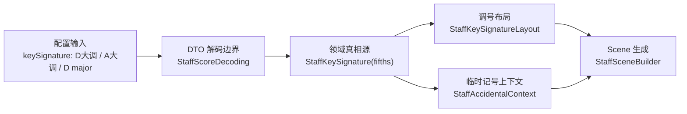

# 调名输入支持分阶段计划

## 目标与边界

- 根因定位：当前共享渲染链已经能正确处理 `fifths: 2` 和 `fifths: 3`，也就是 `D大调` / `A大调` 对应的调号与小节内临时记号语义；缺口在输入边界，而不在渲染层。
- 本轮目标：让配置入口直接支持 `D大调`、`A大调`、`D major`、`A major` 这类命名大调输入，同时保持共享域模型与 scene 生成主链不被输入格式污染。
- 明确不做：不把 `major/minor` 模式引入共享领域层；不改设置 UI；不顺带实现小调；不主动重构 [NoteMaster_Ver_1/Shared/Staff/StaffSceneBuilder.swift](NoteMaster_Ver_1/Shared/Staff/StaffSceneBuilder.swift) 除非验证证明存在真实 scene bug。

## 现状锚点

- 领域真相源已经存在于 [NoteMaster_Ver_1/Shared/Staff/StaffScore.swift](NoteMaster_Ver_1/Shared/Staff/StaffScore.swift)：`StaffKeySignature` 只存 `fifths`，并用 `alteredLetters` / `accidental(for:)` 驱动调号默认升降。
- 输入解析入口集中在 [NoteMaster_Ver_1/Shared/Staff/StaffScoreDecoding.swift](NoteMaster_Ver_1/Shared/Staff/StaffScoreDecoding.swift)：当前 `StaffKeySignature.parse(token:)` 已支持数字与部分简写 token，但还没有把“命名大调输入”收口成统一规则。
- 共享渲染主链已经围绕 `fifths` 工作：
  - [NoteMaster_Ver_1/Shared/Staff/StaffKeySignatureLayout.swift](NoteMaster_Ver_1/Shared/Staff/StaffKeySignatureLayout.swift) 只根据 `fifths` 输出调号 glyph 顺序与垂直位置。
  - [NoteMaster_Ver_1/Shared/Staff/StaffAccidentalContext.swift](NoteMaster_Ver_1/Shared/Staff/StaffAccidentalContext.swift) 只根据 `keySignature` 和 measure override 决定 note accidental 是否显示。
  - [NoteMaster_Ver_1/Shared/Staff/StaffSceneBuilder.swift](NoteMaster_Ver_1/Shared/Staff/StaffSceneBuilder.swift) 只消费 `score.keySignature`，并不需要知道输入时写的是 `2` 还是 `D大调`。
- 当前验证矩阵位于 [NoteMaster_Ver_1/Shared/Staff/StaffValidation.swift](NoteMaster_Ver_1/Shared/Staff/StaffValidation.swift)：已有 `C / G / D / F / Bb` 参考谱例，但尚未把 `A`、命名调号 decode 回归、以及“A 大调 accidental context”纳入护栏。

## 架构原则

- `StaffKeySignature(fifths:)` 继续作为唯一真相源。
- 命名调号只在 DTO 边界解析，不传播进共享领域层和 scene 层。
- 不接受“先临时补 D/A 两个 case”的最小修补；应直接把命名大调解析收口成统一规则，以免后续继续堆散落分支。

## 阶段 1：重构调号输入边界，建立“命名大调 -> fifths”统一解析层

涉及文件：

- [NoteMaster_Ver_1/Shared/Staff/StaffScoreDecoding.swift](NoteMaster_Ver_1/Shared/Staff/StaffScoreDecoding.swift)
- 视实现方式决定是否新增 [NoteMaster_Ver_1/Shared/Staff/StaffKeySignatureParsing.swift](NoteMaster_Ver_1/Shared/Staff/StaffKeySignatureParsing.swift)

动作：

- 把当前 `StaffKeySignature.parse(token:)` 从零散 `switch` 升级为统一的命名大调解析层。
- 一次性明确支持的输入形态：
  - canonical：`{"fifths": 2}`、`{"fifths": 3}`
  - 简写：`"d"`、`"a"`
  - 中文调名：`"D大调"`、`"A大调"`
  - 英文调名：`"D major"`、`"A major"`
  - 带升降记号的完整大调名：`"F# major"`、`"Bb major"`
- 实现上不要只补 `D/A` 两个 token，而是把 major circle-of-fifths 的 `-7...7` 命名别名表或等价解析规则一次收齐，避免后续继续膨胀零散分支。
- 继续保持 decode 结果收敛为 `StaffKeySignature(fifths:)`，不把 `major` 字符串带入领域层。

验收：

- `"D大调"`、`"A大调"`、`"D major"`、`"A major"` 与 `2 / 3` 解码结果完全一致。
- 现有数字、简写、中文“升/降”写法不回归。

注意事项：

- 不要用“粗暴裁剪后缀”的方式处理 `major/大调`，否则未来支持 `minor/小调` 时会埋下歧义。
- 解析规则要显式、可验证、可扩展，而不是依赖模糊字符串清洗。

## 阶段 2：补共享层 fixture，让 decode 回归与 scene 语义回归对齐

涉及文件：

- [NoteMaster_Ver_1/Shared/Staff/StaffScoreFixtures.swift](NoteMaster_Ver_1/Shared/Staff/StaffScoreFixtures.swift)
- [NoteMaster_Ver_1/Shared/Staff/StaffValidation.swift](NoteMaster_Ver_1/Shared/Staff/StaffValidation.swift)
- 若需要更清晰地区分边界验证，可在共享测试/命令行验证入口补轻量 decode 断言，但仍以现有验证体系为主

动作：

- 在验证矩阵里补“命名输入回归”：确保 `"D大调"`、`"A大调"`、`"D major"`、`"A major"` 都能 resolve 到正确 `fifths`。
- 把现有 key signature fixture 从 `C / G / D / F / Bb` 扩到至少包含 `A`；更稳妥的方案是直接覆盖 whole major circle-of-fifths。
- 新增 `A major` 的 accidental context fixture，明确覆盖 `F# / C# / G#` 的调号默认抑制、显式 `natural` 再显示、跨小节 reset。
- 保留 `D major` 参考谱例，继续校验 2 个 sharp 的数量、顺序、垂直位置和 note 区不重叠。

验收：

- 命名调号输入不只是“能 decode”，而且 scene 输出层面对 `2升 / 3升` 也有自动验证护栏。
- `StaffValidationRunner` 能同时证明“decode 边界正确”和“共享渲染语义正确”。

## 阶段 3：把示例配置和 demo 入口切到“可读调名输入”，但不改共享渲染主链

涉及文件：

- [NoteMaster_Ver_1/Shared/Staff/StaffScoreFixtures.swift](NoteMaster_Ver_1/Shared/Staff/StaffScoreFixtures.swift)
- 如果平台层存在直接内嵌 JSON 配置，再按实际引用点少量同步

动作：

- 将 demo / fixture 中对外展示的示例写法切到更符合使用者直觉的命名大调输入，例如 `"D大调"`、`"A大调"`。
- 保持共享渲染链不变：
  - 不主动修改 [NoteMaster_Ver_1/Shared/Staff/StaffSceneBuilder.swift](NoteMaster_Ver_1/Shared/Staff/StaffSceneBuilder.swift)
  - 不主动修改 [NoteMaster_Ver_1/Shared/Staff/StaffKeySignatureLayout.swift](NoteMaster_Ver_1/Shared/Staff/StaffKeySignatureLayout.swift)
  - 不主动修改 [NoteMaster_Ver_1/Shared/Staff/StaffAccidentalContext.swift](NoteMaster_Ver_1/Shared/Staff/StaffAccidentalContext.swift)
- 只有在阶段 2 的验证显示真实 scene 问题时，才针对性修共享渲染链，而不是预防式重写。

验收：

- 示例配置改成命名大调后，Treble / Bass 的调号显示、note accidental 抑制和跨小节 reset 结果与 `fifths` 输入完全一致。
- `noteheadsOnly / fullNotation` 切换行为不受影响。

## 阶段 4：为未来小调支持预留扩展口，但本轮不引入 mode 到领域层

涉及文件：

- 首先约束在 [NoteMaster_Ver_1/Shared/Staff/StaffScoreDecoding.swift](NoteMaster_Ver_1/Shared/Staff/StaffScoreDecoding.swift)
- 若解析规则变复杂，可独立提取 DTO 级辅助对象，但不改 [NoteMaster_Ver_1/Shared/Staff/StaffScore.swift](NoteMaster_Ver_1/Shared/Staff/StaffScore.swift) 的核心模型

动作：

- 在命名调号解析实现中为未来 `minor/小调` 留扩展口，但本轮不真正实现小调。
- 明确当前 bare token 兼容策略，例如 `"a"` 目前仍按既有行为解为 `A大调`；后续若引入小调，再单独设计去歧义规则。
- 避免现在就把 `mode`、调式标签、UI 展示诉求提前污染到领域层。

验收：

- 本轮完成后，结构上不会把未来 `B小调`、`F#小调` 等输入支持堵死。
- 现有 `fifths` 驱动的共享渲染骨架保持稳定，不因提前引入 `mode` 而复杂化。

## 实施顺序建议

1. 先做阶段 1，先把“命名调号解析”收口，再补验证，不要一边继续堆 token case 一边试图修回归。
2. 再做阶段 2，把 decode 回归和 scene 回归都补齐，确保不是“看起来能跑”，而是“有护栏可重复验证”。
3. 然后做阶段 3，把示例入口切到命名大调写法，验证真实使用路径。
4. 最后只做阶段 4 的结构预留，不在这一轮把小调、UI、标签显示一起扩进去。

## 范围控制

- 本轮只做“命名大调输入支持”，不做小调、调式标签、settings UI 选择器。
- 不把 `major/minor` 语义塞进共享领域模型；共享域模型仍只围绕 `StaffKeySignature(fifths:)` 运作。
- 不主动修改 scene 生成主链，除非阶段 2 的验证明确证明存在根因级 scene 缺陷。

