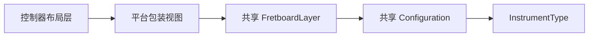

# 跨平台指板组件计划

## 现状与落点

- 现有页面入口很简单，组件接入点明确集中在 [iOSViewController.swift](/Users/shaun/Library/Mobile Documents/com~~apple~~CloudDocs/Develop/NoteMaster_Ver_1/NoteMaster_Ver_1/Platform/iOS/iOSViewController.swift) 和 [macOSViewController.swift](/Users/shaun/Library/Mobile Documents/com~~apple~~CloudDocs/Develop/NoteMaster_Ver_1/NoteMaster_Ver_1/Platform/macOS/macOSViewController.swift)。
- 窗口创建逻辑已经足够薄，[iOSAppDelegate.swift](/Users/shaun/Library/Mobile Documents/com~~apple~~CloudDocs/Develop/NoteMaster_Ver_1/NoteMaster_Ver_1/Platform/iOS/iOSAppDelegate.swift) 和 [macOSAppDelegate.swift](/Users/shaun/Library/Mobile Documents/com~~apple~~CloudDocs/Develop/NoteMaster_Ver_1/NoteMaster_Ver_1/Platform/macOS/macOSAppDelegate.swift) 原则上不需要为了指板组件改结构。
- 当前没有共享目录，最合适的新代码落点是 `NoteMaster_Ver_1/Shared/Fretboard`，避免把几何和绘制逻辑复制到两个平台目录里。

## 目标架构

## 阶段 1：建立共享目录与类型边界

- 新增共享目录 `NoteMaster_Ver_1/Shared/Fretboard`，把“乐器定义、配置、绘制”放在同一功能域内，先不要过早拆成更多层级。
- 新增 `InstrumentType.swift`：定义 `guitar6`、`bass4`、`bass5`，并提供统一的 `stringCount`。
- 新增 `FretboardConfiguration.swift`：承载 `instrument`、`maxFret`、`preferredHeight`，并预留后续扩展位，例如边距、颜色、线宽、marker 尺寸比例。
- 这里先把“组件高度可配置”明确为配置数据，而不是硬编码在控制器里；但最终约束仍由控制器应用。

## 阶段 2：先抽清楚几何规则，再进入绘制

- 统一定义品位范围为 `0...maxFret`，默认 `maxFret = 12`。
- 明确 `0` 品的角色：它是显示范围起点，但不是 marker 区；marker 只出现在 `3/5/7/9/12` 这些“品格区域”的中心。
- 定义横向布局规则：最左侧为上弦枕/零品起点，之后按品格区间均分或按你后续决定的比例算法布局；首版建议先用等宽区间，保证实现简单且结果可控。
- 定义纵向布局规则：弦线数量由 `InstrumentType` 决定，弦线在可绘制高度内等间距分布。
- 定义 marker 规则：`3/5/7/9` 为单圆点，`12` 为双圆点，双圆点在同一品格区内沿纵向上下分布，并避开中间弦线重叠感。
- 把这些几何计算集中在共享绘制核心里，避免 iOS/macOS 各算一套。

## 阶段 3：实现共享 `FretboardLayer`

- 新增 `FretboardLayer.swift`，由它统一持有 `FretboardConfiguration`，并在 `bounds` 或配置变化时触发重绘。
- `FretboardLayer` 负责的内容只包括：背景、指板边界、弦线、品丝、上弦枕、marker。
- 首版优先采用“单个自定义 `CALayer` 统一绘制”的方式，而不是拆很多 `CAShapeLayer`，原因是当前是静态指板，结构更简单，也更容易保证双平台一致性。
- 在 `FretboardLayer` 内部抽出私有几何辅助方法，例如：
  - `fretSegmentRect(at:)`
  - `xPositionForFret(_:)`
  - `yPositionForString(_:)`
  - `markerCenters(for:)`
- 这样后续如果增加命中测试、按弦高亮或更多 marker，只扩展共享核心，不需要重写平台代码。

## 阶段 4：实现双平台薄包装视图

- 新增 [iOSFretboardView.swift](/Users/shaun/Library/Mobile Documents/com~~apple~~CloudDocs/Develop/NoteMaster_Ver_1/NoteMaster_Ver_1/Platform/iOS/iOSFretboardView.swift)，继承 `UIView`。
- 新增 [macOSFretboardView.swift](/Users/shaun/Library/Mobile Documents/com~~apple~~CloudDocs/Develop/NoteMaster_Ver_1/NoteMaster_Ver_1/Platform/macOS/macOSFretboardView.swift)，继承 `NSView`。
- 两个平台包装视图只做 3 件事：
  - 持有共享 `FretboardLayer`
  - 在尺寸变化时同步 layer 的 `frame/bounds`
  - 暴露统一配置入口，供控制器设置乐器类型、最高品和高度策略
- 不在包装视图里写任何业务几何；这样后面扩到手势、点击、hover 时，也能保持平台差异只留在事件转译层。

## 阶段 5：控制器接入与布局落地

- 在 [iOSViewController.swift](/Users/shaun/Library/Mobile Documents/com~~apple~~CloudDocs/Develop/NoteMaster_Ver_1/NoteMaster_Ver_1/Platform/iOS/iOSViewController.swift) 中，用 `iOSFretboardView` 替换当前演示用 `helloLabel` 的主展示区域。
- 在 [macOSViewController.swift](/Users/shaun/Library/Mobile Documents/com~~apple~~CloudDocs/Develop/NoteMaster_Ver_1/NoteMaster_Ver_1/Platform/macOS/macOSViewController.swift) 中，做同样的接入。
- 布局规则统一为：
  - 宽度由控制器约束到父视图可视范围
  - iOS 优先贴 `safeArea` 左右边
  - macOS 贴宿主 `view` 左右边
  - 高度由控制器创建固定高度约束，常量取自组件配置的 `preferredHeight`
- 控制器职责只保留“创建组件、传入配置、添加约束”，不承担任何绘制或几何计算。

## 阶段 6：验证与收口

- 先用默认配置验证一轮：`guitar6 + maxFret 12 + 可见 marker`。
- 再切换到 `bass4`、`bass5` 验证弦数变化是否会破坏 marker 布局和视觉平衡。
- 验证窗口/屏幕尺寸变化时，layer 是否随包装视图尺寸正确重绘，尤其是横向拉伸后品格和圆点是否保持居中。
- 检查控制器和共享层之间是否仍然职责清晰：如果出现控制器里开始写弦距、品位、圆点位置计算，就说明边界跑偏，需要收回到共享层。

## 实施顺序建议

1. 先建共享类型和配置，不碰控制器接入。
2. 再完成 `FretboardLayer` 的静态绘制，把 `0...12`、弦数和 marker 画对。
3. 然后补双平台包装视图，把 layer 生命周期和尺寸同步跑通。
4. 最后替换两个 `ViewController` 里的占位内容，并做三种乐器的显示验证。

## 风险与提前规避

- 最大风险不是绘制本身，而是把“页面布局”和“指板几何”混在控制器里；本计划通过共享 layer 隔离这个风险。
- 第二个风险是 `0` 品与 marker 的坐标语义不统一；计划里先单独定义“品线”和“品格区域”来避免后续返工。
- 第三个风险是双平台包装视图各自偷偷长逻辑；因此平台视图只允许做 layer 宿主和事件桥接，不做绘制规则判断。

