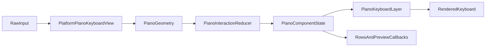
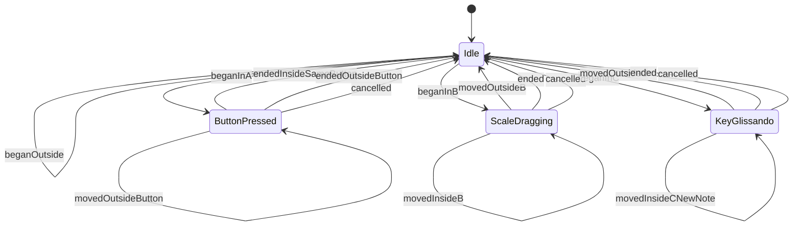
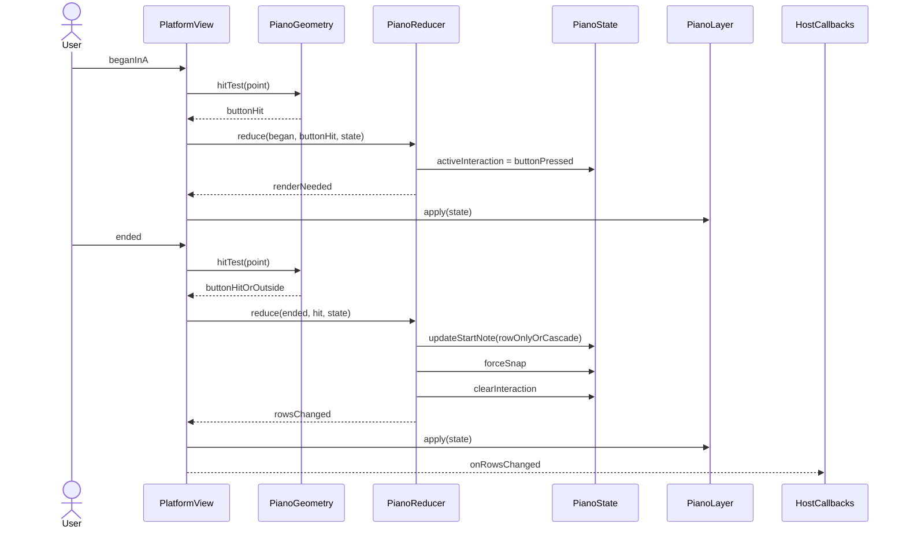
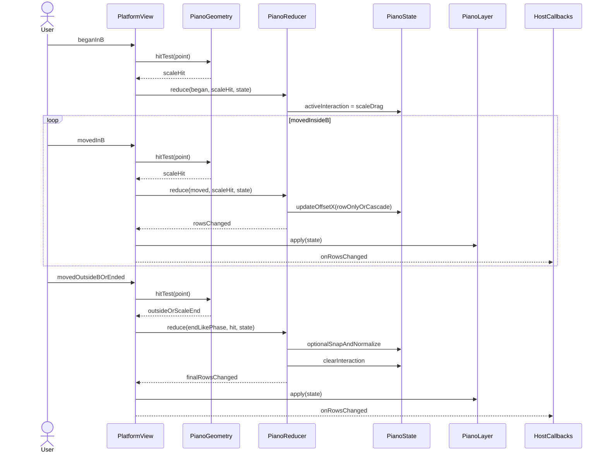
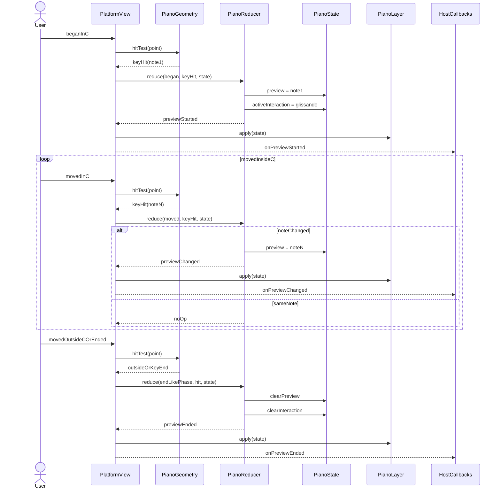

# 钢琴键盘组件分阶段计划

## 目标与边界

- 新组件首轮范围同时覆盖 `iOS UIView` 与 `macOS NSView`，共同采用“组件内聚交互语义 + Shared 几何/状态机/Layer 底座”的实现方式。
- 交互边界按已确认方案固定：
  - `A` 区是左右步进按钮，按半音移动，并且总是自动吸附。
  - `B` 区是仅显示自然音刻度的滚动区，支持连续像素拖动；指针离开 `B` 后立即停止；是否吸附由开关控制。
  - `C` 区是琴键区，仅负责点击/滑音预览，不触发滚动。
- 状态模型固定为“每行独立 `startNote` + 每行 `offsetX` + 每行 `movementScope`”，其中 `startNote` 允许黑键，拖动以 `offsetX` 为主，必要时在结束阶段做归一化。
- 首轮不做系统手势封装，不依赖 `UIScrollView` 或 `NSScrollView` 处理 `B` 区滚动；平台壳层只接原始输入与坐标归一化，Shared 内核保持跨平台复用。
- 实施顺序保持 `Shared 内核 -> iOS 薄壳 -> macOS 薄壳 -> 双平台接入验证`，确保语义先稳定，再处理平台差异。

## 现有代码锚点

- 复用现有平台薄壳 + backing layer 模式：[NoteMaster_Ver_1/Platform/iOS/iOSFretboardView.swift](NoteMaster_Ver_1/Platform/iOS/iOSFretboardView.swift)、[NoteMaster_Ver_1/Platform/macOS/macOSFretboardView.swift](NoteMaster_Ver_1/Platform/macOS/macOSFretboardView.swift)、[NoteMaster_Ver_1/Platform/iOS/iOSStaffView.swift](NoteMaster_Ver_1/Platform/iOS/iOSStaffView.swift)、[NoteMaster_Ver_1/Platform/macOS/macOSStaffView.swift](NoteMaster_Ver_1/Platform/macOS/macOSStaffView.swift)。
- 复用 Shared 绘制组织方式与禁用隐式动画做法：[NoteMaster_Ver_1/Shared/Fretboard/FretboardLayer.swift](NoteMaster_Ver_1/Shared/Fretboard/FretboardLayer.swift)。
- 参考现有几何命中入口与命中结果建模：[NoteMaster_Ver_1/Shared/Fretboard/FretboardGeometry.swift](NoteMaster_Ver_1/Shared/Fretboard/FretboardGeometry.swift)、[NoteMaster_Ver_1/Shared/Fretboard/FretboardInteraction.swift](NoteMaster_Ver_1/Shared/Fretboard/FretboardInteraction.swift)。
- 利用已有音高模型承接钢琴音高计算：[NoteMaster_Ver_1/Shared/Fretboard/NotePitch.swift](NoteMaster_Ver_1/Shared/Fretboard/NotePitch.swift)。
- 组件接入层参考当前控制器组织与主内容区编排：[NoteMaster_Ver_1/Platform/iOS/iOSViewController.swift](NoteMaster_Ver_1/Platform/iOS/iOSViewController.swift)、[NoteMaster_Ver_1/Platform/macOS/macOSViewController.swift](NoteMaster_Ver_1/Platform/macOS/macOSViewController.swift)、[NoteMaster_Ver_1/Platform/iOS/Controls/iOSTargetNotePromptView.swift](NoteMaster_Ver_1/Platform/iOS/Controls/iOSTargetNotePromptView.swift)、[NoteMaster_Ver_1/Platform/macOS/Controls/macOSTargetNotePromptView.swift](NoteMaster_Ver_1/Platform/macOS/Controls/macOSTargetNotePromptView.swift)。
- 工程采用文件系统同步根组，新增 `NoteMaster_Ver_1/` 下源码通常无需额外维护工程树，但落地时仍要确认目标成员关系与编译可见性：[NoteMaster_Ver_1.xcodeproj/project.pbxproj](NoteMaster_Ver_1.xcodeproj/project.pbxproj)。

```11:20:NoteMaster_Ver_1/Platform/iOS/iOSFretboardView.swift
final class iOSFretboardView: UIView {
    private var lastMeasuredPrimaryDimension: CGFloat?

    var configuration: FretboardConfiguration {
        didSet {
            guard oldValue != configuration else {
                return
            }
```

```53:55:NoteMaster_Ver_1/Platform/iOS/iOSFretboardView.swift
override class var layerClass: AnyClass {
    FretboardLayer.self
}
```

```104:106:NoteMaster_Ver_1/Platform/macOS/macOSFretboardView.swift
override func makeBackingLayer() -> CALayer {
    FretboardLayer()
}
```

```186:190:NoteMaster_Ver_1/Shared/Fretboard/FretboardLayer.swift
CATransaction.begin()
CATransaction.setDisableActions(true)
updates()
CATransaction.commit()
```

## 总体设计




- `Platform/iOS/Controls/` 与 `Platform/macOS/Controls/` 都只保留薄壳平台视图，职责分别与 `iOSFretboardView` / `macOSFretboardView` 一致：接原始输入、做必要坐标归一化、更新 backing layer、向外发送高层回调。
- `Shared/Piano/` 承载以下核心类型：
  - `PianoConfiguration`：白键宽、行高、行间距、黑键比例、A/B 区尺寸、吸附开关等。
  - `PianoRowState` / `PianoComponentState`：每行 `startNote`、`offsetX`、`movementScope`，以及当前 `preview`、`activeInteraction`。
  - `PianoInteraction`：`phase`、`zone`、`hit result`、`semantic event`。
  - `PianoGeometry`：布局计算、A/B/C 命中、白键/黑键映射、吸附边界计算。
  - `PianoInteractionReducer`：`A/B/C` 状态机推进，只输出 `nextState + semanticEvents`。
  - `PianoScene` / `PianoSceneBuilder`：按 bounds 和 state 生成可绘制场景。
  - `PianoKeyboardLayer` + `PianoRowLayer`：最少 layer 绘制实现，建议控制为根 layer + 每行一个 row layer。
- 对外 API 采用高层语义回调，而不是抛 raw hit：
  - `onRowsChanged([PianoRowState])`
  - `onPreviewStarted/Changed/Ended`
  - 这样让 `A/B/C` 规则固定在组件内部，避免把状态机堆回控制器。

## 关键业务时序

- 下面这些时序不是“建议行为”，而是本轮实现必须固化的业务约束；`Geometry` 负责命中，`Reducer` 负责推进状态机，平台壳层只负责接原始输入并调度 Shared 内核。
- 交互锁区规则固定：
  - 一次输入序列只会锁定一种模式：`A` 区按钮、`B` 区拖动、`C` 区滑音三者互斥。
  - `B` 区拖动中不会切到 `C` 区滑音；离开 `B` 立即结束拖动。
  - `C` 区滑音中不会切到 `B` 区滚动；离开 `C` 立即结束预览。
- 状态修改职责固定：
  - `A` 区主要改 `startNote`
  - `B` 区主要改 `offsetX`
  - `C` 区只改 `preview`

### 总交互状态机



### A区按钮步进时序

- `began` 命中左/右按钮后进入按下态，记录 `rowIndex + direction + movementScope`。
- `ended` 且仍在同一按钮内时，执行一次半音步进：
  - `rowOnly`：只改当前行
  - `cascade`：把同一语义增量传播到所有关联行
- `A` 区动作总是自动吸附，不受 `snapEnabled` 开关影响。
- 如果抬起时已不在原按钮内，则只清除按下态，不触发步进。



### B区刻度拖动时序

- `began` 命中 `B` 区后建立 drag session，记录拖动起点与受影响行集合。
- `moved` 且仍在 `B` 区内时，按像素连续更新 `offsetX`：
  - `rowOnly`：只改当前行 `offsetX`
  - `cascade`：同一 `deltaX` 同步传播到所有关联行
- `moved` 离开 `B` 区时，立即结束本次拖动，不继续跟踪区域外输入。
- `ended/cancelled` 或“离开 `B`”结束时：
  - `snapEnabled = false`：保留当前 `offsetX`
  - `snapEnabled = true`：吸附到最近目标边界，并可在 reducer 内做 `startNote + residualOffsetX` 的归一化



### C区琴键滑音时序

- `began` 命中 `C` 区某个键时开始预览，并建立 `glissando` 会话。
- `moved` 且仍在 `C` 区内时：
  - 命中音未变化：不发回调、不重算滚动
  - 命中音变化：仅更新 `previewNote`，发出 `onPreviewChanged`
- `moved` 离开 `C`、`ended` 或 `cancelled` 时，结束预览并清空 `preview`。
- `C` 区全过程绝不修改 `offsetX`，因此不会导致键盘滚动。



## 分阶段实施

### 阶段 1：Shared 状态与事件模型

- 新建 `Shared/Piano/` 目录，先落状态、事件、配置，不碰平台接入。
- 明确并固定以下数据结构：
  - `PianoMovementScope`：`.rowOnly` / `.cascade`
  - `PianoZone`：`.buttonLeft` / `.buttonRight` / `.scale` / `.keys` / `.outside`
  - `PianoEventPhase`：与 `FretboardEventPhase` 对齐
  - `PianoRowState`：`startNote`、`offsetX`、`movementScope`
  - `PianoPreviewState`、`PianoInteractionState`
  - `PianoSemanticEvent`
- 在这一阶段就把“锚点 + 残差”模型定死：
  - `A` 区主要改 `startNote`
  - `B` 区主要改 `offsetX`
  - `C` 区只改 `preview`
- 产出若干纯 Shared 测试样例或最小断言用例，覆盖：黑键起始音、级联传播、吸附量化、`C` 区不改滚动。

### 阶段 2：几何与场景构建

- 新增 `PianoGeometry` / `PianoSceneBuilder`，把下列几何问题先完全抽象清楚：
  - 多行总 bounds 下每一行 `A/B/C` 子区域矩形
  - 基于 `startNote + offsetX + whiteKeyWidth` 计算当前白键/黑键布局
  - 白键刻度文本与刻度线位置，只显示自然音，不显示黑键刻度
  - 黑键起始时左边界可能落在白键刻度之间的情况
  - 拖动结束时吸附到最近半音边界，或可选只归一化到最近可绘制锚点
- 命中测试输出统一的 `PianoHitResult`，包含：`rowIndex`、`zone`、`note`、`buttonDirection`、`isInsideActiveZone`。
- 这一阶段先不碰视图，只通过几何层保证 `A/B/C` 区命中和音高映射稳定。

### 阶段 3：交互状态机 Reducer

- 新增 `PianoInteractionReducer`，只接受：当前 `state`、`rawEvent`、`hitResult`、`configuration`，输出 `PianoReduction`。
- 固化三套规则：
  - `A` 区：`began` 进入按钮按下态；`ended` 且仍命中同按钮时步进半音并强制吸附；支持按 `movementScope` 做单行/级联传播。
  - `B` 区：`began` 建立 drag session；`moved` 连续更新 `offsetX`；离开 `B` 立即结束；`ended/cancelled` 时根据 `snapEnabled` 吸附。
  - `C` 区：`began` 开始预览；`moved` 时仅在音变化时更新；离开 `C` 或 `ended/cancelled` 时结束；绝不改 `offsetX`。
- 这一阶段同时把“交互锁区”机制定下来：一次输入序列只属于一种模式，不在 `B` 与 `C` 之间中途切换。

### 阶段 4：最少 Layer 绘制栈

- 新增 `PianoKeyboardLayer` 和 `PianoRowLayer`，目标是“根 layer + 每行一个 row layer”，避免按键级别 layer。
- 每个 row layer 一次性绘制：
  - `A` 区按钮背景与箭头
  - `B` 区刻度、自然音标签、当前窗口参考线
  - `C` 区白键、黑键、当前预览/按下高亮
- 统一沿用现有 `FretboardLayer` 的无隐式动画模式；所有 frame/state 更新都走 `CATransaction.setDisableActions(true)`。
- 如果首版发现 `A/B/C` 的高亮或预览叠层过于复杂，再增加一个轻量 overlay layer，但仍保持“按行”而不是“按键”拆层。

### 阶段 5：iOS 薄壳 UIView

- 新增 `Platform/iOS/Controls/iOSPianoKeyboardView.swift`，结构参考 [NoteMaster_Ver_1/Platform/iOS/iOSFretboardView.swift](NoteMaster_Ver_1/Platform/iOS/iOSFretboardView.swift)：
  - `override class var layerClass` 返回 `PianoKeyboardLayer`
  - `touchesBegan/Moved/Ended/Cancelled` 直接接 raw input
  - 内部调用 `PianoGeometry + PianoInteractionReducer`
  - 将 `PianoComponentState` 回写到 backing layer
  - 对外只暴露高层回调和必要配置属性
- 组件 API 建议首版保持半受控：
  - 外部可设置 `rows` / `configuration`
  - 组件内部也能在交互时即时更新内部状态
  - 每次变化通过 `onRowsChanged` 回传，供宿主决定是否持久化
- 不在这一层接 `UIScrollView` 或 `UIGestureRecognizer`，避免与 `C` 区滑音语义冲突。

### 阶段 6：macOS 薄壳 NSView

- 新增 `Platform/macOS/Controls/macOSPianoKeyboardView.swift`，结构参考 [NoteMaster_Ver_1/Platform/macOS/macOSFretboardView.swift](NoteMaster_Ver_1/Platform/macOS/macOSFretboardView.swift) 与 [NoteMaster_Ver_1/Platform/macOS/macOSStaffView.swift](NoteMaster_Ver_1/Platform/macOS/macOSStaffView.swift)：
  - `override func makeBackingLayer() -> CALayer` 返回 `PianoKeyboardLayer`
  - `mouseDown/Dragged/Up` 直接接 raw mouse input
  - 平台层负责把 AppKit 坐标转换成 Shared 几何语义；如果 Shared 统一采用 top-left 语义，则比照现有 `contextNormalizationMode` 做点位与绘制归一化
  - 处理 `viewDidMoveToWindow`、`setFrameSize`、必要时的 live resize 刷新，避免窗口缩放时渲染滞后
- 对外 API 与 iOS 保持一致：同名 `rows/configuration` 属性，同步的 `onRowsChanged` / `onPreview*` 回调。
- 不在这一层借助 `NSScrollView` 处理 `B` 区拖动，避免滚动容器与 `C` 区滑音语义冲突。

### 阶段 7：双平台控制器级演示接入

- 在 [NoteMaster_Ver_1/Platform/iOS/iOSViewController.swift](NoteMaster_Ver_1/Platform/iOS/iOSViewController.swift) 与 [NoteMaster_Ver_1/Platform/macOS/macOSViewController.swift](NoteMaster_Ver_1/Platform/macOS/macOSViewController.swift) 中各选一个最小接入位置做 demo 或功能入口，优先采用“与现有主内容区并列”的方式，而不是立即深度嵌入训练器状态机。
- 建议初期双平台都只做：
  - 创建若干默认 `rows`
  - 监听 `onRowsChanged`
  - 监听 `onPreview*`
  - 在控制台或一个简易标签中观察行为
- 接入目标是先验证平台壳层与 Shared 内核的闭环一致，再评估是否与现有 `trainer`、`target prompt` 或页面切换状态联动。

### 阶段 8：验证与收口

- 验证清单围绕已确认语义：
  - 黑键起始音是否能正确绘制和命中
  - 多行在 `rowOnly` / `cascade` 下是否按预期传播
  - `B` 区连续拖动是否平滑，离开区域是否立刻停止
  - `C` 区滑音是否只改预览、不引发滚动
  - `snapEnabled` 开关在 `B` 区拖动结束与 `A` 区按钮步进后的行为是否符合预期
  - layer 数量是否保持在低位，且不存在隐式动画
- 双平台补充检查：
  - macOS 坐标归一化是否正确，`A/B/C` 区命中与 iOS 语义一致
  - macOS 窗口 live resize / backing scale 变化后是否能稳定刷新
  - 双平台回调顺序是否一致，避免 iOS / macOS 出现不同步的 rows 或 preview 生命周期
- 这一阶段补充 `ReadLints` 检查新增文件，并视情况补最小单元测试或 reducer 几何测试。

### 阶段 9：后续扩展（暂不纳入首轮交付）

- 风格扩展：后续再考虑更复杂的主题、标记层、外部选中态、MIDI 事件输出。
- 与训练器集成：在组件本身稳定后，再决定是否接入现有 `trainerDisplayState` / `pageDisplayState` 体系。

## 关键实现决策

- 选型定为“方案 2 的语义封装”，但**不**做成单体 `UIView`；内部按当前工程习惯拆成 Shared 几何 / Shared reducer / Shared layer。
- 首轮范围同时包含 iOS 和 macOS，但实施顺序保持 `Shared -> iOS -> macOS -> 双平台验证`，避免在语义尚未稳定前同步调两端平台细节。
- `macOS` 不单做“末尾补齐”，而是从 Shared 类型命名、坐标语义、layer 刷新入口开始就按双平台对齐设计。
- 为了控制复杂度，先确保交互语义正确，再逐步优化绘制细节和后续跨平台复用。

