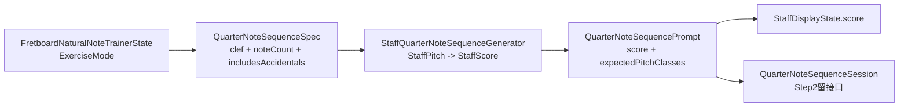

# 随机四分音训练计划

## 目标

- 在 [NoteMaster_Ver_1/Shared/Fretboard/FretboardNaturalNoteTrainer.swift](NoteMaster_Ver_1/Shared/Fretboard/FretboardNaturalNoteTrainer.swift) 新增 `quarterNoteSequence` 训练模式，参数为 `clef`、`noteCount`、`includesAccidentals`。
- `includesAccidentals == false` 时只生成自然音；`includesAccidentals == true` 时允许半音。第一版固定为升号拼写，不生成降号拼写。
- 第一步只产出 shared `QuarterNoteSequencePrompt`：`score + expectedPitchClasses`，不接顺序判题、不接设置面板。

## 现有接缝

- [NoteMaster_Ver_1/Shared/Controls/StaffDisplayState.swift](NoteMaster_Ver_1/Shared/Controls/StaffDisplayState.swift) 的 `score` 已经是五线谱内容真相源；controller 只要写入 `staffDisplayState.score`，`sceneProvider` 就会推动平台 `*StaffView` 渲染。
- [NoteMaster_Ver_1/Shared/Fretboard/FretboardNaturalNoteTrainer.swift](NoteMaster_Ver_1/Shared/Fretboard/FretboardNaturalNoteTrainer.swift) 当前只围绕单个 `targetPitchClass` 和 `handle(hitResult:configuration:)` 工作，适合加 `ExerciseMode`，但不适合直接承载 `StaffScore` 生成细节。
- [NoteMaster_Ver_1/Platform/iOS/iOSViewController.swift](NoteMaster_Ver_1/Platform/iOS/iOSViewController.swift) 与 [NoteMaster_Ver_1/Platform/macOS/macOSViewController.swift](NoteMaster_Ver_1/Platform/macOS/macOSViewController.swift) 目前都已有 `staffDisplayState` / `applyStaffDisplayState()`，后续显示随机谱面可以复用这条链路，不必先改 [NoteMaster_Ver_1/Shared/Controls/PageDisplayState.swift](NoteMaster_Ver_1/Shared/Controls/PageDisplayState.swift) 或 [NoteMaster_Ver_1/Shared/Controls/SettingsPanelModel.swift](NoteMaster_Ver_1/Shared/Controls/SettingsPanelModel.swift)。

## 结构

## 阶段 1：共享域扩展，只做生成输出

- 在 [NoteMaster_Ver_1/Shared/Fretboard/FretboardNaturalNoteTrainer.swift](NoteMaster_Ver_1/Shared/Fretboard/FretboardNaturalNoteTrainer.swift) 增加 `ExerciseMode`、`QuarterNoteSequenceSpec`、`QuarterNoteSequencePrompt`；保留现有 `Prompt`、`targetPitchClass`、`handle(...)` 单目标路径不变。
- 新增生成入口，例如 `generateQuarterNoteSequencePrompt(spec:)`；只返回 `QuarterNoteSequencePrompt`，不触发平台 UI，不改 controller。
- 明确第一版 accidentals 语义：
- `false`：只允许 `C D E F G A B`
- `true`：允许 `C# D# F# G# A#`，不生成 `Db Eb Gb Ab Bb`
- 在同一文件先留下第二步接口占位：`QuarterNoteSequenceSession`、`QuarterNoteSequenceAnswerResult`、`handleQuarterNoteSequenceAnswer(_:)` 的注释/打桩，先不实现判题。

## 阶段 2：抽 shared Staff generator，生成 `StaffScore`

- 新增 [NoteMaster_Ver_1/Shared/Staff/StaffQuarterNoteSequenceGenerator.swift](NoteMaster_Ver_1/Shared/Staff/StaffQuarterNoteSequenceGenerator.swift)。
- 输入为 `QuarterNoteSequenceSpec` + `RandomNumberGenerator`；内部直接随机 `StaffPitch`，不要先随机 `PitchClass` 再反推书写音。
- 内部按 `StaffClef` 维护候选池，第一版把范围收在默认可视区附近，避免大量加线；范围逻辑留在 generator 内部，不泄漏到 controller。
- 生成结果全部映射为 `StaffScoreNote(duration: .quarter)`，按每 4 个音拆成一个 `StaffMeasure`，最终输出：
- `StaffScore`
- `expectedPitchClasses: [PitchClass]`
- 这一层只依赖 [NoteMaster_Ver_1/Shared/Staff/StaffScore.swift](NoteMaster_Ver_1/Shared/Staff/StaffScore.swift) 的类型，不依赖平台 view。

## 阶段 3：shared 验证补齐

- 扩展 [NoteMaster_Ver_1/Shared/Fretboard/FretboardValidation.swift](NoteMaster_Ver_1/Shared/Fretboard/FretboardValidation.swift)，通过 trainer 新入口验证：
- `noteCount` 正确
- `score.clef` 与 spec 一致
- 所有 note 的 `duration == .quarter`
- `expectedPitchClasses.count == score.notes.count`
- `includesAccidentals == false` 时所有输出都为自然音
- `includesAccidentals == true` 时候选池允许半音，但仍不出现降号拼写
- 回归现有单音 trainer 夹具，确保旧的 `single target` 训练路径不被新 mode 破坏。
- 第一轮不改 [NoteMaster_Ver_1/Shared/Staff/StaffValidation.swift](NoteMaster_Ver_1/Shared/Staff/StaffValidation.swift)，除非实现过程中暴露出 staff 渲染层的 accidental / ledger line 语义缺口。

## 阶段 4：控制器接线显示谱面（后续步骤，不在第一步实现）

- 在 [NoteMaster_Ver_1/Platform/iOS/iOSViewController.swift](NoteMaster_Ver_1/Platform/iOS/iOSViewController.swift) 和 [NoteMaster_Ver_1/Platform/macOS/macOSViewController.swift](NoteMaster_Ver_1/Platform/macOS/macOSViewController.swift) 增加一个共享 helper，把 `QuarterNoteSequencePrompt` 落到现有五线谱链路。
- 最小接线点是：
- 同步 `staffDisplayState.configuration.clef`
- 写入 `staffDisplayState.score = prompt.score`
- 复用现有 `applyStaffDisplayState()`
- 这一阶段仍可不动 [NoteMaster_Ver_1/Shared/Controls/PageDisplayState.swift](NoteMaster_Ver_1/Shared/Controls/PageDisplayState.swift) 和 [NoteMaster_Ver_1/Shared/Controls/SettingsPanelModel.swift](NoteMaster_Ver_1/Shared/Controls/SettingsPanelModel.swift)，因为当前默认 `topContentMode == .staff` 已足以承载谱面显示。

## 阶段 5：顺序判题与模式曝光（第二步/第三步）

- 实现 `QuarterNoteSequenceSession.currentIndex` 与 `handleQuarterNoteSequenceAnswer(_:)`，按 `expectedPitchClasses` 顺序判题。
- 决定答题输入来源：继续用指板点击，还是新增自然音条/其他输入；若继续用指板，复用当前 controller 的 `handleFretboardTrainerHitResult` 分流。
- 若后续需要让用户切换训练模式，再扩展 [NoteMaster_Ver_1/Shared/Controls/SettingsPanelModel.swift](NoteMaster_Ver_1/Shared/Controls/SettingsPanelModel.swift) / [NoteMaster_Ver_1/Shared/Controls/SettingsPanelStateContext.swift](NoteMaster_Ver_1/Shared/Controls/SettingsPanelStateContext.swift)；否则先保留内部入口或调试入口。

## 不动范围

- 第一步不改 [NoteMaster_Ver_1/Shared/Controls/PageDisplayState.swift](NoteMaster_Ver_1/Shared/Controls/PageDisplayState.swift)。
- 第一步不改 [NoteMaster_Ver_1/Shared/Controls/SettingsPanelModel.swift](NoteMaster_Ver_1/Shared/Controls/SettingsPanelModel.swift)。
- 第一步不改 [NoteMaster_Ver_1/Platform/iOS/Controls/iOSTargetNotePromptView.swift](NoteMaster_Ver_1/Platform/iOS/Controls/iOSTargetNotePromptView.swift) / [NoteMaster_Ver_1/Platform/macOS/Controls/macOSTargetNotePromptView.swift](NoteMaster_Ver_1/Platform/macOS/Controls/macOSTargetNotePromptView.swift)，因为 quarter-note sequence 先不走单音 prompt 组件。

