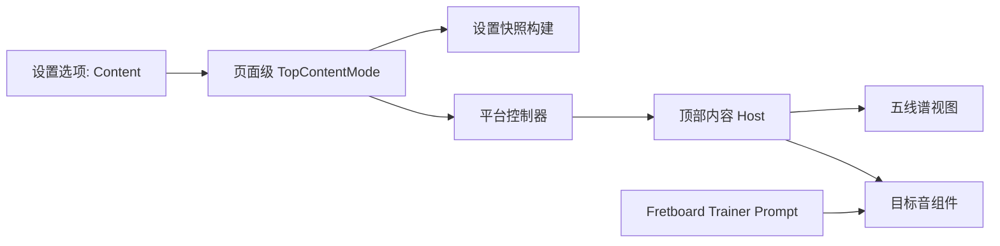

# 顶部内容切换计划

## 目标

在当前 `staffView -> fretboardHostView` 的页面结构上，新增一个独立的顶部内容模式真相源 `TopContentMode`，并通过统一设置面板里的 `choice row` 切换顶部区域显示：

- `五线谱`
- `目标音组件`

这个方案遵循你选定的 `方案 A + choice row`：

- 不把模式状态塞进 [StaffDisplayState.swift](/Users/shaun/Library/Mobile Documents/com~~apple~~CloudDocs/Develop/NoteMaster_Ver_1/NoteMaster_Ver_1/Shared/Controls/StaffDisplayState.swift)
- 不修改 `FretboardView` / `StaffView` 的内部职责
- 通过新的页面级 shared state + `topContentHostView` 承接未来扩展




## 现有落点

当前顶部区域还是由控制器直接把 `staffView` 挂到滚动内容里，再让 `fretboardHostView` 接在它下面：

```swift
// 文件路径: NoteMaster_Ver_1/Platform/iOS/iOSViewController.swift
// 函数/成员: configureLayout()
// 功能说明: 当前顶部区域直接由 staffView 占位；方案 A 会把这一层替换为 topContentHostView。
contentView.addSubview(staffView)
contentView.addSubview(fretboardHostView)

staffView.topAnchor.constraint(
    equalTo: contentView.topAnchor,
    constant: Layout.contentTopInset
)
fretboardHostView.topAnchor.constraint(
    equalTo: staffView.bottomAnchor,
    constant: Layout.verticalSpacing
)
```

现有设置面板已经支持标准 `choice row`，不需要改平台渲染控件，只需要扩 shared row/action/state：

```swift
// 文件路径: NoteMaster_Ver_1/Shared/Controls/SettingsPanelModel.swift
// 函数/成员: SettingsSectionID.rowIDs, SettingsChoiceRowID, SettingsActionID
// 功能说明: 当前 settings 已经有 choice/slider/toggle 三类 shared row；新增“Content”最自然的方式就是复用 choice row。
case .fretboard:
    return [
        .choice(.instrument),
        .choice(.displayMode),
        .choice(.labels),
        .choice(.spelling),
        .choice(.octave)
    ]
```

## 阶段 1：建立页面级顶部内容状态

- 新增一个 shared 页面级状态文件，例如 [TopContentDisplayState.swift](/Users/shaun/Library/Mobile Documents/com~~apple~~CloudDocs/Develop/NoteMaster_Ver_1/NoteMaster_Ver_1/Shared/Controls/TopContentDisplayState.swift)。
- 在这个文件中定义：
  - `enum TopContentMode { case staff, targetPrompt }`
  - `struct TopContentDisplayState { var mode: TopContentMode }`
  - 默认值设为 `.staff`，保证现有行为不变。
- 不把这个模式挂进 `StaffDisplayState`，明确它是页面级内容切换状态，而不是五线谱内部配置。
- 这一步的目标是先把“显示哪个顶部内容”与 `FretboardDisplayState` / `StaffDisplayState` 分离开。

重点文件：

- [TopContentDisplayState.swift](/Users/shaun/Library/Mobile Documents/com~~apple~~CloudDocs/Develop/NoteMaster_Ver_1/NoteMaster_Ver_1/Shared/Controls/TopContentDisplayState.swift)
- [iOSViewController.swift](/Users/shaun/Library/Mobile Documents/com~~apple~~CloudDocs/Develop/NoteMaster_Ver_1/NoteMaster_Ver_1/Platform/iOS/iOSViewController.swift)
- [macOSViewController.swift](/Users/shaun/Library/Mobile Documents/com~~apple~~CloudDocs/Develop/NoteMaster_Ver_1/NoteMaster_Ver_1/Platform/macOS/macOSViewController.swift)

## 阶段 2：把统一设置面板扩到第三路页面级状态

- 扩展 [SettingsPanelModel.swift](/Users/shaun/Library/Mobile Documents/com~~apple~~CloudDocs/Develop/NoteMaster_Ver_1/NoteMaster_Ver_1/Shared/Controls/SettingsPanelModel.swift)：
  - 新增 `SettingsChoiceRowID.content`
  - 新增两个 `SettingsActionID`，例如 `setTopContentStaff` / `setTopContentPrompt`
  - 将该 row 放到 `.staff` section，建议排在 `clef` 前后，标题可用 `Content`
  - 该 row 使用 `.singleSelection + .segmented`
- 扩展 `SettingsActionID.isSelected(...)` / `isEnabled(...)` / `apply(...)`，让它能读取和写入 `TopContentDisplayState`
- 扩展 `SettingsPanelEvent.apply(...)` 的签名，使其从当前的双 state：
  - `apply(to:and:)`
  变为三 state：
  - `apply(to:and:topContentDisplayState:)`
- 扩展 [SettingsPanelSnapshotBuilder.swift](/Users/shaun/Library/Mobile Documents/com~~apple~~CloudDocs/Develop/NoteMaster_Ver_1/NoteMaster_Ver_1/Shared/Controls/SettingsPanelSnapshotBuilder.swift) 的 `makeModel(...)` 和内部 `makeChoiceItem(...)`，把新的页面级状态参与快照计算。
- 平台设置视图层 [iOSSettingsPanelView.swift](/Users/shaun/Library/Mobile Documents/com~~apple~~CloudDocs/Develop/NoteMaster_Ver_1/NoteMaster_Ver_1/Platform/iOS/Controls/iOSSettingsPanelView.swift) / [macOSSettingsPanelView.swift](/Users/shaun/Library/Mobile Documents/com~~apple~~CloudDocs/Develop/NoteMaster_Ver_1/NoteMaster_Ver_1/Platform/macOS/Controls/macOSSettingsPanelView.swift) 预计不需要改，因为现有 `choice row` 渲染已足够。

## 阶段 3：新增目标音组件（双平台）

- iOS 新增一个薄 `UIView` 组件，例如 [iOSTargetNotePromptView.swift](/Users/shaun/Library/Mobile Documents/com~~apple~~CloudDocs/Develop/NoteMaster_Ver_1/NoteMaster_Ver_1/Platform/iOS/Controls/iOSTargetNotePromptView.swift)
- macOS 新增一个对称 `NSView` 组件，例如 [macOSTargetNotePromptView.swift](/Users/shaun/Library/Mobile Documents/com~~apple~~CloudDocs/Develop/NoteMaster_Ver_1/NoteMaster_Ver_1/Platform/macOS/Controls/macOSTargetNotePromptView.swift)
- 两个平台组件都尽量保持薄：
  - 内部一个居中的 label/text field
  - 一个 `apply(prompt:)`
  - 直接消费现有 [FretboardNaturalNoteTrainer.swift](/Users/shaun/Library/Mobile Documents/com~~apple~~CloudDocs/Develop/NoteMaster_Ver_1/NoteMaster_Ver_1/Shared/Fretboard/FretboardNaturalNoteTrainer.swift) 里的 `Prompt`
- 不新增新的业务状态，不从组件内部读取 trainer；组件只做显示壳。

这一步的关键是把“显示当前目标音”做成真正可插拔的顶部内容组件，而不是继续停留在控制台字符串。

## 阶段 4：把顶部区域从 `staffView` 重构为 `topContentHostView`

- 在 [iOSViewController.swift](/Users/shaun/Library/Mobile Documents/com~~apple~~CloudDocs/Develop/NoteMaster_Ver_1/NoteMaster_Ver_1/Platform/iOS/iOSViewController.swift) 和 [macOSViewController.swift](/Users/shaun/Library/Mobile Documents/com~~apple~~CloudDocs/Develop/NoteMaster_Ver_1/NoteMaster_Ver_1/Platform/macOS/macOSViewController.swift) 中：
  - 新增 `topContentHostView`
  - 把当前 `staffView` 从 `contentView` 的直接子视图，改为 `topContentHostView` 的子视图
  - 同时把新的 `targetNotePromptView` 也挂到 `topContentHostView`
  - 将现有 `staffView.top -> contentView.top` / `fretboardHostView.top -> staffView.bottom` 的约束链，改成 `topContentHostView` 占据原本 `staffView` 的布局角色
- 新增 `applyTopContentDisplayState()` 作为控制器中的页面级 apply 入口：
  - 根据 `TopContentDisplayState.mode` 决定 `staffView` 和 `targetNotePromptView` 的显隐
  - 如有必要，切换 `isHidden`、约束或 arranged subview 顺序
- 保留 [applyStaffDisplayState()](/Users/shaun/Library/Mobile Documents/com~~apple~~CloudDocs/Develop/NoteMaster_Ver_1/NoteMaster_Ver_1/Platform/iOS/iOSViewController.swift) 继续只管五线谱内部配置
- 保留 [applyFretboardTrainerPrompt(...)](/Users/shaun/Library/Mobile Documents/com~~apple~~CloudDocs/Develop/NoteMaster_Ver_1/NoteMaster_Ver_1/Platform/iOS/iOSViewController.swift) 继续只管把 trainer prompt 应用到当前可见的 prompt 组件

这一阶段的重点不是“把五线谱换掉”，而是把顶部区域抽成一个真正可切换的 host。

## 阶段 5：把控制器事件与 prompt 更新统一收口

- 在双平台控制器中增加第三个页面级状态属性，例如 `topContentDisplayState`
- 扩展现有 `handleSettingsPanelEvent(...)`：
  - 让 `SettingsPanelEvent.apply(...)` 同时产出 `nextTopContentDisplayState`
  - 只有当它变化时，才触发 `applyTopContentDisplayState()`
- 在 trainer 推进路径中继续复用现有的 `applyFretboardTrainerPrompt(reason:)`
- 保持以下职责边界：
  - `FretboardNaturalNoteTrainerState` 负责业务 prompt
  - `TargetNotePromptView` 负责显示 prompt
  - `TopContentDisplayState` 负责顶部显示模式
  - 控制器负责把三者组装起来

## 阶段 6：验证与回归

- 扩展 [FretboardValidation.swift](/Users/shaun/Library/Mobile Documents/com~~apple~~CloudDocs/Develop/NoteMaster_Ver_1/NoteMaster_Ver_1/Shared/Fretboard/FretboardValidation.swift) 的 `manualChecklist(...)`，加入：
  - 切换 `Content` 为 `Target` 后，顶部区域显示目标音组件、五线谱隐藏
  - 切回 `Staff` 后，五线谱恢复，trainer 不丢失当前目标音
  - 目标音切换时，prompt 组件文本会同步更新
- 保留现有命令行 validation runner 对 shared trainer 的回归
- 额外做双平台手工验证：
  - iOS：切换设置项后布局、滚动、点击判题都正常
  - macOS：切换设置项后 resize / live resize 不闪烁，顶部内容切换稳定

## 关键文件范围

- 新增 [TopContentDisplayState.swift](/Users/shaun/Library/Mobile Documents/com~~apple~~CloudDocs/Develop/NoteMaster_Ver_1/NoteMaster_Ver_1/Shared/Controls/TopContentDisplayState.swift)：页面级顶部内容模式真相源
- 修改 [SettingsPanelModel.swift](/Users/shaun/Library/Mobile Documents/com~~apple~~CloudDocs/Develop/NoteMaster_Ver_1/NoteMaster_Ver_1/Shared/Controls/SettingsPanelModel.swift)：新增 `choice row` 与 action
- 修改 [SettingsPanelSnapshotBuilder.swift](/Users/shaun/Library/Mobile Documents/com~~apple~~CloudDocs/Develop/NoteMaster_Ver_1/NoteMaster_Ver_1/Shared/Controls/SettingsPanelSnapshotBuilder.swift)：把第三路 state 编进快照
- 新增 [iOSTargetNotePromptView.swift](/Users/shaun/Library/Mobile Documents/com~~apple~~CloudDocs/Develop/NoteMaster_Ver_1/NoteMaster_Ver_1/Platform/iOS/Controls/iOSTargetNotePromptView.swift)：iOS `UIView` 组件
- 新增 [macOSTargetNotePromptView.swift](/Users/shaun/Library/Mobile Documents/com~~apple~~CloudDocs/Develop/NoteMaster_Ver_1/NoteMaster_Ver_1/Platform/macOS/Controls/macOSTargetNotePromptView.swift)：macOS 对称组件
- 修改 [iOSViewController.swift](/Users/shaun/Library/Mobile Documents/com~~apple~~CloudDocs/Develop/NoteMaster_Ver_1/NoteMaster_Ver_1/Platform/iOS/iOSViewController.swift)：顶部 host、状态 apply、事件接线
- 修改 [macOSViewController.swift](/Users/shaun/Library/Mobile Documents/com~~apple~~CloudDocs/Develop/NoteMaster_Ver_1/NoteMaster_Ver_1/Platform/macOS/macOSViewController.swift)：对称实现
- 复用 [FretboardNaturalNoteTrainer.swift](/Users/shaun/Library/Mobile Documents/com~~apple~~CloudDocs/Develop/NoteMaster_Ver_1/NoteMaster_Ver_1/Shared/Fretboard/FretboardNaturalNoteTrainer.swift)：现有 `Prompt` 直接作为组件输入

## 验收标准

- 设置面板出现新的 `choice row`，可在 `五线谱` / `目标音组件` 之间切换
- iOS 使用 `UIView` 组件显示当前目标音名，macOS 使用对称 `NSView` 组件
- 顶部区域切换后布局稳定，`fretboardHostView` 的位置与高度语义不被破坏
- trainer 当前目标音会实时同步到 prompt 组件
- 切回五线谱后，五线谱显示与原有 `StaffDisplayState` 行为保持一致
- 双平台设置面板渲染层不需要为新 row 增加特殊平台分支

